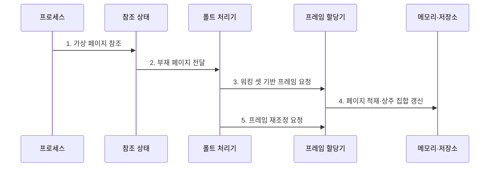

---
sidebar:
  order: 16
  label: "016. 워킹 셋·페이지 폴트 (Working Set·Page Fault)"
  badge:
    text: "기출 · 50%"
    variant: note
title: 워킹 셋·페이지 폴트 (Working Set·Page Fault)
date: "2026-07-27T23:59:59+09:00"
tags: [notes-software]
weight: 16
extra:
  question_no: "016"
  source_status: "기출"
  source_history: "131회"
  priority: 50
  priority_note: "131회 기출, 워킹 셋·페이지 폴트 제어"
---

## 미리 알고가기

- **워킹 셋(Working Set)**: 최근 참조 창에서 사용한 페이지 집합
- **상주 집합(Resident Set)**: 프로세스가 물리 메모리에 보유한 페이지 집합
- **페이지 폴트(Page Fault)**: 참조 페이지가 비상주일 때 발생하는 예외
- **주요 페이지 폴트(Major Page Fault)**: 보조기억장치 입출력이 필요한 폴트
- **경미 페이지 폴트(Minor Page Fault)**: 보조기억장치 입출력 없이 해결되는 폴트
- **페이지 폴트 빈도(Page Fault Frequency, PFF)**: 단위 시간 또는 메모리 참조당 페이지 폴트 발생률
- **참조 지역성(Locality of Reference)**: 가까운 시점에 일부 페이지를 반복 참조
- **스레싱(Thrashing)**: 페이지 교체·적재가 실행보다 많아진 상태
- **참조 창(Reference Window)**: 현재 시점부터 일정 시간이나 참조 횟수만큼 거슬러 올라가 워킹 셋에 포함할 페이지를 정하는 관찰 범위
- **물리 프레임(Physical Frame)**: 물리 메모리를 페이지와 같은 크기로 나눈 블록으로서 상주 페이지를 실제로 저장한다.
- **입출력(Input/Output, I/O)**: 주요 페이지 폴트 처리 시 보조기억장치에서 메모리로 페이지를 읽는 전송 작업
- **페이지 폴트 트랩(Page-fault Trap)**: 비상주 페이지 접근을 하드웨어가 감지해 커널의 페이지 폴트 처리기로 제어권을 넘기는 예외 진입
- **희생 페이지(Victim Page)**: 빈 프레임이 없을 때 교체 정책이 퇴출 대상으로 선택한 기존 상주 페이지
- **온라인 제어(Online Control)**: 실행 중 관측되는 페이지 폴트 빈도로 프레임 부족을 사후 감지하고 할당량을 조정하는 방식
- **컨테이너 호스트(Container Host)**: 여러 격리 컨테이너에 물리 메모리를 배분하며 워킹 셋과 주요 폴트율로 각 메모리 한도를 조정하는 기반 시스템
- **워크로드(Workload)**: 시스템이 처리하는 작업의 도착·메모리 참조·자원 사용 특성
- **감쇠(Decay)**: 오래된 참조의 영향력을 시간이 지날수록 줄이는 계산 방식
- **다중 시간창(Multiple Time Windows)**: 짧은 관찰 구간과 긴 관찰 구간을 함께 사용해 단기·장기 지역성을 추정하는 방식
- **꼬리 지연(Tail Latency)**: 요청 지연시간 분포에서 가장 느린 일부 요청의 지연
- **서비스 수준(Service Level)**: 응답시간·처리량·가용성 등에 대해 지키기로 정한 운영 목표

## Ⅰ. 개요

- 정의/개념: 최근 참조로 **프레임 수요·부족을 판단**하는 기법
- 배경/필요성: 고정 배분의 **지역성 변화·폴트 급증** 대응

### 쉽게 이해하기 (학습용)

- 최근에 쓰는 자료 묶음만큼 책상을 주고 창고 왕복이 늘면 공간을 다시 조정한다.

## Ⅱ. 특징

- **최근 참조 창**으로 현재 지역성의 워킹 셋 추정
- **상주 집합 부족** 시 재참조 페이지 폴트 증가
- **워킹 셋·폴트 빈도**로 프레임 배분·실행 작업 수 조정

### 쉽게 이해하기 (학습용)

- 기록 범위를 넓히면 필요한 자료를 덜 빠뜨리지만 책상에 둘 자료를 더 많이 잡는다.

## Ⅲ. 구조 및 구성요소

| 구성요소 | 책임 |
|:---|:---|
| 프로세스 | **가상 페이지 참조** |
| 참조·상주 상태 | **이력·상주 관계 기록** |
| 워킹 셋 추정기 | **목표 프레임 계산** |
| 페이지 폴트 처리기 | **페이지 적재·재실행** |
| 프레임 할당기 | **할당·회수·희생 선택** |

### 쉽게 이해하기 (학습용)

- 최근 사용 기록으로 책상 크기를 정하고 없는 자료를 찾으면 창고에서 가져와 다시 실행한다.

## Ⅳ. 흐름도

**동작 원리**

- **1. 가상 페이지 참조**: 접근 발생
- **2. 부재 페이지 전달**: 폴트 처리
- **3. 워킹 셋 기반 프레임 요청**: 최근 참조량을 목표에 반영
- **4. 페이지 적재·상주 집합 갱신**: 빈 프레임 확보와 매핑 반영
- **5. 프레임 재조정 요청**: 부족·여유 대응

### 쉽게 이해하기 (학습용)

- 최근 사용 기록과 창고 왕복 횟수로 책상 크기를 조정한다.

## Ⅴ. 종류 및 비교

| 구분 | 워킹 셋 | 페이지 폴트 빈도 |
|:---|:---|:---|
| 적용 기준 | 참조 이력·**집합 추적 가능** | 저비용 **온라인 제어** |
| 핵심 특징 | 참조 창으로 **목표 집합 추정** | 폴트율로 **부족 상태 감지** |
| 한계 | 창 크기별 **추정 오차** | 부족 상태 **사후 감지** |

> 요약: 워킹 셋은 필요량을 추정하고 폴트 빈도는 부족을 감지

### 쉽게 이해하기 (학습용)

- 사용 기록을 자세히 모으면 필요한 책상 크기를 잡고, 창고 왕복만 세면 부족 여부를 빠르게 안다.

## Ⅵ. 실무 고려사항 및 대책

| 고려사항 | 대책 | 효과 |
|:---|:---|:---|
| 참조 창이 짧아 순환 지역성 누락 | 워크로드 주기와 민감도 분석으로 창 조정 | 워킹 셋 추정 정확도 향상 |
| 참조 창이 길어 과거 페이지를 계속 유지 | 감쇠·다중 시간창과 메모리 압박 시 축소 | 불필요 프레임 점유 감소 |
| 폴트 빈도만 보고 순차 최초 접근을 부족으로 오인 | 주요·경미 폴트와 재참조·I/O 대기 분리 | 잘못된 증설·축소 방지 |
| 프레임 회수가 중요 작업의 꼬리 지연 유발 | 중요도별 최소 상주 집합과 회수 우선순위 | 서비스 수준 보호 |

### 쉽게 이해하기 (학습용)

- 호스트는 컨테이너가 실제로 쓰는 메모리와 디스크 적재 횟수를 보고 한도를 조정한다.

## Ⅶ. 결론

- 워킹 셋·주요 폴트율로 **프레임·작업 수**를 결정

### 쉽게 이해하기 (학습용)

- 최근 사용량과 디스크 적재 신호를 함께 보고 메모리와 동시에 실행할 작업 수를 정한다.
