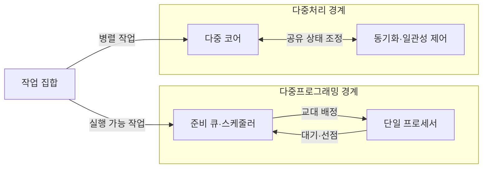
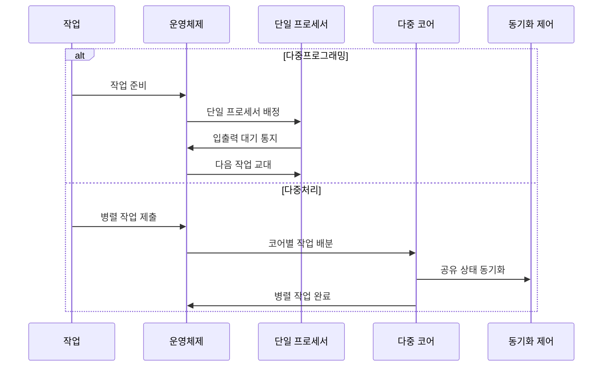

---
sidebar:
  order: 17
  label: "017. 다중프로그래밍·다중처리 (Multiprogramming·Multiprocessing)"
  badge:
    text: "미출제 · 30%"
    variant: note
title: 다중프로그래밍·다중처리 (Multiprogramming·Multiprocessing)
date: "2026-07-25T00:35:28+09:00"
tags: [notes-software]
weight: 17
extra:
  question_no: "017"
  source_status: "미출제"
  source_history: ""
  priority: 30
  priority_note: "교대 실행·동시 실행 구조 비교 기초"
---

## 미리 알고가기

- **다중프로그래밍(Multiprogramming)**: 한 프로세서가 여러 작업을 교대 실행
- **다중처리(Multiprocessing)**: 여러 프로세서가 여러 작업을 동시 실행
- **동시성(Concurrency)**: 여러 작업이 겹친 기간에 진행되는 성질
- **병렬성(Parallelism)**: 여러 작업이 같은 시점에 실행되는 성질
- **문맥 전환(Context Switch)**: 실행 상태 저장 후 다음 상태 복원
- **동기화(Synchronization)**: 공유 상태 접근 순서·시점을 조정
- **캐시 일관성(Cache Coherence)**: 코어별 캐시의 공유 데이터 값을 일치
- **프로세서·코어(Processor·Core)**: 프로세서는 명령 실행 장치이고 코어는 독립 명령 흐름을 실행하는 내부 처리 단위로서 단일·다중 실행 자원의 차이를 이룸
- **운영체제(Operating System, OS)**: ‘오에스’로 읽고 Operating System의 머리글자를 딴 표기이며 준비 큐에서 작업을 교대 배정하거나 여러 코어에 병렬 작업을 분산하는 시스템 소프트웨어
- **입출력(Input/Output, I/O)**: ‘아이오’로 읽고 Input과 Output의 머리글자를 빗금(/)으로 묶는 관례 표기이며 작업이 장치 응답을 기다릴 때 다른 작업으로 교대할 기회를 만듦
- **준비 큐·스케줄러(Ready Queue·Scheduler)**: 준비 큐는 실행 가능 작업을 보관하고 스케줄러는 다음 실행 작업과 교대 시점을 선택함
- **선점(Preemption)**: 운영체제가 실행 중인 작업의 프로세서 제어권을 회수해 다른 준비 작업으로 교대하는 동작
- **직렬 구간(Serial Section)**: 하나의 실행 흐름에서만 처리되어 코어 수를 늘려도 병렬 속도 향상을 제한하는 프로그램 부분
- **공유 상태 가시성(Shared-state Visibility)**: 한 코어가 갱신한 값이 다른 코어의 실행에도 최신 값으로 보이도록 메모리 순서와 캐시 상태를 맞추는 성질
- **영상 인코더·프레임(Video Encoder·Frame)**: 영상 인코더는 원본 영상을 압축 형식으로 변환하고 프레임은 개별 화면 단위로서 서로 독립된 묶음을 여러 코어에서 병렬 처리할 수 있음

## Ⅰ. 개요

- 정의/개념: 교대 실행과 다중 프로세서 실행 방식
- **배경/필요성**: 작업 특성이 달라 교대·동시 실행 구분 필요

### 쉽게 이해하기 (학습용)

- 한 사람이 일이 멈출 때 다른 일을 맡는 방식과 여러 사람이 동시에 일하는 방식을 구분한다.

## Ⅱ. 특징

- 다중프로그래밍은 입출력 대기 중 다른 작업 실행한다.
- 다중처리는 병렬 구간을 여러 프로세서에서 동시 실행한다.
- 다중처리 확장 시 직렬 구간·동기화 비용이 속도 향상 제한한다.

### 쉽게 이해하기 (학습용)

- 빈 시간을 줄이면 한 작업대를 더 바쁘게 쓰고 작업대를 늘리면 동시에 일하지만 조율 비용이 든다.

## Ⅲ. 아키텍처 및 구성요소

| 설계 요소 | 설명 |
|:---|:---|
| 준비 큐·스케줄러 | 실행 가능 작업과 교대 시점 관리 |
| 단일 프로세서 | 한 시점에 한 작업 명령 흐름 실행 |
| 다중 코어 | 여러 작업 명령 흐름을 같은 시점에 실행 |
| 동기화·일관성 제어 | 공유 상태 순서와 코어별 캐시 값 조정 |

> 요약: 단일 프로세서는 교대, 다중 코어는 동기화하며 동시 실행

### 쉽게 이해하기 (학습용)

- 한 작업대는 대기 줄에서 일을 바꿔 받고 여러 작업대는 공용 자료 사용 순서를 맞춘다.

## Ⅳ. 원리 및 절차 흐름도

| 절차 | 설명 |
|:---|:---|
| 작업 준비 | 실행 가능 작업을 준비 큐에 등록 |
| 단일 프로세서 배정 | 선택 작업에 프로세서 제어권 이전 |
| 입출력 대기 통지 | 실행 작업이 입출력 완료까지 대기 전환 |
| 다음 작업 교대 | 다른 준비 작업의 문맥을 복원해 실행 |
| 병렬 작업 제출 | 동시에 실행할 독립 작업 단위 제출 |
| 코어별 작업 배분 | 작업 단위를 여러 코어에 분산 |
| 공유 상태 동기화 | 공유 데이터 접근 순서·가시성 보장 |
| 병렬 작업 완료 | 코어별 결과를 완료 상태로 집계 |

> 요약: 대기 시 교대하거나 작업을 코어별로 나눠 동시 실행

### 쉽게 이해하기 (학습용)

- 한 작업이 기다리면 다음 일로 바꾸고 나눌 수 있는 일은 여러 작업대에 동시에 배정한다.

## Ⅴ. 종류 및 비교

| 판단 기준 | 다중프로그래밍 | 다중처리 |
|:---|:---|:---|
| 핵심 특징 | 단일 프로세서의 교대 실행 | 다중 코어의 동시 실행 |
| 적용 기준 | 입출력 대기 작업 혼재 | 병렬 구간·다중 코어 확보 |
| 주요 위험 | 문맥 전환·단일 처리 한계 | 동기화·일관성 비용 |

> 요약: 대기 활용은 다중프로그래밍, 동시 실행은 다중처리

### 쉽게 이해하기 (학습용)

- 한 작업대의 빈 시간을 채울 때는 교대하고 여러 작업대로 나눌 수 있을 때는 동시에 처리한다.

## Ⅵ. 실무 사례

1. 단일 코어 배치 시스템은 입출력 대기 중 다른 작업 실행

### 쉽게 이해하기 (학습용)

- 배치 시스템은 한 작업이 디스크를 기다리는 동안 다음 작업을 실행한다.

## Ⅶ. 결론

- 입출력 대기율·병렬 구간·동기화 비용으로 실행 구조 선택

### 쉽게 이해하기 (학습용)

- 기다리는 시간이 많은지, 일을 나눌 수 있는지, 결과를 맞추는 비용이 큰지 보고 구조를 정한다.
