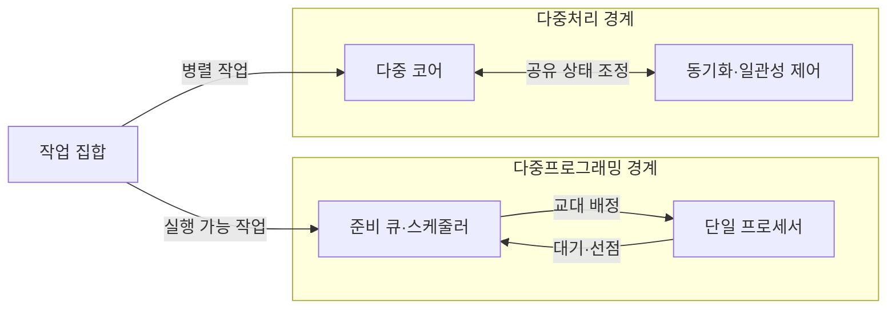
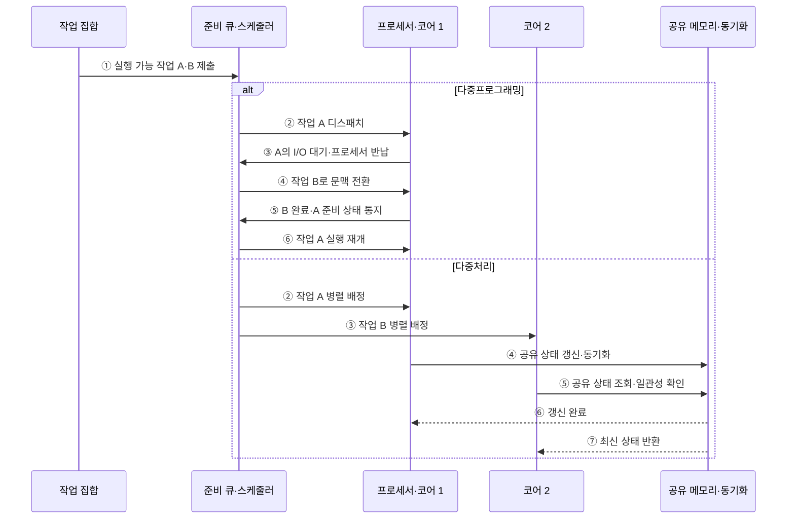

---
sidebar:
  order: 17
  label: "017. 다중프로그래밍·다중처리 (Multiprogramming·Multiprocessing)"
  badge:
    text: "미출 · 30%"
    variant: note
title: 다중프로그래밍·다중처리 (Multiprogramming·Multiprocessing)
date: "2026-07-25T00:35:28+09:00"
tags: [notes-software]
weight: 17
extra:
  question_no: "017"
  source_status: "미출"
  source_history: ""
  priority: 30
  priority_note: "교대 실행·동시 실행 구조 비교 기초"
---

## 미리 알고가기

- **다중프로그래밍(Multiprogramming)**: 한 프로세서가 여러 작업을 교대 실행
- **다중처리(Multiprocessing)**: 여러 프로세서가 여러 작업을 동시 실행
- **동시성(Concurrency)**: 여러 작업이 겹친 기간에 진행되는 성질
- **병렬성(Parallelism)**: 여러 작업이 같은 시점에 실행되는 성질
- **문맥 전환(Context Switch)**: 실행 상태 저장 후 다음 상태 복원
- **동기화(Synchronization)**: 공유 상태 접근 순서·시점을 조정
- **캐시 일관성(Cache Coherence)**: 코어별 캐시의 공유 데이터 값을 일치
- **프로세서·코어(Processor·Core)**: 프로세서는 명령 실행 장치이고 코어는 독립 명령 흐름을 실행하는 내부 처리 단위로서 단일·다중 실행 자원의 차이를 이룸
- **운영체제(Operating System, OS)**: 준비 큐의 작업을 교대 배정하거나 여러 코어에 병렬로 분산하는 시스템 소프트웨어
- **입출력(Input/Output, I/O)**: 작업이 장치 응답을 기다리는 동안 다른 작업으로 전환할 수 있게 하는 처리
- **준비 큐·스케줄러(Ready Queue·Scheduler)**: 준비 큐는 실행 가능 작업을 보관하고 스케줄러는 다음 실행 작업과 교대 시점을 선택함
- **선점(Preemption)**: 운영체제가 실행 중인 작업의 프로세서 제어권을 회수해 다른 준비 작업으로 교대하는 동작
- **직렬 구간(Serial Section)**: 하나의 실행 흐름에서만 처리되어 코어 수를 늘려도 병렬 속도 향상을 제한하는 프로그램 부분
- **공유 상태 가시성(Shared-state Visibility)**: 한 코어가 갱신한 값이 다른 코어의 실행에도 최신 값으로 보이도록 메모리 순서와 캐시 상태를 맞추는 성질
- **영상 인코더·프레임(Video Encoder·Frame)**: 영상 인코더는 원본 영상을 압축 형식으로 변환하고 프레임은 개별 화면 단위로서 서로 독립된 묶음을 여러 코어에서 병렬 처리할 수 있음
- **스레싱(Thrashing)**: 메모리나 입출력 자원 교체가 실제 작업보다 많아져 처리량이 급감하는 상태
- **수용 제어(Admission Control)**: 자원 여유를 검사해 새 작업의 실행 허용 여부를 결정하는 절차
- **경합 프로파일링(Contention Profiling)**: 잠금·공유 자원별 대기시간을 측정해 병렬 실행의 병목을 찾는 분석
- **프로세서 친화도(Processor Affinity)**: 작업을 특정 코어에 계속 배정해 캐시의 데이터를 재사용하는 정책
- **작업 훔치기(Work Stealing)**: 유휴 코어가 바쁜 코어의 대기열에서 작업을 가져와 부하를 나누는 방식
- **비균일 메모리 접근(Non-uniform Memory Access, NUMA)**: 어느 프로세서에 연결된 메모리인지에 따라 접근 시간이 달라지는 구조
- **거짓 공유(False Sharing)**: 서로 다른 데이터를 쓰는 코어들이 같은 캐시 라인을 공유해 불필요한 일관성 통신이 발생하는 현상
- **메모리 모델(Memory Model)**: 여러 실행 흐름에서 메모리 읽기·쓰기 순서와 가시성을 규정한 규칙

## Ⅰ. 개요

- 정의/개념: 교대 실행과 다중 프로세서 실행 방식
- **배경/필요성**: 작업 특성이 달라 교대·동시 실행 구분 필요

### 쉽게 이해하기 (학습용)

- 한 사람이 일이 멈출 때 다른 일을 맡는 방식과 여러 사람이 동시에 일하는 방식을 구분한다.

## Ⅱ. 특징

- 다중프로그래밍은 입출력 대기 중 다른 작업 실행한다.
- 다중처리는 병렬 구간을 여러 프로세서에서 동시 실행한다.
- 다중처리 확장 시 직렬 구간·동기화 비용이 속도 향상 제한한다.

### 쉽게 이해하기 (학습용)

- 빈 시간을 줄이면 한 작업대를 더 바쁘게 쓰고 작업대를 늘리면 동시에 일하지만 조율 비용이 든다.

## Ⅲ. 아키텍처

**도표안 A — 구조도**

**도표안 B — sequenceDiagram**

| 설계 요소 | 입력·상태 | 역할 |
|:---|:---|:---|
| 준비 큐·스케줄러 | 실행 가능 작업·대기·선점 상태 | 교대·코어별 배정 결정 |
| 단일 프로세서 | 선택 작업 문맥 | 한 시점에 한 명령 흐름 실행 |
| 다중 코어 | 병렬 작업·코어 상태 | 여러 명령 흐름 동시 실행 |
| 동기화·일관성 제어 | 공유 상태·캐시 라인 상태 | 접근 순서·값 가시성 보장 |

**동작 원리**

- ① 실행 가능한 작업 A·B를 준비 큐에 등록
- ② 다중프로그래밍은 A를 단일 프로세서에 배정하고 다중처리는 A를 코어 1에 배정
- ③ 다중프로그래밍은 A의 I/O 대기로 프로세서를 반납하고 다중처리는 B를 코어 2에 동시 배정
- ④ 다중프로그래밍은 B로 문맥을 전환하고 다중처리는 A가 공유 상태를 동기화하며 갱신
- ⑤ 다중프로그래밍은 B 완료 후 A를 준비 상태로 바꾸고 다중처리는 B가 공유 상태의 최신값을 조회
- ⑥ 다중프로그래밍은 A를 재개하고 다중처리는 A의 갱신 완료
- ⑦ 다중처리의 코어 2에 일관성이 확보된 최신값 반환

### 쉽게 이해하기 (학습용)

- 한 작업대는 대기 줄에서 일을 바꿔 받고 여러 작업대는 공용 자료 사용 순서를 맞춘다.

## Ⅳ. 종류 및 비교

| 판단 기준 | 다중프로그래밍 | 다중처리 |
|:---|:---|:---|
| 핵심 특징 | 단일 프로세서의 교대 실행 | 다중 코어의 동시 실행 |
| 적용 기준 | 입출력 대기 작업 혼재 | 병렬 구간·다중 코어 확보 |
| 주요 위험 | 문맥 전환·단일 처리 한계 | 동기화·일관성 비용 |

> 요약: 대기 활용은 다중프로그래밍, 동시 실행은 다중처리

### 쉽게 이해하기 (학습용)

- 한 작업대의 빈 시간을 채울 때는 교대하고 여러 작업대로 나눌 수 있을 때는 동시에 처리한다.

## Ⅴ. 실무 고려사항 및 대책

| 운영 위험 | 대응 | 기대 효과 |
|:---|:---|:---|
| 동시 작업 증가로 메모리·I/O 스레싱 | 수용 제어와 작업별 자원 한도·압박 지표 감시 | 처리량 붕괴 방지 |
| 코어 증가에도 직렬 구간·잠금이 속도 제한 | 병렬 비율·경합 프로파일링과 데이터 분할 | 실제 병렬 이득 확보 |
| 스레드·코어 이동으로 캐시 지역성 저하 | 친화도·작업 훔치기 범위와 NUMA 배치 조정 | 데이터 재사용 향상 |
| 공유 상태 가시성 오류·거짓 공유 | 메모리 모델 준수·동기화와 캐시 라인 분리 | 정확성·확장성 확보 |

### 적용 사례

- 단일 코어 배치 시스템은 한 작업의 입출력 대기 중 다른 작업을 교대 실행해 프로세서 유휴시간을 줄인다.

### 쉽게 이해하기 (학습용)

- 배치 시스템은 한 작업이 디스크를 기다리는 동안 다음 작업을 실행한다.

## Ⅵ. 결론

- 입출력 대기율·병렬 구간·동기화 비용을 기준으로 다중프로그래밍과 다중처리를 선택한다.

### 쉽게 이해하기 (학습용)

- 기다리는 시간이 많은지, 일을 나눌 수 있는지, 결과를 맞추는 비용이 큰지 보고 구조를 정한다.
