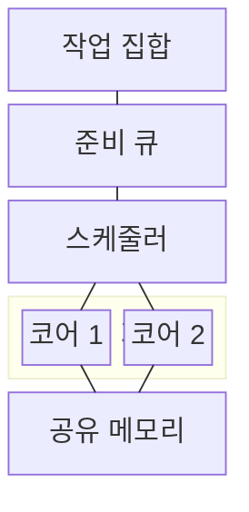
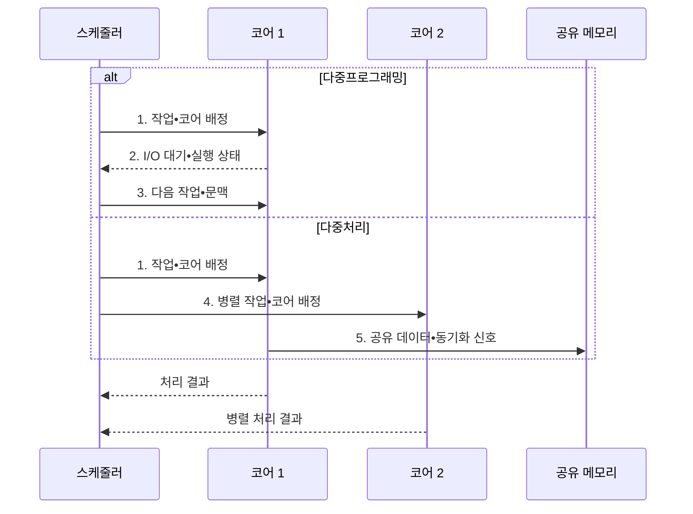

---
sidebar:
  order: 17
  label: "017. 다중프로그래밍•다중처리 (Multiprogramming•Multiprocessing)"
  badge:
    text: "미출 • 30%"
    variant: note
title: 다중프로그래밍•다중처리 (Multiprogramming•Multiprocessing)
date: "2026-08-03T08:48:47+09:00"
tags: [notes-software]
weight: 17
extra:
  question_no: "017"
  source_status: "미출"
  source_history: ""
  priority: 30
  priority_note: "교대 실행•동시 실행 구조 비교 기초"
---

## Ⅰ. 개요

핵심 용어

- **다중프로그래밍(Multiprogramming)**: 한 프로세서가 여러 작업을 교대 실행해 유휴 시간을 줄이는 방식
- **다중처리(Multiprocessing)**: 여러 프로세서나 코어가 여러 작업을 같은 시점에 실행하는 방식

- 정의/개념: **다중프로그래밍과 다중처리** 는 각각 한 프로세서에서 여러 작업을 교대 실행하거나 여러 프로세서에서 작업을 동시에 실행하는 **운영체제 처리 방식**
- 배경/필요성: 단일 작업만 실행하면 I/O 대기 중 **CPU 유휴•다중 코어 미활용**

#### 한줄 요약

- 한 사람이 일이 멈출 때 다른 일을 맡는 방식과 여러 사람이 동시에 일하는 방식을 구분한다.

## Ⅱ. 특징

핵심 용어

- **직렬 구간(Serial Section)**: 하나의 실행 흐름에서만 처리되어 코어를 늘려도 병렬 속도 향상을 제한하는 부분
- **동기화(Synchronization)**: 여러 코어의 공유 상태 접근 순서와 가시성을 맞추는 제어

- **다중프로그래밍** 은 I/O 대기 중 작업 교대
- **다중처리** 는 여러 코어에서 작업 동시 실행
- **직렬 구간•동기화** 가 병렬 속도 향상 제한

#### 한줄 요약

- 빈 시간을 줄이면 한 작업대를 더 바쁘게 쓰고 작업대를 늘리면 동시에 일하지만 조율 비용이 든다.

## Ⅲ. 구조 및 구성요소

핵심 용어

- **준비 큐•스케줄러**: 실행 가능 작업을 보관하고 다음 작업과 교대•코어 배정을 결정하는 구성요소
- **공유 메모리**: 여러 코어가 함께 읽고 쓰며 동기화 정보도 보관하는 메모리 영역

| 구성요소 | 책임 |
|:---|:---|
| 작업 집합 | **실행 가능 작업 제공** |
| 준비 큐 | **실행 후보 보관** |
| 스케줄러 | **교대•코어별 배정** |
| 코어 1•2 | **교대•병렬 명령 흐름 실행** |
| 공유 메모리 | **공유 상태•동기화 정보 보관** |

#### 한줄 요약

- 한 작업대는 대기 줄에서 일을 바꿔 받고 여러 작업대는 공용 자료 사용 순서를 맞춘다.

## Ⅳ. 흐름도

핵심 용어

- **문맥 전환(Context Switch)**: 실행 중인 작업 상태를 저장하고 다음 작업 상태를 복원하는 처리
- **공유 상태 가시성(Shared-state Visibility)**: 한 코어의 갱신값이 다른 코어에도 최신 값으로 보이는 성질

**동작 원리**

- **1. 작업•코어 배정**: 실행 방식에 따라 첫 작업과 코어를 배정
- **2. I/O 대기•실행 상태**: 교대 판단을 위해 중단 원인과 문맥 전달
- **3. 다음 작업•문맥**: 준비 작업의 저장 문맥을 복원해 교대 실행
- **4. 병렬 작업•코어 배정**: 독립 작업을 다른 코어에 동시 배정
- **5. 공유 데이터•동기화 신호**: 코어 간 가시성과 접근 순서 보장

#### 한줄 요약

- 한 작업대는 일을 교대하고 여러 작업대는 동시에 처리한다.

## Ⅴ. 종류 및 비교

핵심 용어

- **캐시 일관성(Cache Coherence)**: 코어별 캐시에 있는 공유 데이터의 값을 일치시키는 메커니즘
- **병렬 구간**: 서로 다른 코어에서 같은 시점에 독립적으로 실행할 수 있는 프로그램 부분
- **문맥 전환•동기화 비용**: 작업 상태를 교체하거나 코어 간 공유 데이터의 순서•가시성을 맞추는 데 드는 추가 처리시간

| 실행 자원 활용 방식 | 다중프로그래밍 | 다중처리 |
|:---|:---|:---|
| 적용 기준 | 입출력 **대기 작업 혼재** | **병렬 구간•다중 코어** 확보 |
| 핵심 특징 | 단일 프로세서의 **교대 실행** | 다중 코어의 **동시 실행** |
| 한계 | **문맥 전환•단일 처리** 한계 | **동기화•캐시 일관성** 비용 |

> 요약: **대기 시간 활용** 은 다중프로그래밍, **동시 실행** 은 다중처리

#### 한줄 요약

- 한 작업대의 빈 시간을 채울 때는 교대하고 여러 작업대로 나눌 수 있을 때는 동시에 처리한다.

## Ⅵ. 실무 고려사항 및 대책

핵심 용어

- **스레싱(Thrashing)**: 메모리나 I/O 자원 교체가 실제 작업보다 많아져 처리량이 급감하는 상태
- **경합 프로파일링(Contention Profiling)**: 잠금•공유 자원별 대기시간을 측정해 병목을 찾는 분석
- **프로세서 친화도•작업 훔치기**: 캐시 재사용을 위해 코어를 유지하거나 유휴 코어가 다른 큐의 작업을 가져오는 부하 분산 방식
- **비균일 메모리 접근(Non-uniform Memory Access, NUMA)**: 연결된 프로세서에 따라 메모리 접근 시간이 달라지는 구조
- **거짓 공유(False Sharing)**: 서로 다른 데이터를 쓰는 코어가 같은 캐시 라인을 공유해 불필요한 일관성 통신을 만드는 현상
- **수용 제어•자원 상한**: 새 작업 허용 여부를 자원 여유로 판정하고 동시에 사용할 메모리•I/O 양의 최댓값을 제한하는 통제
- **캐시 지역성(Cache Locality)**: 최근 사용한 코드•데이터가 같은 코어의 캐시에 남아 재사용되는 성질
- **메모리 모델(Memory Model)**: 여러 코어의 읽기•쓰기가 다른 코어에 보이는 순서와 동기화 규칙을 정한 계약

| 문제 | 대책 | 효과 |
|:---|:---|:---|
| 동시 작업 증가로 메모리•I/O **스레싱 발생** | **수용 제어•자원 상한** 과 압박 지표 감시 | **처리량 붕괴** 방지 |
| 코어를 늘려도 직렬 구간•잠금이 **속도 향상 제한** | 병렬 비율•**경합 프로파일링** 후 데이터 분할 | 실제 **병렬 이득** 확보 |
| 코어 이동이 잦아 **캐시 지역성 저하** | **프로세서 친화도•작업 훔치기** 와 NUMA 배치 조정 | **데이터 재사용률** 향상 |
| 공유 상태 가시성 오류와 **거짓 공유 발생** | **메모리 모델•동기화** 준수와 캐시 라인 분리 | **정확성•확장성** 확보 |

#### 한줄 요약

- 배치 시스템은 한 작업이 디스크를 기다리는 동안 다음 작업을 실행한다.

## Ⅶ. 결론

핵심 용어

- **I/O 대기•병렬 구간**: 다중프로그래밍과 다중처리 중 실행 구조를 선택하는 기준

- **I/O 대기** 가 크면 다중프로그래밍, **병렬 구간** 이 크면 다중처리 선택

#### 한줄 요약

- 기다리는 시간이 많은지, 일을 나눌 수 있는지, 결과를 맞추는 비용이 큰지 보고 구조를 정한다.
