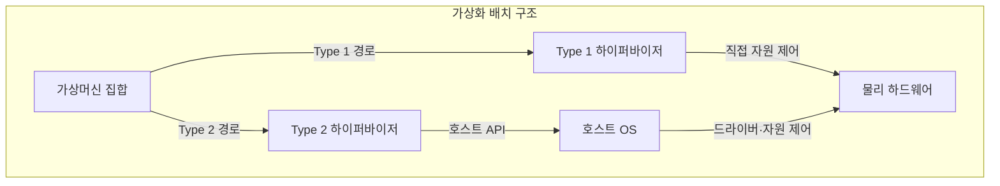
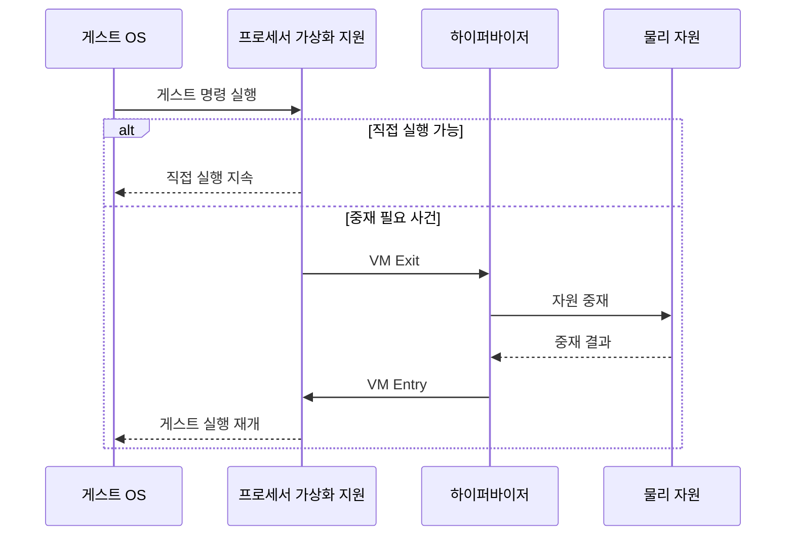

---
sidebar:
  order: 18
  label: "018. 가상화 — Type 1·Type 2 하이퍼바이저 (Virtualization·Hypervisor)"
  badge:
    text: "기출 · 85%"
    variant: note
title: 가상화 — Type 1·Type 2 하이퍼바이저 (Virtualization·Hypervisor)
date: "2026-07-25T00:35:28+09:00"
tags: [notes-software]
weight: 18
extra:
  question_no: "018"
  source_status: "기출"
  source_history: "128회, 131회, 132회, 137회"
  priority: 85
  priority_note: "4회 반복, 하이퍼바이저 구조·선택 핵심"
---

## 미리 알고가기

- **가상화(Virtualization)**: 물리 자원을 논리 실행 환경으로 추상화
- **가상머신(Virtual Machine, VM)**: ‘브이엠’으로 읽고 Virtual Machine의 머리글자를 딴 표기이며 게스트 운영체제와 가상 자원을 묶은 격리 단위
- **하이퍼바이저(Hypervisor)**: 가상머신의 자원 접근을 중재하는 계층
- **타입 원 하이퍼바이저(Type 1 Hypervisor)**: ‘타입 원’으로 읽고 하이퍼바이저 배치 구조에 붙인 관례 번호 1을 사용하며 물리 하드웨어 위에서 직접 실행함
- **타입 투 하이퍼바이저(Type 2 Hypervisor)**: ‘타입 투’로 읽고 하이퍼바이저 배치 구조에 붙인 관례 번호 2를 사용하며 호스트 운영체제 위에서 응용 프로그램으로 실행함
- **가상 중앙처리장치(Virtual CPU, vCPU)**: ‘브이시피유’로 읽고 virtual의 소문자 v와 CPU를 결합해 물리 CPU와 구분한 표기이며 가상머신에 제시하는 논리 프로세서
- **가상머신 엑시트(Virtual Machine Exit, VM Exit)**: ‘브이엠 엑시트’로 읽고 가상머신 실행 경계를 나가는 동작을 뜻하는 공식 명칭이며 민감 명령·입출력·인터럽트에서 게스트 상태를 저장하고 하이퍼바이저로 제어권을 넘김
- **가상머신 엔트리(Virtual Machine Entry, VM Entry)**: ‘브이엠 엔트리’로 읽고 가상머신 실행 경계로 들어가는 동작을 뜻하는 공식 명칭이며 게스트 상태를 복원하고 하이퍼바이저에서 게스트로 제어권을 돌려줌
- **하드웨어 보조 가상화**: 프로세서가 게스트 실행·전환을 지원
- **응용 프로그래밍 인터페이스(Application Programming Interface, API)**: ‘에이피아이’로 읽고 Application Programming Interface의 머리글자를 딴 표기이며 소프트웨어 기능을 호출하기 위한 규약
- **게스트·호스트 운영체제(Guest·Host Operating System, Guest·Host OS)**: ‘게스트·호스트 오에스’로 읽고 Operating System의 머리글자 OS 앞에 실행 위치를 붙인 표기이며 게스트는 가상머신 내부에서 실행되고 호스트는 Type 2 하이퍼바이저 아래에서 물리 장치를 관리함
- **장치 모사(Device Emulation)**: 하이퍼바이저가 게스트에 가상 장치 동작을 흉내 내며 잦은 VM Exit에서 처리 오버헤드를 만드는 기능
- **오버헤드(Overhead)**: 실제 게스트 작업 외에 상태 전환·접근 검증·장치 모사에 추가로 드는 시간과 처리 비용
- **장치 드라이버(Device Driver)**: 운영체제가 물리 장치를 제어하도록 명령과 하드웨어 동작을 연결하는 소프트웨어
- **입출력·인터럽트(Input/Output·Interrupt, I/O·Interrupt)**: ‘아이오·인터럽트’로 읽고 Input과 Output의 머리글자를 빗금으로 묶어 데이터 방향을 나타낸 표기이며 입출력은 장치와 데이터를 주고받고 인터럽트는 장치·타이머 사건이 프로세서 실행을 중단해 처리기를 호출함
- **민감 명령(Sensitive Instruction)**: 게스트가 직접 실행하면 물리 자원이나 격리 상태에 영향을 주므로 하이퍼바이저 중재가 필요한 명령
- **공격면(Attack Surface)**: 외부 입력이나 낮은 권한 주체가 접근할 수 있는 코드·인터페이스 범위로서 Type 2에서는 호스트 운영체제까지 영향 범위에 포함됨

## Ⅰ. 개요

- **정의/개념**: 물리 자원을 격리 가상머신으로 분할
- **배경/필요성**: 자원 유휴·환경 종속이 커 가상화 필요

### 쉽게 이해하기 (학습용)

- 한 건물의 전기와 공간을 관리자가 나눠 여러 독립 사무실처럼 제공한다.

## Ⅱ. 특징

- 게스트 OS별 가상 CPU·메모리·장치 격리한다.
- 일반 명령은 직접 실행해 중재 비용을 줄인다.
- VM Exit 비율 증가 시 전환·장치 모사 오버헤드 증가한다.

### 쉽게 이해하기 (학습용)

- 일반 일은 사무실에서 바로 하고 건물 자원이 필요한 사건만 관리자에게 넘기므로 호출이 잦으면 느려진다.

## Ⅲ. 아키텍처 및 구성요소

| 설계 요소 | 설명 |
|:---|:---|
| 가상머신 집합 | 게스트 OS·응용 프로그램·가상 자원 포함 |
| Type 1 하이퍼바이저 | 하드웨어를 직접 제어해 가상 자원 제공 |
| Type 2 하이퍼바이저 | 호스트 OS 서비스로 가상머신 실행 |
| 호스트 OS | Type 2의 장치 드라이버·자원 관리 제공 |
| 물리 하드웨어 | 프로세서·메모리·입출력 장치 제공 |

> 요약: Type 1은 직접, Type 2는 OS를 경유

### 쉽게 이해하기 (학습용)

- 전용 관리자가 건물을 바로 제어하거나 기존 사무실 운영체제 위의 관리 프로그램이 자원을 요청한다.

## Ⅳ. 원리 및 절차 흐름도

| 절차 | 설명 |
|:---|:---|
| 게스트 명령 실행 | vCPU 문맥에서 게스트 명령 시작 |
| 직접 실행 지속 | 허용 명령을 물리 프로세서에서 실행 |
| VM Exit | 민감 명령·입출력·인터럽트에서 상태 저장 |
| 자원 중재 | 하이퍼바이저가 접근 검증·가상 상태 갱신 |
| 중재 결과 | 물리 자원 처리 결과를 하이퍼바이저에 반환 |
| VM Entry | 게스트 상태 복원 후 게스트 모드 진입 |
| 게스트 실행 재개 | 중재 완료 지점부터 게스트 실행 |

> 요약: 일반 명령은 직접, 필요 사건만 중재

### 쉽게 이해하기 (학습용)

- 사무실에서 바로 처리할 수 없는 요청만 관리자가 확인하고 결과를 돌려준 뒤 일을 이어 간다.

## Ⅴ. 종류 및 비교

| 판단 기준 | Type 1 하이퍼바이저 | Type 2 하이퍼바이저 |
|:---|:---|:---|
| 핵심 특징 | 하드웨어 직접 제어 | 호스트 OS 서비스 경유 |
| 적용 기준 | 데이터센터 운영·성능·격리 우선 | 개발 단말·설치 편의·장치 호환 우선 |
| 주요 위험 | 전용 드라이버·운영 복잡성 | 호스트 장애·공격면 영향 |

> 요약: 운영 격리는 Type 1, 호스트 편의는 Type 2

### 쉽게 이해하기 (학습용)

- 전용 운영 환경은 Type 1을 쓰고 기존 컴퓨터에서 간편히 시험할 때는 Type 2를 쓴다.

## Ⅵ. 실무 사례

1. 데이터센터는 Type 1으로 서버 통합·가상머신 격리
2. 개발 단말은 Type 2로 다른 운영체제·버전 시험

### 쉽게 이해하기 (학습용)

- 데이터센터는 전용 가상화 계층으로 여러 서버를 한 장비에 격리해 운영한다.
- 개발자는 기존 운영체제를 유지한 채 시험용 운영체제를 가상머신으로 실행한다.

## Ⅶ. 결론

- 운영 격리·장치 제어·호스트 의존성으로 하이퍼바이저 선택

### 쉽게 이해하기 (학습용)

- 전용 운영이 필요한지 기존 운영체제와 장치를 활용할지 보고 배치 방식을 정한다.
