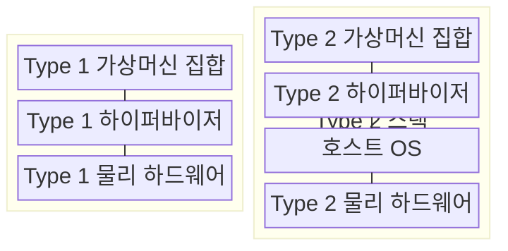
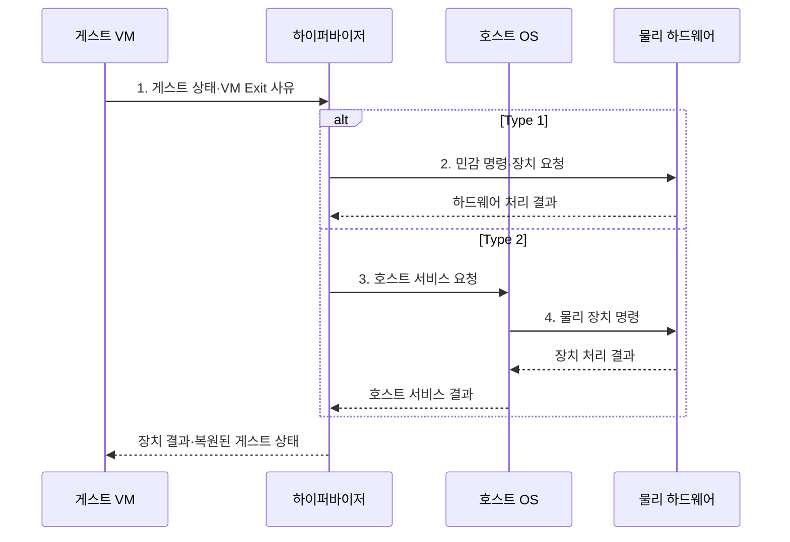

---
sidebar:
  order: 18
  label: "018. 가상화: Type 1·Type 2 하이퍼바이저 (Virtualization·Hypervisor)"
  badge:
    text: "기출 · 85%"
    variant: note
title: "가상화: Type 1·Type 2 하이퍼바이저 (Virtualization·Hypervisor)"
date: "2026-08-02T12:00:00+09:00"
tags: [notes-software]
weight: 18
extra:
  question_no: "018"
  source_status: "기출"
  source_history: "128회, 131회, 132회, 137회"
  priority: 85
  priority_note: "4회 반복, 하이퍼바이저 구조·선택 핵심"
---

## Ⅰ. 개요

핵심 용어

- **가상화(Virtualization)**: 물리 자원을 격리된 논리 실행 환경으로 추상화하는 기술
- **하이퍼바이저(Hypervisor)**: 가상머신의 물리 자원 접근을 중재하는 계층

- 정의/개념: **가상화와 하이퍼바이저**는 물리 자원을 중재해 여러 격리된 가상머신에 논리 자원으로 제공하는 **자원 추상화 구조**
- 배경/필요성: 응용별 전용 서버 배치로 **자원 유휴·환경 종속 증가**

#### 한줄 요약

- 한 건물의 전기와 공간을 관리자가 나눠 여러 독립 사무실처럼 제공한다.

## Ⅱ. 특징

핵심 용어

- **가상머신 엑시트·엔트리(VM Exit·VM Entry)**: 게스트 상태를 저장해 하이퍼바이저로 나오고 다시 복원해 게스트로 들어가는 전환
- **하드웨어 보조 가상화**: 프로세서가 게스트 실행과 상태 전환을 직접 지원하는 기능

- **가상 CPU·메모리·장치**로 게스트별 자원 격리
- **하이퍼바이저 중재**로 물리 자원 공유·권한 통제
- **하드웨어 보조·VM Exit·VM Entry**가 실행 전환 오버헤드 결정

#### 한줄 요약

- 일반 일은 사무실에서 바로 하고 건물 자원이 필요한 사건만 관리자에게 넘기므로 호출이 잦으면 느려진다.

## Ⅲ. 구조 및 구성요소

핵심 용어

- **Type 1 하이퍼바이저**: 물리 하드웨어 위에서 직접 실행되어 자원을 중재하는 하이퍼바이저
- **Type 2 하이퍼바이저**: 호스트 운영체제 위에서 응용 프로그램으로 실행되는 하이퍼바이저
- **호스트 운영체제(Host OS)**: Type 2 아래에서 물리 장치 드라이버와 시스템 서비스를 제공하는 운영체제

| 구성요소 | 책임 |
|:---|:---|
| Type 1 가상머신 집합 | **격리된 응용 환경 제공** |
| Type 1 하이퍼바이저 | **하드웨어 직접 중재** |
| Type 1 물리 하드웨어 | **CPU·메모리·장치 제공** |
| Type 2 가상머신 집합 | **격리된 응용 환경 제공** |
| Type 2 하이퍼바이저 | **호스트 서비스로 실행** |
| 호스트 OS | **드라이버·시스템 서비스** |
| Type 2 물리 하드웨어 | **CPU·메모리·장치 제공** |

#### 한줄 요약

- 전용 관리자가 건물을 바로 제어하거나 기존 사무실 운영체제 위의 관리 프로그램이 자원을 요청한다.

## Ⅳ. 흐름도

핵심 용어

- **민감 명령(Sensitive Instruction)**: 게스트가 직접 실행하면 물리 자원이나 격리에 영향을 주어 중재가 필요한 명령
- **장치 모사(Device Emulation)**: 하이퍼바이저가 게스트에 물리 장치처럼 보이는 동작을 제공하는 기능

**동작 원리**

- **1. 게스트 상태·VM Exit 사유**: 민감 명령과 게스트 문맥 전달
- **2. 민감 명령·장치 요청**: Type 1이 하드웨어를 직접 중재
- **3. 호스트 서비스 요청**: Type 2가 호스트 운영체제 기능 호출
- **4. 물리 장치 명령**: 호스트 드라이버가 장치 제어

#### 한줄 요약

- Type 1은 직접 제어하고 Type 2는 호스트를 거친다.

## Ⅴ. 종류 및 비교

핵심 용어

- **공격면(Attack Surface)**: 낮은 권한 주체나 외부 입력이 접근할 수 있는 코드·인터페이스 범위
- **호스트 호환성**: 기존 운영체제의 장치 드라이버와 서비스를 가상화 계층이 활용할 수 있는 성질

| 하이퍼바이저 배치 방식 | Type 1 | Type 2 |
|:---|:---|:---|
| 적용 기준 | 데이터센터 **운영·격리 우선** | 개발 단말·**장치 호환 우선** |
| 핵심 특징 | 하드웨어 **직접 자원 제어** | 호스트 OS **서비스 경유** |
| 한계 | 전용 드라이버·**운영 복잡성** | 호스트 장애·**공격면 영향** |

> 요약: **운영 격리**는 Type 1, **호스트 호환성**은 Type 2

#### 한줄 요약

- 전용 운영 환경은 Type 1을 쓰고 기존 컴퓨터에서 간편히 시험할 때는 Type 2를 쓴다.

## Ⅵ. 실무 고려사항 및 대책

핵심 용어

- **자원 초과 할당(Oversubscription)**: 물리 자원보다 많은 vCPU·메모리를 VM에 논리적으로 배정하는 방식
- **vCPU 준비 시간**: 가상 CPU가 실행 가능하지만 물리 CPU를 받지 못해 기다린 시간
- **준가상 드라이버·장치 직접 할당**: 효율적 하이퍼바이저 통신과 특정 VM의 물리 장치 직접 사용으로 중재를 줄이는 방식
- **관리면(Management Plane)**: VM 생성·배치·이동·권한을 제어하는 운영 인터페이스
- **스냅숏·실시간 이동**: VM 상태를 저장하거나 실행 중인 VM을 다른 호스트로 옮기는 기능

| 문제 | 대책 | 효과 |
|:---|:---|:---|
| vCPU·메모리 초과 할당으로 **자원 경합 증가** | 준비 시간·회수·교환량에 따른 **수용 제어** | VM **서비스 수준** 유지 |
| 잦은 VM Exit·장치 모사로 **처리량 저하** | Exit 원인 계측 후 **준가상 드라이버·직접 할당** 적용 | **가상화 중재 비용** 감소 |
| 하이퍼바이저·호스트 취약점이 **다수 VM에 전파** | **관리면 분리·최소 기능**과 패치·이미지 무결성 관리 | **공격면·장애 범위** 축소 |
| 이동 뒤 장치·메모리 상태 차이로 **복원 실패** | **스냅숏·실시간 이동**의 호환성·정합성 사전 시험 | **이동·복원 신뢰성** 확보 |

#### 한줄 요약

- 데이터센터는 전용 가상화 계층으로 여러 서버를 한 장비에 격리해 운영한다.

## Ⅶ. 결론

핵심 용어

- **운영 격리·호스트 장치 활용**: Type 1과 Type 2 하이퍼바이저 중 배치 방식을 선택하는 기준

- **운영 격리** 우선은 Type 1, **호스트 장치 활용** 우선은 Type 2 선택

#### 한줄 요약

- 전용 운영이 필요한지 기존 운영체제와 장치를 활용할지 보고 배치 방식을 정한다.
