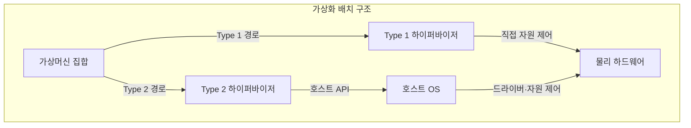
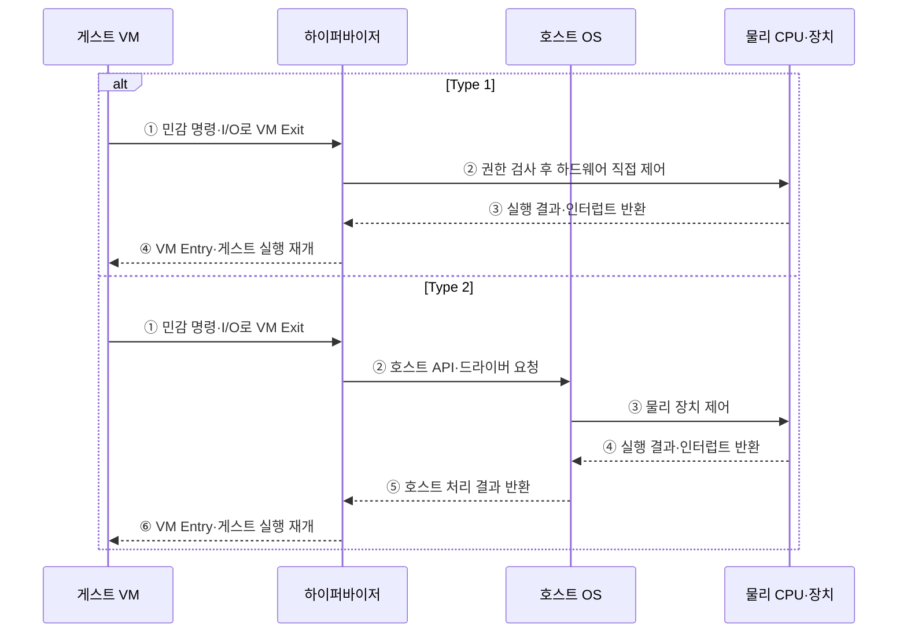

---
sidebar:
  order: 18
  label: "018. 가상화 — Type 1·Type 2 하이퍼바이저 (Virtualization·Hypervisor)"
  badge:
    text: "기출 · 85%"
    variant: note
title: 가상화 — Type 1·Type 2 하이퍼바이저 (Virtualization·Hypervisor)
date: "2026-07-27T23:59:59+09:00"
tags: [notes-software]
weight: 18
extra:
  question_no: "018"
  source_status: "기출"
  source_history: "128회, 131회, 132회, 137회"
  priority: 85
  priority_note: "4회 반복, 하이퍼바이저 구조·선택 핵심"
---

## 미리 알고가기

- **가상화(Virtualization)**: 물리 자원을 논리 실행 환경으로 추상화
- **가상머신(Virtual Machine, VM)**: 게스트 운영체제와 가상 자원을 묶어 실행하는 격리 단위
- **하이퍼바이저(Hypervisor)**: 가상머신의 자원 접근을 중재하는 계층
- **타입 원 하이퍼바이저(Type 1 Hypervisor)**: 물리 하드웨어 위에서 직접 실행되는 하이퍼바이저
- **타입 투 하이퍼바이저(Type 2 Hypervisor)**: 호스트 운영체제 위에서 응용 프로그램으로 실행되는 하이퍼바이저
- **가상 중앙처리장치(Virtual CPU, vCPU)**: 가상머신에 논리 프로세서로 제공되는 물리 CPU 자원
- **가상머신 엑시트(Virtual Machine Exit, VM Exit)**: 민감 명령·입출력·인터럽트 발생 시 게스트 상태를 저장하고 하이퍼바이저로 제어권을 넘기는 동작
- **가상머신 엔트리(Virtual Machine Entry, VM Entry)**: 게스트 상태를 복원하고 하이퍼바이저에서 가상머신으로 제어권을 넘기는 동작
- **하드웨어 보조 가상화**: 프로세서가 게스트 실행·전환을 지원
- **응용 프로그래밍 인터페이스(Application Programming Interface, API)**: 소프트웨어 기능을 호출하고 결과를 받기 위한 규약
- **게스트·호스트 운영체제(Guest·Host Operating System, Guest·Host OS)**: 게스트는 가상머신 내부에서 실행되고 호스트는 타입 2 하이퍼바이저 아래에서 물리 장치를 관리한다.
- **장치 모사(Device Emulation)**: 하이퍼바이저가 게스트에 가상 장치 동작을 흉내 내며 잦은 VM Exit에서 처리 오버헤드를 만드는 기능
- **오버헤드(Overhead)**: 실제 게스트 작업 외에 상태 전환·접근 검증·장치 모사에 추가로 드는 시간과 처리 비용
- **장치 드라이버(Device Driver)**: 운영체제가 물리 장치를 제어하도록 명령과 하드웨어 동작을 연결하는 소프트웨어
- **입출력·인터럽트(Input/Output·Interrupt, I/O·Interrupt)**: 입출력은 장치와 데이터를 교환하고 인터럽트는 장치·타이머 사건을 처리하도록 현재 실행을 중단한다.
- **민감 명령(Sensitive Instruction)**: 게스트가 직접 실행하면 물리 자원이나 격리 상태에 영향을 주므로 하이퍼바이저 중재가 필요한 명령
- **공격면(Attack Surface)**: 외부 입력이나 낮은 권한 주체가 접근할 수 있는 코드·인터페이스 범위로서 Type 2에서는 호스트 운영체제까지 영향 범위에 포함됨
- **자원 초과 할당(Oversubscription)**: 물리 자원보다 많은 가상 CPU·메모리를 VM에 논리적으로 배정하는 방식
- **가상 CPU 준비 시간(vCPU Ready Time)**: 가상 CPU가 실행 가능하지만 물리 CPU를 배정받지 못해 기다린 시간
- **메모리 회수·교환(Reclaim·Swap)**: 회수는 VM의 물리 메모리를 되찾는 동작이고 교환은 메모리 내용을 저장장치로 옮기는 동작
- **수용 제어(Admission Control)**: 물리 자원 여유를 검사해 새 VM의 배치 허용 여부를 결정하는 절차
- **준가상 드라이버(Paravirtualized Driver)**: 실제 장치를 그대로 모사하지 않고 하이퍼바이저와 효율적으로 통신하도록 게스트가 인식하는 장치 드라이버
- **장치 직접 할당(Device Passthrough)**: 물리 장치를 특정 VM이 직접 사용하도록 연결해 가상화 중재를 줄이는 방식
- **관리면(Management Plane)**: VM 생성·배치·이동·권한을 제어하는 운영 인터페이스와 구성요소
- **스냅숏·실시간 이동(Snapshot·Live Migration)**: 스냅숏은 VM의 특정 시점 상태를 저장하고 실시간 이동은 실행을 짧게만 멈추며 다른 호스트로 옮기는 기능
- **이미지 무결성(Image Integrity)**: VM 이미지가 승인되지 않은 변경 없이 신뢰할 수 있는 상태임을 검증하는 성질
- **워크로드(Workload)**: VM에서 실행되는 응용 프로그램과 그 자원 사용 특성

## Ⅰ. 개요

- 정의/개념: 하이퍼바이저가 물리 자원을 **격리된 가상머신으로 분할**하는 기술
- 기존 한계: 물리 서버별 전용 배치는 **자원 유휴·환경 종속·증설 비용** 증가

### 쉽게 이해하기 (학습용)

- 한 건물의 전기와 공간을 관리자가 나눠 여러 독립 사무실처럼 제공한다.

## Ⅱ. 특징

- **가상 CPU·메모리·장치**로 게스트별 자원 격리
- **하이퍼바이저 중재**로 물리 자원 공유·권한 통제
- **VM Exit·장치 모사**가 가상화 실행 오버헤드 결정

### 쉽게 이해하기 (학습용)

- 일반 일은 사무실에서 바로 하고 건물 자원이 필요한 사건만 관리자에게 넘기므로 호출이 잦으면 느려진다.

## Ⅲ. 아키텍처

**도표안 A — 구조도**

**도표안 B — sequenceDiagram**

| 설계 요소 | 입력·상태 | 역할 |
|:---|:---|:---|
| 가상머신 집합 | 게스트 OS·가상 자원·실행 상태 | 격리된 응용 환경 제공 |
| Type 1 하이퍼바이저 | VM 구성·물리 자원 상태 | 하드웨어 직접 중재·격리 |
| Type 2 하이퍼바이저 | VM 구성·호스트 API | 호스트 서비스로 VM 실행 |
| 호스트 OS·물리 하드웨어 | 드라이버·CPU·메모리·장치 | Type 2 서비스와 실제 실행 자원 제공 |

**동작 원리**

- ① 게스트의 민감 명령·입출력으로 VM Exit 발생
- ② Type 1은 하드웨어를 직접 제어하고 Type 2는 호스트 운영체제 API 호출
- ③ Type 1은 하드웨어 실행, Type 2는 호스트 드라이버를 통한 장치 제어
- ④ Type 1은 결과를 받아 게스트를 재개하고 Type 2는 장치 결과를 호스트 운영체제에 반환
- ⑤ Type 2의 호스트 운영체제가 처리 결과를 하이퍼바이저에 반환
- ⑥ Type 2 하이퍼바이저가 VM Entry로 게스트 실행 재개

### 쉽게 이해하기 (학습용)

- 전용 관리자가 건물을 바로 제어하거나 기존 사무실 운영체제 위의 관리 프로그램이 자원을 요청한다.

## Ⅳ. 종류 및 비교

| 하이퍼바이저 유형 | Type 1 | Type 2 |
|:---|:---|:---|
| 적용 기준 | 데이터센터 **운영·격리 우선** | 개발 단말·**장치 호환 우선** |
| 핵심 특징 | 하드웨어 **직접 자원 제어** | 호스트 OS **서비스 경유** |
| 한계 | 전용 드라이버·**운영 복잡성** | 호스트 장애·**공격면 영향** |

> 요약: 운영 격리는 Type 1, 호스트 편의는 Type 2

### 쉽게 이해하기 (학습용)

- 전용 운영 환경은 Type 1을 쓰고 기존 컴퓨터에서 간편히 시험할 때는 Type 2를 쓴다.

## Ⅴ. 실무 고려사항 및 대책

| 운영 위험 | 대응 | 기대 효과 |
|:---|:---|:---|
| 과도한 vCPU·메모리 초과 할당으로 경합 | 준비 시간·회수·교환·I/O 지연 기반 수용 제어 | VM 서비스 수준 유지 |
| VM Exit·장치 모사 빈도로 처리량 저하 | 원인별 Exit 계측과 준가상 드라이버·직접 할당 검토 | 중재 비용 감소 |
| 하이퍼바이저·호스트 취약점이 다수 VM에 영향 | 관리면 분리·최소 기능·패치와 이미지 무결성 관리 | 공격면·장애 범위 축소 |
| 스냅숏·실시간 이동 후 상태·성능 불일치 | 호환성·정합성·복구·성능 사전 시험 | 이동·복원 신뢰성 확보 |

### 적용 사례

- 데이터센터는 Type 1 하이퍼바이저로 여러 서버 워크로드를 한 물리 장비에 통합하되 VM별 자원·권한을 격리한다.

### 쉽게 이해하기 (학습용)

- 데이터센터는 전용 가상화 계층으로 여러 서버를 한 장비에 격리해 운영한다.

## Ⅵ. 결론

- 서버 통합과 워크로드 격리를 달성하려면 **운영 격리·장치 제어·호스트 OS 의존성**을 검토하고 운영 환경에 적합한 하이퍼바이저 유형을 선택한다.

### 쉽게 이해하기 (학습용)

- 전용 운영이 필요한지 기존 운영체제와 장치를 활용할지 보고 배치 방식을 정한다.
