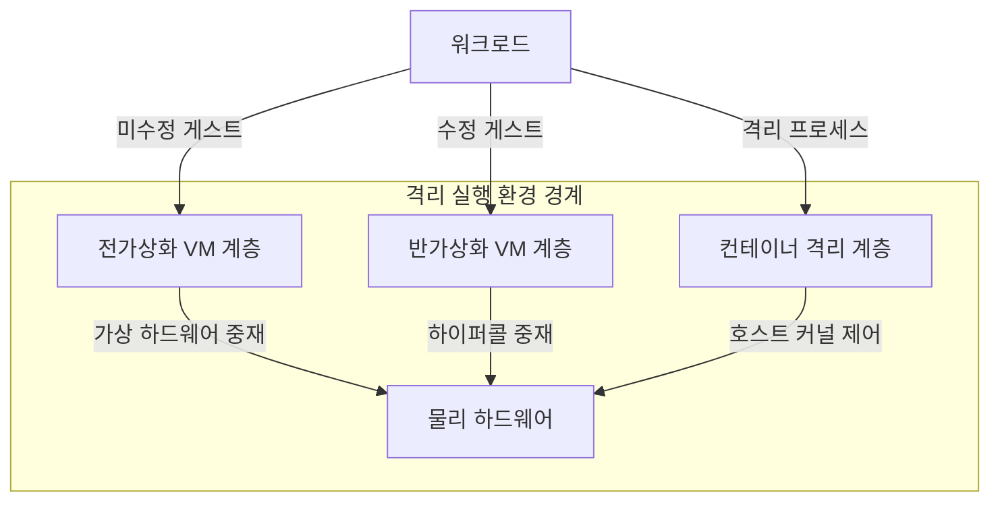
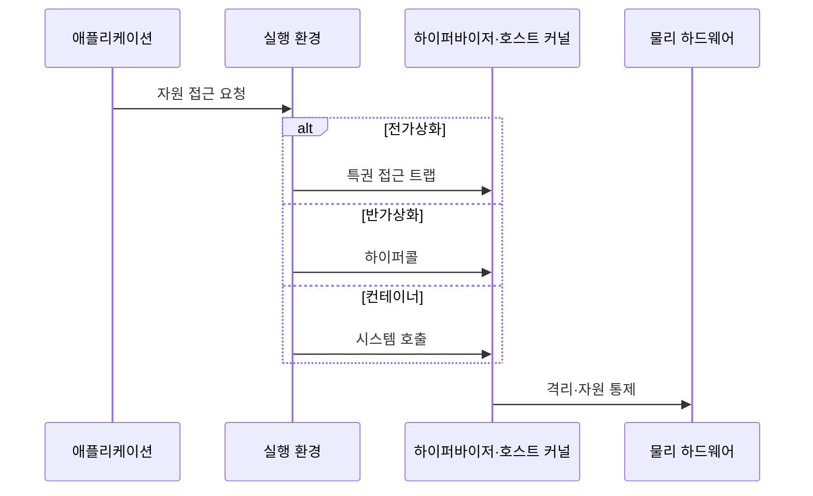

---
sidebar:
  order: 19
  label: "019. 전가상화·반가상화·컨테이너 비교 (Full·Para·Container Virtualization)"
  badge:
    text: "기출 · 50%"
    variant: note
title: 전가상화·반가상화·컨테이너 비교 (Full·Para·Container Virtualization)
date: "2026-07-27T23:59:59+09:00"
tags: [notes-software]
weight: 19
extra:
  question_no: "019"
  source_status: "기출"
  source_history: "137회"
  priority: 50
  priority_note: "137회 기출, 가상화·컨테이너 경계 비교"
---

## 미리 알고가기

- **전가상화(Full Virtualization)**: 게스트 OS 수정 없이 가상 하드웨어 제공
- **반가상화(Paravirtualization)**: 수정 게스트가 하이퍼콜로 자원 중재 요청
- **컨테이너(Container)**: 호스트 커널을 공유하는 프로세스 격리 단위
- **하이퍼바이저(Hypervisor)**: 가상머신의 물리 자원 접근 중재
- **하이퍼콜(Hypercall)**: 게스트가 하이퍼바이저 기능을 요청하는 호출
- **네임스페이스(Namespace)**: 프로세스·마운트·네트워크 관점 격리
- **제어 그룹(Control Group, cgroup)**: 프로세스 집합의 CPU·메모리 등 자원 사용량을 제한하고 계측하는 리눅스 기능
- **게스트·호스트 운영체제(Guest·Host Operating System, Guest·Host OS)**: 게스트는 가상머신 내부에서 실행되고 호스트는 물리 장비와 컨테이너의 공유 커널을 관리한다.
- **가상머신(Virtual Machine, VM)**: 독립된 게스트 운영체제와 가상 하드웨어를 묶어 하이퍼바이저가 실행하는 격리 단위
- **워크로드(Workload)**: 가상머신이나 컨테이너 안에서 실행할 응용과 처리 작업의 집합
- **실행 밀도(Deployment Density)**: 한 물리 장비에 동시에 배치할 수 있는 격리 실행 환경의 수로서 커널 공유 여부와 자원 오버헤드에 좌우됨
- **가상 하드웨어(Virtual Hardware)**: 하이퍼바이저가 게스트에 제시하는 논리 프로세서·메모리·장치 인터페이스
- **특권 접근 트랩(Privileged-access Trap)**: 미수정 게스트의 보호 자원 접근을 프로세서가 포착해 하이퍼바이저로 제어권을 넘기는 예외
- **시스템 호출(System Call)**: 응용 프로세스가 파일·네트워크·메모리 같은 호스트 커널 기능을 요청하는 공식 진입 경로
- **반가상 장치 드라이버(Paravirtualized Device Driver)**: 게스트가 하이퍼바이저와 협력하는 인터페이스로 입출력을 요청해 가상 장치 모사 비용을 줄이는 드라이버
- **마이크로서비스(Microservice)**: 하나의 비즈니스 기능을 독립 배포하는 작은 서비스로서 컨테이너의 빠른 시작과 높은 배치 밀도를 활용함
- **공격면(Attack Surface)**: 공격자가 접근 가능한 코드·인터페이스 범위로서 컨테이너는 공유 호스트 커널 취약점의 영향을 함께 받을 수 있음

## Ⅰ. 개요

- 정의/개념: 게스트 수정·커널 공유 범위가 다른 **격리 실행 방식**
- 기존 한계: 단일 가상화 방식은 **호환성·격리·시작속도·밀도** 동시 최적화에 한계

### 쉽게 이해하기 (학습용)

- 독립 건물을 통째로 흉내 내거나 관리자와 협력하거나 한 건물의 구역만 나눠 쓴다.

## Ⅱ. 특징

- 전가상화는 **미수정 게스트·독립 커널** 지원
- 반가상화는 **하이퍼콜**로 장치 중재 비용 절감
- 컨테이너는 **호스트 커널 공유**로 시작시간·자원 절감

### 쉽게 이해하기 (학습용)

- 원본 운영체제를 그대로 쓰면 무겁고 협력하도록 바꾸면 가벼워지며 커널까지 공유하면 가장 빨리 시작한다.

## Ⅲ. 아키텍처 및 구성요소

| 설계 요소 | 설명 |
|:---|:---|
| 전가상화 VM 계층 | 미수정 게스트·가상 하드웨어·하이퍼바이저 |
| 반가상화 VM 계층 | 수정 게스트·하이퍼콜·하이퍼바이저 |
| 컨테이너 격리 계층 | 프로세스·네임스페이스·cgroup·호스트 커널 |
| 물리 하드웨어 | 프로세서·메모리·입출력 장치 제공 |

> 요약: VM은 하이퍼바이저, 컨테이너는 커널 사용

### 쉽게 이해하기 (학습용)

- 두 가상머신 방식은 독립 운영체제를 두고 컨테이너는 같은 운영체제의 구역과 자원만 나눈다.

## Ⅳ. 원리 및 절차 흐름도

| 절차 | 설명 |
|:---|:---|
| 자원 접근 요청 | 애플리케이션이 실행 환경에 자원 요청 |
| 특권 접근 트랩 | 미수정 게스트의 가상 하드웨어 접근 포착 |
| 하이퍼콜 | 수정 게스트가 하이퍼바이저 기능 직접 요청 |
| 시스템 호출 | 격리 프로세스가 호스트 커널 기능 요청 |
| 격리·자원 통제 | 경로별 접근 검증·네임스페이스·한도 적용 |

> 요약: 트랩·하이퍼콜·시스템 호출이 각 격리 경계를 통과

### 쉽게 이해하기 (학습용)

- 같은 자원 요청도 가상 장치, 협력 호출, 호스트 커널 중 어느 길을 쓰는지에 따라 처리된다.

## Ⅴ. 종류 및 비교

| 격리 실행 방식 | 전가상화 | 반가상화 | 컨테이너 |
|:---|:---|:---|:---|
| 적용 기준 | 게스트 수정 불가·**커널 격리** | 게스트 수정 가능·**중재 성능 우선** | 커널 호환·**빠른 배포 우선** |
| 핵심 특징 | 미수정 게스트·**독립 커널** | 하이퍼콜·**수정 게스트** | 호스트 **커널 공유** |
| 한계 | 중재 비용·**낮은 밀도** | 게스트 수정·**호환 제약** | 커널 공유 **공격면** |

> 요약: 전가상화·반가상화·커널 공유로 구분

### 쉽게 이해하기 (학습용)

- 운영체제를 못 바꾸면 전가상화, 바꿀 수 있으면 반가상화, 커널을 공유해도 되면 컨테이너를 쓴다.

## Ⅵ. 실무 사례

1. 상용 게스트 OS는 **수정 없이 전가상화**로 실행

### 쉽게 이해하기 (학습용)

- 수정할 수 없는 운영체제는 가상 하드웨어를 제공해 그대로 실행한다.

## Ⅶ. 결론

- 워크로드 격리와 자원 효율을 균형 있게 확보하기 위해 **게스트 수정 가능성·커널 격리·기동시간·배치 밀도**를 검토하고, 전가상화·반가상화·컨테이너를 선택한다

### 쉽게 이해하기 (학습용)

- 운영체제를 바꿀 수 있는지, 커널을 공유해도 되는지, 얼마나 빨리 늘려야 하는지 보고 정한다.
