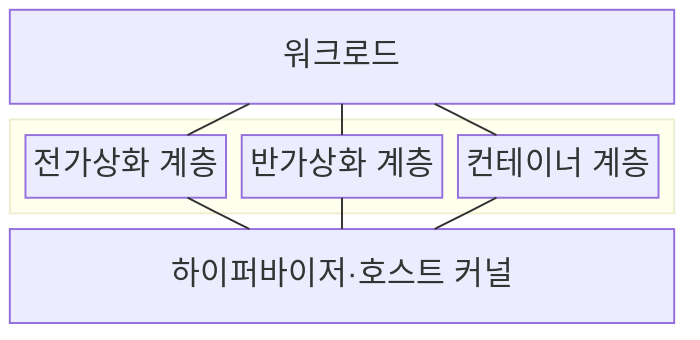
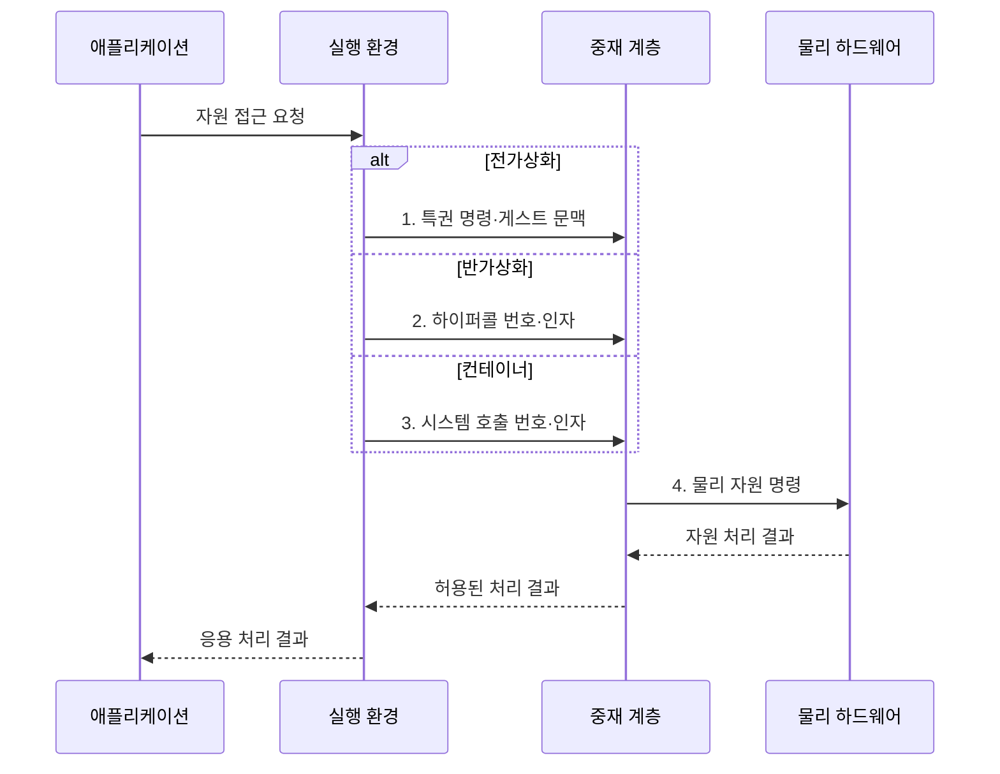

---
sidebar:
  order: 19
  label: "019. 전가상화·반가상화·컨테이너 비교 (Full·Para·Container Virtualization)"
  badge:
    text: "기출 · 50%"
    variant: note
title: 전가상화·반가상화·컨테이너 비교 (Full·Para·Container Virtualization)
date: "2026-07-31T10:26:12+09:00"
tags: [notes-software]
weight: 19
extra:
  question_no: "019"
  source_status: "기출"
  source_history: "137회"
  priority: 50
  priority_note: "137회 기출, 가상화·컨테이너 경계 비교"
---

## 미리 알고가기

- **전가상화(Full Virtualization)**: 게스트 OS 수정 없이 가상 하드웨어 제공
- **반가상화(Paravirtualization)**: 수정 게스트가 하이퍼콜로 자원 중재 요청
- **컨테이너(Container)**: 호스트 커널을 공유하는 프로세스 격리 단위
- **하이퍼바이저(Hypervisor)**: 가상머신의 물리 자원 접근 중재
- **하이퍼콜(Hypercall)**: 게스트가 하이퍼바이저 기능을 요청하는 호출
- **네임스페이스(Namespace)**: 프로세스·마운트·네트워크 관점 격리
- **제어 그룹(Control Group, cgroup)**: 프로세스 집합의 CPU·메모리 등 자원 사용량을 제한하고 계측하는 리눅스 기능
- **게스트·호스트 운영체제(Guest·Host Operating System, Guest·Host OS)**: 게스트는 가상머신 내부에서 실행되고 호스트는 물리 장비와 컨테이너의 공유 커널을 관리한다.
- **가상머신(Virtual Machine, VM)**: 독립된 게스트 운영체제와 가상 하드웨어를 묶어 하이퍼바이저가 실행하는 격리 단위
- **워크로드(Workload)**: 가상머신이나 컨테이너 안에서 실행할 응용과 처리 작업의 집합
- **실행 밀도(Deployment Density)**: 한 물리 장비에 동시에 배치할 수 있는 격리 환경의 수로서 커널을 공유하고 자원 오버헤드가 작을수록 높아짐
- **가상 하드웨어(Virtual Hardware)**: 하이퍼바이저가 게스트에 제시하는 논리 프로세서·메모리·장치 인터페이스
- **특권 접근 트랩(Privileged-access Trap)**: 미수정 게스트의 보호 자원 접근을 프로세서가 포착해 하이퍼바이저로 제어권을 넘기는 예외
- **시스템 호출(System Call)**: 응용 프로세스가 파일·네트워크·메모리 같은 호스트 커널 기능을 요청하는 공식 진입 경로
- **반가상 장치 드라이버(Paravirtualized Device Driver)**: 게스트가 하이퍼바이저와 협력하는 인터페이스로 입출력을 요청해 가상 장치 모사 비용을 줄이는 드라이버
- **공격면(Attack Surface)**: 공격자가 접근 가능한 코드·인터페이스 범위로서 컨테이너는 공유 호스트 커널 취약점의 영향을 함께 받을 수 있음
- **기동시간(Startup Time)**: VM이나 컨테이너의 생성 요청부터 응용 프로그램이 실행 가능해질 때까지의 시간
- **시끄러운 이웃(Noisy Neighbor)**: 같은 물리 장비의 다른 워크로드가 자원을 과도하게 사용해 내 워크로드 성능을 떨어뜨리는 현상
- **이미지 출처 증명(Image Provenance)**: 실행 이미지가 누가 어떤 재료와 절차로 만들었는지 검증할 수 있는 기록
- **최소 권한(Least Privilege)**: 작업에 필요한 최소한의 자원과 권한만 부여하는 보안 원칙

> **키워드:** 전가상화·반가상화·컨테이너 비교 (Full·Para·Container Virtualization)

## Ⅰ. 개요

- 정의/개념: 게스트 수정·커널 공유 범위가 다른 **격리 실행 방식**
- 배경/필요성: 게스트 수정 가능성과 커널 공유 범위에 따른 **호환성·격리·배치 밀도 판단**

### 쉽게 이해하기 (학습용)

- 독립 건물을 통째로 흉내 내거나 관리자와 협력하거나 한 건물의 구역만 나눠 쓴다.

## Ⅱ. 특징

- 전가상화는 **미수정 게스트·독립 커널** 지원
- 반가상화는 **하이퍼콜**로 장치 중재 비용 절감
- 컨테이너는 **호스트 커널 공유**로 시작시간·자원 절감

### 쉽게 이해하기 (학습용)

- 원본 운영체제를 그대로 쓰면 무겁고 협력하도록 바꾸면 가벼워지며 커널까지 공유하면 가장 빨리 시작한다.

## Ⅲ. 구조 및 구성요소

| 구성요소 | 책임 |
|:---|:---|
| 워크로드 | **자원 접근 요청** |
| 전가상화 계층 | **미수정 게스트 실행** |
| 반가상화 계층 | **하이퍼콜 기반 실행** |
| 컨테이너 계층 | **커널 공유 격리** |
| 하이퍼바이저·호스트 커널 | **권한·자원 중재** |

### 쉽게 이해하기 (학습용)

- 같은 자원 요청도 가상 장치, 협력 호출, 호스트 커널 중 어느 길을 쓰는지에 따라 처리된다.

## Ⅳ. 흐름도

**동작 원리**

- **1. 특권 명령·게스트 문맥**: 전가상화의 트랩 기반 자원 중재
- **2. 하이퍼콜 번호·인자**: 반가상화 게스트의 명시적 기능 요청
- **3. 시스템 호출 번호·인자**: 컨테이너의 공유 커널 기능 요청
- **4. 물리 자원 명령**: 권한·자원 한도 검증 후 하드웨어 실행

### 쉽게 이해하기 (학습용)

- 같은 요청도 트랩·하이퍼콜·시스템 호출 중 한 길을 쓴다.

## Ⅴ. 종류 및 비교

| 격리 실행 방식 | 전가상화 | 반가상화 | 컨테이너 |
|:---|:---|:---|:---|
| 적용 기준 | 게스트 수정 불가·**커널 격리** | 게스트 수정 가능·**중재 성능 우선** | 커널 호환·**빠른 배포 우선** |
| 핵심 특징 | 미수정 게스트·**독립 커널** | 하이퍼콜·**수정 게스트** | 호스트 **커널 공유** |
| 한계 | 중재 비용·**낮은 밀도** | 게스트 수정·**호환 제약** | 커널 공유 **공격면** |

> 요약: **게스트 수정 여부·커널 공유 범위**로 **격리 방식** 구분

### 쉽게 이해하기 (학습용)

- 운영체제를 못 바꾸면 전가상화, 바꿀 수 있으면 반가상화, 커널을 공유해도 되면 컨테이너를 쓴다.

## Ⅵ. 실무 고려사항 및 대책

| 고려사항 | 대책 | 효과 |
|:---|:---|:---|
| 공유 커널 취약점이 여러 컨테이너에 **피해 전파** | 커널 패치·**최소 권한**과 고위험 작업 VM 격리 | **공격면·피해 범위** 축소 |
| 자원 상한이 없어 **시끄러운 이웃 발생** | **cgroup 제한·예약**과 워크로드별 사용량 계측 | **성능 간섭** 통제 |
| 출처 불명 이미지로 **악성 코드·취약 구성 유입** | 서명된 이미지·**출처 증명·취약점 검사** | **공급망 신뢰성** 확보 |
| 전가상화의 장치 모사로 **기동·처리 비용 증가** | **반가상 장치 드라이버**와 실제 처리량 계측 | 격리를 유지하며 **오버헤드 절감** |

### 쉽게 이해하기 (학습용)

- 수정할 수 없는 운영체제는 가상 하드웨어를 제공하고 가벼운 서비스는 호스트 커널을 공유한다.

## Ⅶ. 결론

- **게스트 수정 불가·커널 격리**는 전가상화, 수정 가능은 반가상화, **커널 공유**는 컨테이너 선택

### 쉽게 이해하기 (학습용)

- 운영체제를 바꿀 수 있는지, 커널을 공유해도 되는지, 얼마나 빨리 늘려야 하는지 보고 정한다.
