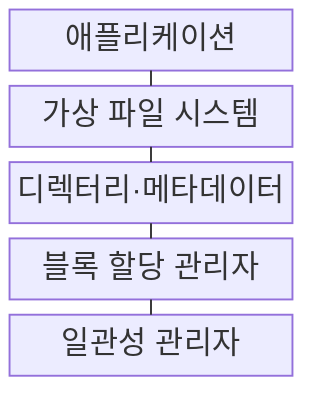
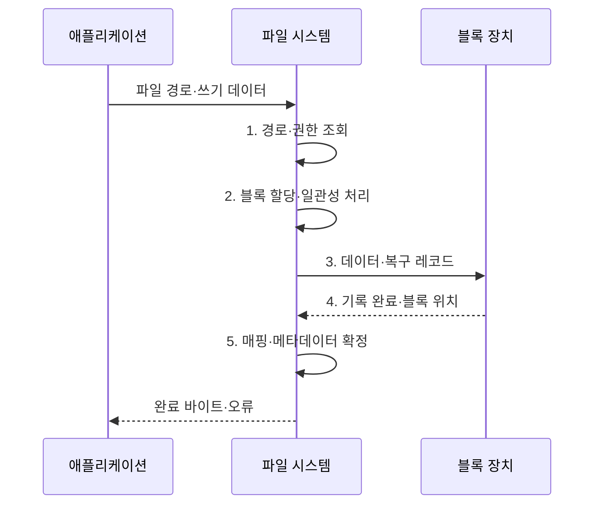

---
sidebar:
  order: 20
  label: "020. 파일 시스템: FAT·NTFS·ext4·APFS (File System)"
  badge:
    text: "미출제 · 50%"
    variant: note
title: "파일 시스템: FAT·NTFS·ext4·APFS (File System)"
date: "2026-08-02T12:00:00+09:00"
tags: [notes-software]
weight: 20
extra:
  question_no: "020"
  source_status: "미출제"
  source_history: ""
  priority: 50
  priority_note: "할당·메타데이터·장애 일관성 비교"
---

## Ⅰ. 개요

핵심 용어

- **파일 시스템(File System)**: 파일 이름과 메타데이터를 저장장치 블록에 연결하는 영구 저장 관리 체계

- 정의/개념: **파일 시스템**은 파일 이름•메타데이터를 저장장치 블록에 연결하고 접근•할당•장애 복구를 관리하는 **영구 저장 관리 체계**
- 배경/필요성: 원시 블록만으로는 파일 **식별·접근 통제·장애 복구 불가**

#### 한줄 요약

- 폴더 장부가 파일 이름을 저장 공간과 연결하고 중단된 변경을 복구하게 한다.

## Ⅱ. 특징

핵심 용어

- **메타데이터(Metadata)**: 파일의 크기·위치·권한·시간을 설명하는 관리 정보
- **저널링(Journaling)**: 변경 의도를 로그에 기록해 장애 뒤 재실행·복구하는 방식
- **쓰기 시 복사(Copy-on-Write, COW)**: 변경 데이터를 새 블록에 기록한 뒤 참조를 전환하는 갱신 방식

- **디렉터리·메타데이터·블록** 분리 관리
- **블록 크기 증가** 시 관리 항목 감소·내부 단편화 증가
- **저널링·COW**로 장애 일관성 확보

#### 한줄 요약

- 큰 상자는 장부가 단순하지만 남는 공간이 커지고 작은 상자는 공간을 아끼지만 관리 항목이 늘어난다.

## Ⅲ. 구조 및 구성요소

핵심 용어

- **가상 파일 시스템(Virtual File System, VFS)**: 파일 시스템별 구현 차이를 공통 파일 인터페이스로 추상화하는 계층
- **블록 할당 관리자**: 파일 데이터를 저장할 블록의 배치와 회수를 관리하는 구성요소
- **일관성 관리자**: 데이터·메타데이터 커밋 순서와 장애 복구를 통제하는 구성요소

| 구성요소 | 책임 |
|:---|:---|
| 애플리케이션 | **파일 연산 요청** |
| 가상 파일 시스템 | **공통 파일 인터페이스** |
| 디렉터리·메타데이터 | **경로·속성·위치 연결** |
| 블록 할당 관리자 | **블록 배치·회수** |
| 일관성 관리자 | **커밋·장애 복구 통제** |

#### 한줄 요약

- 파일 장부를 찾고 빈 공간에 데이터를 쓴 뒤 복구 방식에 맞춰 새 위치를 확정한다.

## Ⅳ. 흐름도

핵심 용어

- **경로 해석(Path Resolution)**: 디렉터리 이름을 순서대로 따라 대상 파일 메타데이터를 찾는 과정
- **복구 레코드**: 쓰기 도중 장애가 나도 변경을 재실행하거나 되돌릴 수 있도록 기록한 정보
- **커밋(Commit)**: 데이터·메타데이터 변경이 정한 일관성 범위에서 영구 저장됐음을 확정하는 동작

**동작 원리**

- **1. 경로·권한 조회**: 디렉터리를 따라 대상과 접근 권한 확인
- **2. 블록 할당·일관성 처리**: 기존 위치와 필요한 빈 블록을 찾고 복구 방식 결정
- **3. 데이터·복구 레코드**: 파일 내용과 저널·COW 정보 기록
- **4. 기록 완료·블록 위치**: 저장장치가 영구 기록 결과 반환
- **5. 매핑·메타데이터 확정**: 크기·위치·시간 정보를 커밋

#### 한줄 요약

- 빈 공간에 쓴 뒤 복구 방식에 맞춰 새 위치를 확정한다.

## Ⅴ. 종류 및 비교

핵심 용어

- **FAT·NTFS·ext4·APFS**: 할당표, MFT·ACL·저널, 아이노드·익스텐트·저널, COW·스냅샷을 각각 핵심 구조로 쓰는 파일 시스템
- **아이노드(Index Node, inode)**: 파일 이름을 제외한 유형·권한·크기·블록 위치를 저장하는 유닉스 계열 구조

| 파일 시스템 선택 기준 | FAT | NTFS | ext4 | APFS |
|:---|:---|:---|:---|:---|
| 적용 기준 | **이동식 매체·교차 장치 호환** | **Windows 권한·복구** | **Linux 범용 서버·단말** | **Apple 장치·스냅샷 운영** |
| 핵심 특징 | **단순 할당표·광범위 호환** | **MFT·ACL·저널** | **아이노드·익스텐트·저널** | **COW·스냅샷·암호화** |
| 한계 | **저널 부재·기능 제약** | **Windows 종속성** | **조정 복잡성** | **COW 단편화·생태계 종속** |

> 요약: **호환성·운영체제·복구 방식**에 따라 **FAT·NTFS·ext4·APFS** 선택

#### 한줄 요약

- 여러 장치 호환은 FAT를 보고 운영체제별 권한·복구·스냅샷 요구는 각 기본 파일 시스템을 따른다.

## Ⅵ. 실무 고려사항 및 대책

핵심 용어

- **내구성(Durability)**: 쓰기 완료로 확정한 데이터가 비정상 종료 뒤에도 영구 저장소에 남는 성질
- **강제 동기화(Filesystem Synchronization, fsync)**: 파일 변경 내용을 저장장치까지 확정하도록 요청하는 시스템 호출
- **장애 주입 시험(Fault-injection Test)**: 쓰기 중 전원 차단·오류를 의도적으로 발생시켜 복구를 검증하는 시험
- **내부 단편화(Internal Fragmentation)**: 파일의 마지막 할당 블록 안에서 사용되지 않고 남는 공간
- **쓰기 증폭(Write Amplification)**: 논리 변경량보다 저장장치에 실제 기록되는 데이터가 더 많아지는 현상

| 문제 | 대책 | 효과 |
|:---|:---|:---|
| 쓰기 완료를 실제 **내구성 보장으로 오인** | 중요 데이터에 **fsync·장애 주입 시험** 적용 | 장애 후 **데이터 손실 범위** 확인 |
| 작은 파일에 큰 블록을 할당해 **내부 단편화 증가** | 파일 크기 분포에 맞춰 **블록 크기·할당 정책 선택** | **저장 공간 효율** 향상 |
| 장기 스냅샷이 **COW 단편화·쓰기 증폭 유발** | **보존 기간·여유 공간·정리 비용** 관리 | **성능 저하·용량 고갈** 방지 |
| 파일 시스템 기능이 장치·운영체제와 **불일치** | 실제 대상에서 **읽기·쓰기·권한·복구 시험** | **호환성 장애** 예방 |

#### 한줄 요약

- 여러 장치에서 읽을 매체는 호환성이 높은 FAT 계열을 쓴다.

## Ⅶ. 결론

핵심 용어

- **이동식 호환·운영체제·스냅샷 요구**: FAT·NTFS·ext4·APFS 중 파일 시스템을 선택하는 기준

- **이동식 호환·운영체제·스냅샷 요구**에 따라 **FAT·NTFS·ext4·APFS 선택**

#### 한줄 요약

- 어느 장치에서 읽을지, 권한과 장애 복구가 필요한지, 시점 복원이 필요한지 보고 정한다.
