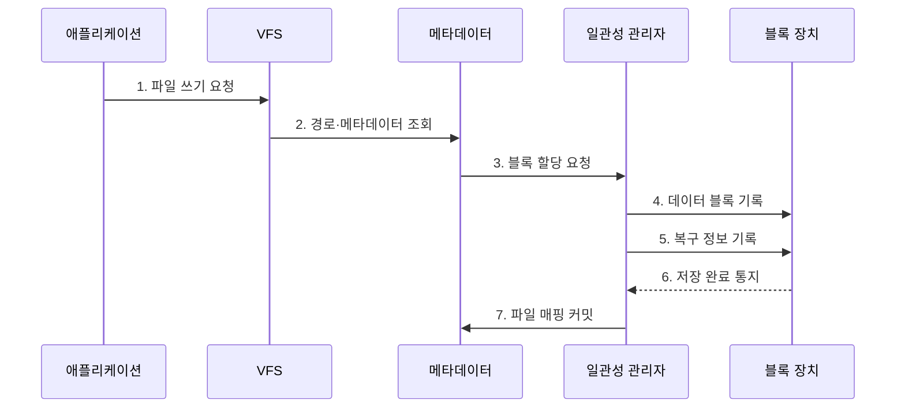

---
sidebar:
  order: 20
  label: "020. 파일 시스템: FAT·NTFS·ext4·APFS (File System)"
  badge:
    text: "미출제 · 50%"
    variant: note
title: "파일 시스템: FAT·NTFS·ext4·APFS (File System)"
date: "2026-07-25T00:35:28+09:00"
tags: [notes-software]
weight: 20
extra:
  question_no: "020"
  source_status: "미출제"
  source_history: ""
  priority: 50
  priority_note: "할당·메타데이터·장애 일관성 비교"
---

## 미리 알고가기

- **파일 시스템(File System)**: 저장 블록을 파일·디렉터리로 조직
- **가상 파일 시스템(Virtual File System, VFS)**: 파일 시스템별 구현 차이를 공통 파일 인터페이스로 추상화하는 계층
- **메타데이터(Metadata)**: 파일 크기·위치·권한·시간 정보
- **블록·클러스터(Block·Cluster)**: 파일에 할당하는 저장장치 공간 단위
- **익스텐트(Extent)**: 연속 블록의 시작 위치·길이 표현
- **저널링(Journaling)**: 변경 의도를 로그에 기록해 장애 후 재실행·복구
- **쓰기 시 복사(Copy-on-Write, COW)**: 변경 데이터를 새 블록에 기록한 뒤 참조를 전환하는 갱신 방식
- **스냅샷(Snapshot)**: 특정 시점의 파일 시스템 참조 상태 보존
- **접근 제어 목록(Access Control List, ACL)**: 사용자·그룹별 파일 접근 권한을 기록하는 목록
- **마스터 파일 테이블(Master File Table, MFT)**: NTFS의 파일·디렉터리 메타데이터를 저장하는 핵심 테이블
- **파일 할당 테이블(File Allocation Table, FAT)**: 파일을 구성하는 클러스터의 연결 관계를 할당표에 기록하는 파일 시스템
- **신기술 파일 시스템(New Technology File System, NTFS)**: MFT·ACL·저널로 Windows의 메타데이터·권한·장애 복구를 지원하는 파일 시스템
- **제4 확장 파일 시스템(Fourth Extended File System, ext4)**: 아이노드·익스텐트·저널을 제공하는 Linux 범용 파일 시스템
- **애플 파일 시스템(Apple File System, APFS)**: 쓰기 시 복사·스냅샷·암호화를 지원하는 Apple 장치용 파일 시스템
- **아이노드(Index Node, inode)**: 파일 이름을 제외한 유형·권한·크기·블록 위치를 저장하는 유닉스 계열 메타데이터 구조
- **운영체제(Operating System, OS)**: 파일 경로를 해석하고 저장 블록·권한·장애 복구를 관리하는 시스템 소프트웨어
- **블록 장치(Block Device)**: 데이터를 고정 크기 블록 단위로 읽고 쓰며 파일 시스템의 영구 저장 공간을 제공하는 장치
- **경로 해석(Path Resolution)**: 디렉터리 이름을 순서대로 따라가 대상 파일의 메타데이터를 찾는 과정
- **커밋(Commit)**: 데이터·메타데이터 변경이 정한 일관성 범위에서 영구 저장됐음을 확정하는 동작
- **내부 단편화(Internal Fragmentation)**: 파일의 마지막 할당 블록 안에서 사용되지 않고 남는 공간으로서 블록 크기가 클수록 증가할 수 있음
- **암호화(Encryption)**: 저장 데이터를 키 없이는 읽을 수 없는 형태로 변환해 APFS 파일과 스냅샷의 기밀성을 보호하는 기능
- **장애 일관성(Crash Consistency)**: 쓰기 도중 전원이 끊겨도 파일 시스템이 복구 가능한 구조를 유지하는 성질
- **내구성(Durability)**: 쓰기 완료로 확정한 데이터가 비정상 종료 뒤에도 영구 저장소에 남는 성질
- **강제 동기화(Filesystem Synchronization, fsync)**: 응용 프로그램이 파일의 변경 내용을 저장장치까지 확정하도록 요청하는 시스템 호출
- **쓰기 증폭(Write Amplification)**: 논리적으로 변경한 데이터보다 저장장치에 실제 기록되는 데이터가 더 많아지는 현상
- **장애 주입 시험(Fault-injection Test)**: 쓰기 과정의 특정 지점에서 전원 차단·오류를 의도적으로 발생시켜 복구 동작을 검증하는 시험

## Ⅰ. 개요

- 정의/개념: 이름·메타데이터를 블록에 잇는 **저장 체계**
- 배경/필요성: 원시 블록의 **식별·권한·복구 기능** 제공

### 쉽게 이해하기 (학습용)

- 폴더 장부가 파일 이름을 저장 공간과 연결하고 중단된 변경을 복구하게 한다.

## Ⅱ. 특징

- **디렉터리·메타데이터·블록** 분리 관리
- **블록 크기**가 관리량·내부 단편화 결정
- **저널링·COW**로 장애 일관성 확보

### 쉽게 이해하기 (학습용)

- 큰 상자는 장부가 단순하지만 남는 공간이 커지고 작은 상자는 공간을 아끼지만 관리 항목이 늘어난다.

## Ⅲ. 구조 및 구성요소

| 구성요소 | 책임 |
|:---|:---|
| 애플리케이션 | **파일 연산 요청** |
| 가상 파일 시스템 | **공통 파일 인터페이스** |
| 디렉터리·메타데이터 | **경로·속성·위치 연결** |
| 블록 할당 관리자 | **블록 배치·회수** |
| 일관성 관리자 | **커밋·장애 복구 통제** |

### 쉽게 이해하기 (학습용)

- 파일 장부를 찾고 빈 공간에 데이터를 쓴 뒤 복구 방식에 맞춰 새 위치를 확정한다.

## Ⅳ. 흐름도

**동작 원리**

- **1. 파일 쓰기 요청**: 경로·데이터 전달
- **2. 경로·메타데이터 조회**: 대상 해석
- **3. 블록 할당 요청**: 빈 공간 결정
- **4. 데이터 블록 기록**: 파일 내용 저장
- **5. 복구 정보 기록**: 저널·COW 반영
- **6. 저장 완료 통지**: 장치 응답
- **7. 파일 매핑 커밋**: 크기·위치 확정

### 쉽게 이해하기 (학습용)

- 빈 공간에 쓴 뒤 복구 방식에 맞춰 새 위치를 확정한다.

## Ⅴ. 종류 및 비교

| 구분 | FAT | NTFS | ext4 | APFS |
|:---|:---|:---|:---|:---|
| 적용 기준 | 이동식 매체·교차 장치 호환 | Windows 권한·복구 | Linux 범용 서버·단말 | Apple 장치·스냅샷 운영 |
| 핵심 특징 | 단순 할당표·광범위 호환 | MFT·ACL·저널 | 아이노드·익스텐트·저널 | COW·스냅샷·암호화 |
| 한계 | 저널 부재·기능 제약 | Windows 종속성 | 조정 복잡성 | COW 단편화·생태계 종속 |

> 요약: FAT·NTFS·ext4·APFS를 용도별 선택

### 쉽게 이해하기 (학습용)

- 여러 장치 호환은 FAT를 보고 운영체제별 권한·복구·스냅샷 요구는 각 기본 파일 시스템을 따른다.

## Ⅵ. 실무 고려사항 및 대책

| 고려사항 | 대책 | 효과 |
|:---|:---|:---|
| 쓰기 완료와 실제 내구성 범위 혼동 | 중요 데이터에 fsync 적용·장애 주입 복구 시험 | 장애 후 데이터 손실 범위 확인 |
| 작은 파일과 큰 블록으로 내부 단편화 증가 | 파일 크기 분포에 맞는 블록 크기·할당 정책 선택 | 저장 공간 효율 향상 |
| COW·장기 스냅샷으로 단편화·쓰기 증폭 증가 | 스냅샷 보존기간·여유 공간·정리 비용 관리 | 성능 저하·용량 고갈 방지 |
| 파일 시스템 기능이 장치·운영체제와 불일치 | 실제 대상 간 읽기·쓰기·권한·복구 시험 | 호환성 장애 예방 |

### 쉽게 이해하기 (학습용)

- 여러 장치에서 읽을 매체는 호환성이 높은 FAT 계열을 쓴다.

## Ⅶ. 결론

- 호환성·권한·복구 요구로 **파일 시스템**을 선택한다.

### 쉽게 이해하기 (학습용)

- 어느 장치에서 읽을지, 권한과 장애 복구가 필요한지, 시점 복원이 필요한지 보고 정한다.
