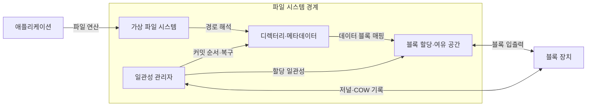
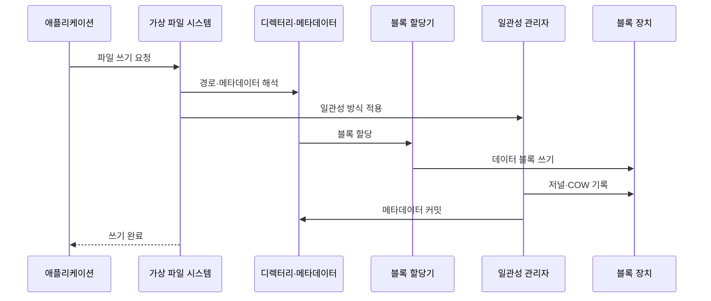

---
sidebar:
  order: 20
  label: "020. 파일 시스템 — FAT·NTFS·ext4·APFS (File System)"
  badge:
    text: "미출제 · 50%"
    variant: note
title: 파일 시스템 — FAT·NTFS·ext4·APFS (File System)
date: "2026-07-25T00:35:28+09:00"
tags: [notes-software]
weight: 20
extra:
  question_no: "020"
  source_status: "미출제"
  source_history: ""
  priority: 50
  priority_note: "할당·메타데이터·장애 일관성 비교"
---

## 미리 알고가기

- **파일 시스템(File System)**: 저장 블록을 파일·디렉터리로 조직
- **가상 파일 시스템(Virtual File System, VFS)**: ‘브이에프에스’로 읽고 Virtual File System의 머리글자를 딴 표기이며 파일 시스템별 차이를 공통 인터페이스로 추상화
- **메타데이터(Metadata)**: 파일 크기·위치·권한·시간 정보
- **블록·클러스터(Block·Cluster)**: 파일에 할당하는 저장장치 공간 단위
- **익스텐트(Extent)**: 연속 블록의 시작 위치·길이 표현
- **저널링(Journaling)**: 변경 의도를 로그에 기록해 장애 후 재실행·복구
- **쓰기 시 복사(Copy-on-Write, COW)**: ‘카우’로 읽고 Copy-on-Write의 머리글자를 딴 표기이며 변경 데이터를 새 블록에 쓰고 참조 전환
- **스냅샷(Snapshot)**: 특정 시점의 파일 시스템 참조 상태 보존
- **접근 제어 목록(Access Control List, ACL)**: ‘에이시엘’로 읽고 Access Control List의 머리글자를 딴 표기이며 사용자·그룹별 파일 접근 권한을 기록하는 목록
- **마스터 파일 테이블(Master File Table, MFT)**: ‘엠에프티’로 읽고 Master File Table의 머리글자를 딴 표기이며 NTFS가 파일·디렉터리 메타데이터를 저장하는 핵심 테이블
- **파일 할당 테이블(File Allocation Table, FAT)**: ‘팻’으로 읽고 File Allocation Table의 머리글자를 딴 표기이며 파일의 클러스터 연결을 할당표에 기록하는 파일 시스템 계열
- **신기술 파일 시스템(New Technology File System, NTFS)**: ‘엔티에프에스’로 읽고 New Technology File System의 머리글자를 딴 표기이며 MFT·ACL·저널로 Windows의 메타데이터·권한·복구를 제공
- **제4 확장 파일 시스템(Fourth Extended File System, ext4)**: ‘이엑스티 포’로 읽고 extended의 축약어 ext와 네 번째 세대를 뜻하는 숫자 4를 결합한 관례 표기이며 Linux에서 아이노드·익스텐트·저널을 제공하는 범용 파일 시스템
- **애플 파일 시스템(Apple File System, APFS)**: ‘에이피에프에스’로 읽고 Apple File System의 머리글자를 딴 표기이며 쓰기 시 복사·스냅샷·암호화로 Apple 장치의 시점 복구를 관리
- **아이노드(Index Node, inode)**: ‘아이노드’로 읽는 유닉스 계열의 관례 이름으로 파일 이름을 제외한 유형·권한·크기·블록 위치를 저장하는 메타데이터 구조
- **운영체제(Operating System, OS)**: ‘오에스’로 읽고 Operating System의 머리글자를 딴 표기이며 파일 경로를 해석하고 저장 블록·권한·장애 복구를 관리
- **블록 장치(Block Device)**: 데이터를 고정 크기 블록 단위로 읽고 쓰며 파일 시스템의 영구 저장 공간을 제공하는 장치
- **경로 해석(Path Resolution)**: 디렉터리 이름을 순서대로 따라가 대상 파일의 메타데이터를 찾는 과정
- **커밋(Commit)**: 데이터·메타데이터 변경이 정한 일관성 범위에서 영구 저장됐음을 확정하는 동작
- **내부 단편화(Internal Fragmentation)**: 파일의 마지막 할당 블록 안에서 사용되지 않고 남는 공간으로서 블록 크기가 클수록 증가할 수 있음
- **암호화(Encryption)**: 저장 데이터를 키 없이는 읽을 수 없는 형태로 변환해 APFS 파일과 스냅샷의 기밀성을 보호하는 기능

## Ⅰ. 개요

- 정의/개념: 이름·메타데이터를 블록에 연결
- **배경/필요성**: 원시 블록은 식별·복구가 안 돼 파일 체계 필요

### 쉽게 이해하기 (학습용)

- 폴더 장부가 파일 이름을 저장 공간과 연결하고 중단된 변경을 복구하게 한다.

## Ⅱ. 특징

- 디렉터리·메타데이터·데이터 블록을 분리 관리한다.
- 블록 크기 증가 시 관리 항목 감소·내부 단편화 증가한다.
- 저널링·쓰기 시 복사로 비정상 종료 후 일관성 확보한다.

### 쉽게 이해하기 (학습용)

- 큰 상자는 장부가 단순하지만 남는 공간이 커지고 작은 상자는 공간을 아끼지만 관리 항목이 늘어난다.

## Ⅲ. 아키텍처 및 구성요소

| 설계 요소 | 설명 |
|:---|:---|
| 가상 파일 시스템 | 파일 연산을 파일 시스템 구현에 전달 |
| 디렉터리·메타데이터 | 경로 이름과 파일 속성·블록 위치 연결 |
| 블록 할당·여유 공간 | 데이터 블록 배치·회수·빈 공간 관리 |
| 일관성 관리자 | 저널·COW 커밋 순서와 장애 복구 통제 |

> 요약: 경로를 메타데이터·블록에 연결하고 변경을 일관되게 커밋

### 쉽게 이해하기 (학습용)

- 공통 창구가 폴더 장부에서 위치를 찾고 빈 공간을 배정한 뒤 복구 기록과 함께 확정한다.

## Ⅳ. 원리 및 절차 흐름도

| 절차 | 설명 |
|:---|:---|
| 파일 쓰기 요청 | 경로·데이터·쓰기 조건을 VFS에 전달 |
| 경로·메타데이터 해석 | 디렉터리를 따라 대상 파일 상태 확인 |
| 일관성 방식 적용 | 저널·COW 정책에 맞춰 커밋 순서 결정 |
| 블록 할당 | 빈 블록 선택 후 파일 블록 매핑 준비 |
| 데이터 블록 쓰기 | 할당 블록에 파일 데이터 기록 |
| 저널·COW 기록 | 변경 로그 또는 새 메타데이터 블록 기록 |
| 메타데이터 커밋 | 파일 크기·블록 매핑·디렉터리 확정 |
| 쓰기 완료 | 일관성 보장 범위 완료 후 결과 반환 |

> 요약: 경로 해석·블록 기록 후 일관성 정책으로 메타데이터 확정

### 쉽게 이해하기 (학습용)

- 파일 장부를 찾고 빈 공간에 데이터를 쓴 뒤 복구 방식에 맞춰 새 위치를 확정한다.

## Ⅴ. 종류 및 비교

| 판단 기준 | FAT | NTFS | ext4 | APFS |
|:---|:---|:---|:---|:---|
| 핵심 특징 | 단순 할당표·광범위 호환 | MFT·ACL·저널 | 아이노드·익스텐트·저널 | COW·스냅샷·암호화 |
| 적용 기준 | 이동식 매체·교차 장치 호환 | Windows 권한·복구 | Linux 범용 서버·단말 | Apple 장치·스냅샷 운영 |
| 주요 위험 | 저널 부재·기능 제약 | Windows 종속성 | 조정 복잡성 | COW 단편화·생태계 종속 |

> 요약: FAT·NTFS·ext4·APFS를 용도별 선택

### 쉽게 이해하기 (학습용)

- 여러 장치 호환은 FAT를 보고 운영체제별 권한·복구·스냅샷 요구는 각 기본 파일 시스템을 따른다.

## Ⅵ. 실무 사례

1. 교차 장치 이동식 매체는 FAT 계열로 포맷
2. Windows 파일 서버는 NTFS ACL·저널 적용
3. Linux 범용 서버는 ext4 익스텐트·저널 사용
4. Apple 단말 백업은 APFS 스냅샷·암호화 활용

### 쉽게 이해하기 (학습용)

- 여러 장치에서 읽을 매체는 호환성이 높은 FAT 계열을 쓴다.
- Windows 서버는 사용자별 권한과 장애 복구 기록을 NTFS로 관리한다.
- Linux 서버는 연속 블록과 저널을 지원하는 ext4를 범용으로 쓴다.
- Apple 단말은 APFS 스냅샷으로 시점을 보존하고 저장 내용을 암호화한다.

## Ⅶ. 결론

- 운영체제 호환·권한·복구·스냅샷 요구로 파일 시스템 선택

### 쉽게 이해하기 (학습용)

- 어느 장치에서 읽을지, 권한과 장애 복구가 필요한지, 시점 복원이 필요한지 보고 정한다.
