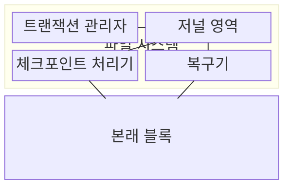
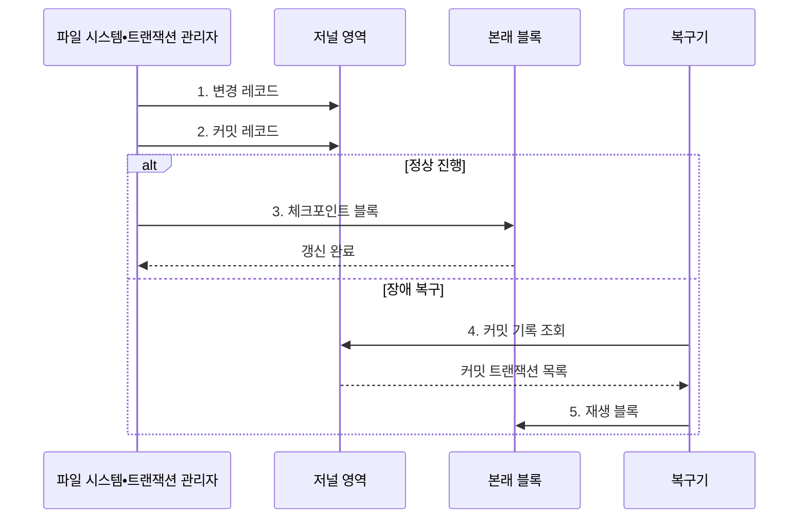

---
sidebar:
  order: 21
  label: "021. 파일 시스템 저널링 (File System Journaling)"
  badge:
    text: "미출제 • 50%"
    variant: note
title: "파일 시스템 저널링 (File System Journaling)"
date: "2026-08-03T08:48:47+09:00"
tags:
  - "notes-software"
weight: 21
extra:
  question_no: "021"
  source_status: "미출"
  source_history: ""
  priority: 50
  priority_note: "저널링은 장애 후 일관성 복구 핵심"
---

## Ⅰ. 개요

핵심 용어

- **파일 시스템 저널링(File System Journaling)**: 변경을 본래 블록보다 저널에 먼저 기록해 장애 뒤 일관성을 복구하는 방식이다.
- **저널(Journal)**: 트랜잭션 변경과 커밋 레코드를 순차 저장하는 복구 영역이다.
- **메타데이터(Metadata)**: 파일 이름•크기•블록 위치처럼 파일 구조를 설명하는 정보다.

- 정의/개념: 변경을 **저널** 에 선기록하고 **커밋 단위로 복구** 하는 파일 시스템 복구 기법
- 배경/필요성: 직접 갱신 중 전원 장애로 **메타데이터•데이터 불일치**

#### 한줄 요약

- 장부를 고치기 전 일지에 변경 묶음을 적어 두면 장애 뒤 완료된 묶음만 다시 옮길 수 있다.

## Ⅱ. 특징

핵심 용어

- **커밋 레코드(Commit Record)**: 트랜잭션 기록이 완료되어 복구 때 재생할 수 있음을 나타내는 표식이다.
- **원자성(Atomicity)**: 변경 묶음이 전부 반영되거나 전부 폐기되어 중간 상태가 보이지 않는 성질이다.
- **쓰기 증폭(Write Amplification)**: 한 논리 변경을 저널과 본래 블록에 거듭 기록해 실제 쓰기량이 늘어나는 현상이다.

- **커밋 레코드** 로 완료 변경만 재생하는 원자적 복구
- **순차 저널 기록** 으로 전체 파일 시스템 검사 범위 축소
- **보호 범위** 가 넓을수록 **쓰기 증폭** 증가

#### 한줄 요약

- 완료 도장 전 변경은 버리고, 파일 내용까지 일지에 복사하면 복구 범위와 쓰기량이 함께 늘어난다.

## Ⅲ. 구조 및 구성요소

핵심 용어

- **트랜잭션(Transaction)**: 함께 커밋하거나 폐기할 파일 시스템 변경 묶음이다.
- **체크포인트(Checkpoint)**: 커밋된 저널 변경을 파일 시스템의 본래 블록에 반영하는 작업이다.
- **본래 블록(Home Block)**: 저널이 아닌 파일 시스템의 최종 위치에서 데이터나 메타데이터가 저장되는 블록이다.

| 구성요소 | 책임 |
|:---|:---|
| 트랜잭션 관리자 | **변경 묶음•커밋 조정** |
| 저널 영역 | **변경•커밋 순차 보존** |
| 체크포인트 처리기 | **본래 블록 반영** |
| 복구기 | **커밋 재생•미커밋 무시** |

#### 한줄 요약

- 변경 담당자가 일지 창고에 묶음을 보관하고 체크포인트•복구 담당자가 같은 일지를 원본 장부에 반영한다.

## Ⅳ. 흐름도

핵심 용어

- **지속화(Persistence)**: 전원 장애 뒤에도 기록이 남도록 변경과 커밋 레코드를 비휘발 저장장치에 확정하는 동작이다.
- **재마운트(Remount)**: 장애 뒤 파일 시스템을 다시 연결하면서 저널 검사와 복구를 시작하는 과정이다.
- **재생(Replay)**: 커밋됐지만 본래 블록에 반영되지 않은 저널 변경을 다시 적용하는 동작이다.

**동작 원리**

1. **변경 레코드**: 갱신 블록을 트랜잭션 단위로 순차 저장
2. **커밋 레코드**: 변경 레코드의 지속화 완료 경계 확정
3. **체크포인트 블록**: 커밋된 변경을 본래 위치에 반영
4. **커밋 기록 조회**: 재마운트 시 완료 트랜잭션 식별
5. **재생 블록**: 커밋 후 미반영된 변경만 다시 적용

#### 한줄 요약

- 관리자가 변경 묶음과 완료 도장을 일지에 남기고, 장애 뒤 도장이 있는 묶음만 원본 장부에 다시 옮긴다.

## Ⅴ. 종류 및 비교

핵심 용어

- **라이트백 모드(Writeback Mode)**: 메타데이터만 저널링해 쓰기량을 줄이지만 파일 데이터의 최신성은 보장하지 않는 방식이다.
- **오더드 모드(Ordered Mode)**: 파일 데이터를 먼저 본래 위치에 기록한 뒤 메타데이터를 저널링하는 방식이다.
- **저널 모드(Journal Mode)**: 데이터와 메타데이터를 모두 저널링해 보호 범위를 넓히는 방식이다.

| 저널 모드 | Writeback | Ordered | Journal |
|:---|:---|:---|:---|
| 적용 기준 | 낮은 쓰기량이 데이터 최신성보다 우선 | 일반 파일 시스템의 비용•복구 균형 | 데이터 변경까지 원자적 복구가 필요 |
| 핵심 특징 | **메타데이터만 저널링** | **데이터 선기록**•메타데이터 저널링 | **데이터•메타데이터 저널링** |
| 한계 | 파일 내용의 **최신성 미보장** | 데이터•메타데이터의 **시점 차이** | **쓰기 증폭•지연** 증가 |

> 요약: 데이터 보호 범위로 세 저널 모드 선택

#### 한줄 요약

- 구조만 일지에 남길지, 파일 내용을 먼저 쓸지, 파일 내용까지 일지에 복사할지 선택한다.

## Ⅵ. 실무 고려사항 및 대책

핵심 용어

- **쓰기 순서 장벽(Write Barrier)**: 앞선 기록의 영구 저장을 확인한 뒤 다음 기록을 허용해 커밋 순서를 지키는 제어다.
- **강제 동기화(Filesystem Synchronization, fsync)**: 응용이 파일 변경을 저장장치까지 확정하도록 요청하는 시스템 호출이다.
- **그룹 커밋(Group Commit)**: 여러 트랜잭션을 한 번의 저장장치 동기화로 함께 확정하는 방식이다.
- **체크섬(Checksum)**: 저장 데이터에서 계산한 검증값을 비교해 저널 손상을 찾는 값이다.

| 문제 | 대책 | 효과 |
|:---|:---|:---|
| 저장장치 재정렬로 **커밋 순서** 훼손 | **쓰기 순서 장벽•강제 동기화** 검증 | 커밋 **원자성•내구성** 유지 |
| 체크포인트 지연으로 **저널 공간** 고갈 | **저널 사용률•체크포인트 지연** 감시 | 저널 포화에 따른 **쓰기 중단** 예방 |
| 데이터 저널링으로 **쓰기 증폭•지연** 증가 | 워크로드별 **저널 모드•그룹 커밋** 적용 | 보호 범위별 **쓰기량•지연** 절감 |
| 손상된 저널 재생으로 **복구 오류** 확산 | **저널 체크섬•복구 시험** 적용 | 손상 레코드의 **재생 차단** |

#### 한줄 요약

- 저장 순서에 장벽을 세우고 일지가 차기 전에 원본 장부로 옮기며, 여러 완료 도장은 묶어 기록한다.

## Ⅶ. 결론

핵심 용어

- **보호 범위**: 장애 복구 대상으로 메타데이터만 둘지 파일 데이터까지 포함할지를 정하는 기준이다.
- **저널 모드**: 보호 범위와 쓰기량•복구 시간의 균형에 따라 선택하는 기록 정책이다.

- **보호 범위•쓰기량•복구 시간** 을 기준으로 **저널 모드** 선택

#### 한줄 요약

- 장애 뒤 구조만 복구할지 파일 내용까지 복구할지를 정하고 필요한 기록 방식을 선택한다.
