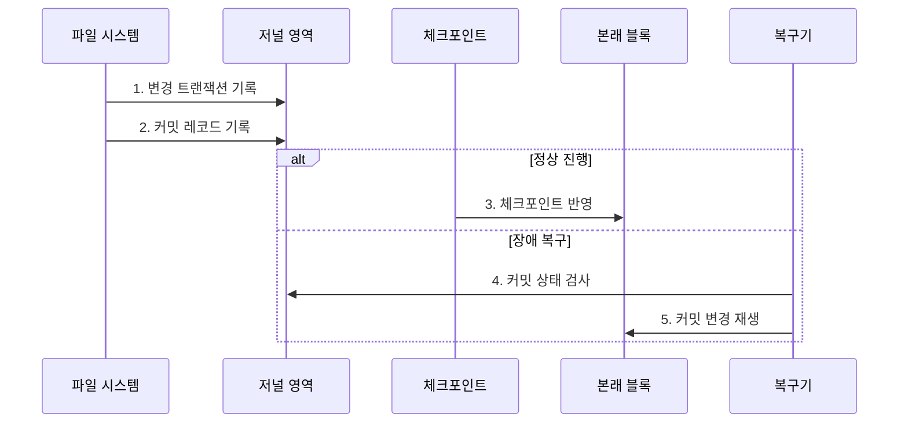

---
sidebar:
  order: 21
  label: "021. 파일 시스템 저널링 (File System Journaling)"
  badge:
    text: "미출제 · 50%"
    variant: note
title: "파일 시스템 저널링 (File System Journaling)"
date: "2026-07-25T00:35:28+09:00"
tags:
  - "notes-software"
weight: 21
extra:
  question_no: "021"
  source_status: "미출제"
  source_history: ""
  priority: 50
  priority_note: "저널링은 장애 후 일관성 복구 핵심"
---

## 미리 알고가기

- **파일 시스템 저널링(File System Journaling)**: 변경을 본래 블록보다 저널에 먼저 기록하는 복구 방식
- **메타데이터(Metadata)**: 파일 이름·크기·블록 위치 같은 구조 정보
- **저널(Journal)**: 트랜잭션과 커밋 레코드를 순차 저장하는 영역
- **트랜잭션(Transaction)**: 함께 커밋하거나 폐기할 변경 묶음
- **커밋 레코드(Commit Record)**: 트랜잭션 기록 완료를 나타내는 표식
- **체크포인트(Checkpoint)**: 커밋 변경을 본래 블록에 반영하는 작업
- **데이터 모드(Data Mode)**: 파일 데이터의 저널링·기록 순서를 정하는 정책
- **원자성(Atomicity)**: 트랜잭션의 변경이 전부 반영되거나 전부 폐기되어 중간 상태가 보이지 않는 성질
- **본래 블록(Home Block)**: 저널이 아닌 파일 시스템의 최종 위치에서 데이터나 메타데이터가 저장될 원래 블록
- **지속화(Persistence)**: 전원 장애 뒤에도 기록이 남도록 저널 블록과 커밋 레코드를 비휘발 저장장치에 확정하는 동작
- **재마운트(Remount)**: 장애 뒤 파일 시스템을 다시 운영체제 경로에 연결하며 저널 검사와 복구를 시작하는 과정
- **재생(Replay)**: 커밋됐지만 본래 블록에 반영되지 않은 저널 변경을 복구 중 다시 적용하는 동작
- **쓰기 증폭(Write Amplification)**: 하나의 논리 변경을 저널과 본래 블록에 반복 기록해 실제 저장장치 쓰기량이 늘어나는 현상
- **라이트백·오더드·저널 모드(Writeback·Ordered·Journal Mode)**: 각각 메타데이터만 저널링하거나 데이터를 먼저 기록하거나 데이터와 메타데이터를 모두 저널링하는 보호 방식
- **파일 서버(File Server)**: 여러 사용자의 파일을 저장·공유하며 Ordered 모드로 일반적인 쓰기량과 장애 복구 범위를 절충하는 서버
- **쓰기 순서 장벽(Write Barrier)**: 저장장치가 쓰기 순서를 바꾸지 못하도록 앞선 기록의 영구 저장을 확인한 뒤 다음 기록을 허용하는 제어
- **강제 동기화(Filesystem Synchronization, fsync)**: 응용 프로그램이 파일 변경 내용을 저장장치까지 확정하도록 요청하는 시스템 호출
- **그룹 커밋(Group Commit)**: 여러 트랜잭션의 커밋 기록을 한 번의 저장장치 동기화로 함께 확정하는 방식
- **체크섬(Checksum)**: 저장 데이터로 계산한 짧은 검증값을 다시 비교해 손상 여부를 찾는 값

## Ⅰ. 개요

- 정의/개념: 변경을 선기록해 **커밋 단위로 복구**하는 기법
- 배경/필요성: 갱신 중단의 **파일 시스템 불일치** 방지

### 쉽게 이해하기 (학습용)

- 장부를 고치기 전 일지에 변경 묶음을 적어 두면 장애 뒤 완료된 묶음만 다시 옮길 수 있다.

## Ⅱ. 특징

- **커밋 레코드**가 원자적 복구 경계
- **순차 저널 기록**으로 장애 복구 단축
- **보호 범위 확대** 시 쓰기 증폭 증가

### 쉽게 이해하기 (학습용)

- 완료 도장 전 변경은 버리고, 파일 내용까지 일지에 복사하면 복구 범위와 쓰기량이 함께 늘어난다.

## Ⅲ. 구조 및 구성요소

| 구성요소 | 책임 |
|:---|:---|
| 파일 변경 | **갱신 블록 제공** |
| 트랜잭션 관리자 | **변경 묶음·커밋 조정** |
| 저널 영역 | **변경·커밋 순차 보존** |
| 체크포인트 처리기 | **본래 블록 반영** |
| 복구기 | **커밋 재생·미커밋 무시** |

### 쉽게 이해하기 (학습용)

- 일지에 완료 도장이 있으면 원래 장부에 옮기고, 도장이 없으면 중간 변경을 버린다.

## Ⅳ. 흐름도

**동작 원리**

- **1. 변경 트랜잭션 기록**: 변경 블록 저장
- **2. 커밋 레코드 기록**: 지속화 확정
- **3. 체크포인트 반영**: 본래 위치 갱신
- **4. 커밋 상태 검사**: 재마운트 복구
- **5. 커밋 변경 재생**: 미반영 변경 적용

### 쉽게 이해하기 (학습용)

- 완료 도장이 있는 변경만 원래 장부에 다시 옮긴다.

## Ⅴ. 종류 및 비교

| 구분 | Writeback | Ordered | Journal |
|:---|:---|:---|:---|
| 적용 기준 | 쓰기량이 데이터 최신성보다 우선 | 일반 파일 시스템의 비용·복구 균형 | 데이터 변경까지 원자적 복구 필요 |
| 핵심 특징 | 메타데이터만 저널 | 데이터 선기록·메타데이터 저널 | 데이터·메타데이터 저널 |
| 한계 | 파일 내용 최신성 미보장 | 데이터·메타데이터 시점 차이 | 쓰기 증폭·성능 저하 |

> 요약: 데이터 보호 범위로 세 저널 모드 선택

### 쉽게 이해하기 (학습용)

- 구조만 일지에 남길지, 파일 내용을 먼저 쓸지, 파일 내용까지 일지에 복사할지 선택한다.

## Ⅵ. 실무 고려사항 및 대책

| 고려사항 | 대책 | 효과 |
|:---|:---|:---|
| 저장장치 쓰기 재정렬로 커밋 순서 훼손 | 쓰기 순서 장벽·강제 동기화의 실제 동작 검증 | 커밋 원자성·내구성 확보 |
| 체크포인트 지연으로 저널 공간 고갈 | 저널 사용률·체크포인트 지연 감시와 여유 공간 확보 | 쓰기 중단 예방 |
| 데이터 저널링의 쓰기 증폭·지연 증가 | 워크로드별 모드 선택·그룹 커밋 적용 | 보호 범위와 성능 균형 |
| 손상된 저널 재생으로 장애 확대 | 저널 체크섬·복구 시험·별도 백업 | 복구 신뢰성 향상 |

### 쉽게 이해하기 (학습용)

- 일반 서버는 파일 내용을 먼저 쓴 뒤 구조 변경의 완료 도장을 남긴다.

## Ⅶ. 결론

- 보호 범위·쓰기량·복구시간으로 **저널 모드**를 선택

### 쉽게 이해하기 (학습용)

- 장애 뒤 구조만 복구할지 파일 내용까지 복구할지를 정하고 필요한 기록 방식을 선택한다.
