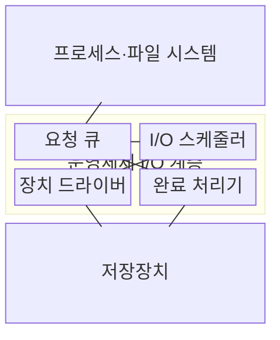
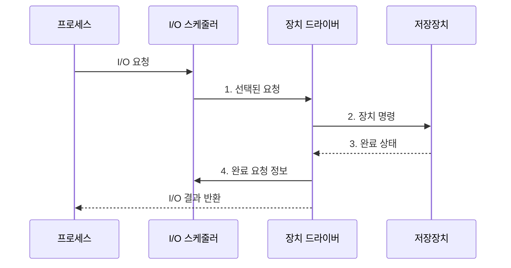

---
sidebar:
  order: 22
  label: "022. I/O 관리·디스크 스케줄링 (I/O Management Disk Scheduling)"
  badge:
    text: "미출제 · 50%"
    variant: note
title: "I/O 관리·디스크 스케줄링 (I/O Management Disk Scheduling)"
date: "2026-08-02T12:00:00+09:00"
tags:
  - "notes-software"
weight: 22
extra:
  question_no: "022"
  source_status: "미출"
  source_history: ""
  priority: 50
  priority_note: "I/O 큐·디스크 스케줄링 지연 설계 가치"
---

## Ⅰ. 개요

핵심 용어

- **입출력 요청(Input/Output Request, I/O Request)**: 프로세스가 저장장치에 요구하는 읽기·쓰기 작업이다.
- **입출력 스케줄러(Input/Output Scheduler, I/O Scheduler)**: 요청의 병합 여부·처리 순서·제출 시점을 결정하는 운영체제 계층이다.

- 정의/개념: 입출력 요청의 **병합·순서·제출**을 제어하는 운영체제 **I/O 관리 기법**
- 배경/필요성: 긴 헤드 탐색과 공유 큐 경합으로 **응답 시간 증가**

#### 한줄 요약

- 창구는 장치 특성에 따라 요청을 묶고 처리 순서를 바꿔 대기 시간을 줄인다.

## Ⅱ. 특징

핵심 용어

- **하드 디스크 드라이브(Hard Disk Drive, HDD)**: 회전 원판과 이동 헤드로 데이터를 읽고 쓰는 저장장치다.
- **비휘발성 메모리 익스프레스(Non-Volatile Memory Express, NVMe)**: PCIe 저장장치를 위한 다중 큐 기반 명령 인터페이스다.
- **솔리드 스테이트 드라이브(Solid State Drive, SSD)**: 회전 부품 없이 반도체 메모리에 데이터를 저장해 병렬 접근하는 저장장치다.
- **탐색 거리·회전 지연**: HDD 헤드가 목표 트랙으로 이동하는 거리와 원하는 섹터가 헤드 아래에 올 때까지 기다리는 시간이다.
- **꼬리 지연(Tail Latency)**: 요청 지연 분포에서 가장 느린 일부 요청의 응답 시간이다.

- HDD는 **탐색 거리·회전 지연** 최소화 중심
- SSD·NVMe는 **큐 경합 완화·병렬성** 활용 중심
- **처리량·꼬리 지연**의 상충관계 통제

#### 한줄 요약

- 회전 디스크는 이동을 줄이고 NVMe는 여러 통로를 막힘없이 쓰는 것이 중요하다.

## Ⅲ. 구조 및 구성요소

핵심 용어

- **요청 큐(Request Queue)**: 저장장치에 제출하기 전 입출력 요청을 위치·시각·우선순위와 함께 보관하는 대기열이다.
- **장치 드라이버(Device Driver)**: 운영체제의 입출력 요청을 저장장치가 이해하는 명령으로 변환하는 소프트웨어다.
- **완료 처리기(Completion Handler)**: 장치가 끝낸 요청을 큐에서 제거하고 대기 작업을 재개하는 구성요소다.

| 구성요소 | 책임 |
|:---|:---|
| 요청 큐 | **위치·시각·우선순위 보관** |
| I/O 스케줄러 | **병합·정렬·대상 선택** |
| 장치 드라이버 | **장치 명령 변환** |
| 완료 처리기 | **완료 반영·작업 재개** |

#### 한줄 요약

- 접수함·순서 담당자·번역 담당자·완료 담당자가 저장장치 앞에서 각기 대기·선택·명령·재개 책임을 나눈다.

## Ⅳ. 흐름도

핵심 용어

- **논리 블록(Logical Block)**: 저장장치 위치를 연속 번호로 지정하는 운영체제의 저장 단위다.
- **버퍼(Buffer)**: 입출력 데이터를 메모리에 임시 보관해 장치 명령에 전달하는 영역이다.
- **인터럽트·완료 큐(Interrupt·Completion Queue)**: 장치 완료를 CPU에 알리고 끝난 명령 상태를 기록해 작업을 재개하는 수단이다.

**동작 원리**

1. **선택된 요청**: 병합·정렬 정책으로 다음 제출 대상 확정
2. **장치 명령**: 논리 블록과 버퍼를 장치 형식으로 변환
3. **완료 상태**: 인터럽트 또는 완료 큐로 실행 결과 전달
4. **완료 요청 정보**: 큐에서 완료 항목을 제거하고 작업 재개

#### 한줄 요약

- 접수 담당자가 요청을 골라 장치 언어로 번역해 보내고, 완료표가 돌아오면 기다리던 프로그램을 깨운다.

## Ⅴ. 종류 및 비교

핵심 용어

- **선입 선처리(First-Come, First-Served, FCFS)**: 도착 순서대로 디스크 요청을 처리하는 방식이다.
- **스캔(SCAN)**: 디스크 헤드가 한 방향의 실린더 요청을 처리한 뒤 이동 방향을 바꾸는 방식이다.
- **데드라인 스케줄링(Deadline Scheduling)**: 요청별 만료 시각으로 오래 기다린 요청을 기한 안에 제출하는 방식이다.
- **멀티큐(Multi-Queue)**: CPU·장치별 여러 큐로 요청을 병렬 처리하는 구조다.

| 디스크 스케줄링 방식 | FCFS | SCAN | Deadline | 멀티큐 |
|:---|:---|:---|:---|:---|
| 적용 기준 | 기준 정책·낮은 요청 부하 | 회전형 HDD | 지연 상한이 중요한 장치 | NVMe·다중 코어 |
| 핵심 특징 | **도착 순서** 처리 | **실린더 이동 방향** 순회 | **만료 시각·위치 큐** 병행 | **CPU·장치별 병렬 큐** |
| 한계 | 먼 요청 간 **헤드 이동** 반복 | 반대 방향 요청의 **대기 증가** | 잘못된 **만료값**에 따른 처리량 저하 | 큐 간 **공정성·병합 비용** |

> 요약: HDD는 헤드 이동, SSD는 지연·병렬성 중심 선택

#### 한줄 요약

- 접수 순서, 헤드 이동, 마감 시각, 병렬 통로 중 장치 병목에 맞는 기준을 선택한다.

## Ⅵ. 실무 고려사항 및 대책

핵심 용어

- **큐 깊이(Queue Depth)**: 동시에 대기하거나 실행 중인 입출력 요청 수다.
- **상위 백분위(Upper Percentile)**: 지연을 짧은 순서로 정렬했을 때 대부분의 요청이 넘지 않는 상단 경곗값이다.
- **공정성(Fairness)**: 특정 요청 종류가 처리 기회를 계속 잃지 않도록 순서를 배분하는 성질이다.
- **인터럽트 병합·폴링(Interrupt Coalescing·Polling)**: 완료 사건을 묶어 알리거나 CPU가 완료 큐를 반복 확인해 완료 처리 비용을 조절하는 방식이다.
- **큐 상한(Queue Limit)**: 꼬리 지연과 메모리 사용을 제한하기 위해 동시에 대기시킬 요청 수에 둔 최댓값이다.
- **기아(Starvation)**: 특정 종류의 요청이 다른 요청에 계속 밀려 처리 기회를 얻지 못하는 상태다.

| 문제 | 대책 | 효과 |
|:---|:---|:---|
| HDD 정책을 SSD·NVMe에 적용해 **병렬 큐** 활용 저하 | 매체별 **탐색 비용·큐 구조**로 정책 선택 | 장치별 **처리량·지연** 개선 |
| 큐 깊이가 커져 상위 백분위 **꼬리 지연** 증가 | 처리량 증가가 멈추는 지점에서 **큐 상한** 설정 | 처리량을 유지하며 **응답 시간** 제한 |
| 읽기 우선 정책으로 쓰기 요청이 **장기 대기** | 요청 **만료 시각·큐 공정성** 적용 | 쓰기 요청의 **기아** 방지 |
| 완료 인터럽트가 CPU 실행 시간을 **과도하게 점유** | 부하별 **인터럽트 병합·폴링** 선택 | CPU의 **완료 처리 횟수** 절감 |

#### 한줄 요약

- 백업용 회전 디스크는 한 방향으로 훑어 헤드 왕복을 줄인다.

## Ⅶ. 결론

핵심 용어

- **탐색 비용**: HDD 헤드의 이동 거리와 회전 대기가 만드는 물리적 입출력 지연이다.
- **병렬 처리**: NVMe의 다중 큐를 통해 여러 요청을 동시에 제출·완료하는 방식이다.

- 헤드 이동 비용이 크면 **SCAN**, 기한 초과 위험은 **Deadline**, NVMe 병렬 처리에는 멀티큐 선택

#### 한줄 요약

- 장치가 실제로 기다리는 원인을 찾아 그 비용을 줄이는 정책을 선택한다.
