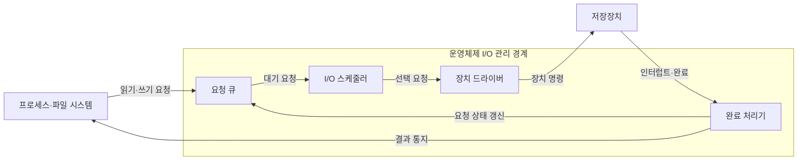
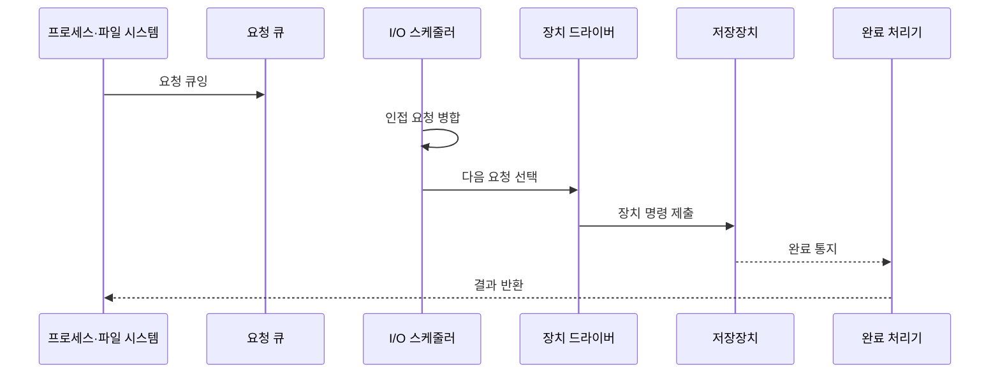

---
sidebar:
  order: 22
  label: "022. I/O 관리·디스크 스케줄링 (I/O Management Disk Scheduling)"
  badge:
    text: "미출제 · 50%"
    variant: note
title: "I/O 관리·디스크 스케줄링 (I/O Management Disk Scheduling)"
date: "2026-07-25T00:35:28+09:00"
tags:
  - "notes-software"
weight: 22
extra:
  question_no: "022"
  source_status: "미출제"
  source_history: ""
  priority: 50
  priority_note: "I/O 큐·디스크 스케줄링 지연 설계 가치"
---

## 미리 알고가기

- **입출력 요청(Input/Output Request, I/O Request)**: ‘아이오 요청’으로 읽고 Input과 Output의 머리글자를 빗금(/)으로 묶는 관례 표기이며 프로세스가 장치에 요구하는 읽기·쓰기 작업
- **요청 큐(Request Queue)**: 제출 전 입출력 요청을 보관하는 대기열
- **I/O 스케줄러(I/O Scheduler)**: ‘아이오 스케줄러’로 읽고 Input과 Output의 머리글자를 빗금으로 묶은 표기이며 요청 병합·순서·제출 시점을 정하는 계층
- **장치 드라이버(Device Driver)**: 요청을 장치 명령으로 변환하는 소프트웨어
- **탐색 거리(Seek Distance)**: HDD 헤드가 목표 실린더까지 이동하는 거리
- **큐 깊이(Queue Depth)**: 동시에 대기하거나 실행 중인 요청 수
- **꼬리 지연(Tail Latency)**: 상위 백분위 요청이 겪는 긴 응답 시간
- **멀티큐(Multi-Queue)**: 여러 대기열을 뜻하며 CPU·장치 큐로 요청을 병렬 처리하는 구조
- **운영체제(Operating System, OS)**: ‘오에스’로 읽고 Operating System의 머리글자를 딴 표기이며 프로세스·메모리·장치를 관리하고 입출력 요청을 중재
- **선입 선처리(First-Come, First-Served, FCFS)**: ‘에프시에프에스’로 읽고 First-Come, First-Served의 머리글자를 딴 표기이며 도착 순서대로 디스크 요청을 처리
- **솔리드 스테이트 드라이브(Solid-State Drive, SSD)**: ‘에스에스디’로 읽고 Solid-State Drive의 머리글자를 딴 표기이며 플래시 메모리로 비휘발 데이터를 저장
- **비휘발성 메모리 익스프레스(Non-Volatile Memory Express, NVMe)**: ‘엔브이엠이’로 읽고 Non-Volatile Memory Express를 줄인 표기이며 PCIe 저장장치의 다중 큐 명령 인터페이스
- **하드 디스크 드라이브(Hard Disk Drive, HDD)**: ‘에이치디디’로 읽고 Hard Disk Drive의 머리글자를 딴 표기이며 회전 원판과 이동 헤드로 데이터를 읽고 쓰는 저장장치
- **주변 구성요소 상호연결 익스프레스(Peripheral Component Interconnect Express, PCIe)**: ‘피시아이 익스프레스’로 읽고 PCI에 고속 규격을 뜻하는 e를 붙인 표기이며 NVMe SSD를 다중 레인 직렬 링크로 연결
- **중앙처리장치(Central Processing Unit, CPU)**: ‘시피유’로 읽고 Central Processing Unit의 머리글자를 딴 표기이며 입출력 제출·완료 처리를 실행하고 멀티큐의 코어별 경합을 분산
- **회전 지연(Rotational Latency)**: HDD 원판이 돌아 목표 섹터가 헤드 아래에 올 때까지 기다리는 시간
- **처리량·평균 지연(Throughput·Average Latency)**: 처리량은 단위 시간당 완료 요청 수이고 평균 지연은 모든 요청 응답시간의 평균으로서 꼬리 지연과 함께 정책 상충을 평가함
- **스캔(SCAN)**: ‘스캔’으로 읽는 디스크 스케줄링의 공식 알고리즘 이름으로 별도 영문 확장어를 만들지 않으며 헤드가 한 방향의 실린더 요청을 처리한 뒤 방향을 바꿈
- **데드라인 스케줄링(Deadline Scheduling)**: 요청에 만료 시각을 부여해 위치 최적화 중에도 오래 기다린 요청을 기한 안에 제출하는 방식
- **인터럽트·완료 큐(Interrupt·Completion Queue)**: 인터럽트는 장치 완료를 CPU에 알리는 신호이고 완료 큐는 끝난 명령의 상태를 기록해 대기 작업을 재개하게 하는 저장소
- **논리 블록·버퍼(Logical Block·Buffer)**: 논리 블록은 연속 번호로 지정한 저장 단위이고 버퍼는 입출력 데이터를 메모리에 임시 보관해 장치 명령에 전달하는 영역

## Ⅰ. 개요

- 정의/개념: 입출력 요청의 병합·순서·제출을 제어
- **배경/필요성**: 매체별 지연이 달라 요청 순서 최적화 필요

### 쉽게 이해하기 (학습용)

- 창구는 장치 특성에 따라 요청을 묶고 처리 순서를 바꿔 대기 시간을 줄인다

## Ⅱ. 특징

- HDD는 헤드 탐색 거리·회전 지연이 핵심이다.
- SSD·NVMe는 큐 경합·병렬성이 핵심이다.
- 처리량과 평균·꼬리 지연의 균형 필요하다.

### 쉽게 이해하기 (학습용)

- 회전 디스크는 이동을 줄이고 NVMe는 여러 통로를 막힘없이 쓰는 것이 중요하다

## Ⅲ. 아키텍처 및 구성요소

| 설계 요소 | 설명 |
|:---|:---|
| 요청 큐 | 제출 전 요청·위치·시각·우선순위 보관 |
| I/O 스케줄러 | 요청 병합·정렬·다음 제출 대상 선택 |
| 장치 드라이버 | 선택 요청을 장치 명령으로 변환·전달 |
| 완료 처리기 | 완료 상태 반영·대기 작업 실행 재개 |

> 요약: 요청 큐부터 완료 처리까지 운영체제가 장치 접근 제어

### 쉽게 이해하기 (학습용)

- 대기표를 받은 요청은 순서 조정과 장치 명령 변환을 거쳐 완료 뒤 호출자에게 돌아간다

## Ⅳ. 원리 및 절차 흐름도

| 절차 | 설명 |
|:---|:---|
| 요청 큐잉 | 읽기·쓰기 요청과 위치·시각 정보를 큐에 삽입 |
| 인접 요청 병합 | 연속 논리 블록 요청을 묶어 명령 수 감소 |
| 다음 요청 선택 | 매체 특성·정책·만료 시각으로 대상 결정 |
| 장치 명령 제출 | 드라이버가 장치 큐에 명령·버퍼 전달 |
| 완료 통지 | 장치가 인터럽트·완료 큐로 결과 전달 |
| 결과 반환 | 상태 갱신 후 대기 작업을 깨워 결과 전달 |

> 요약: 요청을 병합·선택·제출하고 완료 결과를 호출자에 반환

### 쉽게 이해하기 (학습용)

- 가까운 요청을 묶어 장치에 보내고 작업이 끝나면 기다리던 프로그램을 깨운다

## Ⅴ. 종류 및 비교

| 판단 기준 | FCFS | SCAN | Deadline | 멀티큐 |
|:---|:---|:---|:---|:---|
| 핵심 특징 | 도착 순서 | 실린더 이동 방향 | 만료 시각·위치 큐 | CPU·장치별 병렬 큐 |
| 적용 기준 | 비교 기준·낮은 부하 | 회전형 HDD | 지연 예측성이 중요한 장치 | NVMe·다중 코어 |
| 주요 위험 | 긴 헤드 이동 | 반대 방향 요청 지연 | 만료값 조정 오류 | 큐 간 공정성·병합 비용 |

> 요약: HDD는 헤드 이동, SSD는 지연·병렬성 중심 선택

### 쉽게 이해하기 (학습용)

- 접수 순서, 헤드 이동, 마감 시각, 병렬 통로 중 장치 병목에 맞는 기준을 선택한다.

## Ⅵ. 실무 사례

1. HDD 백업 서버는 SCAN으로 헤드 이동 편차 감소
2. NVMe 서버는 멀티큐로 CPU별 잠금 경합 감소

### 쉽게 이해하기 (학습용)

- 백업용 회전 디스크는 한 방향으로 훑어 헤드 왕복을 줄인다
- NVMe 서버는 CPU별 대기열로 하나의 잠금에 요청이 몰리지 않게 한다

## Ⅶ. 결론

- 매체 비용·지연 목표·병렬성으로 I/O 정책 선택

### 쉽게 이해하기 (학습용)

- 장치가 실제로 기다리는 원인을 찾아 그 비용을 줄이는 정책을 선택한다
