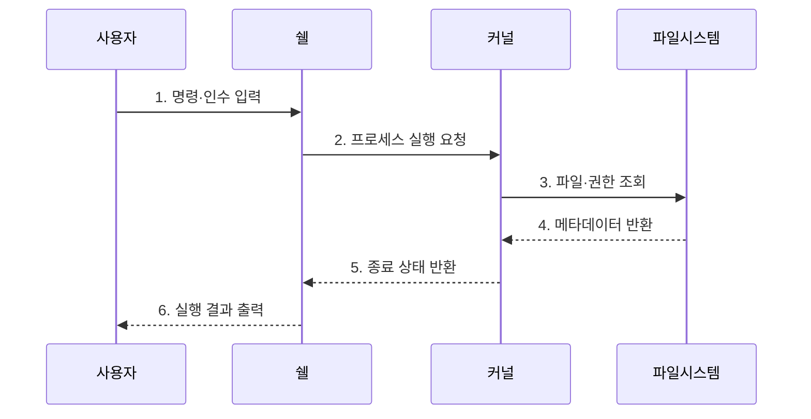

---
sidebar:
  order: 23
  label: "023. UNIX 커널·쉘·파일시스템 3요소 (UNIX Kernel Shell)"
  badge:
    text: "기출 · 30%"
    variant: note
title: "UNIX 커널·쉘·파일시스템 3요소 (UNIX Kernel Shell)"
date: "2026-07-27T23:59:59+09:00"
tags:
  - "notes-software"
weight: 23
extra:
  question_no: "023"
  source_status: "기출"
  source_history: "125회"
  priority: 30
  priority_note: "125회 기출 후 저빈도, UNIX 구성 기초"
---

## 미리 알고가기

- **유닉스(UNIX)**: 커널·셸·파일 시스템을 분리하고 다중 사용자를 지원하는 운영체제 계열
- **커널(Kernel)**: 특권 모드에서 프로세스·메모리·장치 자원 관리
- **쉘(Shell)**: 명령을 해석해 프로세스 실행을 요청하는 사용자 프로그램
- **파일시스템(File System)**: 파일·디렉터리의 경로·권한·저장 블록 관리
- **시스템 호출(System Call)**: 사용자 프로그램이 커널 기능을 요청하는 인터페이스
- **파이프(Pipe)**: 한 프로세스 출력을 다른 프로세스 입력에 연결
- **리다이렉션(Redirection)**: 표준 입출력을 파일·장치로 바꾸는 쉘 기능
- **프롬프트(Prompt)**: 쉘이 다음 명령을 기다린다는 표시
- **운영체제(Operating System, OS)**: 사용자 프로그램과 하드웨어 사이에서 프로세스·메모리·장치·파일을 관리하는 시스템 소프트웨어
- **특권 모드·사용자 모드(Privileged·User Mode)**: 특권 모드는 하드웨어 제어 명령을 허용하고 사용자 모드는 응용 실행을 제한해 시스템 호출로 커널 기능을 요청하게 하는 프로세서 권한 상태
- **사용자 공간·커널 공간(User·Kernel Space)**: 사용자 공간은 쉘과 응용이 격리 실행되는 주소 범위이고 커널 공간은 운영체제 핵심과 파일시스템이 특권으로 실행되는 범위
- **표준 입출력(Standard Input/Output, Standard I/O)**: 프로그램이 기본으로 사용하는 입력·출력·오류 스트림
- **스크립트·인수(Script·Argument)**: 스크립트는 여러 쉘 명령을 저장한 파일이고 인수는 명령 동작에 전달하는 값
- **스크립트 주입(Script Injection)**: 신뢰하지 않은 입력이 쉘 문법으로 해석되어 의도하지 않은 명령이 실행되는 취약점
- **소유자·권한 비트(Owner·Permission Bits)**: 소유자는 파일 관리 주체이고 권한 비트는 소유자·그룹·기타 사용자의 읽기·쓰기·실행 허용 여부를 기록한다.
- **로그 필터·집계(Log Filter·Aggregation)**: 필터는 조건에 맞는 로그 줄만 통과시키고 집계는 여러 결과를 개수·합계로 묶어 파이프 조합의 처리 결과를 만듦
- **허용 목록(Allowlist)**: 실행을 허용한 명령·인수만 명시하고 그 밖의 입력을 거부하는 목록
- **최소 권한(Least Privilege)**: 작업에 필요한 최소한의 사용자·파일·장치 권한만 부여하는 원칙
- **파이프 실패 전파(Pipeline Failure Propagation)**: 연결한 명령 중 하나의 실패를 전체 작업의 실패로 인식해 종료 상태로 전달하는 처리

## Ⅰ. 개요

- 정의/개념: 커널·쉘·파일시스템의 **책임을 계층화한 운영체제 구조**
- 배경/필요성: 직접 특권 접근의 **자원 충돌·권한 침해** 방지

### 쉽게 이해하기 (학습용)

- 쉘이 말을 해석하고 커널이 자원을 움직이며 파일시스템이 데이터를 보관한다.

## Ⅱ. 특징

- **커널 시스템 호출**로 프로세스·메모리·장치 통제
- **쉘 명령 해석·파이프**로 단일 기능 프로그램 조합
- **파일시스템 계층**으로 경로·권한·영속 블록 관리

### 쉽게 이해하기 (학습용)

- 작은 명령의 출입구를 파이프로 이어 복잡한 작업을 만든다.

## Ⅲ. 구조 및 구성요소

| 구성요소 | 책임 |
|:---|:---|
| 사용자 | **명령·인수 입력** |
| 쉘 | **명령 해석·실행 조합** |
| 커널 | **특권 자원 통제** |
| 파일시스템 | **경로·권한·블록 관리** |
| 하드웨어 | **CPU·메모리·장치 제공** |

### 쉽게 이해하기 (학습용)

- 창구가 요청을 해석해 관리실과 서고에 전달하고 다음 입력을 기다린다.

## Ⅳ. 흐름도

**동작 원리**

- **1. 명령·인수 입력**: 사용자 요청
- **2. 프로세스 실행 요청**: 구문 해석
- **3. 파일·권한 조회**: 실행 대상 확인
- **4. 메타데이터 반환**: 내용·속성 제공
- **5. 종료 상태 반환**: 실행 결과 전달
- **6. 실행 결과 출력**: 프롬프트 표시

### 쉽게 이해하기 (학습용)

- 쉘이 요청을 해석해 커널과 파일시스템에 전달한다.

## Ⅴ. 종류 및 비교

| 구분 | 커널 | 쉘 | 파일시스템 |
|:---|:---|:---|:---|
| 적용 기준 | 프로세스·메모리·**장치 통제** | 명령·스크립트·**파이프** | 영속 파일·**디렉터리 관리** |
| 핵심 특징 | 특권 **자원 관리** | 명령 해석·**실행 조합** | 경로·권한·**블록 관리** |
| 한계 | 결함의 **시스템 전파** | 입력·스크립트 **주입** | 권한 오류·**메타데이터 손상** |

> 요약: 시스템 호출·명령·파일 연산으로 요소 경계 구분

### 쉽게 이해하기 (학습용)

- 커널은 자원, 쉘은 명령, 파일시스템은 저장을 맡는다.

## Ⅵ. 실무 고려사항 및 대책

| 고려사항 | 대책 | 효과 |
|:---|:---|:---|
| 신뢰하지 않은 입력을 쉘 문법으로 해석 | 문자열 명령 조합 금지·인수 분리·허용 목록 적용 | 명령·스크립트 주입 방지 |
| 쉘·서비스를 과도한 사용자 권한으로 실행 | 전용 사용자·최소 권한·작업 후 권한 해제 | 침해 시 피해 범위 축소 |
| 파일 소유자·권한 비트 설정 오류 | 기본 권한 정책·변경 감사·민감 파일 접근 점검 | 무단 읽기·변경 예방 |
| 파이프 중간 명령 실패를 최종 성공으로 오인 | 파이프 실패 전파·각 명령 종료 상태 기록 | 자동화 오류 조기 발견 |

### 쉽게 이해하기 (학습용)

- 로그는 필터와 집계 도구를 파이프로 이어 필요한 내용만 뽑는다.

## Ⅶ. 결론

- 명령·자원·저장 책임으로 **UNIX 계층**을 구성

### 쉽게 이해하기 (학습용)

- 명령은 창구, 자원은 관리실, 데이터는 서고가 각각 맡는다.
