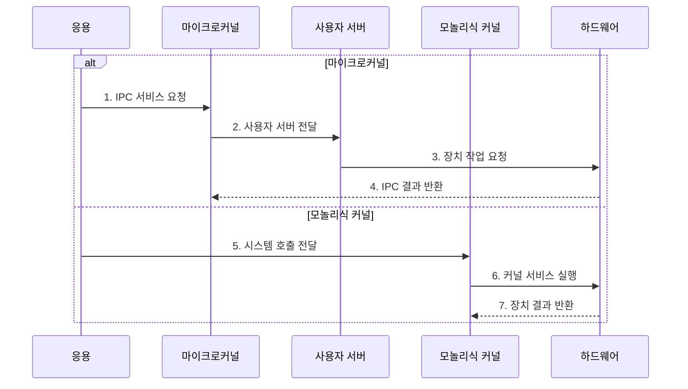

---
sidebar:
  order: 24
  label: "024. 마이크로커널 vs 모놀리식 커널 (Microkernel vs Monolithic)"
  badge:
    text: "기출 · 50%"
    variant: note
title: "마이크로커널 vs 모놀리식 커널 (Microkernel vs Monolithic)"
date: "2026-07-27T23:59:59+09:00"
tags:
  - "notes-software"
weight: 24
extra:
  question_no: "024"
  source_status: "기출"
  source_history: "138회"
  priority: 50
  priority_note: "138회 기출, 커널 구조·격리 절충"
---

## 미리 알고가기

- **마이크로커널(Microkernel)**: 최소 기능만 커널에 두고 서비스를 사용자 공간에 분리
- **모놀리식 커널(Monolithic Kernel)**: 운영체제 서비스를 한 커널 주소 공간에 통합
- **사용자 공간 서버(User-space Server)**: 파일·장치·네트워크 서비스를 격리 실행
- **프로세스 간 통신(Inter-Process Communication, IPC)**: 분리된 프로세스의 주소 공간 사이에서 메시지를 교환하는 방식
- **결함 격리(Fault Isolation)**: 서비스 오류의 전파 범위를 주소 공간으로 제한
- **커널 주소 공간(Kernel Address Space)**: 운영체제 핵심 코드와 서비스가 특권으로 실행되는 가상 주소 범위로서 모놀리식 커널의 결함이 시스템 전체로 전파될 수 있음
- **시스템 호출(System Call)**: 응용이 파일·장치·네트워크 같은 운영체제 서비스를 커널에 요청하는 공식 진입 경로
- **스케줄링(Scheduling)**: 실행 가능 프로세스나 스레드 중 다음 대상을 선택해 중앙처리장치 시간을 배분하는 마이크로커널의 핵심 기능
- **장치 드라이버(Device Driver)**: 운영체제가 하드웨어 장치를 제어하도록 명령과 장치 동작을 연결하는 서비스
- **처리량(Throughput)**: 단위 시간에 완료한 서비스 요청 수로서 IPC 왕복과 주소 공간 전환 비용의 영향을 받는 성능 지표
- **차량 제어 운영체제(Vehicle-control Operating System)**: 장치 드라이버 결함을 사용자 공간 서버에 격리하고 해당 서버만 재시작할 수 있어야 하는 제어용 운영체제
- **범용 서버 운영체제(General-purpose Server Operating System)**: 파일·네트워크 요청의 낮은 호출 지연과 높은 처리량을 위해 서비스를 커널에 통합할 수 있는 운영체제
- **신뢰 컴퓨팅 기반(Trusted Computing Base, TCB)**: 시스템 보안을 유지하려면 반드시 신뢰해야 하는 특권 코드와 구성요소의 범위
- **공유 메모리·무복사(Shared Memory·Zero-copy)**: 공유 메모리는 여러 프로세스가 같은 메모리 영역을 매핑하고 무복사는 데이터를 중간 버퍼로 반복 복제하지 않는 전달 방식
- **감독·재시작(Supervision·Restart)**: 서비스 상태를 감시하다 실패하면 해당 서비스만 다시 실행하는 복구 방식
- **멱등성(Idempotency)**: 같은 요청을 여러 번 실행해도 최종 결과가 한 번 실행한 것과 같은 성질
- **꼬리 지연(Tail Latency)**: 요청 지연시간 분포에서 가장 느린 일부 요청의 지연

## Ⅰ. 개요

- 정의/개념: 운영체제 서비스를 **커널·사용자 공간에 배치**하는 구조
- 배경/필요성: 서비스 통합의 **결함 전파·전체 중단** 방지

### 쉽게 이해하기 (학습용)

- 핵심 창구만 본관에 두고 부서를 밖으로 나누는 방식과 모두 본관에 두는 방식의 차이다.

## Ⅱ. 특징

- **서비스 실행 공간**이 호출 경로·결함 전파 범위 결정
- 마이크로커널은 **최소 커널·사용자 서버 격리** 제공
- 모놀리식은 **커널 내부 직접 호출**로 처리 지연 절감

### 쉽게 이해하기 (학습용)

- 서비스를 밖으로 나누면 전달은 늘지만 한 서비스 고장을 따로 처리할 수 있다.

## Ⅲ. 구조 및 구성요소

| 구성요소 | 책임 |
|:---|:---|
| 응용 | **운영체제 서비스 요청** |
| 마이크로커널 | **IPC·스케줄링 수행** |
| 사용자 공간 서버 | **서비스 격리 실행** |
| 모놀리식 커널 | **서비스 통합 실행** |
| 하드웨어 | **CPU·메모리·장치 제공** |

### 쉽게 이해하기 (학습용)

- 마이크로커널은 메시지를 서버에 왕복시키고 모놀리식은 커널 안에서 바로 처리한다.

## Ⅳ. 흐름도

**동작 원리**

- **1. IPC 서비스 요청**: 커널 진입
- **2. 사용자 서버 전달**: 메시지 중계
- **3. 장치 작업 요청**: 격리 서비스 실행
- **4. IPC 결과 반환**: 응용에 응답
- **5. 시스템 호출 전달**: 모놀리식 진입
- **6. 커널 서비스 실행**: 내부 직접 호출
- **7. 장치 결과 반환**: 응용에 응답

### 쉽게 이해하기 (학습용)

- 서비스를 밖에 두면 메시지를 거치고 안에 두면 바로 호출한다.

## Ⅴ. 종류 및 비교

| 구분 | 마이크로커널 | 모놀리식 커널 |
|:---|:---|:---|
| 적용 기준 | 결함 격리·**서비스 재시작 우선** | 호출 지연·**처리량 우선** |
| 핵심 특징 | IPC 기반 **사용자 서버 호출** | 커널 내부 **함수 직접 호출** |
| 한계 | IPC·주소 공간 **전환 비용** | 결함 전파·**시스템 중단** |

> 요약: 격리·재시작 요구와 호출 비용으로 커널 구조 구분

### 쉽게 이해하기 (학습용)

- 마이크로커널은 전달이 늘지만 서버를 격리하고 모놀리식은 내부에서 바로 부른다.

## Ⅵ. 실무 고려사항 및 대책

| 고려사항 | 대책 | 효과 |
|:---|:---|:---|
| 잦은 IPC·데이터 복사로 처리량 저하 | 요청 묶음 처리·공유 메모리·무복사 적용 | 주소 공간 왕복 비용 절감 |
| 사용자 서버 재시작 중 상태·요청 유실 | 감독·재시작과 상태 체크포인트·멱등 요청 설계 | 서비스 단위 복구 |
| 커널·서버 인터페이스 확대로 공격면 증가 | 최소 인터페이스·권한 분리·TCB 범위 점검 | 특권 코드·침해 범위 축소 |
| 평균 지연만 보고 IPC 병목 은폐 | 경로별 IPC 횟수·복사량·꼬리 지연 계측 | 구조 선택 근거 확보 |

### 쉽게 이해하기 (학습용)

- 차량 드라이버 하나가 고장 나도 해당 서버만 다시 시작할 수 있다.

## Ⅶ. 결론

- 재시작 필요·IPC 비용으로 **커널 구조**를 선택한다.

### 쉽게 이해하기 (학습용)

- 고장을 따로 복구해야 하면 서비스를 밖에 두고 짧은 호출이 우선이면 안에 둔다.
