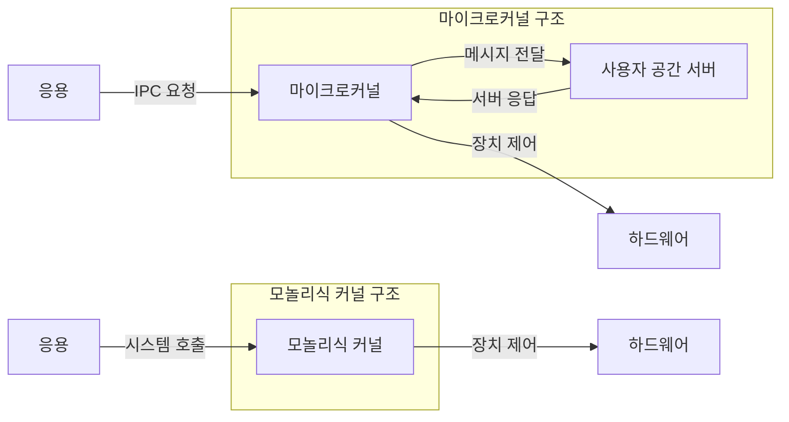
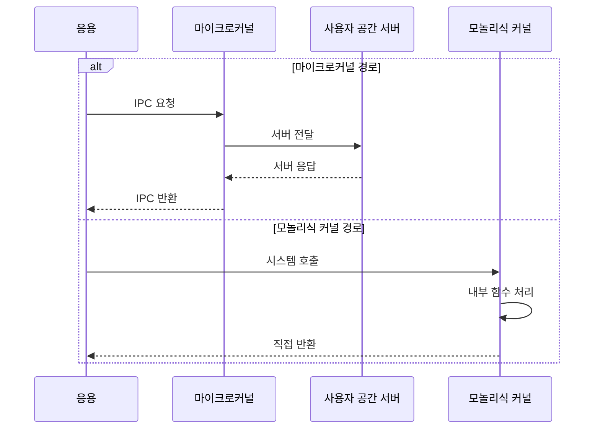

---
sidebar:
  order: 24
  label: "024. 마이크로커널 vs 모놀리식 커널 (Microkernel vs Monolithic)"
  badge:
    text: "기출 · 50%"
    variant: note
title: "마이크로커널 vs 모놀리식 커널 (Microkernel vs Monolithic)"
date: "2026-07-27T23:59:59+09:00"
tags:
  - "notes-software"
weight: 24
extra:
  question_no: "024"
  source_status: "기출"
  source_history: "138회"
  priority: 50
  priority_note: "138회 기출, 커널 구조·격리 절충"
---

## 미리 알고가기

- **마이크로커널(Microkernel)**: 최소 기능만 커널에 두고 서비스를 사용자 공간에 분리
- **모놀리식 커널(Monolithic Kernel)**: 운영체제 서비스를 한 커널 주소 공간에 통합
- **사용자 공간 서버(User-space Server)**: 파일·장치·네트워크 서비스를 격리 실행
- **프로세스 간 통신(Inter-Process Communication, IPC)**: ‘아이피시’로 읽고 Inter-Process Communication의 머리글자를 딴 표기이며 분리된 주소 공간 사이의 메시지 교환
- **결함 격리(Fault Isolation)**: 서비스 오류의 전파 범위를 주소 공간으로 제한
- **커널 주소 공간(Kernel Address Space)**: 운영체제 핵심 코드와 서비스가 특권으로 실행되는 가상 주소 범위로서 모놀리식 커널의 결함이 시스템 전체로 전파될 수 있음
- **시스템 호출(System Call)**: 응용이 파일·장치·네트워크 같은 운영체제 서비스를 커널에 요청하는 공식 진입 경로
- **스케줄링(Scheduling)**: 실행 가능 프로세스나 스레드 중 다음 대상을 선택해 중앙처리장치 시간을 배분하는 마이크로커널의 핵심 기능
- **장치 드라이버(Device Driver)**: 운영체제가 하드웨어 장치를 제어하도록 명령과 장치 동작을 연결하는 서비스
- **처리량(Throughput)**: 단위 시간에 완료한 서비스 요청 수로서 IPC 왕복과 주소 공간 전환 비용의 영향을 받는 성능 지표
- **차량 제어 운영체제(Vehicle-control Operating System)**: 장치 드라이버 결함을 사용자 공간 서버에 격리하고 해당 서버만 재시작할 수 있어야 하는 제어용 운영체제
- **범용 서버 운영체제(General-purpose Server Operating System)**: 파일·네트워크 요청의 낮은 호출 지연과 높은 처리량을 위해 서비스를 커널에 통합할 수 있는 운영체제

## Ⅰ. 개요

- 정의/개념: 운영체제 서비스를 **커널·사용자 공간에 배치**하는 구조
- 기존 한계: 모든 서비스의 커널 통합은 **결함 전파·전체 중단** 위험 증가

### 쉽게 이해하기 (학습용)

- 핵심 창구만 본관에 두고 부서를 밖으로 나누는 방식과 모두 본관에 두는 방식의 차이다

## Ⅱ. 특징

- **서비스 실행 공간**이 호출 경로·결함 전파 범위 결정
- 마이크로커널은 **최소 커널·사용자 서버 격리** 제공
- 모놀리식은 **커널 내부 직접 호출**로 처리 지연 절감

### 쉽게 이해하기 (학습용)

- 서비스를 밖으로 나누면 전달은 늘지만 한 서비스 고장을 따로 처리할 수 있다

## Ⅲ. 아키텍처 및 구성요소

| 설계 요소 | 설명 |
|:---|:---|
| 마이크로커널 | IPC·스케줄링·주소 공간 등 최소 기능 수행 |
| 사용자 공간 서버 | 파일·장치·네트워크 서비스를 격리 실행 |
| 모놀리식 커널 | 운영체제 서비스를 한 커널 주소 공간에 통합 |

> 요약: 마이크로커널은 사용자 서버 분리, 모놀리식은 커널 통합

### 쉽게 이해하기 (학습용)

- 기능을 커널 안팎 어디에 두는지가 고장 범위와 재시작 가능성을 결정한다

## Ⅳ. 원리 및 절차 흐름도

| 절차 | 설명 |
|:---|:---|
| IPC 요청 | 응용이 마이크로커널에 서비스 메시지 전달 |
| 서버 전달 | 마이크로커널이 사용자 공간 서버로 중계 |
| 서버 응답 | 서버가 처리 결과를 마이크로커널에 반환 |
| IPC 반환 | 마이크로커널이 응용에 결과 메시지 전달 |
| 시스템 호출 | 응용이 모놀리식 커널에 서비스 요청 |
| 내부 함수 처리 | 같은 커널 주소 공간에서 서비스 수행 |
| 직접 반환 | 모놀리식 커널이 응용에 결과 반환 |

> 요약: IPC 왕복은 서버 경유, 내부 함수는 커널에서 완료

### 쉽게 이해하기 (학습용)

- 마이크로커널은 메시지를 서버에 왕복시키고 모놀리식은 커널 안에서 바로 처리한다

## Ⅴ. 종류 및 비교

| 커널 구조 | 마이크로커널 | 모놀리식 커널 |
|:---|:---|:---|
| 적용 기준 | 결함 격리·**서비스 재시작 우선** | 호출 지연·**처리량 우선** |
| 핵심 특징 | IPC 기반 **사용자 서버 호출** | 커널 내부 **함수 직접 호출** |
| 한계 | IPC·주소 공간 **전환 비용** | 결함 전파·**시스템 중단** |

> 요약: 격리·재시작 요구와 호출 비용으로 커널 구조 구분

### 쉽게 이해하기 (학습용)

- 마이크로커널은 전달이 늘지만 서버를 격리하고 모놀리식은 내부에서 바로 부른다

## Ⅵ. 실무 사례

1. 차량 제어 OS는 **드라이버를 사용자 서버**로 격리
2. 범용 서버 OS는 **파일·네트워크 서비스**를 커널에 통합

### 쉽게 이해하기 (학습용)

- 차량 드라이버 하나가 고장 나도 해당 서버만 다시 시작할 수 있다
- 파일·네트워크 기능을 커널 안에 두면 주소 공간을 오가는 전달이 줄어든다

## Ⅶ. 결론

- 격리·재시작은 **마이크로커널**, 직접 호출은 **모놀리식**

### 쉽게 이해하기 (학습용)

- 고장을 따로 복구해야 하면 서비스를 밖에 두고 짧은 호출이 우선이면 안에 둔다
