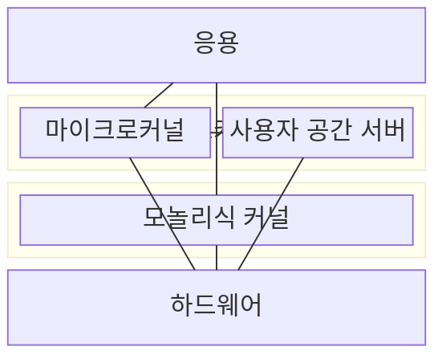
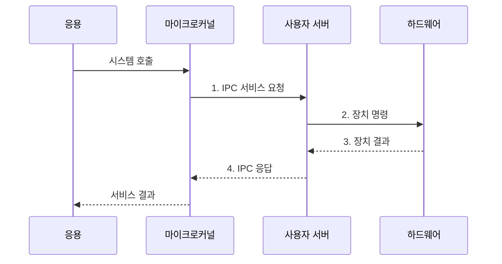

---
sidebar:
  order: 24
  label: "024. 마이크로커널 vs 모놀리식 커널 (Microkernel vs Monolithic)"
  badge:
    text: "기출 • 50%"
    variant: note
title: "마이크로커널 vs 모놀리식 커널 (Microkernel vs Monolithic)"
date: "2026-08-03T08:48:47+09:00"
tags:
  - "notes-software"
weight: 24
extra:
  question_no: "024"
  source_status: "기출"
  source_history: "138회"
  priority: 50
  priority_note: "138회 기출, 커널 구조•격리 절충"
---

## Ⅰ. 개요

핵심 용어

- **마이크로커널(Microkernel)**: 최소 기능만 커널에 두고 운영체제 서비스를 사용자 공간에 분리하는 구조다.
- **모놀리식 커널(Monolithic Kernel)**: 운영체제 서비스를 하나의 커널 주소 공간에 통합하는 구조다.

- 정의/개념: 운영체제 서비스를 **커널•사용자 공간** 에 다르게 배치하는 커널 구조 유형
- 배경/필요성: 서비스 통합 시 단일 결함이 **커널 전체로 전파**되어 시스템 중단

#### 한줄 요약

- 핵심 창구만 본관에 두고 부서를 밖으로 나누는 방식과 모두 본관에 두는 방식의 차이다.

## Ⅱ. 특징

핵심 용어

- **사용자 공간 서버(User-space Server)**: 파일•장치•네트워크 서비스를 커널과 분리된 주소 공간에서 실행하는 프로세스다.
- **결함 격리(Fault Isolation)**: 서비스 오류의 전파 범위를 해당 주소 공간으로 제한하는 성질이다.
- **직접 호출**: 모놀리식 커널의 서비스가 같은 주소 공간에서 함수 호출로 협력하는 방식이다.

- **서비스 실행 공간** 이 호출 경로•결함 전파 범위 결정
- 마이크로커널은 **최소 커널•사용자 서버 격리** 제공
- 모놀리식은 **커널 내부 직접 호출** 로 처리 지연 절감

#### 한줄 요약

- 서비스를 밖으로 나누면 전달은 늘지만 한 서비스 고장을 따로 처리할 수 있다.

## Ⅲ. 구조 및 구성요소

핵심 용어

- **프로세스 간 통신(Inter-Process Communication, IPC)**: 분리된 프로세스 주소 공간 사이에서 메시지를 교환하는 방식이다.
- **스케줄링(Scheduling)**: 실행 가능한 작업 중 다음 대상을 선택해 CPU 시간을 배분하는 커널 기능이다.

| 구성요소 | 책임 |
|:---|:---|
| 마이크로커널 | **IPC•스케줄링 수행** |
| 사용자 공간 서버 | **서비스 격리 실행** |
| 모놀리식 커널 | **서비스 통합 실행** |

#### 한줄 요약

- 마이크로커널 경계 밖에는 서비스별 방이 있고 모놀리식 경계 안에는 모든 서비스가 한 공간에 놓인다.

## Ⅳ. 흐름도

핵심 용어

- **시스템 호출(System Call)**: 응용이 운영체제 서비스를 커널에 요청하는 공식 진입 경로다.
- **주소 공간**: 프로세스나 커널이 코드와 데이터를 배치하고 접근하는 가상 메모리 범위다.

**동작 원리**

1. **IPC 서비스 요청**: 커널이 요청을 격리된 서버 주소 공간으로 중계
2. **장치 명령**: 사용자 서버가 담당 서비스의 하드웨어 작업 요청
3. **장치 결과**: 하드웨어 완료 상태를 사용자 서버에 전달
4. **IPC 응답**: 서비스 결과를 커널 경유로 응용에 반환

#### 한줄 요약

- 서비스를 밖에 두면 메시지를 거치고 안에 두면 바로 호출한다.

## Ⅴ. 종류 및 비교

핵심 용어

- **서비스 재시작**: 실패한 사용자 공간 서버만 다시 실행해 전체 시스템 중단을 피하는 복구 방식이다.
- **주소 공간 전환**: 커널과 사용자 서버 사이를 오가며 실행 문맥과 메모리 접근 범위를 바꾸는 작업이다.

| 커널 구조 | 마이크로커널 | 모놀리식 커널 |
|:---|:---|:---|
| 적용 기준 | 결함 격리•**서비스 재시작 우선** | 호출 지연•**처리량 우선** |
| 핵심 특징 | IPC 기반 **사용자 서버 호출** | 커널 내부 **함수 직접 호출** |
| 한계 | IPC•주소 공간 **전환 비용** | 결함 전파•**시스템 중단** |

> 요약: 격리•재시작 요구와 호출 비용으로 커널 구조 구분

#### 한줄 요약

- 마이크로커널은 전달이 늘지만 서버를 격리하고 모놀리식은 내부에서 바로 부른다.

## Ⅵ. 실무 고려사항 및 대책

핵심 용어

- **공유 메모리•무복사(Shared Memory•Zero-copy)**: 같은 메모리 영역을 매핑하고 중간 버퍼 복제를 줄여 IPC 전달 비용을 낮추는 방식이다.
- **상태 체크포인트(State Checkpoint)**: 재시작 뒤 서비스를 복구할 수 있도록 필요한 상태를 저장한 시점별 사본이다.
- **신뢰 컴퓨팅 기반(Trusted Computing Base, TCB)**: 보안을 유지하려면 반드시 신뢰해야 하는 특권 코드와 구성요소 범위다.
- **꼬리 지연(Tail Latency)**: 요청 지연 분포에서 가장 느린 일부 요청의 응답 시간이다.
- **요청 묶음(Request Batching)**: 여러 IPC 요청을 한 번에 전달해 경계 왕복과 호출 횟수를 줄이는 방식이다.
- **감독•멱등 요청(Supervision•Idempotent Request)**: 감독은 실패 서버를 감지해 재시작하고, 멱등 요청은 같은 요청을 반복해도 결과가 달라지지 않게 한다.
- **공격면•권한 분리**: 공격면은 외부 입력이 닿는 코드•인터페이스 범위이고, 권한 분리는 구성요소별 특권을 필요한 범위로 나누는 통제다.

| 문제 | 대책 | 효과 |
|:---|:---|:---|
| 잦은 IPC•데이터 복사로 **처리량 저하** | **요청 묶음•공유 메모리•무복사** 적용 | 주소 공간의 **왕복•복사 비용** 절감 |
| 사용자 서버 재시작 중 **상태•요청 유실** | **감독•상태 체크포인트•멱등 요청** 설계 | 장애 서버의 **서비스 단위 복구** |
| 커널•서버 인터페이스 확대로 **공격면 증가** | 최소 인터페이스와 **TCB•권한 분리** 점검 | **특권 코드•침해 범위** 축소 |
| 평균 지연으로 **IPC 병목** 은폐 | 경로별 **IPC 횟수•복사량•꼬리 지연** 계측 | 격리 이득과 **호출 비용** 비교 |

#### 한줄 요약

- 서비스 방이 멈추면 그 방의 상태표로 다시 열고, 메시지 왕복이 몰리면 공유 통로로 복사 횟수를 줄인다.

## Ⅶ. 결론

핵심 용어

- **서비스 단위 복구**: 전체 커널을 멈추지 않고 실패한 서비스만 격리해 재시작하는 복구 기준이다.
- **호출 지연**: 응용 요청이 커널과 서비스 경계를 거쳐 결과를 받기까지 걸리는 시간이다.

- 서비스 단위 복구가 필요하면 **마이크로커널**, 낮은 호출 지연이 우선이면 **모놀리식 커널** 선택

#### 한줄 요약

- 고장을 따로 복구해야 하면 서비스를 밖에 두고 짧은 호출이 우선이면 안에 둔다.
