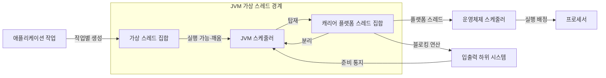
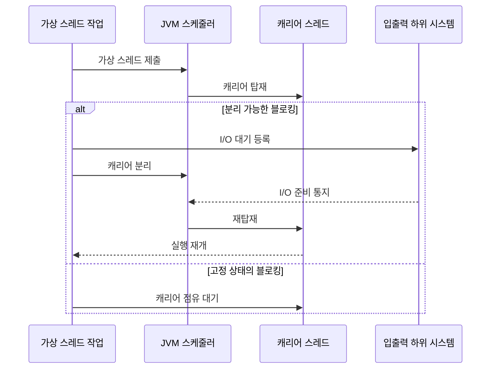

---
sidebar:
  order: 25
  label: "025. 가상 스레드 — Java Project Loom (Virtual Thread)"
  badge:
    text: "기출 · 50%"
    variant: note
title: 가상 스레드 — Java Project Loom (Virtual Thread)
date: "2026-07-27T23:59:59+09:00"
tags: [notes-software]
weight: 25
extra:
  question_no: "025"
  source_status: "기출"
  source_history: "138회"
  priority: 50
  priority_note: "138회 기출, 경량 동시성·스케줄링 현안"
---

## 미리 알고가기

- **가상 스레드(Virtual Thread)**: JDK가 스케줄링하는 경량 Java `Thread` 실행 단위
- **플랫폼 스레드(Platform Thread)**: 운영체제 스레드와 연결된 Java 스레드
- **캐리어 스레드(Carrier Thread)**: 가상 스레드를 실행하는 플랫폼 스레드
- **탑재·분리(Mount·Unmount)**: 가상 스레드를 캐리어에 연결·해제
- **JVM 스케줄러**: ‘제이브이엠 스케줄러’로 읽고 Java Virtual Machine의 머리글자를 딴 표기이며 실행 가능 가상 스레드를 캐리어에 배정
- **고정(Pinning)**: 차단 중 가상 스레드가 캐리어에서 분리되지 못함
- **스레드별 요청 처리(Thread-per-Request)**: 요청 수명 동안 전용 스레드 사용
- **블로킹 입출력(Blocking I/O)**: ‘블로킹 아이오’로 읽고 Input과 Output의 머리글자를 빗금으로 묶은 표기이며 완료 전 호출 스레드의 진행을 멈추는 입출력
- **자바 개발 키트(Java Development Kit, JDK)**: ‘제이디케이’로 읽고 Java Development Kit의 머리글자를 딴 표기이며 Java 개발·실행 도구와 가상 스레드 구현을 제공
- **자바 가상 머신(Java Virtual Machine, JVM)**: ‘제이브이엠’으로 읽고 Java Virtual Machine의 머리글자를 딴 표기이며 Java 바이트코드를 실행하고 가상 스레드를 스케줄링
- **응용 프로그래밍 인터페이스(Application Programming Interface, API)**: ‘에이피아이’로 읽고 Application Programming Interface의 머리글자를 딴 표기이며 소프트웨어 기능을 호출하기 위한 규약
- **중앙처리장치(Central Processing Unit, CPU)**: ‘시피유’로 읽고 Central Processing Unit의 머리글자를 딴 표기이며 명령을 실행하고 실제 병렬 처리 한도를 결정
- **자바 프로젝트 룸(Java Project Loom)**: ‘프로젝트 룸’으로 읽는 OpenJDK의 공식 프로젝트 이름으로 별도 약어를 만들지 않으며 가상 스레드와 경량 동시성 기능을 개발함
- **스레드 식별자 `Thread`**: ‘스레드’로 읽고 Java 클래스 이름의 첫 글자를 대문자로 쓰는 코드 표기 관례를 따르며 가상·플랫폼 스레드를 생성하고 제어하는 API 형식을 나타냄
- **동기화 식별자 `synchronized`**: ‘싱크로나이즈드’로 읽고 Java 예약어를 소문자 코드로 쓰는 언어 관례 표기이며 객체 모니터를 획득해 임계 구역의 상호 배제를 제공함
- **다중화(Multiplexing)**: 많은 가상 스레드의 실행을 소수 캐리어 스레드에 번갈아 탑재해 플랫폼 스레드를 재사용하는 방식
- **호출 스택(Call Stack)**: 함수 호출 위치·지역 변수·반환 주소를 쌓아 가상 스레드가 분리된 뒤 같은 지점에서 재개하게 하는 실행 상태
- **운영체제(Operating System, OS)**: ‘오에스’로 읽고 Operating System의 머리글자를 딴 표기이며 캐리어 플랫폼 스레드를 실제 프로세서 코어에 배정
- **네이티브·외부 함수(Native·Foreign Function)**: Java 가상 머신 밖의 기계어 코드나 외부 인터페이스를 호출하며 일부 차단 구간에서 가상 스레드가 캐리어를 점유하게 할 수 있는 함수
- **데이터베이스 연결 한도(Database Connection Limit)**: 동시에 빌릴 수 있는 외부 연결 수의 상한으로서 가상 스레드 수와 별도로 제한해 데이터베이스 자원 고갈을 방지함
- **플랫폼 스레드 풀(Platform Thread Pool)**: 실제 CPU 계산 병렬도에 맞춘 수의 플랫폼 스레드를 재사용해 계산 작업을 실행하는 구조

## Ⅰ. 개요

- 정의/개념: 다수 가상 스레드를 **소수 캐리어 스레드에 다중화**하는 실행 방식
- 기존 한계: 요청별 플랫폼 스레드는 **대기 중 메모리·커널 자원** 점유

### 쉽게 이해하기 (학습용)

- 많은 작업표를 소수 작업자에게 번갈아 올려 기다리는 동안 다른 일을 맡긴다.

## Ⅱ. 특징

- **경량 생성·스케줄링**으로 요청별 스레드 모델 지원
- **블로킹 시 캐리어 분리**로 다른 가상 스레드 실행
- CPU 병렬도는 **캐리어·물리 코어 수**로 제한

### 쉽게 이해하기 (학습용)

- 기다리는 일은 많이 맡을 수 있지만 동시에 계산하는 수는 실제 작업자와 작업대 수를 넘지 못한다.

## Ⅲ. 아키텍처 및 구성요소

| 설계 요소 | 설명 |
|:---|:---|
| 가상 스레드 집합 | 작업별 호출 스택·실행 상태 보유 |
| JVM 스케줄러 | 실행 가능 가상 스레드를 캐리어에 배정 |
| 캐리어 플랫폼 스레드 집합 | 탑재된 가상 스레드 코드를 운영체제에서 실행 |

> 요약: JVM이 가상 스레드를 캐리어에 탑재·분리해 재사용

### 쉽게 이해하기 (학습용)

- 작업표는 진행 상태를 갖고 JVM 관리자가 빈 작업자에게 올리며 운영체제가 작업자를 실행한다.

## Ⅳ. 원리 및 절차 흐름도

| 절차 | 설명 |
|:---|:---|
| 가상 스레드 제출 | 작업별 가상 스레드를 실행 가능 등록 |
| 캐리어 탑재 | 스케줄러가 가상 스레드를 캐리어에 연결 |
| I/O 대기 등록 | 블로킹 입출력 완료 조건을 하위 계층에 등록 |
| 캐리어 분리 | 가상 스레드 상태를 보존하고 캐리어 반환 |
| I/O 준비 통지 | 입출력 완료 가능 상태를 스케줄러에 전달 |
| 재탑재 | 실행 가능 가상 스레드를 캐리어에 다시 연결 |
| 실행 재개 | 중단된 호출 지점부터 작업 계속 |
| 캐리어 점유 대기 | 네이티브·외부 함수 고정 시 캐리어도 대기 |

> 요약: 지원 대기는 분리·재탑재하고 고정 대기는 캐리어 점유

### 쉽게 이해하기 (학습용)

- 입출력을 기다리면 작업표를 내려 다른 일을 맡기고 준비되면 다시 올리지만 분리 불가 작업은 작업자도 기다린다.

## Ⅴ. 종류 및 비교

| Java 스레드 모델 | 가상 스레드 | 플랫폼 스레드 |
|:---|:---|:---|
| 적용 기준 | 다수 독립 요청·**블로킹 I/O** | CPU 계산·**네이티브 호출** |
| 핵심 특징 | JDK의 **캐리어 다중화** | OS의 **직접 스케줄링** |
| 한계 | 캐리어 고정·**외부 자원 고갈** | 생성·전환·**메모리 비용** |

> 요약: 대기는 가상, 병렬 작업은 플랫폼 사용

### 쉽게 이해하기 (학습용)

- 기다리는 요청이 많으면 작업표를 늘리고 계산·네이티브 작업은 실제 작업자 수에 맞춘다.

## Ⅵ. 실무 사례

1. API 서버는 **요청별 가상 스레드·DB 연결 한도** 적용

### 쉽게 이해하기 (학습용)

- 서버는 요청마다 가상 스레드를 만들되 한정된 데이터베이스 연결은 별도로 제한한다.

## Ⅶ. 결론

- **I/O 대기율·외부 자원 한도·고정 구간**으로 모델 선택

### 쉽게 이해하기 (학습용)

- 기다리는 시간이 많은지, 연결 같은 자원이 몇 개인지, 캐리어를 붙잡는 코드가 있는지 보고 정한다.
