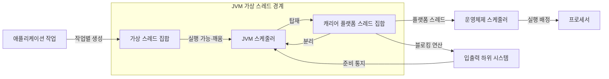
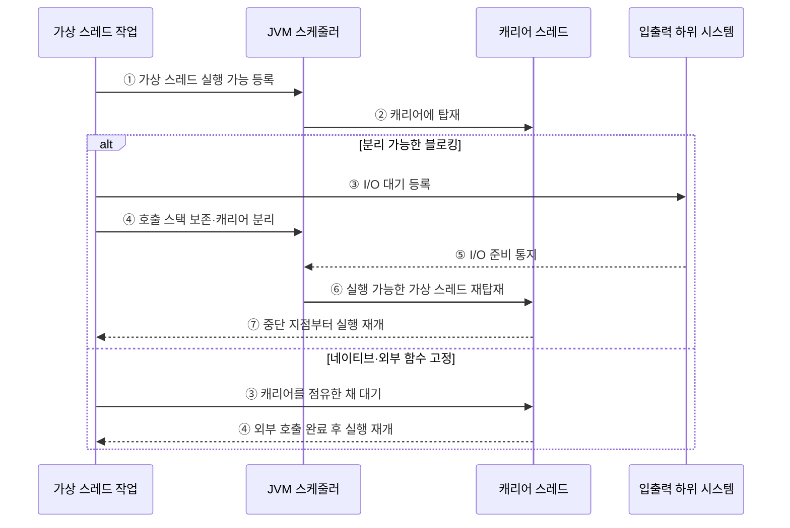

---
sidebar:
  order: 25
  label: "025. 가상 스레드 — Java Project Loom (Virtual Thread)"
  badge:
    text: "기출 · 50%"
    variant: note
title: 가상 스레드 — Java Project Loom (Virtual Thread)
date: "2026-07-27T23:59:59+09:00"
tags: [notes-software]
weight: 25
extra:
  question_no: "025"
  source_status: "기출"
  source_history: "138회"
  priority: 50
  priority_note: "138회 기출, 경량 동시성·스케줄링 현안"
---

## 미리 알고가기

- **가상 스레드(Virtual Thread)**: JDK가 스케줄링하는 경량 Java `Thread` 실행 단위
- **플랫폼 스레드(Platform Thread)**: 운영체제 스레드와 연결된 Java 스레드
- **캐리어 스레드(Carrier Thread)**: 가상 스레드를 실행하는 플랫폼 스레드
- **탑재·분리(Mount·Unmount)**: 가상 스레드를 캐리어에 연결·해제
- **JVM 스케줄러**: 실행 가능한 가상 스레드를 캐리어 스레드에 배정하는 구성요소
- **고정(Pinning)**: 가상 스레드가 네이티브·외부 함수를 실행하는 동안 캐리어에서 분리되지 못하는 상태
- **스레드별 요청 처리(Thread-per-Request)**: 요청 수명 동안 전용 스레드 사용
- **블로킹 입출력(Blocking I/O)**: 작업이 완료될 때까지 호출 스레드의 진행을 멈추는 입출력 방식
- **자바 개발 키트(Java Development Kit, JDK)**: Java 개발·실행 도구와 가상 스레드 구현을 제공하는 개발 도구
- **자바 가상 머신(Java Virtual Machine, JVM)**: Java 바이트코드를 실행하고 가상 스레드를 스케줄링하는 실행 환경
- **응용 프로그래밍 인터페이스(Application Programming Interface, API)**: 소프트웨어 기능을 호출하고 결과를 받기 위한 규약
- **중앙처리장치(Central Processing Unit, CPU)**: 명령을 실행하며 실제 병렬 처리 한도를 결정하는 처리장치
- **자바 프로젝트 룸(Java Project Loom)**: 가상 스레드와 경량 동시성 기능을 개발한 OpenJDK 프로젝트
- **스레드 식별자 `Thread`**: 가상·플랫폼 스레드를 생성하고 제어하는 Java API 클래스
- **동기화 식별자 `synchronized`**: 객체 모니터를 획득해 임계 구역의 상호 배제를 보장하는 Java 예약어이며 JDK 24부터 이 구문에서 차단돼도 가상 스레드가 캐리어를 분리할 수 있음
- **다중화(Multiplexing)**: 많은 가상 스레드의 실행을 소수 캐리어 스레드에 번갈아 탑재해 플랫폼 스레드를 재사용하는 방식
- **호출 스택(Call Stack)**: 함수 호출 위치·지역 변수·반환 주소를 쌓아 가상 스레드가 분리된 뒤 같은 지점에서 재개하게 하는 실행 상태
- **운영체제(Operating System, OS)**: 캐리어 플랫폼 스레드를 실제 프로세서 코어에 배정하는 시스템 소프트웨어
- **네이티브·외부 함수(Native·Foreign Function)**: Java 가상 머신 밖의 기계어 코드나 외부 인터페이스를 호출하며 일부 차단 구간에서 가상 스레드가 캐리어를 점유하게 할 수 있는 함수
- **데이터베이스 연결 한도(Database Connection Limit)**: 동시에 빌릴 수 있는 외부 연결 수의 상한으로서 가상 스레드 수와 별도로 제한해 데이터베이스 자원 고갈을 방지함
- **플랫폼 스레드 풀(Platform Thread Pool)**: 실제 CPU 계산 병렬도에 맞춘 수의 플랫폼 스레드를 재사용해 계산 작업을 실행하는 구조
- **역압력(Backpressure)**: 하위 자원의 처리 한계를 요청자에게 전달해 새 작업의 유입 속도를 낮추는 제어
- **스레드 로컬(Thread-local)**: 각 스레드마다 별도 값을 보관하는 저장 방식으로 가상 스레드 수만큼 값이 생기면 메모리 사용량이 커질 수 있음
- **자바 비행 기록기(Java Flight Recorder, JFR)**: JVM 실행 사건과 성능 지표를 낮은 부하로 수집하는 진단 기능

## Ⅰ. 개요

- 정의/개념: 다수 가상 스레드를 **소수 캐리어 스레드에 다중화**하는 실행 방식
- 기존 한계: 요청별 플랫폼 스레드는 **대기 중 메모리·커널 자원** 점유

### 쉽게 이해하기 (학습용)

- 많은 작업표를 소수 작업자에게 번갈아 올려 기다리는 동안 다른 일을 맡긴다.

## Ⅱ. 특징

- **경량 생성·스케줄링**으로 요청별 스레드 모델 지원
- **블로킹 시 캐리어 분리**로 다른 가상 스레드 실행
- CPU 병렬도는 **캐리어·물리 코어 수**로 제한

### 쉽게 이해하기 (학습용)

- 기다리는 일은 많이 맡을 수 있지만 동시에 계산하는 수는 실제 작업자와 작업대 수를 넘지 못한다.

## Ⅲ. 아키텍처

**도표안 A — 구조도**

**도표안 B — sequenceDiagram**

| 설계 요소 | 설명 |
|:---|:---|
| 가상 스레드 집합 | 작업별 호출 스택·실행 상태 보유 |
| JVM 스케줄러 | 실행 가능 가상 스레드를 캐리어에 배정 |
| 캐리어 플랫폼 스레드 집합 | 탑재된 가상 스레드 코드를 운영체제에서 실행 |

**동작 원리**

- ① 작업별 가상 스레드를 JVM 스케줄러에 실행 가능 상태로 등록
- ② 스케줄러가 가상 스레드를 캐리어 플랫폼 스레드에 탑재
- ③ 일반 블로킹 입출력은 완료 조건을 등록하지만 네이티브·외부 함수는 캐리어를 점유
- ④ 일반 입출력 대기는 호출 스택을 보존하고 분리하며 고정 호출은 완료 후 같은 캐리어에서 재개
- ⑤ 입출력 하위 시스템이 준비된 가상 스레드를 스케줄러에 통지
- ⑥ 스케줄러가 실행 가능한 가상 스레드를 빈 캐리어에 재탑재
- ⑦ 보존한 호출 지점부터 가상 스레드 실행 재개

### 쉽게 이해하기 (학습용)

- 입출력을 기다리면 작업표를 내려 다른 일을 맡기고 준비되면 다시 올리지만 분리 불가 작업은 작업자도 기다린다.

## Ⅳ. 종류 및 비교

| Java 스레드 모델 | 가상 스레드 | 플랫폼 스레드 |
|:---|:---|:---|
| 적용 기준 | 다수 독립 요청·**블로킹 I/O** | CPU 계산·**네이티브 호출** |
| 핵심 특징 | JDK의 **캐리어 다중화** | OS의 **직접 스케줄링** |
| 한계 | 캐리어 고정·**외부 자원 고갈** | 생성·전환·**메모리 비용** |

> 요약: 대기는 가상, 병렬 작업은 플랫폼 사용

### 쉽게 이해하기 (학습용)

- 기다리는 요청이 많으면 작업표를 늘리고 계산·네이티브 작업은 실제 작업자 수에 맞춘다.

## Ⅴ. 실무 고려사항 및 대책

| 운영 위험 | 대응 | 기대 효과 |
|:---|:---|:---|
| 가상 스레드 수만 늘리고 DB 연결·외부 API 한도 무시 | 세마포어·시간 제한·역압력으로 하위 자원별 동시성 제한 | 외부 자원 고갈 방지 |
| 네이티브·외부 함수가 캐리어를 장시간 고정 | JFR 고정 사건·캐리어 사용률 계측과 호출 격리 | 확장성 저하 원인 식별 |
| CPU 계산 작업까지 무제한 가상 스레드로 실행 | 코어 수에 맞춘 제한된 플랫폼 스레드 풀 사용 | 계산 경합·지연 통제 |
| 가상 스레드마다 큰 스레드 로컬 값 보관 | 요청 문맥 크기·수명 제한과 메모리 사용량 계측 | 대규모 동시성의 메모리 폭증 방지 |

### 적용 사례

- API 서버는 요청마다 가상 스레드를 만들되 데이터베이스 연결 수와 외부 API 동시 호출 수는 별도로 제한한다.

### 쉽게 이해하기 (학습용)

- 서버는 요청마다 가상 스레드를 만들되 한정된 데이터베이스 연결은 별도로 제한한다.

## Ⅵ. 결론

- 대규모 동시 요청을 단순한 코드 구조로 처리하려면 **I/O 대기율·외부 자원 한도·캐리어 고정 구간**을 검토하고 적합한 요청에 가상 스레드를 적용한다.

### 쉽게 이해하기 (학습용)

- 기다리는 시간이 많은지, 연결 같은 자원이 몇 개인지, 캐리어를 붙잡는 코드가 있는지 보고 정한다.
