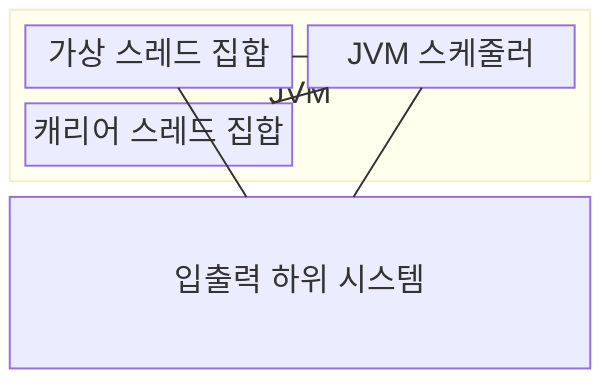
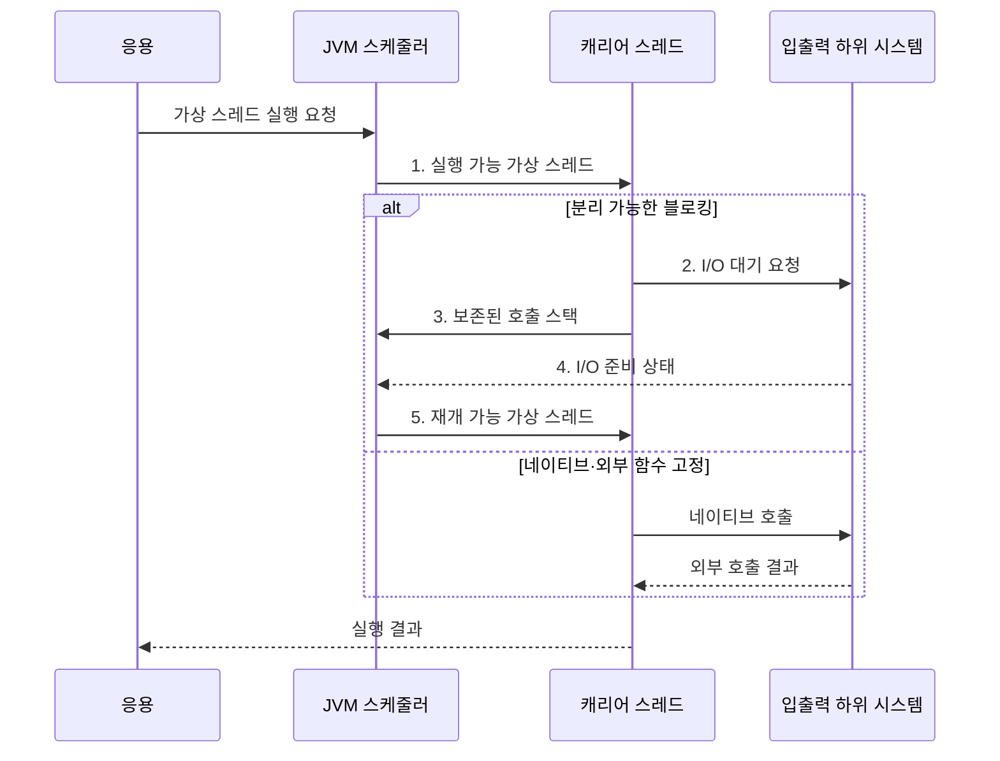

---
sidebar:
  order: 25
  label: "025. 가상 스레드: Java Project Loom (Virtual Thread)"
  badge:
    text: "기출 · 50%"
    variant: note
title: "가상 스레드: Java Project Loom (Virtual Thread)"
date: "2026-08-02T12:00:00+09:00"
tags: [notes-software]
weight: 25
extra:
  question_no: "025"
  source_status: "기출"
  source_history: "138회"
  priority: 50
  priority_note: "138회 기출, 경량 동시성·스케줄링 현안"
---

## Ⅰ. 개요

핵심 용어

- **가상 스레드(Virtual Thread)**: 자바 개발 키트가 스케줄링하는 경량 Java 실행 단위다.
- **캐리어 스레드(Carrier Thread)**: 가상 스레드를 실제로 실행하는 플랫폼 스레드다.
- **다중화(Multiplexing)**: 많은 가상 스레드를 소수 캐리어에 번갈아 탑재해 재사용하는 방식이다.

- 정의/개념: Java Project Loom이 가상 스레드를 **소수 캐리어에 다중화**하는 동시성 실행 모델
- 배경/필요성: 요청별 플랫폼 스레드는 I/O 대기 중에도 **OS 스레드·스택 점유**

### 쉽게 이해하기 (학습용)

- 많은 작업표를 소수 작업자에게 번갈아 올려 기다리는 동안 다른 일을 맡긴다.

## Ⅱ. 특징

핵심 용어

- **블로킹 입출력(Blocking Input/Output, Blocking I/O)**: 작업 완료까지 호출 흐름을 멈추는 입출력 방식이다.
- **분리(Unmount)**: 대기하는 가상 스레드의 실행 상태를 보존하고 캐리어를 다른 작업에 돌려주는 동작이다.
- **중앙처리장치(Central Processing Unit, CPU)**: 명령을 실행하며 가상 스레드의 실제 계산 병렬도 한계를 정하는 처리장치다.

- **경량 생성·스케줄링**으로 요청별 스레드 모델 지원
- **블로킹 시 캐리어 분리**로 다른 가상 스레드 실행
- CPU 병렬도는 **캐리어·물리 코어 수**로 제한

### 쉽게 이해하기 (학습용)

- 기다리는 일은 많이 맡을 수 있지만 동시에 계산하는 수는 실제 작업자와 작업대 수를 넘지 못한다.

## Ⅲ. 구조 및 구성요소

핵심 용어

- **자바 가상 머신(Java Virtual Machine, JVM)**: Java 바이트코드를 실행하고 가상 스레드를 스케줄링하는 실행 환경이다.
- **호출 스택(Call Stack)**: 함수 호출 위치·지역 변수·반환 주소를 보존해 중단 지점에서 재개하게 하는 실행 상태다.
- **운영체제(Operating System, OS)**: 캐리어 플랫폼 스레드를 실제 CPU 코어에 배정하는 시스템 소프트웨어다.

| 구성요소 | 책임 |
|:---|:---|
| 가상 스레드 집합 | 작업별 **호출 스택·실행 상태** 보유 |
| JVM 스케줄러 | 실행 가능한 가상 스레드를 **캐리어에 배정** |
| 캐리어 스레드 집합 | 탑재된 코드를 **운영체제 스레드**에서 실행 |
| 입출력 하위 시스템 | **대기 등록·준비 완료** 통지 |

### 쉽게 이해하기 (학습용)

- 작업표, 배정자, 실제 작업자, 대기 창구로 구성된다.

## Ⅳ. 흐름도

핵심 용어

- **탑재·분리(Mount·Unmount)**: 가상 스레드를 캐리어에 연결하거나 대기 시 해제하는 동작이다.
- **고정(Pinning)**: 가상 스레드가 특정 차단 구간에서 캐리어로부터 분리되지 못하는 상태다.
- **네이티브·외부 함수(Native·Foreign Function)**: JVM 밖의 기계어 코드나 외부 인터페이스를 호출하는 함수다.

**동작 원리**

1. **실행 가능 가상 스레드**: 스케줄러가 빈 캐리어에 실행 작업 배정
2. **I/O 대기 요청**: 하위 시스템에 완료 조건을 등록하고 실행 중단
3. **보존된 호출 스택**: 중단 지점의 실행 상태를 남기고 캐리어 분리
4. **I/O 준비 상태**: 완료된 가상 스레드를 실행 가능 상태로 전환
5. **재개 가능 가상 스레드**: 빈 캐리어에 다시 탑재해 중단 지점부터 재개

### 쉽게 이해하기 (학습용)

- 입출력을 기다리면 작업표를 내려 다른 일을 맡기고 준비되면 다시 올리지만 분리 불가 작업은 작업자도 기다린다.

## Ⅴ. 종류 및 비교

핵심 용어

- **플랫폼 스레드(Platform Thread)**: 운영체제 스레드와 직접 연결되어 CPU 계산이나 네이티브 호출을 실행하는 Java 스레드다.
- **플랫폼 스레드 풀(Platform Thread Pool)**: CPU 계산 병렬도에 맞춘 플랫폼 스레드를 재사용하는 구조다.

| Java 스레드 모델 | 가상 스레드 | 플랫폼 스레드 |
|:---|:---|:---|
| 적용 기준 | 다수 독립 요청·**블로킹 I/O** | CPU 계산·**네이티브 호출** |
| 핵심 특징 | JDK의 **캐리어 다중화** | OS의 **직접 스케줄링** |
| 한계 | 캐리어 고정·**외부 자원 고갈** | 생성·전환·**메모리 비용** |

> 요약: **I/O 대기**는 가상 스레드, **CPU 계산**은 플랫폼 스레드 풀 사용

### 쉽게 이해하기 (학습용)

- 기다리는 요청이 많으면 작업표를 늘리고 계산·네이티브 작업은 실제 작업자 수에 맞춘다.

## Ⅵ. 실무 고려사항 및 대책

핵심 용어

- **세마포어(Semaphore)**: 허용 개수만큼만 작업의 동시 진입을 허용하는 동기화 도구다.
- **역압력(Backpressure)**: 하위 자원의 처리 한계를 요청자에게 전달해 새 작업 유입을 낮추는 제어다.
- **자바 비행 기록기(Java Flight Recorder, JFR)**: JVM 실행 사건과 고정 구간을 낮은 부하로 수집하는 진단 기능이다.
- **스레드 로컬(Thread-local)**: 각 스레드마다 별도 값을 보관해 가상 스레드 수만큼 메모리를 사용할 수 있는 저장 방식이다.

| 문제 | 대책 | 효과 |
|:---|:---|:---|
| 가상 스레드 수가 DB·외부 API 한도를 넘어 **자원 고갈** | **세마포어·시간 제한·역압력**으로 동시성 제한 | 하위 자원의 **대기열·고갈** 방지 |
| 네이티브·외부 함수가 캐리어를 오래 **고정** | **JFR 고정 사건·캐리어 사용률** 계측과 호출 격리 | 확장성 저하의 **고정 구간** 식별 |
| CPU 계산을 무제한 가상 스레드로 실행해 **코어 경합** | 코어 수에 맞춘 **플랫폼 스레드 풀** 사용 | 계산 작업의 **병렬도·지연** 통제 |
| 가상 스레드별 큰 스레드 로컬로 **메모리 급증** | 요청 문맥의 **크기·수명 제한**과 메모리 계측 | 동시 요청별 **메모리 상한** 유지 |

### 쉽게 이해하기 (학습용)

- 서버는 요청마다 가상 스레드를 만들되 한정된 데이터베이스 연결은 별도로 제한한다.

## Ⅶ. 결론

핵심 용어

- **고정 구간**: 가상 스레드가 캐리어를 놓지 못해 다중화 확장성을 제한하는 실행 구간이다.
- **플랫폼 스레드 풀**: CPU 중심 계산을 물리 코어 수에 맞춰 제한하는 실행 구조다.

- I/O 대기가 많고 고정 구간이 짧으면 **가상 스레드**, CPU 계산은 **플랫폼 스레드 풀** 선택

### 쉽게 이해하기 (학습용)

- 기다리는 시간이 많은지, 연결 같은 자원이 몇 개인지, 캐리어를 붙잡는 코드가 있는지 보고 정한다.
