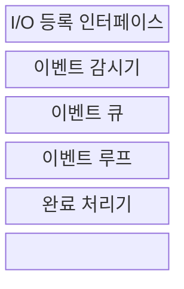
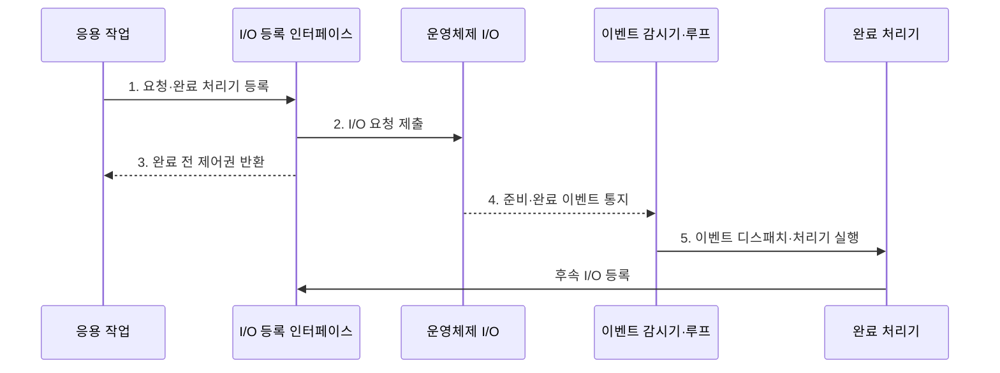

---
sidebar:
  order: 26
  label: "026. 비동기 I/O·이벤트 루프 (Async I/O Event Loop)"
  badge:
    text: "기출 · 50%"
    variant: note
title: "비동기 I/O·이벤트 루프 (Async I/O Event Loop)"
date: "2026-07-30T18:00:00+09:00"
tags:
  - "notes-software"
weight: 26
extra:
  question_no: "026"
  source_status: "기출"
  source_history: "138회"
  priority: 50
  priority_note: "138회 기출, 이벤트 루프·비동기 처리 핵심"
---

## 미리 알고가기

- **입출력(Input/Output, I/O)**: 프로세스와 외부 장치 간 데이터 전달
- **비동기 I/O(Asynchronous I/O)**: 요청 완료 전에 제어권을 반환하고 완료 이벤트로 결과를 전달하는 방식
- **비차단 I/O(Non-blocking I/O)**: 입출력이 준비되지 않았으면 기다리지 않고 즉시 반환하는 방식
- **이벤트 루프(Event Loop)**: 준비·완료 이벤트를 반복 조회·디스패치
- **이벤트 감시기(Event Demultiplexer)**: 여러 I/O 이벤트를 수집
- **응용 프로그래밍 인터페이스(Application Programming Interface, API)**: 프로그램 간 기능 호출 규약
- **역압(Backpressure)**: 소비 속도에 맞춰 입력량 제한
- **작업 풀(Worker Pool)**: 차단·계산 작업을 별도 스레드에서 실행
- **운영체제(Operating System, OS)**: 장치 입출력 요청을 수행하고 준비·완료 상태를 이벤트 감시기에 통지하는 시스템 소프트웨어
- **디스패치(Dispatch)**: 이벤트 큐에서 꺼낸 준비·완료 사건에 연결된 처리기를 선택해 실행하는 동작
- **완료 처리기(Completion Handler)**: 비동기 요청이 끝났을 때 결과를 처리하고 후속 입출력을 등록하는 콜백 함수
- **동기 입출력(Synchronous Input/Output, Synchronous I/O)**: 결과를 받을 때까지 현재 실행 흐름과 스레드를 대기시키는 방식
- **이벤트 서버(Event-driven Server)**: 연결의 준비·완료 사건을 이벤트 루프로 처리하고 긴 계산은 작업 풀로 분리하는 서버
- **암호 해시(Cryptographic Hash)**: 입력을 고정 길이 값으로 변환하는 계산 집약 함수로서 이벤트 루프에서 직접 실행하면 다른 이벤트 처리를 지연시킴
- **큐 상한·읽기 일시 중지(Queue Limit·Read Pause)**: 큐 상한은 대기 이벤트 수를 제한하고 읽기 일시 중지는 한도 도달 시 새 네트워크 입력 수신을 멈춰 역압을 전달한다.
- **콜백(Callback)**: 작업 완료나 사건 발생 시 실행하도록 미리 등록한 함수
- **시간 제한·취소 전파(Timeout·Cancellation Propagation)**: 정한 시간 안에 끝나지 않은 작업을 중단하고 하위 작업에도 취소를 전달하는 방식
- **상관 식별자(Correlation Identifier)**: 비동기 단계로 나뉜 하나의 요청 흐름을 연결해 추적하는 공통 식별값

## Ⅰ. 개요

- 정의/개념: 요청 후 반환하고 **완료 이벤트로 처리**하는 모델
- 배경/필요성: 동기 스레드의 **I/O 대기 점유를 축소**

### 쉽게 이해하기 (학습용)

- 요청을 맡긴 뒤 다른 일을 하다가 완료 알림이 오면 이어서 처리한다.

## Ⅱ. 특징

- **이벤트 루프**로 다수 I/O 연결의 완료 이벤트 배분
- **차단·CPU 작업 분리**로 루프 응답 지연 방지
- **역압·큐 상한**으로 입력량·처리량 불균형 통제

### 쉽게 이해하기 (학습용)

- 한 직원이 오래 붙잡히면 줄이 밀리므로 무거운 일은 다른 직원에게 보낸다.

## Ⅲ. 구조 및 구성요소

| 구성요소 | 책임 |
|:---|:---|
| I/O 등록 인터페이스 | 비동기·비차단 요청 등록 |
| 이벤트 감시기 | 여러 I/O의 준비·완료 사건 수집 |
| 이벤트 큐 | 실행 대기 사건 보관 |
| 이벤트 루프 | 사건을 꺼내 처리기 실행 |
| 완료 처리기 | 결과 처리·후속 I/O 등록 |

### 쉽게 이해하기 (학습용)

- 접수 창구, 알림 수집기, 대기함, 배분자, 처리기로 구성된다.

## Ⅳ. 흐름도

**동작 원리**

- **1. 요청·완료 처리기 등록**: 응용이 요청과 처리기를 등록
- **2. I/O 요청 제출**: 인터페이스가 운영체제에 요청 전달
- **3. 완료 전 제어권 반환**: 응용이 다른 작업을 계속 수행
- **4. 준비·완료 이벤트 통지**: 운영체제가 완료 사건 전달
- **5. 이벤트 디스패치·처리기 실행**: 루프가 처리기를 선택

### 쉽게 이해하기 (학습용)

- 요청을 맡기고 돌아온 뒤 완료 알림을 받으면 다음 요청을 등록한다.

## Ⅴ. 종류 및 비교

| I/O 처리 방식 | 비동기 I/O·이벤트 루프 | 동기 I/O |
|:---|:---|:---|
| 적용 기준 | 다수 **I/O 대기 연결** | 단순한 **순차 제어** |
| 핵심 특징 | 완료 이벤트 재개·**스레드 비점유** | 호출 흐름 대기·**스레드 점유** |
| 한계 | 루프 점유·**큐 누적** | 스레드 고갈·**문맥 전환** |

> 요약: 비동기는 이벤트 재개, 동기는 호출 흐름 대기

### 쉽게 이해하기 (학습용)

- 비동기는 알림 뒤 재개하고 동기는 결과가 나올 때까지 기다린다.

## Ⅵ. 실무 고려사항 및 대책

| 고려사항 | 대책 | 효과 |
|:---|:---|:---|
| 완료 처리기가 차단·장시간 계산해 이벤트 루프 점유 | 실행시간 예산 설정·차단 및 CPU 작업을 작업 풀로 분리 | 다른 연결의 지연 방지 |
| 무한 이벤트 큐로 메모리·꼬리 지연 증가 | 큐 상한·읽기 일시 중지·요청 거절로 역압 적용 | 과부하 통제 |
| 작업 풀이 포화돼 루프가 결과를 끝없이 대기 | 유한 작업 풀·시간 제한·취소 전파 적용 | 연쇄 지연·자원 누수 방지 |
| 콜백 단계가 나뉘어 오류·요청 흐름 추적 곤란 | 상관 식별자·통합 오류 처리·단계별 지연 기록 | 장애 원인 추적성 확보 |

### 적용 사례

- 실행시간이 긴 암호 해시를 **유한 작업 풀로 격리**해 이벤트 루프의 연결 처리 유지

### 쉽게 이해하기 (학습용)

- API는 실행시간이 긴 암호 계산을 루프 밖에서 처리한다.

## Ⅶ. 결론

- **I/O 대기·처리시간**을 보고 이벤트 루프를 적용

### 쉽게 이해하기 (학습용)

- 기다리는 연결이 많고 일을 짧게 끝낼수록 이벤트 루프가 잘 맞는다
