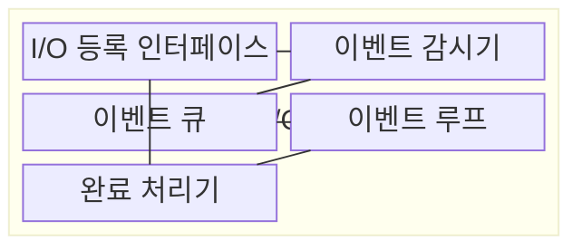
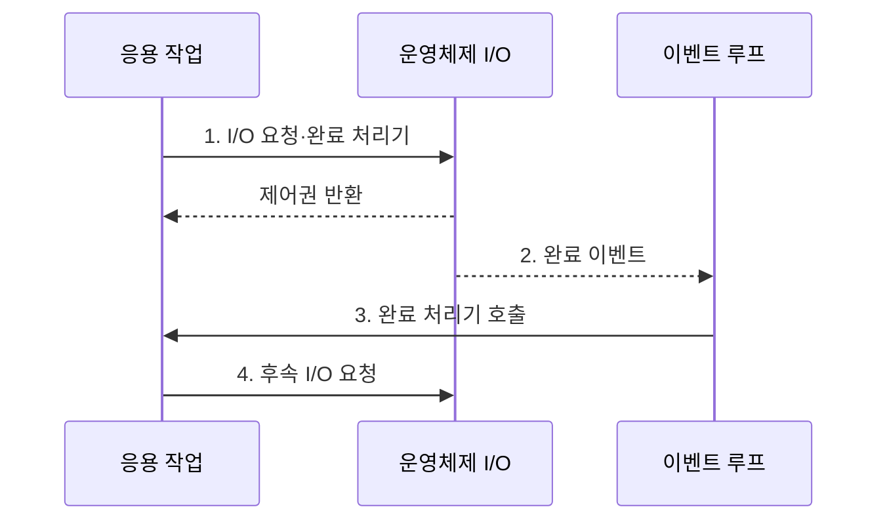

---
sidebar:
  order: 26
  label: "026. 비동기 I/O·이벤트 루프 (Async I/O Event Loop)"
  badge:
    text: "기출 · 50%"
    variant: note
title: "비동기 I/O·이벤트 루프 (Async I/O Event Loop)"
date: "2026-08-02T12:00:00+09:00"
tags:
  - "notes-software"
weight: 26
extra:
  question_no: "026"
  source_status: "기출"
  source_history: "138회"
  priority: 50
  priority_note: "138회 기출, 이벤트 루프·비동기 처리 핵심"
---

## Ⅰ. 개요

핵심 용어

- **비동기 입출력(Asynchronous Input/Output, 비동기 I/O)**: 요청 완료 전에 제어권을 반환하고 완료 이벤트로 결과를 전달하는 방식이다.
- **완료 이벤트**: 운영체제가 입출력 작업의 준비 또는 완료 상태를 실행 흐름에 알리는 신호다.

- 정의/개념: 요청 후 제어권을 반환하고 **완료 이벤트** 로 재개하는 I/O 처리 모델
- 배경/필요성: 동기 I/O는 대기 중 스레드를 점유해 연결 증가 시 **스레드 고갈**

#### 한줄 요약

- 요청을 맡긴 뒤 다른 일을 하다가 완료 알림이 오면 이어서 처리한다.

## Ⅱ. 특징

핵심 용어

- **이벤트 루프(Event Loop)**: 준비·완료 이벤트를 반복 조회해 연결된 처리기로 배분하는 실행 구조다.
- **작업 풀(Worker Pool)**: 차단 또는 CPU 계산 작업을 이벤트 루프 밖의 별도 스레드에서 실행하는 구조다.
- **역압(Backpressure)**: 소비 속도에 맞춰 입력량을 제한해 큐 누적을 막는 제어다.
- **큐 상한(Queue Limit)**: 대기 이벤트가 메모리와 허용 지연을 넘지 않도록 큐 길이에 둔 최댓값이다.

- **이벤트 루프** 로 다수 I/O 연결의 완료 이벤트 배분
- **차단·CPU 작업 분리** 로 루프 응답 지연 방지
- **역압·큐 상한** 으로 입력량·처리량 불균형 통제

#### 한줄 요약

- 한 직원이 오래 붙잡히면 줄이 밀리므로 무거운 일은 다른 직원에게 보낸다.

## Ⅲ. 구조 및 구성요소

핵심 용어

- **비차단 입출력(Non-blocking Input/Output, 비차단 I/O)**: 입출력이 준비되지 않았을 때 기다리지 않고 즉시 반환하는 방식이다.
- **이벤트 감시기(Event Demultiplexer)**: 여러 입출력의 준비·완료 사건을 한곳에 모으는 구성요소다.
- **디스패치(Dispatch)**: 큐에서 꺼낸 이벤트에 연결된 완료 처리기를 선택해 실행하는 동작이다.
- **I/O 등록 인터페이스**: 응용이 비동기 작업과 완료 때 호출할 처리기를 런타임에 제출하는 진입점이다.
- **이벤트 큐·완료 처리기**: 이벤트 큐는 실행 대기 사건을 보관하고 완료 처리기는 결과 처리와 후속 I/O 등록을 수행한다.

| 구성요소 | 책임 |
|:---|:---|
| I/O 등록 인터페이스 | **비동기·비차단 요청** 등록 |
| 이벤트 감시기 | 여러 I/O의 **준비·완료 사건** 수집 |
| 이벤트 큐 | 실행 대기 **이벤트** 보관 |
| 이벤트 루프 | 이벤트를 꺼내 **처리기 디스패치** |
| 완료 처리기 | 결과 처리·**후속 I/O** 등록 |

#### 한줄 요약

- 접수 창구, 알림 수집기, 대기함, 배분자, 처리기로 구성된다.

## Ⅳ. 흐름도

핵심 용어

- **운영체제(Operating System, OS)**: 장치 작업을 수행하고 준비·완료 상태를 이벤트 감시기에 통지하는 시스템 소프트웨어다.
- **완료 처리기(Completion Handler)**: 비동기 요청 결과를 처리하고 후속 입출력을 등록하는 콜백 함수다.

**동작 원리**

1. **I/O 요청·완료 처리기**: 응용이 장치 작업과 결과를 처리할 콜백을 운영체제에 등록
2. **완료 이벤트**: 운영체제가 준비·완료 상태를 감시기에 전달
3. **완료 처리기 호출**: 이벤트 루프가 사건에 연결된 응용 콜백 실행
4. **후속 I/O 요청**: 처리 결과에 따라 다음 비동기 작업 등록

#### 한줄 요약

- 요청을 맡기고 돌아온 뒤 완료 알림을 받으면 다음 요청을 등록한다.

## Ⅴ. 종류 및 비교

핵심 용어

- **동기 입출력(Synchronous Input/Output, 동기 I/O)**: 결과를 받을 때까지 현재 실행 흐름과 스레드를 대기시키는 방식이다.
- **문맥 전환(Context Switch)**: 실행 대상을 바꾸기 위해 레지스터와 스택 상태를 저장·복원하는 작업이다.

| I/O 처리 방식 | 비동기 I/O·이벤트 루프 | 동기 I/O |
|:---|:---|:---|
| 적용 기준 | 다수 **I/O 대기 연결** | 단순한 **순차 제어** |
| 핵심 특징 | 완료 이벤트 재개·**스레드 비점유** | 호출 흐름 대기·**스레드 점유** |
| 한계 | 루프 점유·**큐 누적** | 스레드 고갈·**문맥 전환** |

> 요약: **비동기 I/O** 는 이벤트로 재개하고 **동기 I/O** 는 호출 흐름 대기

#### 한줄 요약

- 비동기는 알림 뒤 재개하고 동기는 결과가 나올 때까지 기다린다.

## Ⅵ. 실무 고려사항 및 대책

핵심 용어

- **큐 상한·읽기 일시 중지(Queue Limit·Read Pause)**: 대기 이벤트 수를 제한하고 한도 도달 시 새 입력 수신을 멈추는 역압 수단이다.
- **시간 제한·취소 전파(Timeout·Cancellation Propagation)**: 늦은 작업을 중단하고 하위 작업에도 취소를 전달하는 방식이다.
- **상관 식별자(Correlation Identifier)**: 여러 비동기 단계로 나뉜 하나의 요청 흐름을 연결해 추적하는 값이다.
- **꼬리 지연(Tail Latency)**: 요청 지연 분포에서 가장 느린 일부 요청의 응답 시간이다.
- **처리기 시간 상한**: 하나의 완료 처리기가 이벤트 루프를 연속 점유할 수 있는 최대 실행시간이다.
- **자원 누수(Resource Leak)**: 취소·오류 뒤 연결이나 메모리 같은 자원이 반환되지 않고 계속 점유되는 상태다.
- **통합 오류 처리**: 여러 비동기 단계에서 발생한 오류를 한 정책으로 수집·분류·복구하는 방식이다.

| 문제 | 대책 | 효과 |
|:---|:---|:---|
| 완료 처리기의 차단·장시간 계산으로 **이벤트 루프 점유** | 처리기 시간 상한과 **차단·CPU 작업 풀 분리** | 다른 연결의 **응답 지연** 방지 |
| 무한 이벤트 큐로 **메모리·꼬리 지연** 증가 | **큐 상한·읽기 일시 중지·요청 거절** 적용 | 입력량에 대한 **역압** 전달 |
| 작업 풀 포화로 루프의 **결과 대기** 누적 | 유한 작업 풀과 **시간 제한·취소 전파** 적용 | 연쇄 지연·**자원 누수** 방지 |
| 콜백 분산으로 오류와 **요청 흐름 추적** 곤란 | **상관 식별자·통합 오류 처리** 적용 | 비동기 단계의 **장애 원인 추적** |

#### 한줄 요약

- 한 접수원이 오래 계산하지 않도록 무거운 작업은 별도 작업대에 보내고, 대기함이 차면 새 요청의 입장을 멈춘다.

## Ⅶ. 결론

핵심 용어

- **대기 연결**: 입출력 결과를 기다리지만 CPU 작업은 수행하지 않는 네트워크·장치 연결이다.
- **작업 풀**: 이벤트 루프를 오래 점유할 차단·계산 작업을 분리하는 실행 구조다.

- 대기 연결이 많고 처리기가 짧으면 **이벤트 루프**, 장시간 차단·계산은 **작업 풀** 선택

#### 한줄 요약

- 기다리는 연결이 많고 일을 짧게 끝낼수록 이벤트 루프가 잘 맞는다
