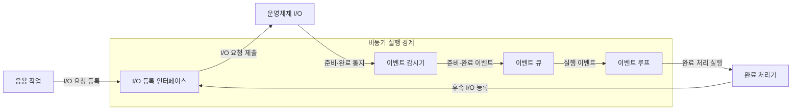
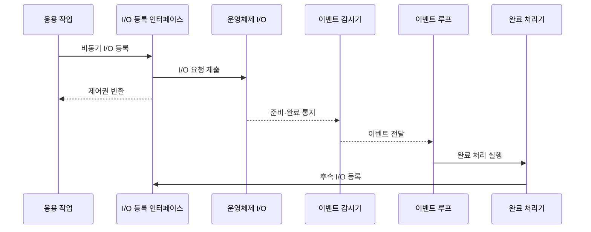

---
sidebar:
  order: 26
  label: "026. 비동기 I/O·이벤트 루프 (Async I/O Event Loop)"
  badge:
    text: "기출 · 50%"
    variant: note
title: "비동기 I/O·이벤트 루프 (Async I/O Event Loop)"
date: "2026-07-27T23:59:59+09:00"
tags:
  - "notes-software"
weight: 26
extra:
  question_no: "026"
  source_status: "기출"
  source_history: "138회"
  priority: 50
  priority_note: "138회 기출, 이벤트 루프·비동기 처리 핵심"
---

## 미리 알고가기

- **입출력(Input/Output, I/O)**: ‘아이오’로 읽고 Input과 Output의 머리글자를 빗금으로 묶은 표기이며 프로세스와 외부 장치 간 데이터 전달
- **비동기 I/O(Asynchronous I/O)**: ‘비동기 아이오’로 읽고 처리 방식 앞에 I/O를 붙인 표기이며 요청 완료 전 반환하고 완료 이벤트로 결과 전달
- **비차단 I/O(Non-blocking I/O)**: ‘논블로킹 아이오’로 읽고 처리 방식 앞에 I/O를 붙인 표기이며 준비되지 않으면 작업 없이 즉시 반환
- **이벤트 루프(Event Loop)**: 준비·완료 이벤트를 반복 조회·디스패치
- **이벤트 감시기(Event Demultiplexer)**: 여러 I/O 이벤트를 수집
- **응용 프로그래밍 인터페이스(Application Programming Interface, API)**: ‘에이피아이’로 읽고 Application Programming Interface의 머리글자를 딴 표기이며 프로그램 간 기능 호출 규약
- **역압(Backpressure)**: 소비 속도에 맞춰 입력량 제한
- **작업 풀(Worker Pool)**: 차단·계산 작업을 별도 스레드에서 실행
- **운영체제(Operating System, OS)**: ‘오에스’로 읽고 Operating System의 머리글자를 딴 표기이며 장치 입출력 요청을 수행하고 준비·완료 상태를 이벤트 감시기에 통지
- **디스패치(Dispatch)**: 이벤트 큐에서 꺼낸 준비·완료 사건에 연결된 처리기를 선택해 실행하는 동작
- **완료 처리기(Completion Handler)**: 비동기 요청이 끝났을 때 결과를 처리하고 후속 입출력을 등록하는 콜백 함수
- **동기 입출력(Synchronous Input/Output, Synchronous I/O)**: ‘싱크로너스 아이오’로 읽고 처리 방식 앞에 I/O를 붙인 표기이며 결과를 받을 때까지 현재 실행 흐름과 스레드를 대기시킴
- **이벤트 서버(Event-driven Server)**: 연결의 준비·완료 사건을 이벤트 루프로 처리하고 긴 계산은 작업 풀로 분리하는 서버
- **암호 해시(Cryptographic Hash)**: 입력을 고정 길이 값으로 변환하는 계산 집약 함수로서 이벤트 루프에서 직접 실행하면 다른 이벤트 처리를 지연시킴
- **큐 상한·읽기 일시 중지(Queue Limit·Read Pause)**: 큐 상한은 대기 이벤트 수를 제한하고 읽기 일시 중지는 한도 도달 시 새 네트워크 입력 수신을 멈춰 역압을 전달함

## Ⅰ. 개요

- **정의/개념**: I/O 요청 후 반환하고 **완료 이벤트로 후속 처리**하는 모델
- **기존 한계**: 연결별 동기 스레드는 **I/O 대기 중 스레드 자원** 점유

### 쉽게 이해하기 (학습용)

- 요청을 맡긴 뒤 다른 일을 하다가 완료 알림이 오면 이어서 처리한다

## Ⅱ. 특징

- **이벤트 루프**로 다수 I/O 연결의 완료 이벤트 배분
- **차단·CPU 작업 분리**로 루프 응답 지연 방지
- **역압·큐 상한**으로 입력량·처리량 불균형 통제

### 쉽게 이해하기 (학습용)

- 한 직원이 오래 붙잡히면 줄이 밀리므로 무거운 일은 다른 직원에게 보낸다

## Ⅲ. 아키텍처 및 구성요소

| 설계 요소 | 설명 |
|:---|:---|
| I/O 등록 인터페이스 | 비동기·비차단 I/O 요청 등록 |
| 이벤트 감시기 | 여러 I/O의 준비·완료 이벤트 수집 |
| 이벤트 큐 | 실행을 기다리는 준비·완료 이벤트 보관 |
| 이벤트 루프 | 큐의 이벤트를 꺼내 완료 처리 실행 |

> 요약: 이벤트 배분으로 호출 작업의 대기를 분리

### 쉽게 이해하기 (학습용)

- 감시기가 알림을 큐에 모으면 루프가 완료 처리를 실행한다.

## Ⅳ. 원리 및 절차 흐름도

| 절차 | 설명 |
|:---|:---|
| 비동기 I/O 등록 | 요청과 완료 처리기를 인터페이스에 등록 |
| I/O 요청 제출 | 인터페이스가 운영체제에 작업 제출 |
| 제어권 반환 | I/O 완료 전 호출 작업에 제어권 반환 |
| 준비·완료 통지 | 운영체제가 준비·완료 상태 통지 |
| 이벤트 전달 | 감시기가 이벤트 루프로 전달 |
| 완료 처리 실행 | 이벤트 루프가 완료 처리기 실행 |
| 후속 I/O 등록 | 처리기가 다음 I/O 요청 등록 |

> 요약: 제어권 반환 후 준비·완료 이벤트로 처리 재개

### 쉽게 이해하기 (학습용)

- 요청을 맡기고 돌아온 뒤 완료 알림을 받으면 다음 요청을 등록한다

## Ⅴ. 종류 및 비교

| I/O 처리 방식 | 비동기 I/O·이벤트 루프 | 동기 I/O |
|:---|:---|:---|
| 적용 기준 | 다수 **I/O 대기 연결** | 단순한 **순차 제어** |
| 핵심 특징 | 완료 이벤트 재개·**스레드 비점유** | 호출 흐름 대기·**스레드 점유** |
| 한계 | 루프 점유·**큐 누적** | 스레드 고갈·**문맥 전환** |

> 요약: 비동기는 이벤트 재개, 동기는 호출 흐름 대기

### 쉽게 이해하기 (학습용)

- 비동기는 알림 뒤 재개하고 동기는 결과가 나올 때까지 기다린다

## Ⅵ. 실무 사례

1. 이벤트 서버는 **암호 해시를 작업 풀**로 분리
2. 네트워크 서버는 **큐 상한에서 읽기 일시 중지**

### 쉽게 이해하기 (학습용)

- API는 오래 걸리는 암호 계산을 루프 밖에서 처리한다.
- 입력 서버는 대기열이 차면 새 데이터 읽기를 잠시 멈춘다.

## Ⅶ. 결론

- **다수 I/O 대기·짧은 처리·역압 가능** 시 이벤트 루프 선택

### 쉽게 이해하기 (학습용)

- 기다리는 연결이 많고 일을 짧게 끝낼수록 이벤트 루프가 잘 맞는다
