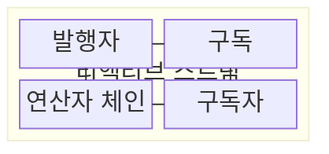
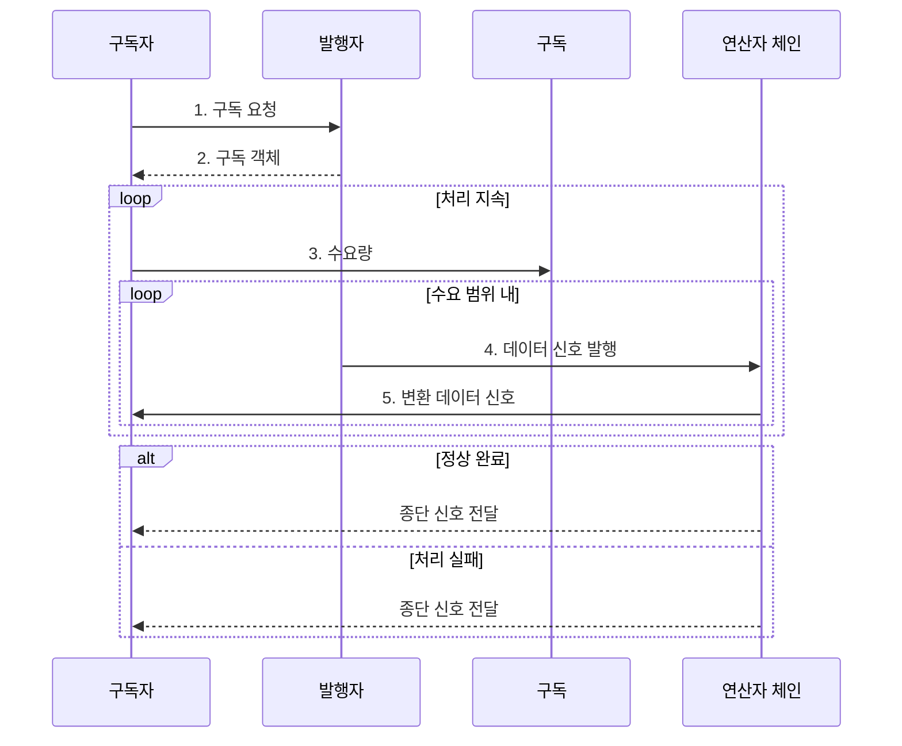

---
sidebar:
  order: 27
  label: "027. 리액티브 프로그래밍 (Reactive Programming)"
  badge:
    text: "미출제 · 50%"
    variant: note
title: "리액티브 프로그래밍 (Reactive Programming)"
date: "2026-07-30T23:22:24+09:00"
tags:
  - "notes-software"
weight: 27
extra:
  question_no: "027"
  source_status: "미출"
  source_history: ""
  priority: 50
  priority_note: "리액티브는 비동기 흐름·역압 설계에 유효"
---

## 미리 알고가기

- **리액티브 프로그래밍(Reactive Programming)**: 데이터 흐름과 변화 전파를 선언적으로 구성
- **스트림(Stream)**: 시간 순서로 전달되는 데이터·이벤트 신호
- **리액티브 스트림(Reactive Streams)**: 비동기 스트림과 비차단 역압 규약
- **발행자(Publisher)**: 수요 범위 데이터 발행·완료 또는 오류 통지
- **구독자(Subscriber)**: 데이터·완료·오류 신호 수신
- **구독(Subscription)**: 수요 요청·취소를 발행자에 전달
- **연산자(Operator)**: 스트림 데이터를 변환·결합
- **수요량(Demand)**: 구독자가 처리 가능한 데이터 수
- **역압(Backpressure)**: 소비 속도에 맞춰 발행량 제한
- **선언형 프로그래밍(Declarative Programming)**: 실행 순서를 직접 지시하기보다 원하는 데이터 변환과 관계를 연산자 체인으로 표현하는 방식
- **비차단(Non-blocking)**: 결과를 기다리는 동안 실행 스레드를 멈추지 않고 준비된 다른 신호 처리를 이어 가는 성질
- **필터·결합·오류 복구(Filter·Combine·Error Recovery)**: 필터는 조건에 맞는 신호만 통과시키고 결합은 여러 스트림을 합치며 오류 복구는 실패 신호를 대체 흐름으로 전환하는 연산자
- **종단 신호(Terminal Signal)**: 스트림이 더는 데이터를 내보내지 않음을 알리는 완료 또는 오류 통지
- **명령형 동기 처리(Imperative Synchronous Processing)**: 호출 순서와 제어 흐름을 명령으로 작성하고 각 반환값을 기다린 뒤 다음 처리를 수행하는 방식
- **호출 스택(Call Stack)**: 동기 함수의 호출 위치·지역 변수·반환 주소를 쌓아 순차 실행 흐름을 유지하는 메모리 구조
- **실행 스케줄러(Execution Scheduler)**: 리액티브 연산을 실행할 스레드나 작업 풀을 선택하는 구성요소
- **지수 백오프·무작위 지연(Exponential Backoff·Jitter)**: 재시도 간격을 점차 늘리고 작은 무작위 시간을 더해 동시 재시도 폭증을 줄이는 방식
- **멱등성(Idempotency)**: 같은 요청을 여러 번 실행해도 최종 결과가 한 번 실행한 것과 같은 성질
- **상관 식별자(Correlation Identifier)**: 여러 비동기 단계를 거치는 하나의 요청 흐름을 연결해 추적하는 공통 식별값
- **꼬리 지연(Tail Latency)**: 요청 지연 분포에서 가장 느린 일부 요청의 응답 시간
- **버퍼 상한(Buffer Limit)**: 생산된 신호를 임시 보관할 수 있는 최대 개수
- **차단 입출력(Blocking Input/Output, Blocking I/O)**: 결과가 준비될 때까지 실행 스레드를 대기시키는 입출력 방식

## Ⅰ. 개요

- 정의/개념: 데이터 흐름과 변화를 **스트림 신호로 전파**하는 선언형 프로그래밍 모델
- 배경/필요성: 소비 속도보다 빠른 무제한 생산은 **버퍼·지연 누적**

### 쉽게 이해하기 (학습용)

- 받을 준비가 된 만큼 주문하고 데이터 변화가 생기면 계속 전달받는다.

## Ⅱ. 특징

- **연산자 체인**을 통한 데이터 변환·결합의 선언적 표현
- **리액티브 스트림 수요량**에 따른 데이터 신호 수 제한
- 완료·오류를 **종단 신호**로 통합한 비동기 생명주기

### 쉽게 이해하기 (학습용)

- 주문서가 허용한 수만큼 재료가 가공 공정을 흐르고, 공정 끝의 완료표나 오류표가 전체 스트림을 닫는다.

## Ⅲ. 구조 및 구성요소

| 구성요소 | 책임 |
|:---|:---|
| 발행자 | 수요 범위의 **데이터·종단 신호** 발행 |
| 구독 | **수요 요청·취소** 전달 |
| 연산자 체인 | 데이터 **변환·필터링·결합** |
| 구독자 | **수요량 요청·스트림 신호** 소비 |

### 쉽게 이해하기 (학습용)

- 생산자, 주문서, 가공 공정, 소비자로 구성된다.

## Ⅳ. 흐름도

**동작 원리**

1. **구독 요청**: 구독자가 발행자에 스트림 수신 의사 전달
2. **구독 객체**: 발행자가 수요 요청·취소 통로 제공
3. **수요량**: 구독자가 처리 가능한 신호 개수 지정
4. **데이터 신호 발행**: 발행자가 요청 한도를 넘지 않게 신호 생성
5. **변환 데이터 신호**: 연산자 체인의 가공 결과를 구독자가 소비

### 쉽게 이해하기 (학습용)

- 소비자가 수량을 주문하면 생산자는 그만큼 보내고 끝이나 오류를 알린다.

## Ⅴ. 종류 및 비교

| 처리 모델 | 리액티브 프로그래밍 | 명령형 동기 처리 |
|:---|:---|:---|
| 적용 기준 | 비동기 **연속 이벤트** 처리 | 단순한 **순차 업무** 처리 |
| 핵심 특징 | **스트림 신호·역압** 기반 수요 제어 | **호출 스택** 기반 순차 반환 |
| 한계 | 비동기 **흐름·오류 추적** 복잡성 | 대기 **스레드·큐 누적** |

> 요약: 리액티브는 신호 전파, 동기는 호출 순서 중심

### 쉽게 이해하기 (학습용)

- 리액티브는 신호가 흐르고 동기는 요청한 순서대로 결과를 기다린다.

## Ⅵ. 실무 고려사항 및 대책

| 고려사항 | 대책 | 효과 |
|:---|:---|:---|
| 무제한 수요·버퍼로 **메모리·꼬리 지연** 증가 | **수요 묶음·버퍼 상한·초과 정책** 명시 | 소비 속도에 맞춘 **역압** 확보 |
| 차단 I/O·긴 계산이 **리액티브 스레드 점유** | 유한 작업 풀·**실행 스케줄러 격리** | 다른 스트림의 **처리 정체** 방지 |
| 긴 연산자 체인에서 오류 원인이 **변환·소실** | **상관 식별자·오류 문맥·종단 신호** 감시 | 연산자별 **실패 지점 추적** |
| 무제한 재시도로 하위 시스템 **과부하 증폭** | **재시도 상한·지수 백오프·멱등성** 적용 | 동시 **재시도 폭주** 방지 |

### 쉽게 이해하기 (학습용)

- 주문량만큼만 신호를 보내고 대기함이 차면 생산을 멈추며, 막힌 공정은 별도 작업대로 옮긴다.

## Ⅶ. 결론

- 생산·소비 속도 차가 크면 **리액티브 스트림**, 단순 순차 업무는 **동기 처리** 선택

### 쉽게 이해하기 (학습용)

- 이벤트가 계속 오고 속도가 다르면 신호와 역압 규칙을 먼저 정한다.
