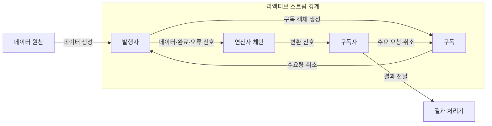
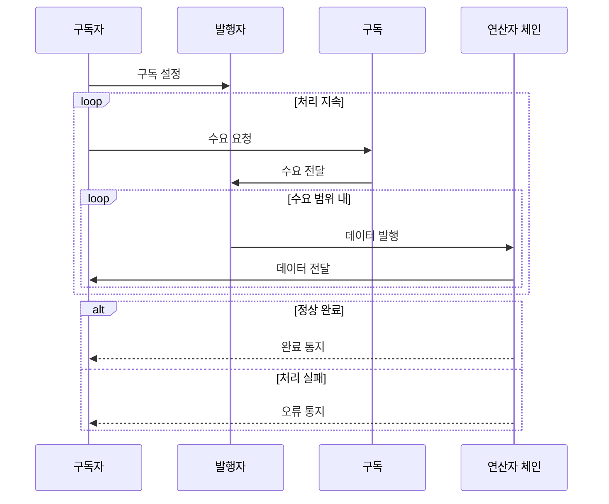

---
sidebar:
  order: 27
  label: "027. 리액티브 프로그래밍 (Reactive Programming)"
  badge:
    text: "미출제 · 50%"
    variant: note
title: "리액티브 프로그래밍 (Reactive Programming)"
date: "2026-07-25T00:35:28+09:00"
tags:
  - "notes-software"
weight: 27
extra:
  question_no: "027"
  source_status: "미출제"
  source_history: ""
  priority: 50
  priority_note: "리액티브는 비동기 흐름·역압 설계에 유효"
---

## 미리 알고가기

- **리액티브 프로그래밍(Reactive Programming)**: 데이터 흐름과 변화 전파를 선언적으로 구성
- **스트림(Stream)**: 시간 순서로 전달되는 데이터·이벤트 신호
- **리액티브 스트림(Reactive Streams)**: 비동기 스트림과 비차단 역압 규약
- **발행자(Publisher)**: 수요 범위 데이터 발행·완료 또는 오류 통지
- **구독자(Subscriber)**: 데이터·완료·오류 신호 수신
- **구독(Subscription)**: 수요 요청·취소를 발행자에 전달
- **연산자(Operator)**: 스트림 데이터를 변환·결합
- **수요량(Demand)**: 구독자가 처리 가능한 데이터 수
- **역압(Backpressure)**: 소비 속도에 맞춰 발행량 제한
- **선언형 프로그래밍(Declarative Programming)**: 실행 순서를 직접 지시하기보다 원하는 데이터 변환과 관계를 연산자 체인으로 표현하는 방식
- **비차단(Non-blocking)**: 결과를 기다리는 동안 실행 스레드를 멈추지 않고 준비된 다른 신호 처리를 이어 가는 성질
- **필터·결합·오류 복구(Filter·Combine·Error Recovery)**: 필터는 조건에 맞는 신호만 통과시키고 결합은 여러 스트림을 합치며 오류 복구는 실패 신호를 대체 흐름으로 전환하는 연산자
- **종단 신호(Terminal Signal)**: 스트림이 더는 데이터를 내보내지 않음을 알리는 완료 또는 오류 통지
- **명령형 동기 처리(Imperative Synchronous Processing)**: 호출 순서와 제어 흐름을 명령으로 작성하고 각 반환값을 기다린 뒤 다음 처리를 수행하는 방식
- **호출 스택(Call Stack)**: 동기 함수의 호출 위치·지역 변수·반환 주소를 쌓아 순차 실행 흐름을 유지하는 메모리 구조
- **리액티브 응용 프로그래밍 인터페이스(Reactive Application Programming Interface, Reactive API)**: ‘리액티브 에이피아이’로 읽고 Application Programming Interface의 머리글자 앞에 방식을 붙인 표기이며 수요량만큼 결과를 비동기 발행
- **시세 스트림(Market-price Stream)**: 시간에 따라 계속 도착하는 가격 이벤트 흐름으로서 연산자 체인에서 필터링하고 오류 복구를 적용함

## Ⅰ. 개요

- **정의/개념**: 데이터 흐름과 변화 전파를 스트림화
- **배경/필요성**: 생산 속도가 소비를 넘겨 비동기 역압 필요

### 쉽게 이해하기 (학습용)

- 받을 준비가 된 만큼 주문하고 데이터 변화가 생기면 계속 전달받는다

## Ⅱ. 특징

- 연산자 체인으로 데이터 변환·결합을 선언적으로 표현한다.
- 리액티브 스트림은 수요량으로 데이터 신호 수 제한한다.
- 긴 비동기 연산 체인은 실행 흐름·오류 추적이 복잡해진다.

### 쉽게 이해하기 (학습용)

- 가공 공정이 길어질수록 어느 단계에서 실패했는지 찾기 어려워진다

## Ⅲ. 아키텍처 및 구성요소

| 설계 요소 | 설명 |
|:---|:---|
| 발행자 | 수요 범위 데이터 발행·완료 또는 오류 통지 |
| 구독 | 수요 요청·취소를 발행자에 전달 |
| 연산자 체인 | 데이터 신호를 변환·필터링·결합 |
| 구독자 | 수요를 요청하고 스트림 신호 소비 |

> 요약: 수요는 역방향, 데이터·완료·오류 신호는 순방향 전달

### 쉽게 이해하기 (학습용)

- 생산자는 데이터를 보내고 가공 공정은 바꾸며 소비자는 받을 수량을 알린다

## Ⅳ. 원리 및 절차 흐름도

| 절차 | 설명 |
|:---|:---|
| 구독 설정 | 구독 요청 후 수요·취소 제어 객체 연결 |
| 수요 요청 | 구독자가 처리 가능한 데이터 수 요청 |
| 수요 전달 | 구독 객체가 발행자에 수요량 전달 |
| 데이터 발행 | 발행자가 수요 범위에서 데이터 발행 |
| 데이터 전달 | 연산자 체인이 변환 결과 전달 |
| 완료 통지 | 연산자 체인이 정상 종단 신호 전달 |
| 오류 통지 | 연산자 체인이 오류 종단 신호 전달 |

> 요약: 수요 범위에서 데이터 발행 후 완료 또는 오류로 종료

### 쉽게 이해하기 (학습용)

- 소비자가 수량을 주문하면 생산자는 그만큼 보내고 끝이나 오류를 알린다

## Ⅴ. 종류 및 비교

| 판단 기준 | 리액티브 프로그래밍 | 명령형 동기 처리 |
|:---|:---|:---|
| 핵심 특징 | 스트림·신호·역압 | 명령·반환값·호출 스택 |
| 적용 기준 | 비동기 연속 이벤트 처리 | 단순 순차 업무 처리 |
| 주요 위험 | 흐름·오류 추적 복잡성 | 대기 스레드·큐 누적 |

> 요약: 리액티브는 신호 전파, 동기는 호출 순서 중심

### 쉽게 이해하기 (학습용)

- 리액티브는 신호가 흐르고 동기는 요청한 순서대로 결과를 기다린다

## Ⅵ. 실무 사례

1. 리액티브 API는 수요량으로 데이터베이스 결과 발행 제한
2. 시세 스트림은 연산자로 필터·오류 복구 조합

### 쉽게 이해하기 (학습용)

- API는 소비자가 요청한 수만큼 데이터베이스 결과를 흘려보낸다.
- 시세 흐름은 가공 중 오류를 같은 연산자 체인에서 복구한다.

## Ⅶ. 결론

- 연속 이벤트·속도 차·오류 전파 요구로 리액티브 모델 선택

### 쉽게 이해하기 (학습용)

- 이벤트가 계속 오고 속도가 다르면 신호와 역압 규칙을 먼저 정한다
