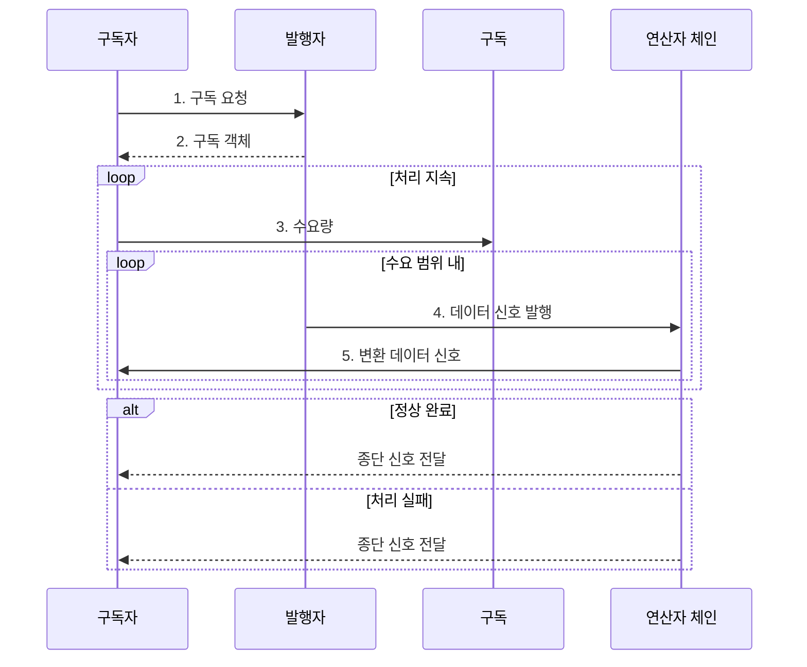

---
sidebar:
  order: 27
  label: "027. 리액티브 프로그래밍 (Reactive Programming)"
  badge:
    text: "미출제 • 50%"
    variant: note
title: "리액티브 프로그래밍 (Reactive Programming)"
date: "2026-08-05T00:59:02+09:00"
tags:
  - "notes-software"
weight: 27
extra:
  question_no: "027"
  source_status: "미출"
  source_history: ""
  priority: 50
  priority_note: "리액티브는 비동기 흐름•역압 설계에 유효"
---

## Ⅰ. 개요

<details>
<summary>핵심 용어</summary>

- **리액티브 프로그래밍(Reactive Programming)**: 데이터 흐름과 변화를 스트림 신호로 전파하도록 선언하는 프로그래밍 모델이다.
- **스트림(Stream)**: 시간 순서에 따라 전달되는 데이터와 이벤트 신호의 흐름이다.

</details>

- 정의/개념: 데이터 흐름과 변화를 **스트림 신호로 전파**하는 선언형 프로그래밍 모델
- 배경/필요성: 소비 속도보다 빠른 무제한 생산은 **버퍼•지연 누적**

#### 한줄 요약

- 받을 준비가 된 만큼 주문하고 데이터 변화가 생기면 계속 전달받는다.

## Ⅱ. 특징

<details>
<summary>핵심 용어</summary>

- **연산자 체인(Operator Chain)**: 스트림 데이터를 변환•필터링•결합하는 연산을 선언 순서로 연결한 구조다.
- **리액티브 스트림(Reactive Streams)**: 비동기 스트림에서 비차단 역압을 주고받는 표준 규약이다.
- **종단 신호(Terminal Signal)**: 스트림이 더는 데이터를 내보내지 않음을 알리는 완료 또는 오류 통지다.

</details>

- **연산자 체인** 을 통한 데이터 변환•결합의 선언적 표현
- **리액티브 스트림 수요량** 에 따른 데이터 신호 수 제한
- 완료•오류를 **종단 신호** 로 통합한 비동기 생명주기

#### 한줄 요약

- 주문서가 허용한 수만큼 재료가 가공 공정을 흐르고, 공정 끝의 완료표나 오류표가 전체 스트림을 닫는다.

## Ⅲ. 구조 및 구성요소

<details>
<summary>핵심 용어</summary>

- **발행자(Publisher)**: 구독자가 요청한 수요 범위에서 데이터와 종단 신호를 내보내는 주체다.
- **구독(Subscription)**: 수요 요청과 취소를 구독자에서 발행자로 전달하는 통로다.
- **구독자(Subscriber)**: 데이터•완료•오류 신호를 받고 처리 가능한 수량을 요청하는 주체다.

</details>

```text
+--------------------------- 리액티브 스트림 ---------------------------+
|                                                                       |
|  [발행자] ---------------- [연산자 체인] ---------------- [구독자]    |
|      |                                                        |       |
|      |                                                        |       |
|      +---------------------- [구독] ---------------------------+       |
|                                                                       |
+-----------------------------------------------------------------------+
```

선의 의미: 발행자와 연산자 체인 및 구독자의 선은 데이터•종단 신호 전달 관계, 발행자와 구독자를 잇는 구독의 선은 수요 요청•취소를 전달하는 제어 관계를 뜻한다.

| 구성요소 | 책임 |
|:---|:---|
| 발행자 | 수요 범위의 **데이터•종단 신호** 발행 |
| 구독 | **수요 요청•취소** 전달 |
| 연산자 체인 | 데이터 **변환•필터링•결합** |
| 구독자 | **수요량 요청•스트림 신호** 소비 |

#### 한줄 요약

- 생산자, 주문서, 가공 공정, 소비자로 구성된다.

## Ⅳ. 흐름도

<details>
<summary>핵심 용어</summary>

- **수요량(Demand)**: 구독자가 현재 처리할 수 있다고 발행자에게 요청한 데이터 신호 개수다.
- **데이터 신호**: 발행자가 수요 범위 안에서 연산자와 구독자에게 전달하는 값이다.

</details>



**동작 원리**

1. **구독 요청**: 구독자가 발행자에 스트림 수신 의사 전달
2. **구독 객체**: 발행자가 수요 요청•취소 통로 제공
3. **수요량**: 구독자가 처리 가능한 신호 개수 지정
4. **데이터 신호 발행**: 발행자가 요청 한도를 넘지 않게 신호 생성
5. **변환 데이터 신호**: 연산자 체인의 가공 결과를 구독자가 소비

#### 한줄 요약

- 소비자가 수량을 주문하면 생산자는 그만큼 보내고 끝이나 오류를 알린다.

## Ⅴ. 종류 및 비교

<details>
<summary>핵심 용어</summary>

- **역압(Backpressure)**: 소비 속도에 맞춰 발행량을 제한해 버퍼 누적을 막는 제어다.
- **명령형 동기 처리(Imperative Synchronous Processing)**: 호출 순서와 제어 흐름을 직접 작성하고 반환을 기다린 뒤 다음 처리를 수행하는 방식이다.
- **호출 스택(Call Stack)**: 동기 함수의 호출 위치•지역 변수•반환 주소를 쌓아 순차 흐름을 유지하는 메모리 구조다.

</details>

| 처리 모델 | 리액티브 프로그래밍 | 명령형 동기 처리 |
|:---|:---|:---|
| 적용 기준 | 비동기 **연속 이벤트** 처리 | 단순한 **순차 업무** 처리 |
| 핵심 특징 | **스트림 신호•역압** 기반 수요 제어 | **호출 스택** 기반 순차 반환 |
| 한계 | 비동기 **흐름•오류 추적** 복잡성 | 대기 **스레드•큐 누적** |

> 요약: 리액티브는 신호 전파, 동기는 호출 순서 중심

#### 한줄 요약

- 리액티브는 신호가 흐르고 동기는 요청한 순서대로 결과를 기다린다.

## Ⅵ. 실무 고려사항 및 대책

<details>
<summary>핵심 용어</summary>

- **버퍼 상한(Buffer Limit)**: 생산된 신호를 임시 보관할 수 있는 최대 개수다.
- **실행 스케줄러(Execution Scheduler)**: 리액티브 연산을 실행할 스레드나 작업 풀을 선택하는 구성요소다.
- **상관 식별자(Correlation Identifier)**: 여러 비동기 단계를 거치는 하나의 요청 흐름을 연결해 추적하는 값이다.
- **지수 백오프(Exponential Backoff)**: 재시도 간격을 지수적으로 늘리는 방식이다.
- **무작위 지연(Jitter)**: 재시도 시점에 무작위 시간을 더하는 방식이다.
- **수요 묶음(Demand Batch)**: 구독자가 한 번에 요청할 신호 수다.
- **초과 정책(Overflow Policy)**: 버퍼 한도를 넘은 신호의 처리 규칙이다.
- **스케줄러 격리(Scheduler Isolation)**: 차단 I/O나 긴 계산을 별도 유한 작업 풀로 보내 다른 스트림의 실행 스레드를 보호하는 방식이다.
- **오류 문맥(Error Context)**: 실패한 연산자•입력•요청 식별값을 함께 기록해 비동기 오류의 발생 지점을 잇는 정보다.
- **재시도 상한(Retry Limit)**: 실패한 작업의 재실행 횟수에 둔 한도다.
- **멱등성(Idempotency)**: 같은 요청을 반복해도 결과가 달라지지 않는 성질이다.

</details>

| 문제 | 대책 | 효과 |
|:---|:---|:---|
| 무제한 수요•버퍼로 **메모리•꼬리 지연** 증가 | **수요 묶음•버퍼 상한•초과 정책** 명시 | 소비 속도에 맞춘 **역압** 확보 |
| 차단 I/O•긴 계산이 **리액티브 스레드 점유** | 유한 작업 풀•**실행 스케줄러 격리** | 다른 스트림의 **처리 정체** 방지 |
| 긴 연산자 체인에서 오류 원인이 **변환•소실** | **상관 식별자•오류 문맥•종단 신호** 감시 | 연산자별 **실패 지점 추적** |
| 무제한 재시도로 하위 시스템 **과부하 증폭** | **재시도 상한•지수 백오프•멱등성** 적용 | 동시 **재시도 폭주** 방지 |

#### 한줄 요약

- 주문량만큼만 신호를 보내고 대기함이 차면 생산을 멈추며, 막힌 공정은 별도 작업대로 옮긴다.

## Ⅶ. 결론

<details>
<summary>핵심 용어</summary>

- **생산 속도(Production Rate)**: 발행자가 단위 시간에 내보내는 신호 수다.
- **소비 속도(Consumption Rate)**: 구독자가 단위 시간에 처리하는 신호 수다.
- **동기 처리**: 한 호출의 반환을 기다린 뒤 다음 작업을 시작하는 순차 실행 방식이다.

</details>

- 생산•소비 속도 차가 크면 **리액티브 스트림**, 단순 순차 업무는 **동기 처리** 선택

#### 한줄 요약

- 이벤트가 계속 오고 속도가 다르면 신호와 역압 규칙을 먼저 정한다.
