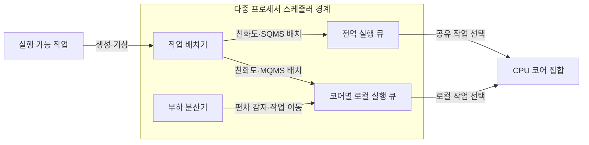
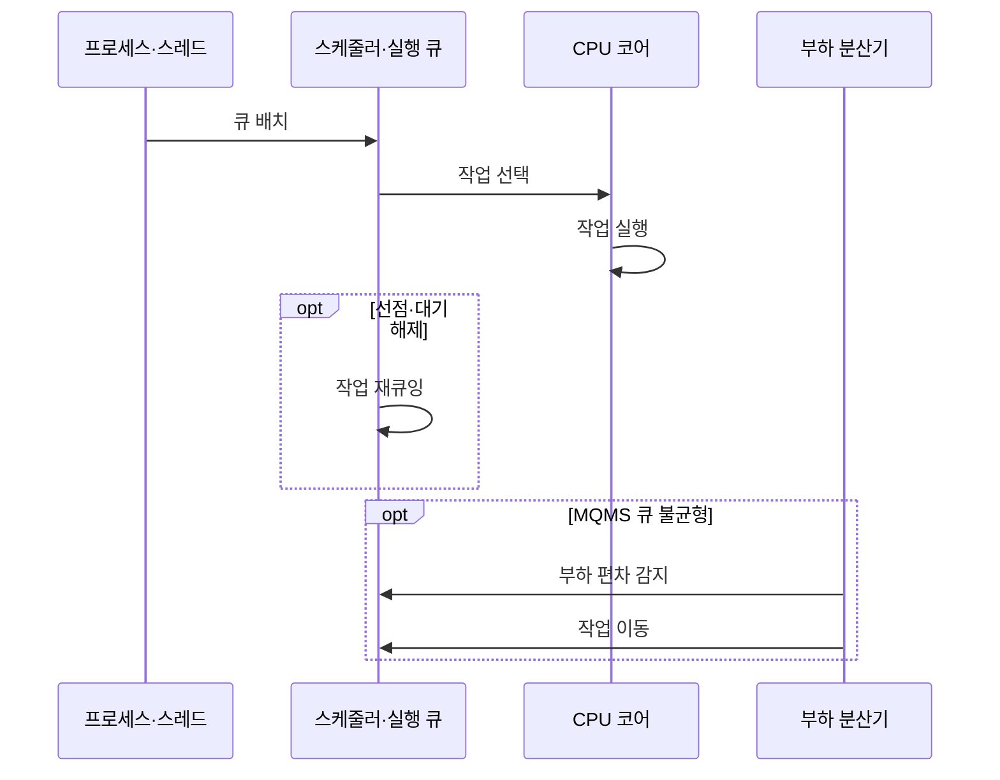

---
sidebar:
  order: 28
  label: "028. 다중 프로세서 스케줄링 — SQMS·MQMS (Multiprocessor Scheduling SQMS MQMS)"
  badge:
    text: "기출 · 50%"
    variant: note
title: "다중 프로세서 스케줄링 — SQMS·MQMS (Multiprocessor Scheduling SQMS MQMS)"
date: "2026-07-27T23:59:59+09:00"
tags:
  - "notes-software"
weight: 28
extra:
  question_no: "028"
  source_status: "기출"
  source_history: "129회"
  priority: 50
  priority_note: "129회 기출, 다중 큐·부하분산 스케줄링"
---

## 미리 알고가기

- **단일 큐 다중 프로세서 스케줄링(Single Queue Multiprocessor Scheduling, SQMS)**: ‘에스큐엠에스’로 읽고 영문 머리글자를 딴 표기이며 모든 코어가 전역 실행 큐를 공유
- **다중 큐 다중 프로세서 스케줄링(Multi-Queue Multiprocessor Scheduling, MQMS)**: ‘엠큐엠에스’로 읽고 영문 머리글자를 딴 표기이며 코어별 로컬 실행 큐를 사용
- **실행 큐(Run Queue)**: 실행 가능한 작업을 대기시키는 스케줄러 큐
- **부하 분산(Load Balancing)**: 코어별 실행 부하 편차를 줄이는 작업 이동
- **작업 훔치기(Work Stealing)**: 유휴 코어가 바쁜 코어 큐의 작업을 가져오는 방식
- **밀기 이동(Push Migration)**: 바쁜 코어의 작업을 덜 바쁜 큐로 이동
- **CPU 친화도(CPU Affinity)**: ‘시피유 친화도’로 읽고 Central Processing Unit의 머리글자를 딴 표기이며 작업이 실행할 수 있거나 선호하는 코어 집합
- **캐시 지역성(Cache Locality)**: 같은 코어의 캐시 데이터를 재사용하는 성질
- **대칭형 다중처리(Symmetric Multiprocessing, SMP)**: ‘에스엠피’로 읽고 Symmetric Multiprocessing의 머리글자를 딴 표기이며 여러 동등 프로세서가 메모리와 운영체제를 공유
- **중앙처리장치(Central Processing Unit, CPU) 코어**: ‘시피유 코어’로 읽고 Central Processing Unit의 머리글자를 딴 표기이며 독립 명령 흐름을 실행하는 처리 단위
- **전역·로컬 실행 큐(Global·Local Run Queue)**: 전역 큐는 모든 코어가 공유하고 로컬 큐는 특정 코어가 주로 소비해 경합과 캐시 이동을 줄임
- **스케줄러(Scheduler)**: 실행 가능 작업을 큐에 배치하고 우선순위·할당량에 따라 코어에서 실행할 대상을 선택하는 운영체제 구성요소
- **재큐잉(Requeueing)**: 선점되거나 대기에서 깨어난 미완료 작업을 실행 큐에 다시 삽입하는 동작
- **캐시 라인 경합(Cache-line Contention)**: 여러 코어가 같은 캐시 블록의 큐 상태를 갱신해 일관성 트래픽과 대기가 늘어나는 현상
- **병렬 런타임(Parallel Runtime)**: 병렬 작업 생성·큐 배치·동기화를 관리하며 유휴 코어가 다른 큐에서 작업을 훔치게 하는 실행 환경
- **유휴 코어(Idle Core)**: 실행할 로컬 작업이 없어 쉬고 있는 처리 코어로서 작업 훔치기의 요청 주체

## Ⅰ. 개요

- **정의/개념**: 복수 CPU 코어에 **준비 작업을 배치·이동**하는 정책
- **기존 한계**: 단일 큐 구조는 **전역 경합·로컬 부하 편차**를 함께 최소화하기 곤란

### 쉽게 이해하기 (학습용)

- 한 대기 줄을 함께 쓸지 코어별 줄을 두고 일감을 옮길지 정하는 문제다

## Ⅱ. 특징

- SQMS는 작업을 자연 분산하지만 전역 큐 경합 발생한다.
- MQMS는 경합·캐시 손실을 줄이지만 로컬 큐 편차 발생한다.
- 밀기 이동·작업 훔치기는 편차 감소 대신 이동 비용 발생한다.

### 쉽게 이해하기 (학습용)

- 공동 줄은 일감이 고르게 빠지지만 붐비고, 개별 줄은 빠르지만 길이가 달라질 수 있다

## Ⅲ. 아키텍처 및 구성요소

| 설계 요소 | 설명 |
|:---|:---|
| 작업 배치기 | 친화도·큐 구조에 따라 작업 배치 |
| 전역 실행 큐 | SQMS의 모든 실행 가능 작업을 공동 보관 |
| 코어별 로컬 실행 큐 | MQMS의 코어별 실행 가능 작업 보관 |
| 부하 분산기 | 로컬 큐 편차 감지·밀기·훔치기 수행 |

> 요약: 친화도 기반 큐 배치와 부하 분산으로 코어 활용 제어

### 쉽게 이해하기 (학습용)

- 배치기는 캐시가 남은 코어의 줄을 우선하고 분산기는 긴 줄의 일감을 옮긴다

## Ⅳ. 원리 및 절차 흐름도

| 절차 | 설명 |
|:---|:---|
| 큐 배치 | 생성·기상 작업을 전역·선호 코어 큐에 삽입 |
| 작업 선택 | 유휴·선점 시 실행 큐에서 대상 선택 |
| 작업 실행 | 코어가 시간 할당량·우선순위에 따라 실행 |
| 작업 재큐잉 | 선점·대기 해제 작업을 실행 큐에 재삽입 |
| 부하 편차 감지 | MQMS 로컬 큐 길이·실행 부하 차이 확인 |
| 작업 이동 | 밀기·훔치기로 다른 코어 큐에 작업 이동 |

> 요약: 작업 배치·실행·재큐잉 후 MQMS 편차를 이동으로 조정

### 쉽게 이해하기 (학습용)

- 코어는 줄에서 작업을 실행하고, 개별 줄 차이가 커지면 일감을 서로 옮긴다

## Ⅴ. 종류 및 비교

| 다중 프로세서 큐 | SQMS | MQMS |
|:---|:---|:---|
| 적용 기준 | 소수 코어·**낮은 큐 경합** | 다수 코어·**지역성 중심 작업** |
| 핵심 특징 | 전역 큐·**자연 부하 분산** | 로컬 큐·**밀기·훔치기** |
| 한계 | 전역 락·**캐시 라인 경합** | 큐 편차·**작업 이동 비용** |

> 요약: SQMS는 균형, MQMS는 지역성을 우선

### 쉽게 이해하기 (학습용)

- SQMS는 공동 줄을, MQMS는 개별 줄의 캐시 이점을 선택한다.

## Ⅵ. 실무 사례

1. 소수 코어 SMP는 **SQMS**로 부하 균형 단순화
2. 병렬 런타임은 **MQMS·작업 훔치기**로 유휴 코어 감소

### 쉽게 이해하기 (학습용)

- 소수 코어는 공동 줄로 별도 이동 없이 남은 일을 나눠 갖는다
- 병렬 런타임은 빈 코어가 바쁜 코어의 작업을 가져와 놀지 않게 한다

## Ⅶ. 결론

- **코어 수·큐 경합·친화도·이동 비용**으로 큐 구조 선택

### 쉽게 이해하기 (학습용)

- 공동 줄의 경합과 개별 줄의 편차 중 더 큰 비용을 줄이는 방식을 선택한다
