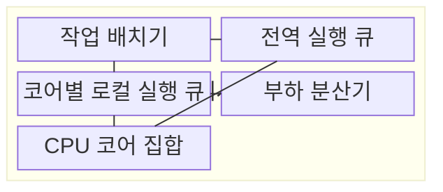
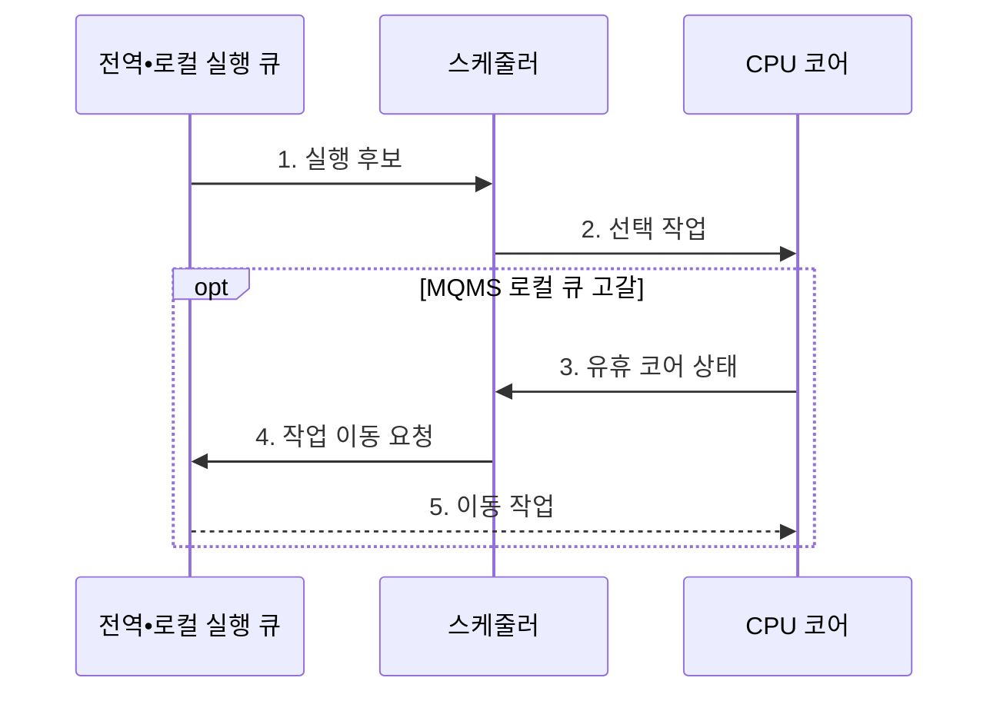

---
sidebar:
  order: 28
  label: "028. 다중 프로세서 스케줄링: SQMS•MQMS (Multiprocessor Scheduling SQMS MQMS)"
  badge:
    text: "기출 • 50%"
    variant: note
title: "다중 프로세서 스케줄링: SQMS•MQMS (Multiprocessor Scheduling SQMS MQMS)"
date: "2026-08-03T08:48:47+09:00"
tags:
  - "notes-software"
weight: 28
extra:
  question_no: "028"
  source_status: "기출"
  source_history: "129회"
  priority: 50
  priority_note: "129회 기출, 다중 큐•부하분산 스케줄링"
---

## Ⅰ. 개요

핵심 용어

- **다중 프로세서 스케줄링(Multiprocessor Scheduling)**: 복수 CPU 코어에 실행 가능한 작업을 배치하고 필요하면 이동하는 운영체제 정책이다.
- **실행 큐(Run Queue)**: 실행 가능한 프로세스나 스레드를 대기시키는 스케줄러 큐다.

- 정의/개념: 복수 CPU 코어에 **준비 작업을 배치•이동**하는 운영체제 스케줄링 정책
- 배경/필요성: 전역 큐는 코어 증가 시 **잠금 경합**, 로컬 큐는 부하 편차 증가

#### 한줄 요약

- 한 대기 줄을 함께 쓸지 코어별 줄을 두고 일감을 옮길지 정하는 문제다.

## Ⅱ. 특징

핵심 용어

- **단일 큐 다중 프로세서 스케줄링(Single Queue Multiprocessor Scheduling, SQMS)**: 모든 코어가 하나의 전역 실행 큐를 공유하는 방식이다.
- **다중 큐 다중 프로세서 스케줄링(Multi-Queue Multiprocessor Scheduling, MQMS)**: 코어별 로컬 실행 큐를 두는 방식이다.
- **캐시 지역성(Cache Locality)**: 작업이 같은 코어의 캐시 데이터를 다시 사용해 메모리 접근을 줄이는 성질이다.
- **밀기 이동•작업 훔치기(Push Migration•Work Stealing)**: 바쁜 큐가 작업을 유휴 코어로 보내거나 유휴 코어가 다른 큐에서 작업을 가져오는 부하 분산 방식이다.

- **SQMS 전역 큐** 의 작업 자연 분산과 경합 증가
- **MQMS 로컬 큐** 로 경합 감소•**캐시 지역성** 향상, 부하 편차 증가
- **밀기 이동•작업 훔치기** 의 편차 감소와 이동 비용

#### 한줄 요약

- 공동 줄은 일감이 고르게 빠지지만 붐비고, 개별 줄은 빠르지만 길이가 달라질 수 있다.

## Ⅲ. 구조 및 구성요소

핵심 용어

- **중앙처리장치(Central Processing Unit, CPU) 친화도**: 작업이 실행할 수 있거나 우선 배정되는 CPU 코어 범위다.
- **부하 분산(Load Balancing)**: 코어별 실행 큐 길이와 처리 부하의 편차를 줄이는 작업 이동이다.
- **작업 배치기•부하 분산기**: 작업 배치기는 초기 코어와 큐를 정하고, 부하 분산기는 실행 중인 큐 편차를 감지해 작업을 옮긴다.

| 구성요소 | 책임 |
|:---|:---|
| 작업 배치기 | **CPU 친화도•큐 구조** 에 따라 작업 배치 |
| 전역 실행 큐 | SQMS의 **실행 가능 작업** 공동 보관 |
| 코어별 로컬 실행 큐 | MQMS 작업을 **코어별 보관** |
| 부하 분산기 | **큐 편차 감지•작업 이동** |
| CPU 코어 집합 | 스케줄러가 선택한 **작업 실행** |

#### 한줄 요약

- 배치 담당자와 공동•개별 줄, 균형 담당자, 코어로 구성된다.

## Ⅳ. 흐름도

핵심 용어

- **작업 훔치기(Work Stealing)**: 유휴 코어가 바쁜 코어의 로컬 큐에서 작업을 가져오는 방식이다.
- **유휴 코어(Idle Core)**: 실행할 로컬 작업이 없어 쉬며 작업 훔치기를 요청하는 처리 코어다.

**동작 원리**

1. **실행 후보**: 실행 큐가 우선순위•친화도에 맞는 작업 제공
2. **선택 작업**: 스케줄러가 실행 대상을 CPU 코어에 배정
3. **유휴 코어 상태**: 로컬 큐 고갈을 부하 분산기에 통지
4. **작업 이동 요청**: 다른 로컬 큐에서 훔칠 작업 탐색
5. **이동 작업**: 바쁜 큐의 작업을 유휴 코어로 이전

#### 한줄 요약

- 코어는 줄에서 작업을 실행하고, 개별 줄 차이가 커지면 일감을 서로 옮긴다.

## Ⅴ. 종류 및 비교

핵심 용어

- **전역 실행 큐(Global Run Queue)**: 모든 CPU 코어가 공동으로 작업을 가져가는 SQMS 대기열이다.
- **로컬 실행 큐(Local Run Queue)**: 특정 CPU 코어가 주로 소비해 경합과 캐시 이동을 줄이는 MQMS 대기열이다.
- **캐시 라인 경합(Cache-line Contention)**: 여러 코어가 같은 큐 상태를 갱신해 일관성 트래픽과 대기가 늘어나는 현상이다.

| 다중 프로세서 큐 | SQMS | MQMS |
|:---|:---|:---|
| 적용 기준 | 소수 코어•**낮은 큐 경합** | 다수 코어•**지역성 중심 작업** |
| 핵심 특징 | 전역 큐•**자연 부하 분산** | 로컬 큐•**밀기•훔치기** |
| 한계 | 전역 락•**캐시 라인 경합** | 큐 편차•**작업 이동 비용** |

> 요약: **SQMS** 는 자연 부하 분산, **MQMS** 는 캐시 지역성 우선

#### 한줄 요약

- SQMS는 공동 줄을, MQMS는 개별 줄의 캐시 이점을 선택한다.

## Ⅵ. 실무 고려사항 및 대책

핵심 용어

- **비균일 메모리 접근(Non-Uniform Memory Access, NUMA)**: 메모리가 연결된 프로세서 노드에 따라 접근 시간이 달라지는 구조다.
- **작업 이동 비용(Migration Cost)**: 작업을 다른 코어로 옮길 때 캐시 재적재•큐 갱신•동기화에 드는 시간이다.
- **공정성(Fairness)**: 특정 작업이 실행 기회를 계속 잃지 않도록 처리 시간을 배분하는 성질이다.
- **기아(Starvation)**: 특정 작업이 계속 후순위로 밀려 실행 기회를 얻지 못하는 현상이다.
- **작업 일괄 인출(Batch Dequeue)**: 한 번의 전역 큐 잠금으로 여러 작업을 가져와 코어별 큐에 나누는 방식이다.
- **이동 임계값(Migration Threshold)**: 큐 길이나 부하 차이가 어느 수준을 넘을 때 작업 이동을 시작할지 정한 기준이다.
- **메모리 위치(Memory Placement)**: 작업 데이터가 어느 NUMA 노드의 물리 메모리에 배치되는지를 나타내는 상태다.
- **꼬리 지연(Tail Latency)**: 작업 지연 분포에서 가장 느린 일부 작업이 기다린 시간이다.

| 문제 | 대책 | 효과 |
|:---|:---|:---|
| SQMS 전역 큐의 잠금•**캐시 라인 경합** 증가 | 대기시간 계측•작업 일괄 인출•**MQMS 전환** | 전역 큐의 **잠금 병목** 완화 |
| MQMS 로컬 큐 편차로 일부 **코어 유휴** | **밀기•작업 훔치기** 임계값과 부하 재평가 | 코어별 **이용률 편차** 감소 |
| 잦은 작업 이동으로 **캐시•NUMA 지역성** 손실 | **CPU 친화도•메모리 위치•이동 비용** 반영 | 캐시와 로컬 메모리의 **데이터 재사용** 유지 |
| 평균 부하가 같아도 특정 작업이 **장기 대기** | 작업별 **꼬리 지연•공정성** 감시 | 숨은 작업 **기아** 방지 |

#### 한줄 요약

- 소수 코어는 공동 줄로 별도 이동 없이 남은 일을 나눠 갖는다.

## Ⅶ. 결론

핵심 용어

- **큐 경합**: 여러 코어가 같은 실행 큐의 잠금과 캐시 라인을 동시에 갱신하며 기다리는 현상이다.
- **지역성 우선**: 작업을 기존 코어와 메모리 가까이에 유지해 캐시 재사용을 높이는 선택 기준이다.

- 소수 코어•낮은 경합은 **SQMS**, 다수 코어•지역성 우선은 **MQMS** 선택

#### 한줄 요약

- 공동 줄의 경합과 개별 줄의 편차 중 더 큰 비용을 줄이는 방식을 선택한다.
