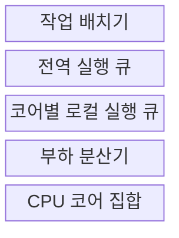
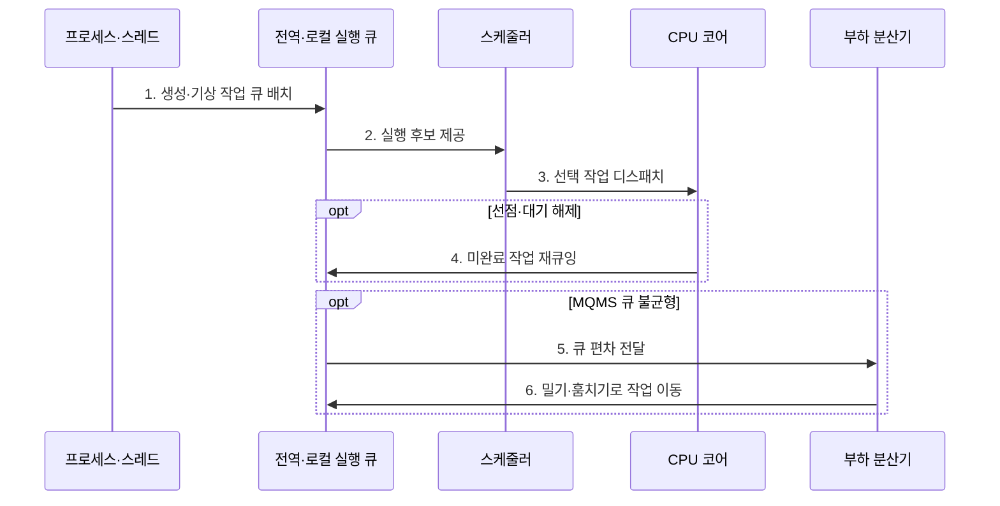

---
sidebar:
  order: 28
  label: "028. 다중 프로세서 스케줄링: SQMS·MQMS (Multiprocessor Scheduling SQMS MQMS)"
  badge:
    text: "기출 · 50%"
    variant: note
title: "다중 프로세서 스케줄링: SQMS·MQMS (Multiprocessor Scheduling SQMS MQMS)"
date: "2026-07-27T23:59:59+09:00"
tags:
  - "notes-software"
weight: 28
extra:
  question_no: "028"
  source_status: "기출"
  source_history: "129회"
  priority: 50
  priority_note: "129회 기출, 다중 큐·부하분산 스케줄링"
---

## 미리 알고가기

- **단일 큐 다중 프로세서 스케줄링(Single Queue Multiprocessor Scheduling, SQMS)**: 모든 코어가 하나의 전역 실행 큐를 공유하는 스케줄링 방식
- **다중 큐 다중 프로세서 스케줄링(Multi-Queue Multiprocessor Scheduling, MQMS)**: 코어별 로컬 실행 큐를 사용하는 스케줄링 방식
- **실행 큐(Run Queue)**: 실행 가능한 작업을 대기시키는 스케줄러 큐
- **부하 분산(Load Balancing)**: 코어별 실행 부하 편차를 줄이는 작업 이동
- **작업 훔치기(Work Stealing)**: 유휴 코어가 바쁜 코어 큐의 작업을 가져오는 방식
- **밀기 이동(Push Migration)**: 바쁜 코어의 작업을 덜 바쁜 큐로 이동
- **CPU 친화도(CPU Affinity)**: 작업이 실행할 수 있거나 우선 배정되는 프로세서 코어의 범위
- **캐시 지역성(Cache Locality)**: 같은 코어의 캐시 데이터를 재사용하는 성질
- **대칭형 다중처리(Symmetric Multiprocessing, SMP)**: 여러 동등한 프로세서가 메모리와 운영체제를 공유하는 처리 구조
- **중앙처리장치(Central Processing Unit, CPU) 코어**: 독립된 명령 흐름을 실행하는 처리 단위
- **전역·로컬 실행 큐(Global·Local Run Queue)**: 전역 큐는 모든 코어가 공유하고 로컬 큐는 특정 코어가 주로 소비해 경합과 캐시 이동을 줄이다.
- **스케줄러(Scheduler)**: 실행 가능 작업을 큐에 배치하고 우선순위·할당량에 따라 코어에서 실행할 대상을 선택하는 운영체제 구성요소
- **재큐잉(Requeueing)**: 선점되거나 대기에서 깨어난 미완료 작업을 실행 큐에 다시 삽입하는 동작
- **캐시 라인 경합(Cache-line Contention)**: 여러 코어가 같은 캐시 블록의 큐 상태를 갱신해 일관성 트래픽과 대기가 늘어나는 현상
- **병렬 런타임(Parallel Runtime)**: 병렬 작업 생성·큐 배치·동기화를 관리하며 유휴 코어가 다른 큐에서 작업을 훔치게 하는 실행 환경
- **유휴 코어(Idle Core)**: 실행할 로컬 작업이 없어 쉬고 있는 처리 코어로서 작업 훔치기의 요청 주체
- **비균일 메모리 접근(Non-uniform Memory Access, NUMA)**: 어느 프로세서에 연결된 메모리인지에 따라 접근 시간이 달라지는 구조
- **작업 이동 비용(Migration Cost)**: 작업을 다른 코어로 옮길 때 캐시 재적재·큐 갱신·동기화에 추가로 드는 시간
- **공정성(Fairness)**: 특정 작업이나 코어 큐가 실행 기회를 계속 잃지 않도록 처리 시간을 배분하는 성질
- **꼬리 지연(Tail Latency)**: 작업 대기시간 분포에서 가장 오래 기다린 일부 작업의 지연

## Ⅰ. 개요

- 정의/개념: 복수 CPU 코어에 **준비 작업을 배치·이동**하는 정책
- 배경/필요성: **전역 경합·로컬 부하 편차**의 동시 통제

### 쉽게 이해하기 (학습용)

- 한 대기 줄을 함께 쓸지 코어별 줄을 두고 일감을 옮길지 정하는 문제다.

## Ⅱ. 특징

- SQMS는 작업을 자연 분산하지만 전역 큐 경합 발생
- MQMS는 경합·캐시 손실을 줄이지만 로컬 큐 편차 발생
- 밀기 이동·작업 훔치기는 편차 감소 대신 이동 비용 발생

### 쉽게 이해하기 (학습용)

- 공동 줄은 일감이 고르게 빠지지만 붐비고, 개별 줄은 빠르지만 길이가 달라질 수 있다.

## Ⅲ. 구조 및 구성요소

| 구성요소 | 책임 |
|:---|:---|
| 작업 배치기 | 친화도·큐 구조에 따라 작업 배치 |
| 전역 실행 큐 | SQMS 실행 가능 작업 공동 보관 |
| 코어별 로컬 실행 큐 | MQMS 작업을 코어별 보관 |
| 부하 분산기 | 큐 편차 감지·작업 이동 |
| CPU 코어 집합 | 선택된 작업 실행 |

### 쉽게 이해하기 (학습용)

- 배치 담당자와 공동·개별 줄, 균형 담당자, 코어로 구성된다.

## Ⅳ. 흐름도

**동작 원리**

- **1. 생성·기상 작업 큐 배치**: 전역 또는 선호 로컬 큐 선택
- **2. 실행 후보 제공**: 우선순위·친화도에 맞는 작업 선별
- **3. 선택 작업 디스패치**: 스케줄러가 CPU 코어에 배정
- **4. 미완료 작업 재큐잉**: 선점된 작업을 큐에 다시 등록
- **5. 큐 편차 전달**: MQMS가 큐 길이·실행 부하 보고
- **6. 밀기·훔치기로 작업 이동**: 로컬 큐 간 작업 재배치

### 쉽게 이해하기 (학습용)

- 코어는 줄에서 작업을 실행하고, 개별 줄 차이가 커지면 일감을 서로 옮긴다.

## Ⅴ. 종류 및 비교

| 다중 프로세서 큐 | SQMS | MQMS |
|:---|:---|:---|
| 적용 기준 | 소수 코어·**낮은 큐 경합** | 다수 코어·**지역성 중심 작업** |
| 핵심 특징 | 전역 큐·**자연 부하 분산** | 로컬 큐·**밀기·훔치기** |
| 한계 | 전역 락·**캐시 라인 경합** | 큐 편차·**작업 이동 비용** |

> 요약: SQMS는 균형, MQMS는 지역성을 우선

### 쉽게 이해하기 (학습용)

- SQMS는 공동 줄을, MQMS는 개별 줄의 캐시 이점을 선택한다.

## Ⅵ. 실무 고려사항 및 대책

| 고려사항 | 대책 | 효과 |
|:---|:---|:---|
| SQMS 전역 큐 잠금·캐시 라인 경합 증가 | 큐 대기시간 계측·묶음 인출·코어 수에 따른 MQMS 전환 | 전역 병목 완화 |
| MQMS 로컬 큐 편차로 일부 코어 유휴 | 밀기·훔치기 임계값과 주기적 부하 재평가 | 코어 이용률 균형 |
| 잦은 작업 이동으로 캐시·NUMA 지역성 손실 | CPU 친화도·메모리 위치·작업 이동 비용 반영 | 데이터 재사용 유지 |
| 평균 부하만 맞추고 특정 작업 장기 대기 | 작업별 대기시간·꼬리 지연·공정성 감시 | 숨은 기아 방지 |

### 적용 사례

- 소수 코어 SMP는 SQMS의 전역 큐로 별도 작업 이동 없이 준비 작업을 자연스럽게 분산

### 쉽게 이해하기 (학습용)

- 소수 코어는 공동 줄로 별도 이동 없이 남은 일을 나눠 갖는다.

## Ⅶ. 결론

- **큐 경합·지역성**으로 SQMS와 MQMS를 선택

### 쉽게 이해하기 (학습용)

- 공동 줄의 경합과 개별 줄의 편차 중 더 큰 비용을 줄이는 방식을 선택한다.
