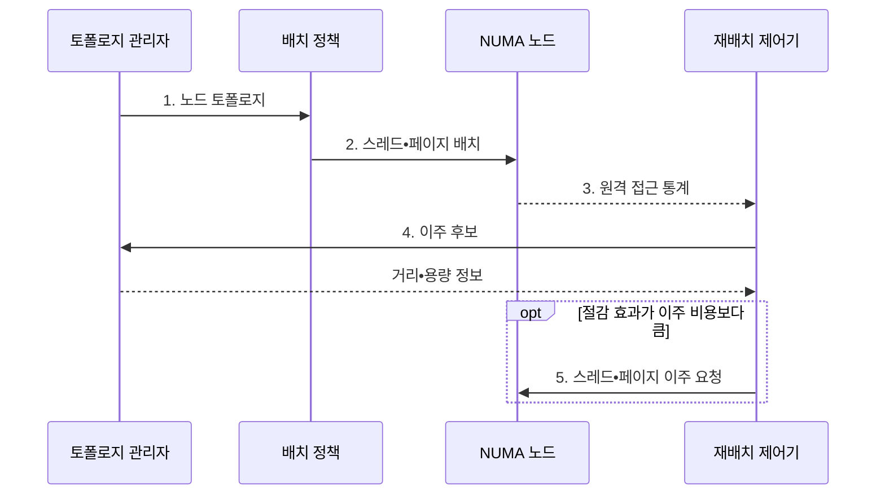

---
sidebar:
  order: 29
  label: "029. NUMA 인지 스케줄링 (NUMA-aware Scheduling)"
  badge:
    text: "미출제 • 50%"
    variant: note
title: "NUMA 인지 스케줄링 (NUMA-aware Scheduling)"
date: "2026-08-03T08:48:47+09:00"
tags:
  - "notes-software"
weight: 29
extra:
  question_no: "029"
  source_status: "미출"
  source_history: ""
  priority: 50
  priority_note: "NUMA 지역성 기반 스레드 배치 가치"
---

## Ⅰ. 개요

핵심 용어

- **비균일 메모리 접근(Non-Uniform Memory Access, NUMA)**: CPU 노드와 메모리의 위치 관계에 따라 접근 시간이 달라지는 구조다.
- **원격 메모리(Remote Memory)**: CPU가 인터커넥트를 거쳐 다른 NUMA 노드에서 접근하는 메모리다.

- 정의/개념: NUMA 토폴로지에 따라 스레드와 페이지를 공동 배치하는 운영체제 **스케줄링 기법**
- 배경/필요성: CPU 부하만 고려하면 스레드•페이지가 분리돼 **원격 접근 지연** 증가

#### 한줄 요약

- 작업자와 자주 쓰는 자료를 같은 층에 두어 층간 이동을 줄이는 방식이다.

## Ⅱ. 특징

핵심 용어

- **퍼스트 터치(First-touch)**: 페이지를 처음 접근한 스레드의 NUMA 노드에 물리 메모리를 할당하는 정책이다.
- **중앙처리장치(Central Processing Unit, CPU) 친화도**: 스레드의 허용•선호 CPU 범위를 정하는 정책이다.
- **이주 비용**: 스레드나 페이지를 다른 노드로 옮길 때 복사•캐시 재적재에 드는 비용이다.

- **원격 접근 통제** 로 지연•대역폭 경합 감소
- **퍼스트 터치•친화도** 로 초기 지역성 확보
- **이주 비용 비교** 로 부하 균형과 지역성 조정

#### 한줄 요약

- 가까이 두면 빠르지만 자주 옮기면 자료 복사와 캐시 재준비 비용이 커진다.

## Ⅲ. 구조 및 구성요소

핵심 용어

- **토폴로지(Topology)**: CPU•메모리가 속한 NUMA 노드와 노드 사이 거리를 나타내는 연결 구조다.
- **메모리 바인딩(Memory Binding)**: 물리 페이지를 할당할 NUMA 노드의 범위를 제한하는 정책이다.
- **NUMA 노드(NUMA Node)**: CPU 코어와 해당 코어에서 가까운 로컬 메모리의 묶음이다.

| 구성요소 | 책임 |
|:---|:---|
| 토폴로지 관리자 | **노드 거리•CPU•메모리 용량** 파악 |
| 배치 정책 | **CPU 친화도•메모리 바인딩** 공동 결정 |
| 재배치 제어기 | **원격 접근 비용•이주 비용** 비교 |
| NUMA 노드 집합 | **CPU 코어•로컬 메모리** 제공 |

#### 한줄 요약

- 거리표 담당자와 작업•자료 공동 배치 담당자, 이사 담당자가 CPU와 로컬 메모리 묶음 주위에 배치된다.

## Ⅳ. 흐름도

핵심 용어

- **스레드 이주(Thread Migration)**: 실행 스레드를 다른 CPU 또는 NUMA 노드로 이동하는 동작이다.
- **페이지 이주(Page Migration)**: 물리 페이지를 다른 NUMA 노드로 복사해 이동하는 동작이다.
- **인터커넥트(Interconnect)**: NUMA 노드 사이의 원격 메모리 요청과 응답을 운반하는 연결망이다.

**동작 원리**

1. **노드 토폴로지**: CPU•메모리 거리와 노드별 용량 제공
2. **스레드•페이지 배치**: 친화도•퍼스트 터치•바인딩으로 공동 위치 결정
3. **원격 접근 통계**: 노드별 접근률•지연•대역폭 경합 관측
4. **이주 후보**: 원격 접근 절감량과 이동 비용을 비교할 대상 선정
5. **스레드•페이지 이주 요청**: 절감 효과가 큰 대상만 가까운 노드로 이동

#### 한줄 요약

- 처음에는 같은 층에 두고 왕래 비용이 이삿값보다 커질 때 위치를 바꾼다.

## Ⅴ. 종류 및 비교

핵심 용어

- **멀티소켓(Multi-socket)**: 둘 이상의 프로세서 소켓과 각 소켓의 로컬 메모리가 여러 NUMA 노드를 이루는 시스템이다.
- **NUMA 비인지 스케줄링**: 메모리 거리보다 CPU 부하와 우선순위를 중심으로 작업을 배치하는 방식이다.

| 스케줄링 방식 | NUMA 인지 | NUMA 비인지 |
|:---|:---|:---|
| 적용 기준 | **멀티소켓•메모리 집약** 작업 | **단일 소켓•낮은 메모리 비중** 작업 |
| 핵심 특징 | **토폴로지•원격 비용** 기반 배치 | **CPU 부하•우선순위** 기반 배치 |
| 한계 | 관측•스레드•페이지의 **이주 비용** | **원격 접근•인터커넥트 경합** 증가 |

> 요약: NUMA 인지는 CPU 부하와 메모리 거리를 함께 최적화

#### 한줄 요약

- 인지 방식은 자료 거리까지 보고, 비인지 방식은 빈 코어를 먼저 찾는다.

## Ⅵ. 실무 고려사항 및 대책

핵심 용어

- **메모리 대역폭(Memory Bandwidth)**: 단위 시간에 CPU와 메모리 사이에서 전송할 수 있는 데이터 양이다.
- **히스테리시스•재이주 대기시간(Hysteresis•Cooldown)**: 배치 기준에 여유 구간을 두고 재변경을 늦춰 반복 이주를 줄이는 제어다.
- **가상 중앙처리장치(Virtual Central Processing Unit, vCPU)**: 가상 머신에 제공되는 논리 CPU다.
- **가상 비균일 메모리 접근(Virtual Non-Uniform Memory Access, vNUMA)**: 가상 머신에 물리 NUMA와 대응하는 CPU•메모리 토폴로지를 노출하는 구조다.
- **병렬 초기화(Parallel Initialization)**: 여러 작업 스레드가 자신이 사용할 페이지를 각 노드에서 처음 접근해 메모리를 분산 배치하는 방식이다.
- **절감 임계값(Savings Threshold)**: 예상 원격 접근 감소가 이주 비용보다 얼마나 커야 재배치를 실행할지 정한 기준이다.
- **이주 진동(Migration Oscillation)**: 접근 패턴의 작은 변화에 따라 스레드나 페이지가 노드 사이를 반복 이동하는 현상이다.

| 문제 | 대책 | 효과 |
|:---|:---|:---|
| 단일 초기화 스레드의 퍼스트 터치로 **페이지 편중** | 작업 스레드별 **병렬 초기화•메모리 바인딩** | 초기 데이터의 **로컬 메모리 배치** |
| 강한 CPU 친화도로 특정 노드의 **부하 집중** | 노드별 **CPU•메모리 대역폭** 감시와 친화도 완화 | 데이터 지역성과 **부하 편차** 균형 |
| 접근 패턴 변화마다 스레드•페이지가 **반복 이주** | 절감 임계값•**히스테리시스•재이주 대기시간** 적용 | 이주 진동•**페이지 복사 비용** 감소 |
| vCPU와 가상 메모리가 다른 물리 노드에 **분리 배치** | **vNUMA 토폴로지** 노출과 CPU•메모리 공동 배치 | 가상 머신의 **원격 접근** 감소 |

#### 한줄 요약

- 작업자와 자주 읽는 자료를 같은 층에서 처음 만지게 하고, 이삿값보다 왕래비가 클 때만 함께 옮긴다.

## Ⅶ. 결론

핵심 용어

- **원격 접근 절감량**: 재배치로 줄일 수 있는 인터커넥트 경유 메모리 접근 비용이다.
- **공동 배치**: 자주 함께 쓰는 스레드와 페이지를 같은 NUMA 노드에 두는 방식이다.

- 원격 접근 절감량이 이주 비용보다 크면 **스레드•페이지 이주**, 아니면 **공동 배치 유지**

#### 한줄 요약

- 빈 코어만 찾지 말고 자료까지 가는 비용과 옮기는 비용을 함께 비교한다.
