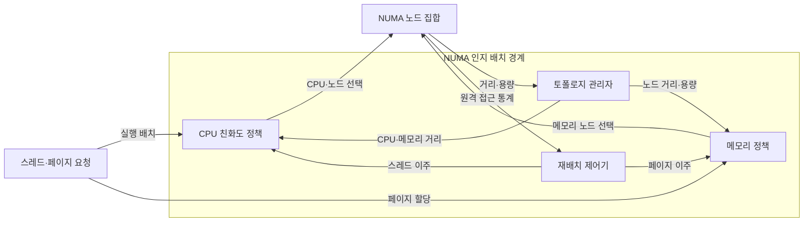
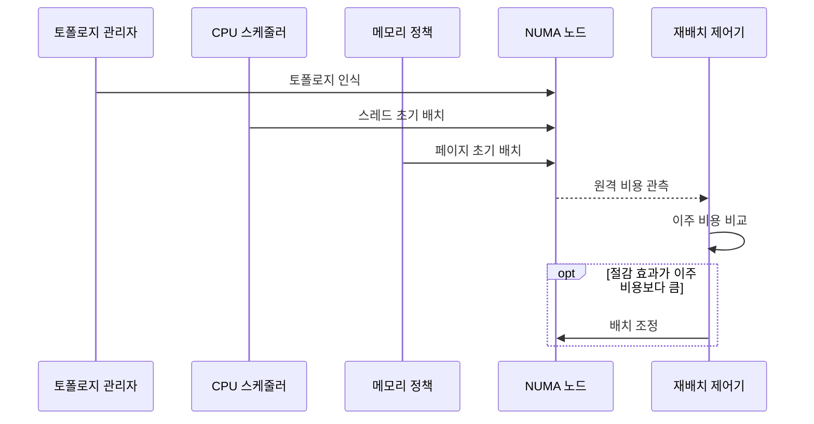

---
sidebar:
  order: 29
  label: "029. NUMA 인지 스케줄링 (NUMA-aware Scheduling)"
  badge:
    text: "미출제 · 50%"
    variant: note
title: "NUMA 인지 스케줄링 (NUMA-aware Scheduling)"
date: "2026-07-25T00:35:28+09:00"
tags:
  - "notes-software"
weight: 29
extra:
  question_no: "029"
  source_status: "미출제"
  source_history: ""
  priority: 50
  priority_note: "NUMA 지역성 기반 스레드 배치 가치"
---

## 미리 알고가기

- **비균일 메모리 접근(Non-Uniform Memory Access, NUMA)**: ‘누마’로 읽고 Non-Uniform Memory Access의 머리글자를 딴 표기이며 CPU 노드별 메모리 접근 비용이 다른 구조
- **NUMA 노드(NUMA Node)**: ‘누마 노드’로 읽고 구조명 NUMA에 자원 묶음 Node를 붙인 표기이며 CPU 코어와 가까운 로컬 메모리의 묶음
- **원격 메모리(Remote Memory)**: 인터커넥트를 거쳐 다른 노드가 접근하는 메모리
- **퍼스트 터치(First-touch)**: ‘퍼스트 터치’로 읽고 두 단어를 붙임표(-)로 잇는 운영체제 정책의 관례 표기이며 페이지를 처음 접근한 스레드의 NUMA 노드에 물리 메모리를 할당함
- **CPU 친화도(CPU Affinity)**: ‘시피유 친화도’로 읽고 Central Processing Unit의 머리글자를 딴 표기이며 스레드의 허용·선호 CPU 범위를 정하는 정책
- **메모리 바인딩(Memory Binding)**: 페이지 할당 노드 범위를 제한하는 정책
- **스레드 이주(Thread Migration)**: 실행 스레드를 다른 CPU·노드로 이동
- **페이지 이주(Page Migration)**: 물리 페이지를 다른 NUMA 노드로 복사·이동
- **중앙처리장치(Central Processing Unit, CPU)**: ‘시피유’로 읽고 Central Processing Unit의 머리글자를 딴 표기이며 스레드를 실행하는 코어와 로컬 메모리의 NUMA 노드 위치를 결정
- **토폴로지(Topology)**: CPU·메모리·장치가 어느 NUMA 노드에 속하고 노드 사이 거리가 얼마인지 나타내는 연결 구조
- **인터커넥트(Interconnect)**: NUMA 노드 사이에서 원격 메모리 요청과 응답을 운반하며 지연·대역폭 경합을 만드는 연결망
- **바인드·인터리브 정책(Bind·Interleave Policy)**: Bind는 지정 노드에만 페이지를 할당하고 Interleave는 여러 노드에 페이지를 순환 분산하는 메모리 배치 정책
- **멀티소켓(Multi-socket)**: 둘 이상의 프로세서 패키지 접속부를 사용해 각 소켓의 코어와 로컬 메모리가 NUMA 노드를 이루는 시스템
- **인메모리 데이터베이스(In-memory Database, In-memory DB)**: ‘인메모리 디비’로 읽고 Database를 DB로 줄인 표기이며 데이터와 작업 스레드를 같은 NUMA 노드에 배치해 원격 접근을 줄임
- **버퍼 풀(Buffer Pool)**: 데이터 페이지를 메모리에 보관해 반복 접근하며 작업 스레드와 같은 노드에 두면 지역성이 높아지는 영역
- **가상 중앙처리장치(Virtual Central Processing Unit, vCPU)**: ‘브이시피유’로 읽고 virtual의 소문자 v와 CPU를 결합한 표기이며 게스트 메모리와 같은 물리 NUMA 노드에 정렬

## Ⅰ. 개요

- **정의/개념**: 토폴로지에 따라 스레드·페이지를 배치
- **배경/필요성**: 원격 접근이 지연을 늘려 지역 배치 필요

### 쉽게 이해하기 (학습용)

- 작업자와 자주 쓰는 자료를 같은 층에 두어 층간 이동을 줄이는 방식이다

## Ⅱ. 특징

- 원격 접근은 인터커넥트 지연·대역폭 경합 유발한다.
- First-touch는 최초 접근 위치로 초기 페이지 배치한다.
- 친화도는 지역성을 높이지만 부하 균형을 제한한다.
- 스레드 이주는 캐시 손실, 페이지 이주는 복사 비용 발생한다.

### 쉽게 이해하기 (학습용)

- 가까이 두면 빠르지만 자주 옮기면 자료 복사와 캐시 재준비 비용이 커진다

## Ⅲ. 아키텍처 및 구성요소

| 설계 요소 | 설명 |
|:---|:---|
| 토폴로지 관리자 | CPU·메모리·장치의 노드 거리·용량 파악 |
| CPU 친화도 정책 | 스레드의 허용·선호 CPU·노드 범위 결정 |
| 메모리 정책 | First-touch·Bind·Interleave 할당 제어 |
| 재배치 제어기 | 원격 비용과 이주 비용으로 배치 조정 |

> 요약: 토폴로지 기반 초기 배치와 접근 통계 기반 재배치

### 쉽게 이해하기 (학습용)

- 지도에 따라 작업과 자료를 놓고, 층간 왕래가 많으면 더 싼 쪽을 옮긴다

## Ⅳ. 원리 및 절차 흐름도

| 절차 | 설명 |
|:---|:---|
| 토폴로지 인식 | CPU·메모리·장치의 노드 거리·용량 확인 |
| 스레드 초기 배치 | 친화도·부하·메모리 위치로 실행 노드 결정 |
| 페이지 초기 배치 | First-touch·바인딩으로 할당 노드 결정 |
| 원격 비용 관측 | 접근률·지연·링크 트래픽으로 비용 계산 |
| 이주 비용 비교 | 캐시 손실·페이지 복사 비용과 절감량 비교 |
| 배치 조정 | 비용이 적은 스레드 또는 페이지를 이주 |

> 요약: 원격 비용이 이주 비용보다 클 때 조정

### 쉽게 이해하기 (학습용)

- 처음에는 같은 층에 두고 왕래 비용이 이삿값보다 커질 때 위치를 바꾼다

## Ⅴ. 종류 및 비교

| 판단 기준 | NUMA 인지 | NUMA 비인지 |
|:---|:---|:---|
| 핵심 특징 | 토폴로지·원격 비용 기반 배치 | CPU 부하·우선순위 기반 배치 |
| 적용 기준 | 멀티소켓·메모리 집약 작업 | 단일 소켓·메모리 비중 낮은 작업 |
| 주요 위험 | 관측·스레드·페이지 이주 비용 | 원격 접근·링크 경합 증가 |

> 요약: NUMA 인지는 CPU 부하와 메모리 거리를 함께 최적화

### 쉽게 이해하기 (학습용)

- 인지 방식은 자료 거리까지 보고, 비인지 방식은 빈 코어를 먼저 찾는다.

## Ⅵ. 실무 사례

1. 인메모리 DB는 작업 스레드·버퍼 풀을 같은 노드에 배치
2. 가상화 호스트는 vCPU·게스트 메모리의 NUMA 노드 정렬

### 쉽게 이해하기 (학습용)

- 데이터베이스는 계산 작업과 자주 읽는 버퍼를 같은 노드에 둔다
- 가상화 호스트는 가상 CPU와 메모리의 물리 노드를 맞춰 원격 접근을 줄인다

## Ⅶ. 결론

- 부하·메모리 거리·원격 비용·이주 비용으로 배치 선택

### 쉽게 이해하기 (학습용)

- 빈 코어만 찾지 말고 자료까지 가는 비용과 옮기는 비용을 함께 비교한다
