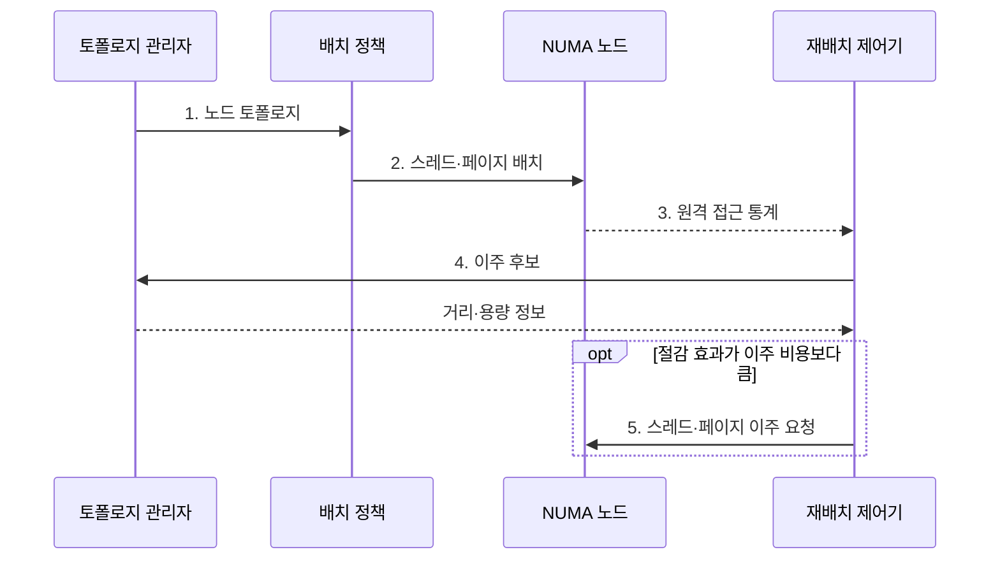

---
sidebar:
  order: 29
  label: "029. NUMA 인지 스케줄링 (NUMA-aware Scheduling)"
  badge:
    text: "미출제 · 50%"
    variant: note
title: "NUMA 인지 스케줄링 (NUMA-aware Scheduling)"
date: "2026-07-30T23:24:06+09:00"
tags:
  - "notes-software"
weight: 29
extra:
  question_no: "029"
  source_status: "미출"
  source_history: ""
  priority: 50
  priority_note: "NUMA 지역성 기반 스레드 배치 가치"
---

## 미리 알고가기

- **비균일 메모리 접근(Non-Uniform Memory Access, NUMA)**: CPU 노드별 메모리 접근 비용이 다른 구조
- **NUMA 노드(NUMA Node)**: CPU 코어와 가까운 로컬 메모리의 묶음
- **원격 메모리(Remote Memory)**: 인터커넥트를 거쳐 다른 노드가 접근하는 메모리
- **퍼스트 터치(First-touch)**: 페이지를 처음 접근한 스레드의 NUMA 노드에 물리 메모리를 할당하는 정책
- **CPU 친화도(CPU Affinity)**: 스레드의 허용·선호 CPU 범위를 정하는 정책
- **메모리 바인딩(Memory Binding)**: 페이지 할당 노드 범위를 제한하는 정책
- **스레드 이주(Thread Migration)**: 실행 스레드를 다른 CPU·노드로 이동
- **페이지 이주(Page Migration)**: 물리 페이지를 다른 NUMA 노드로 복사·이동
- **중앙처리장치(Central Processing Unit, CPU)**: 스레드를 실행하며 로컬 메모리의 NUMA 노드 위치를 결정하는 처리장치
- **토폴로지(Topology)**: CPU·메모리·장치가 어느 NUMA 노드에 속하고 노드 사이 거리가 얼마인지 나타내는 연결 구조
- **인터커넥트(Interconnect)**: NUMA 노드 사이에서 원격 메모리 요청과 응답을 운반하며 지연·대역폭 경합을 만드는 연결망
- **바인드·인터리브 정책(Bind·Interleave Policy)**: Bind는 지정 노드에만 페이지를 할당하고 Interleave는 여러 노드에 페이지를 순환 분산하는 메모리 배치 정책
- **멀티소켓(Multi-socket)**: 둘 이상의 프로세서 패키지 접속부를 사용해 각 소켓의 코어와 로컬 메모리가 NUMA 노드를 이루는 시스템
- **가상 중앙처리장치(Virtual Central Processing Unit, vCPU)**: 가상머신에 제공하는 논리 CPU로서 게스트 메모리와 같은 물리 NUMA 노드에 정렬할 수 있음
- **히스테리시스·대기시간(Hysteresis·Cooldown)**: 배치 변경 기준에 여유 구간을 두고 변경 후 일정 시간 재변경을 막아 반복 이주를 줄이는 제어
- **메모리 대역폭(Memory Bandwidth)**: 단위시간에 CPU와 메모리 사이에서 전송할 수 있는 데이터 양
- **가상 비균일 메모리 접근(Virtual Non-Uniform Memory Access, vNUMA)**: 가상 머신에 물리 NUMA와 대응하는 가상 CPU·메모리 토폴로지를 노출하는 구조

> **키워드:** NUMA 인지 스케줄링 (NUMA-aware Scheduling)

## Ⅰ. 개요

- 정의/개념: NUMA 토폴로지에 따라 스레드와 페이지를 공동 배치하는 운영체제 **스케줄링 기법**
- 배경/필요성: CPU 부하만 고려하면 스레드·페이지가 분리돼 **원격 접근 지연** 증가

### 쉽게 이해하기 (학습용)

- 작업자와 자주 쓰는 자료를 같은 층에 두어 층간 이동을 줄이는 방식이다.

## Ⅱ. 특징

- **원격 접근 통제**로 지연·대역폭 경합 감소
- **퍼스트 터치·친화도**로 초기 지역성 확보
- **이주 비용 비교**로 부하 균형과 지역성 조정

### 쉽게 이해하기 (학습용)

- 가까이 두면 빠르지만 자주 옮기면 자료 복사와 캐시 재준비 비용이 커진다.

## Ⅲ. 구조 및 구성요소

| 구성요소 | 책임 |
|:---|:---|
| 토폴로지 관리자 | **노드 거리·CPU·메모리 용량** 파악 |
| 배치 정책 | **CPU 친화도·메모리 바인딩** 공동 결정 |
| 재배치 제어기 | **원격 접근 비용·이주 비용** 비교 |
| NUMA 노드 집합 | **CPU 코어·로컬 메모리** 제공 |

### 쉽게 이해하기 (학습용)

- 거리표 담당자와 작업·자료 공동 배치 담당자, 이사 담당자가 CPU와 로컬 메모리 묶음 주위에 배치된다.

## Ⅳ. 흐름도

**동작 원리**

1. **노드 토폴로지**: CPU·메모리 거리와 노드별 용량 제공
2. **스레드·페이지 배치**: 친화도·퍼스트 터치·바인딩으로 공동 위치 결정
3. **원격 접근 통계**: 노드별 접근률·지연·대역폭 경합 관측
4. **이주 후보**: 원격 접근 절감량과 이동 비용을 비교할 대상 선정
5. **스레드·페이지 이주 요청**: 절감 효과가 큰 대상만 가까운 노드로 이동

### 쉽게 이해하기 (학습용)

- 처음에는 같은 층에 두고 왕래 비용이 이삿값보다 커질 때 위치를 바꾼다.

## Ⅴ. 종류 및 비교

| 스케줄링 방식 | NUMA 인지 | NUMA 비인지 |
|:---|:---|:---|
| 적용 기준 | **멀티소켓·메모리 집약** 작업 | **단일 소켓·낮은 메모리 비중** 작업 |
| 핵심 특징 | **토폴로지·원격 비용** 기반 배치 | **CPU 부하·우선순위** 기반 배치 |
| 한계 | 관측·스레드·페이지의 **이주 비용** | **원격 접근·인터커넥트 경합** 증가 |

> 요약: NUMA 인지는 CPU 부하와 메모리 거리를 함께 최적화

### 쉽게 이해하기 (학습용)

- 인지 방식은 자료 거리까지 보고, 비인지 방식은 빈 코어를 먼저 찾는다.

## Ⅵ. 실무 고려사항 및 대책

| 고려사항 | 대책 | 효과 |
|:---|:---|:---|
| 단일 초기화 스레드의 퍼스트 터치로 **페이지 편중** | 작업 스레드별 **병렬 초기화·메모리 바인딩** | 초기 데이터의 **로컬 메모리 배치** |
| 강한 CPU 친화도로 특정 노드의 **부하 집중** | 노드별 **CPU·메모리 대역폭** 감시와 친화도 완화 | 데이터 지역성과 **부하 편차** 균형 |
| 접근 패턴 변화마다 스레드·페이지가 **반복 이주** | 절감 임계값·**히스테리시스·재이주 대기시간** 적용 | 이주 진동·**페이지 복사 비용** 감소 |
| vCPU와 가상 메모리가 다른 물리 노드에 **분리 배치** | **vNUMA 토폴로지** 노출과 CPU·메모리 공동 배치 | 가상 머신의 **원격 접근** 감소 |

### 쉽게 이해하기 (학습용)

- 작업자와 자주 읽는 자료를 같은 층에서 처음 만지게 하고, 이삿값보다 왕래비가 클 때만 함께 옮긴다.

## Ⅶ. 결론

- 원격 접근 절감량이 이주 비용보다 크면 **스레드·페이지 이주**, 아니면 **공동 배치 유지**

### 쉽게 이해하기 (학습용)

- 빈 코어만 찾지 말고 자료까지 가는 비용과 옮기는 비용을 함께 비교한다.
