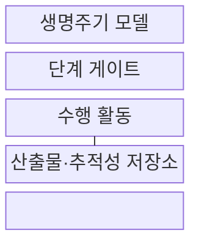
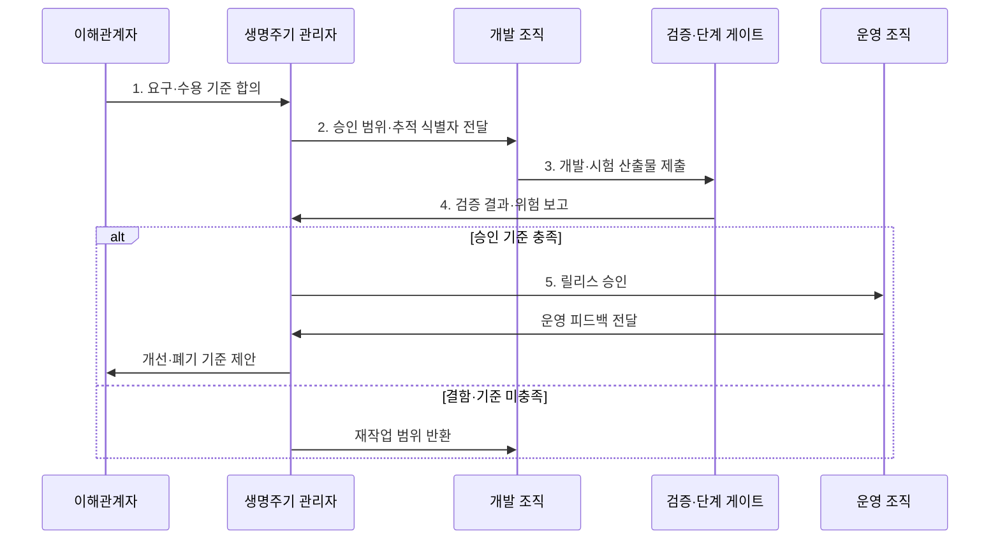

---
sidebar:
  order: 30
  label: "030. 소프트웨어 개발 생명주기 SDLC (Software Development Lifecycle)"
  badge:
    text: "미출제 · 50%"
    variant: note
title: "소프트웨어 개발 생명주기 SDLC (Software Development Lifecycle)"
date: "2026-07-30T18:00:00+09:00"
tags:
  - "notes-software"
weight: 30
extra:
  question_no: "030"
  source_status: "미출제"
  source_history: ""
  priority: 50
  priority_note: "개발 관리 기본, 방법론·DevOps 연결"
---

## 미리 알고가기

- **소프트웨어 개발 생명주기(Software Development Lifecycle, SDLC)**: 요구 식별부터 운영·폐기까지 개발 활동·산출물·승인을 관리하는 체계
- **산출물(Artifact)**: 단계 완료와 승인 근거를 담은 결과물
- **단계 게이트(Stage Gate)**: 다음 단계 진입을 허용하는 승인 기준
- **추적성(Traceability)**: 요구와 설계·코드·시험 결과 간 연결
- **피드백 루프(Feedback Loop)**: 운영 결과를 변경 요구로 환류
- **수용 기준(Acceptance Criteria)**: 요구가 충족됐다고 승인할 수 있는 검증 조건으로서 범위와 시험 결과를 연결한다.
- **기능·비기능 요구(Functional·Non-functional Requirement)**: 기능 요구는 시스템이 수행할 동작이고 비기능 요구는 성능·보안·가용성 같은 품질 조건
- **백로그(Backlog)**: 아직 구현하지 않은 요구·결함·개선 작업을 우선순위와 함께 보관하는 목록
- **데브옵스(Development and Operations, DevOps)**: 개발·운영 협업과 자동화로 소프트웨어 변경을 지속적으로 검증·배포하는 방식
- **자동화 파이프라인(Automation Pipeline)**: 코드 변경을 빌드·시험·배포 단계로 연속 처리하고 각 결과를 통제 증적으로 남기는 자동 흐름
- **서비스형 소프트웨어(Software as a Service, SaaS)**: 인터넷으로 응용 기능을 제공하는 서비스 모델
- **릴리스(Release)**: 검증된 소프트웨어 버전을 사용자나 운영 환경에 제공하는 배포 단위
- **폐기·이관(Decommissioning·Migration)**: 폐기는 서비스와 자원을 종료하고 이관은 보존할 데이터·기능을 다른 시스템으로 옮기는 생명주기 종료 활동
- **감사 증적(Audit Evidence)**: 요구·변경·시험·승인·배포가 정한 절차를 따랐음을 확인할 수 있는 기록
- **서비스 수준 목표(Service Level Objective, SLO)**: 응답시간·가용성 등 서비스 품질에 대해 달성하기로 정한 측정 목표
- **관측 데이터(Telemetry)**: 운영 상태를 파악하도록 수집한 로그·지표·추적 정보

## Ⅰ. 개요

- 정의/개념: 요구부터 폐기까지 **활동·산출물을 통제**하는 체계
- 배경/필요성: 단계별 결함과 변경에 따른 **재작업을 추적·통제**

### 쉽게 이해하기 (학습용)

- 시작부터 종료까지 결과물과 다음 단계 진입 조건을 정한다.

## Ⅱ. 특징

- **단계 게이트**로 진입·종료 조건 통제
- **요구 추적성**으로 변경 영향·검증 범위 연결
- **피드백 루프**로 운영 결과를 개선 요구에 반영

### 쉽게 이해하기 (학습용)

- 개발 결과와 운영 피드백을 연결해 종료까지 관리한다.

## Ⅲ. 구조 및 구성요소

| 구성요소 | 책임 |
|:---|:---|
| 생명주기 모델 | 단계 순서·반복·전이 규칙 정의 |
| 단계 게이트 | 진입·종료·승인 조건 통제 |
| 수행 활동 | 요구·설계·구현·검증·운영 수행 |
| 산출물·추적성 저장소 | 결과·요구 연결·승인 증적 보존 |

### 쉽게 이해하기 (학습용)

- 개발 지도, 검문소, 작업, 결과물 보관소로 구성된다.

## Ⅳ. 흐름도

**동작 원리**

- **1. 요구·수용 기준 합의**: 범위·우선순위 확정
- **2. 승인 범위·추적 식별자 전달**: 개발 기준 연결
- **3. 개발·시험 산출물 제출**: 요구 반영 결과 제공
- **4. 검증 결과·위험 보고**: 수용 기준과 잔여 위험 확인
- **5. 릴리스 승인**: 기준 충족 버전을 운영에 전달

### 쉽게 이해하기 (학습용)

- 만든 결과를 검증·운영하고 피드백이나 종료로 연결한다.

## Ⅴ. 종류 및 비교

| 비교 항목 | 단계 중심 SDLC | DevOps 연계 SDLC |
|:---|:---|:---|
| 적용 기준 | 규제·계약·감사 우선 사업 | 빈번한 변경·운영 피드백 우선 |
| 핵심 특징 | 단계 게이트·산출물 승인 | 자동화 파이프라인·연속 피드백 |
| 한계 | 긴 피드백·변경 비용 | 통제 증적 누락·운영 결합 |

> 요약: 감사 중심은 단계 통제, 변화 중심은 연속 피드백

### 쉽게 이해하기 (학습용)

- 승인이 중요하면 단계를, 변화가 잦으면 연속 흐름을 강화한다.

## Ⅵ. 실무 고려사항 및 대책

| 고려사항 | 대책 | 효과 |
|:---|:---|:---|
| 문서 작성에 치우쳐 실제 요구·코드·시험 연결 누락 | 도구로 추적 링크·시험 범위·변경 영향 자동 수집 | 살아 있는 추적성 확보 |
| 모든 변경에 같은 단계 게이트를 적용해 대기 증가 | 위험·규제 등급별 게이트와 자동 검증 병행 | 통제 강도·변경 속도 균형 |
| 자동 배포 과정에서 승인·감사 증적 누락 | 변경 불가 로그·역할 분리·승인 결과 자동 보존 | DevOps 통제 입증 |
| 운영 데이터가 개선 백로그로 연결되지 않음 | SLO·관측 데이터·사용자 영향으로 개선 우선순위 결정 | 피드백 루프 실효성 확보 |

### 적용 사례

- 금융시스템은 요구별 설계·코드·시험 결과와 승인자를 추적표로 연결해 변경 영향과 감사 근거를 기록

### 쉽게 이해하기 (학습용)

- 금융 개발은 요구마다 시험 결과와 승인자를 남긴다.

## Ⅶ. 결론

- **규제·변경 빈도**로 게이트와 피드백 강도를 결정

### 쉽게 이해하기 (학습용)

- 감사 강도와 변화 속도에 맞는 생명주기 흐름을 선택한다.
