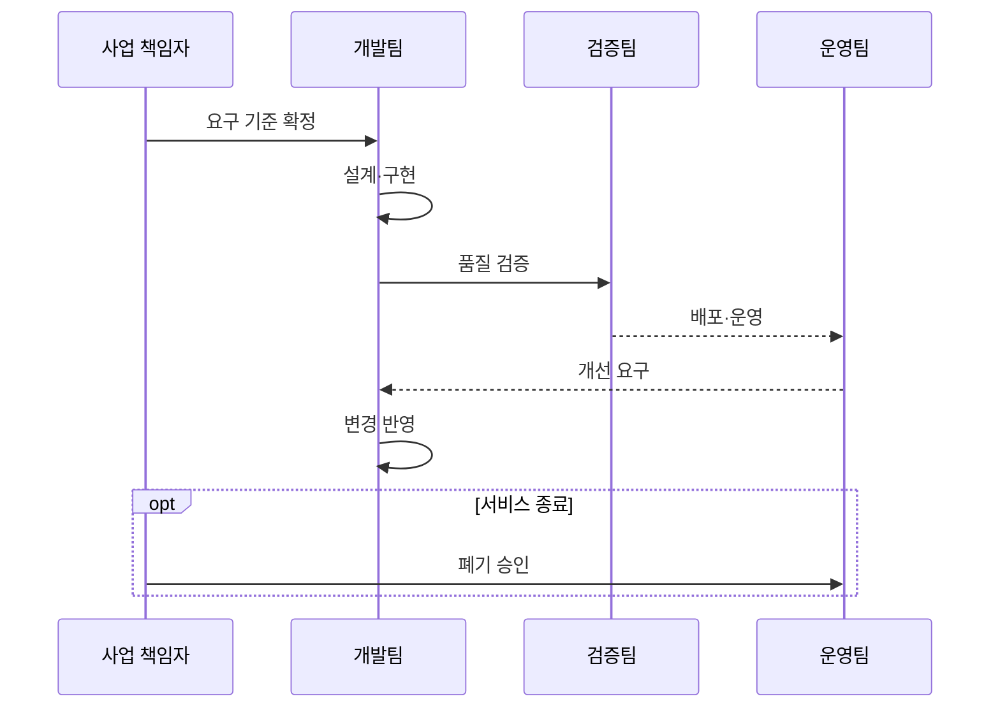

---
sidebar:
  order: 30
  label: "030. 소프트웨어 개발 생명주기 SDLC (Software Development Lifecycle)"
  badge:
    text: "미출제 · 50%"
    variant: note
title: "소프트웨어 개발 생명주기 SDLC (Software Development Lifecycle)"
date: "2026-07-25T00:35:28+09:00"
tags:
  - "notes-software"
weight: 30
extra:
  question_no: "030"
  source_status: "미출제"
  source_history: ""
  priority: 50
  priority_note: "개발 관리 기본, 방법론·DevOps 연결"
---

## 미리 알고가기

- **소프트웨어 개발 생명주기(Software Development Lifecycle, SDLC)**: 요구 식별부터 운영·폐기까지 개발 활동·산출물·승인을 관리하는 체계
- **산출물(Artifact)**: 단계 완료와 승인 근거를 담은 결과물
- **단계 게이트(Stage Gate)**: 다음 단계 진입을 허용하는 승인 기준
- **추적성(Traceability)**: 요구와 설계·코드·시험 결과 간 연결
- **피드백 루프(Feedback Loop)**: 운영 결과를 변경 요구로 환류
- **수용 기준(Acceptance Criteria)**: 요구가 충족됐다고 승인할 수 있는 검증 조건으로서 범위와 시험 결과를 연결함
- **기능·비기능 요구(Functional·Non-functional Requirement)**: 기능 요구는 시스템이 수행할 동작이고 비기능 요구는 성능·보안·가용성 같은 품질 조건
- **백로그(Backlog)**: 아직 구현하지 않은 요구·결함·개선 작업을 우선순위와 함께 보관하는 목록
- **데브옵스(Development and Operations, DevOps)**: 개발·운영 협업과 자동화로 소프트웨어 변경을 지속적으로 검증·배포하는 방식
- **자동화 파이프라인(Automation Pipeline)**: 코드 변경을 빌드·시험·배포 단계로 연속 처리하고 각 결과를 통제 증적으로 남기는 자동 흐름
- **서비스형 소프트웨어(Software as a Service, SaaS)**: ‘사스’로 읽고 Software as a Service의 핵심 머리글자를 조합한 표기이며 인터넷으로 응용 기능을 제공하는 서비스 모델
- **릴리스(Release)**: 검증된 소프트웨어 버전을 사용자나 운영 환경에 제공하는 배포 단위
- **폐기·이관(Decommissioning·Migration)**: 폐기는 서비스와 자원을 종료하고 이관은 보존할 데이터·기능을 다른 시스템으로 옮기는 생명주기 종료 활동

## Ⅰ. 개요

- 정의/개념: 요구부터 폐기까지 활동·산출물·통제를 연결하는 체계
- **배경/필요성**: 단계 결함이 재작업을 늘려 추적·승인 필요

### 쉽게 이해하기 (학습용)

- 시작부터 종료까지 결과물과 다음 단계 진입 조건을 정한다.

## Ⅱ. 특징

- 단계 산출물과 진입·종료 기준으로 진행 상태 가시화한다.
- 추적성으로 요구 변경의 영향과 검증 범위 연결한다.
- 개발 모델에 따라 순차·반복·점진 흐름 조정한다.

### 쉽게 이해하기 (학습용)

- 개발 결과와 운영 피드백을 연결해 종료까지 관리한다.

## Ⅲ. 아키텍처 및 구성요소

| 설계 요소 | 설명 |
|:---|:---|
| 생명주기 모델 | 단계의 순서·반복·전이 규칙 정의 |
| 관리 기준 | 일정·비용·품질·위험과 승인 조건 통제 |
| 수행 활동 | 요구·설계·구현·검증·운영 업무 묶음 |
| 산출물·추적성 | 단계 결과와 요구 간 연결 증적 유지 |

> 요약: 모델·기준·활동·산출물로 생명주기 통제

### 쉽게 이해하기 (학습용)

- 할 일과 통과 기준, 결과물의 연결 기록을 함께 관리한다.

## Ⅳ. 원리 및 절차 흐름도

| 절차 | 설명 |
|:---|:---|
| 요구 기준 확정 | 범위·수용 기준·우선순위 합의 |
| 설계·구현 | 요구를 구조·데이터·코드로 변환 |
| 품질 검증 | 수용 기준으로 기능·비기능 확인 |
| 배포·운영 | 승인 산출물을 배포해 서비스 관찰 |
| 개선 요구 | 운영 결과를 변경 백로그로 환류 |
| 변경 반영 | 영향 분석 후 다음 반복에 구현 |
| 폐기 승인 | 보존·이관·자원 해제 기준 확정 |

> 요약: 요구·검증을 거쳐 개선과 폐기까지 순환

### 쉽게 이해하기 (학습용)

- 만든 결과를 검증·운영하고 피드백이나 종료로 연결한다.

## Ⅴ. 종류 및 비교

| 판단 기준 | 단계 중심 SDLC | DevOps 연계 SDLC |
|:---|:---|:---|
| 핵심 특징 | 단계 게이트·산출물 승인 | 자동화 파이프라인·연속 피드백 |
| 적용 기준 | 규제·계약·감사 우선 사업 | 빈번한 변경·운영 피드백 우선 |
| 주요 위험 | 긴 피드백·변경 비용 | 통제 증적 누락·운영 결합 |

> 요약: 감사 중심은 단계 통제, 변화 중심은 연속 피드백

### 쉽게 이해하기 (학습용)

- 승인이 중요하면 단계를, 변화가 잦으면 연속 흐름을 강화한다.

## Ⅵ. 실무 사례

1. 금융시스템은 요구·시험 추적표와 승인 기록 유지

### 쉽게 이해하기 (학습용)

- 금융 개발은 요구마다 시험 결과와 승인자를 남긴다.

## Ⅶ. 결론

- 규제·변경 빈도에 맞춰 단계·산출물·피드백 통제 설계

### 쉽게 이해하기 (학습용)

- 감사 강도와 변화 속도에 맞는 생명주기 흐름을 선택한다.
