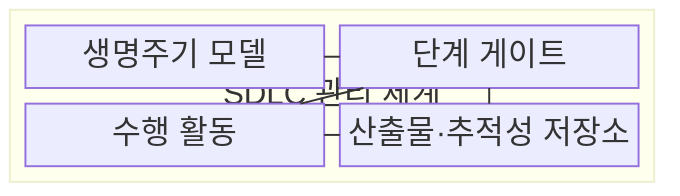
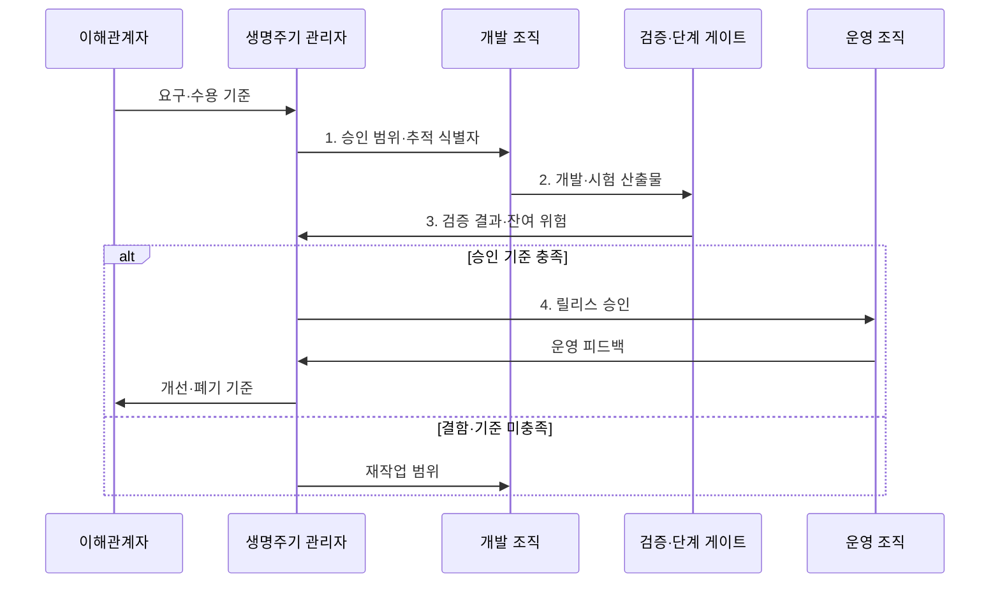

---
sidebar:
  order: 30
  label: "030. 소프트웨어 개발 생명주기 SDLC (Software Development Lifecycle)"
  badge:
    text: "미출제 · 50%"
    variant: note
title: "소프트웨어 개발 생명주기 SDLC (Software Development Lifecycle)"
date: "2026-07-30T23:24:56+09:00"
tags:
  - "notes-software"
weight: 30
extra:
  question_no: "030"
  source_status: "미출"
  source_history: ""
  priority: 50
  priority_note: "개발 관리 기본, 방법론·DevOps 연결"
---

## 미리 알고가기

- **소프트웨어 개발 생명주기(Software Development Lifecycle, SDLC)**: 요구 식별부터 운영·폐기까지 개발 활동·산출물·승인을 관리하는 체계
- **산출물(Artifact)**: 단계 완료와 승인 근거를 담은 결과물
- **단계 게이트(Stage Gate)**: 다음 단계 진입을 허용하는 승인 기준
- **추적성(Traceability)**: 요구와 설계·코드·시험 결과 간 연결
- **피드백 루프(Feedback Loop)**: 운영 결과를 변경 요구로 환류
- **수용 기준(Acceptance Criteria)**: 요구가 충족됐다고 승인할 수 있는 검증 조건으로서 범위와 시험 결과를 연결한다.
- **기능·비기능 요구(Functional·Non-functional Requirement)**: 기능 요구는 시스템이 수행할 동작이고 비기능 요구는 성능·보안·가용성 같은 품질 조건
- **백로그(Backlog)**: 아직 구현하지 않은 요구·결함·개선 작업을 우선순위와 함께 보관하는 목록
- **데브옵스(Development and Operations, DevOps)**: 개발·운영 협업과 자동화로 소프트웨어 변경을 지속적으로 검증·배포하는 방식
- **자동화 파이프라인(Automation Pipeline)**: 코드 변경을 빌드·시험·배포 단계로 연속 처리하고 각 결과를 통제 증적으로 남기는 자동 흐름
- **릴리스(Release)**: 검증된 소프트웨어 버전을 사용자나 운영 환경에 제공하는 배포 단위
- **폐기·이관(Decommissioning·Migration)**: 폐기는 서비스와 자원을 종료하고 이관은 보존할 데이터·기능을 다른 시스템으로 옮기는 생명주기 종료 활동
- **감사 증적(Audit Evidence)**: 요구·변경·시험·승인·배포가 정한 절차를 따랐음을 확인할 수 있는 기록
- **서비스 수준 목표(Service Level Objective, SLO)**: 응답시간·가용성 등 서비스 품질에 대해 달성하기로 정한 측정 목표
- **관측 데이터(Telemetry)**: 운영 상태를 파악하도록 수집한 로그·지표·추적 정보

## Ⅰ. 개요

- 정의/개념: 요구 식별부터 폐기까지 활동·산출물·승인을 통제하는 **SDLC 관리 체계**
- 배경/필요성: 산출물 연결이 없으면 변경 영향과 **재작업 범위 추적 불가**

### 쉽게 이해하기 (학습용)

- 시작부터 종료까지 결과물과 다음 단계 진입 조건을 정한다.

## Ⅱ. 특징

- **단계 게이트**로 진입·종료 조건 통제
- **요구 추적성**으로 변경 영향·검증 범위 연결
- **피드백 루프**로 운영 결과를 개선 요구에 반영

### 쉽게 이해하기 (학습용)

- 단계마다 검문소가 산출물을 확인하고 요구표의 연결선을 따라 운영 결과를 다음 개선 작업으로 돌려보낸다.

## Ⅲ. 구조 및 구성요소

| 구성요소 | 책임 |
|:---|:---|
| 생명주기 모델 | **단계 순서·반복·전이 규칙** 정의 |
| 단계 게이트 | **진입·종료·승인 조건** 통제 |
| 수행 활동 | **요구·설계·구현·검증·운영** 수행 |
| 산출물·추적성 저장소 | 결과·요구 연결과 **승인 증적** 보존 |

### 쉽게 이해하기 (학습용)

- 개발 지도, 검문소, 작업, 결과물 보관소로 구성된다.

## Ⅳ. 흐름도

**동작 원리**

1. **승인 범위·추적 식별자**: 요구와 개발·시험 항목의 연결 기준 설정
2. **개발·시험 산출물**: 승인 범위별 구현 결과와 검증 증적 제출
3. **검증 결과·잔여 위험**: 수용 기준 충족 여부와 재작업 범위 판정
4. **릴리스 승인**: 기준을 충족한 버전만 운영 환경에 전달

### 쉽게 이해하기 (학습용)

- 만든 결과를 검증·운영하고 피드백이나 종료로 연결한다.

## Ⅴ. 종류 및 비교

| 생명주기 운영 방식 | 단계 중심 SDLC | DevOps 연계 SDLC |
|:---|:---|:---|
| 적용 기준 | **규제·계약·감사** 우선 사업 | 빈번한 **변경·운영 피드백** 우선 |
| 핵심 특징 | **단계 게이트·산출물 승인** | **자동화 파이프라인·연속 피드백** |
| 한계 | 긴 **피드백 주기·변경 비용** | **통제 증적 누락·운영 결합도** 증가 |

> 요약: 감사 중심은 단계 통제, 변화 중심은 연속 피드백

### 쉽게 이해하기 (학습용)

- 승인이 중요하면 단계를, 변화가 잦으면 연속 흐름을 강화한다.

## Ⅵ. 실무 고려사항 및 대책

| 고려사항 | 대책 | 효과 |
|:---|:---|:---|
| 문서만 작성하고 요구·코드·시험의 **추적 링크 누락** | 요구·코드·시험 링크와 **변경 영향 자동 수집** | 변경별 **검증 범위 식별** |
| 모든 변경에 같은 단계 게이트를 적용해 **승인 대기 증가** | 위험·규제 등급별 **게이트·자동 검증** 적용 | 통제 강도별 **변경 대기시간** 절감 |
| 자동 배포에서 승인·**감사 증적 누락** | 수정 방지 감사 로그·**역할 분리·승인 보존** | DevOps의 **통제 이행 입증** |
| 운영 데이터가 개선 백로그로 **환류되지 않음** | **SLO·관측 데이터·사용자 영향**으로 우선순위 결정 | 운영 결과의 **피드백 루프** 연결 |

### 쉽게 이해하기 (학습용)

- 요구표의 각 줄을 코드·시험·승인표와 연결하고, 운영 계기판의 이상 신호는 다음 개선 목록의 순서로 되돌린다.

## Ⅶ. 결론

- 규제·감사 강도가 높으면 **단계 게이트**, 변경·운영 빈도가 높으면 **연속 피드백** 강화

### 쉽게 이해하기 (학습용)

- 감사 강도와 변화 속도에 맞는 생명주기 흐름을 선택한다.
