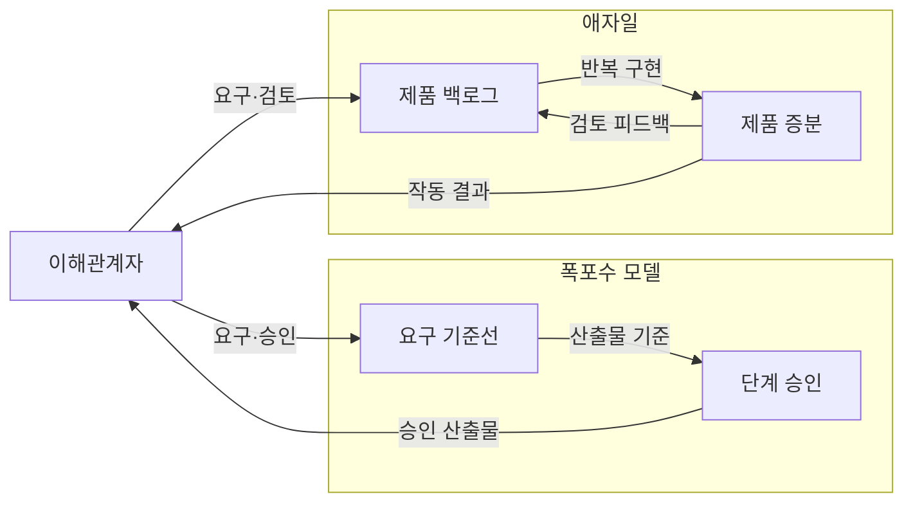
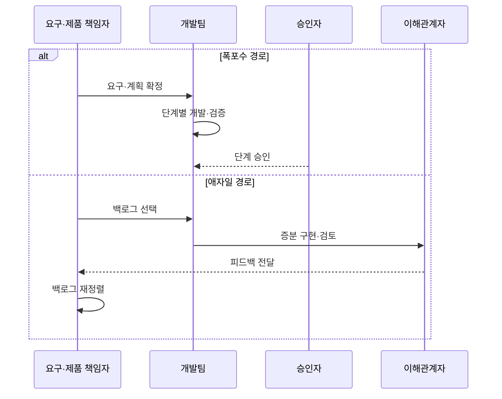

---
sidebar:
  order: 31
  label: "031. 폭포수 모델 vs 애자일 (Waterfall vs Agile)"
  badge:
    text: "미출제 · 30%"
    variant: note
title: "폭포수 모델 vs 애자일 (Waterfall vs Agile)"
date: "2026-07-25T00:35:00+09:00"
tags:
  - "notes-software"
weight: 31
extra:
  question_no: "031"
  source_status: "미출제"
  source_history: ""
  priority: 30
  priority_note: "미출제, 개발 생명주기 비교 기초"
---

## 미리 알고가기

- **폭포수 모델(Waterfall Model)**: 각 개발 단계의 산출물을 승인한 뒤 다음 단계로 이동하는 순차 개발 모델
- **애자일(Agile)**: 짧은 반복마다 제품 증분을 검토하고 피드백을 다음 작업에 반영하는 개발 방식
- **요구 기준선(Requirements Baseline)**: 승인된 요구의 변경 통제 기준
- **제품 백로그(Product Backlog)**: 제품에 필요한 요구와 작업을 가치와 위험에 따라 정렬한 단일 목록
- **제품 증분(Product Increment)**: 반복마다 통합해 검토 가능한 결과
- **소프트웨어 개발 생명주기(Software Development Lifecycle, SDLC)**: ‘에스디엘시’로 읽고 Software Development Lifecycle의 머리글자를 딴 표기이며 요구부터 운영까지 활동·산출물 흐름을 관리
- **이해관계자(Stakeholder)**: 제품의 요구·승인·사용 결과에 영향을 주거나 영향을 받으며 증분 검토에 피드백을 제공하는 사람이나 조직
- **제품 책임자(Product Owner)**: 제품 가치와 위험을 기준으로 백로그 순서를 정하고 반복에 반영할 요구를 선택하는 책임자
- **반복(Iteration)**: 짧은 기간에 요구 선택·구현·검토를 완료하고 피드백을 다음 주기에 반영하는 개발 주기
- **산출물·추적성(Artifact·Traceability)**: 산출물은 단계 결과이고 추적성은 요구를 설계·코드·시험·승인 기록과 연결해 변경 영향을 확인하게 하는 관계
- **항공 인증 개발(Aviation Certification Development)**: 안전 규정에 따라 단계별 산출물과 요구 추적표의 검토·승인 증적을 남겨야 하는 개발
- **모바일 서비스(Mobile Service)**: 사용자 반응과 요구 변화가 잦아 짧은 제품 증분의 피드백으로 다음 작업 순서를 바꾸는 서비스

## Ⅰ. 개요

- 정의/개념: 단계 승인형과 반복 증분형 개발 생명주기 비교
- **배경/필요성**: 요구·승인 주기가 달라 개발 모델 선택 필요

### 쉽게 이해하기 (학습용)

- 단계별 승인과 잦은 방향 조정 중 맞는 방식을 선택한다

## Ⅱ. 특징

- 폭포수는 단계 승인 중심, 늦은 오류는 재작업 확대한다.
- 애자일은 짧은 증분 검토로 요구 변경 조기 반영한다.

### 쉽게 이해하기 (학습용)

- 폭포수는 단계 문에서, 애자일은 짧은 주기에서 오류를 찾는다

## Ⅲ. 아키텍처 및 구성요소

| 설계 요소 | 설명 |
|:---|:---|
| 요구 기준선 | 단계별 범위와 산출물의 승인 기준 |
| 단계 승인 | 산출물 검토 후 다음 단계 진입 통제 |
| 제품 백로그 | 요구·작업을 가치와 위험에 따라 정렬 |
| 제품 증분 | 반복마다 통합해 검토 가능한 결과 |

> 요약: 폭포수는 기준선·승인, 애자일은 백로그·증분으로 통제

### 쉽게 이해하기 (학습용)

- 폭포수는 기준선과 승인, 애자일은 목록과 결과물로 움직인다

## Ⅳ. 원리 및 절차 흐름도

| 절차 | 설명 |
|:---|:---|
| 요구·계획 확정 | 요구와 단계별 산출물 승인 기준 확정 |
| 단계별 개발·검증 | 분석·설계·구현·시험 순차 수행 |
| 단계 승인 | 산출물 검토 후 다음 단계 진입 |
| 백로그 선택 | 가치·위험에 따라 반복 작업 선택 |
| 증분 구현·검토 | 작동 증분을 만들어 이해관계자와 검토 |
| 피드백 전달 | 이해관계자가 검토 의견 전달 |
| 백로그 재정렬 | 검토 의견으로 제품 백로그 재정렬 |

> 요약: 폭포수는 단계 승인, 애자일은 증분 피드백 반복

### 쉽게 이해하기 (학습용)

- 폭포수는 문을 지나고 애자일은 결과를 본 뒤 순서를 바꾼다

## Ⅴ. 종류 및 비교

| 판단 기준 | 폭포수 | 애자일 |
|:---|:---|:---|
| 핵심 특징 | 초기 계획·단계별 승인 | 반복 계획·증분 피드백 |
| 적용 기준 | 요구 안정·승인 증적 중요 | 변경·고객 피드백 빈번 |
| 주요 위험 | 늦은 오류·재작업 확대 | 범위 변동·장기 예측 저하 |

> 요약: 폭포수는 승인, 애자일은 반복 검토로 변경 통제

### 쉽게 이해하기 (학습용)

- 요구가 안정되면 승인, 변화가 잦으면 반복 피드백을 쓴다

## Ⅵ. 실무 사례

1. 항공 인증 개발은 단계 산출물·요구 추적표 승인
2. 모바일 서비스는 사용자 의견을 다음 반복에 반영

### 쉽게 이해하기 (학습용)

- 항공 개발은 단계마다 결과와 요구 연결 기록을 승인한다.
- 모바일 팀은 사용자 반응으로 다음 작업 순서를 바꾼다.

## Ⅶ. 결론

- 요구 안정성·승인 증적·피드백 주기에 따른 모델 선택

### 쉽게 이해하기 (학습용)

- 요구 변화와 승인 방식에 맞는 개발 흐름을 선택한다
