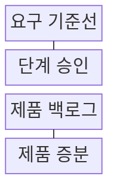
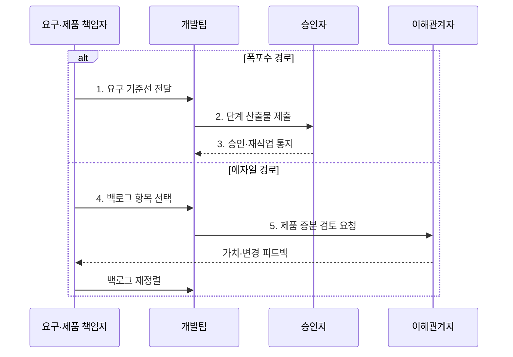

---
sidebar:
  order: 31
  label: "031. 폭포수 모델 vs 애자일 (Waterfall vs Agile)"
  badge:
    text: "미출제 · 30%"
    variant: note
title: "폭포수 모델 vs 애자일 (Waterfall vs Agile)"
date: "2026-07-30T18:00:00+09:00"
tags:
  - "notes-software"
weight: 31
extra:
  question_no: "031"
  source_status: "미출제"
  source_history: ""
  priority: 30
  priority_note: "미출제, 개발 생명주기 비교 기초"
---

## 미리 알고가기

- **폭포수 모델(Waterfall Model)**: 각 개발 단계의 산출물을 승인한 뒤 다음 단계로 이동하는 순차 개발 모델
- **애자일(Agile)**: 짧은 반복마다 제품 증분을 검토하고 피드백을 다음 작업에 반영하는 개발 방식
- **요구 기준선(Requirements Baseline)**: 승인된 요구의 변경 통제 기준
- **제품 백로그(Product Backlog)**: 제품에 필요한 요구와 작업을 가치와 위험에 따라 정렬한 단일 목록
- **제품 증분(Product Increment)**: 반복마다 통합해 검토 가능한 결과
- **소프트웨어 개발 생명주기(Software Development Lifecycle, SDLC)**: 요구분석부터 운영까지 개발 활동과 산출물의 흐름을 관리하는 체계
- **이해관계자(Stakeholder)**: 제품의 요구·승인·사용 결과에 영향을 주거나 영향을 받으며 증분 검토에 피드백을 제공하는 사람이나 조직
- **제품 책임자(Product Owner)**: 제품 가치와 위험을 기준으로 백로그 순서를 정하고 반복에 반영할 요구를 선택하는 책임자
- **반복(Iteration)**: 짧은 기간에 요구 선택·구현·검토를 완료하고 피드백을 다음 주기에 반영하는 개발 주기
- **산출물·추적성(Artifact·Traceability)**: 산출물은 단계 결과이고 추적성은 요구를 설계·코드·시험·승인 기록과 연결해 변경 영향을 확인하게 하는 관계
- **항공 인증 개발(Aviation Certification Development)**: 안전 규정에 따라 단계별 산출물과 요구 추적표의 검토·승인 증적을 남겨야 하는 개발
- **모바일 서비스(Mobile Service)**: 사용자 반응과 요구 변화가 잦아 짧은 제품 증분의 피드백으로 다음 작업 순서를 바꾸는 서비스
- **완료 정의(Definition of Done)**: 제품 증분이 구현·시험·문서·보안 등 필요한 품질 조건을 모두 충족했는지 판단하는 공통 기준
- **혼합형 생명주기(Hybrid Lifecycle)**: 전체 승인·계약은 단계형으로 관리하고 단계 안의 개발은 반복형으로 수행하는 방식
- **리드타임(Lead Time)**: 요구 제기부터 사용 가능한 결과 제공까지의 시간

## Ⅰ. 개요

- 정의/개념: **단계 승인형·반복 증분형** 개발 방식 비교
- 배경/필요성: 요구 안정성과 승인 주기에 맞는 **개발 모델 선택**

### 쉽게 이해하기 (학습용)

- 단계별 승인과 잦은 방향 조정 중 맞는 방식을 선택한다.

## Ⅱ. 특징

- **단계 승인 중심**으로 폭포수의 범위·증적 통제
- **증분 피드백 중심**으로 애자일의 변경 조기 반영
- **요구 안정성·승인 주기**로 모델 선택

### 쉽게 이해하기 (학습용)

- 폭포수는 단계 문에서, 애자일은 짧은 주기에서 오류를 찾는다.

## Ⅲ. 구조 및 구성요소

| 구성요소 | 책임 |
|:---|:---|
| 요구 기준선 | 폭포수 범위·산출물 기준 확정 |
| 단계 승인 | 다음 단계 진입 통제 |
| 제품 백로그 | 애자일 요구·작업 우선순위 관리 |
| 제품 증분 | 반복별 통합 결과 제공 |

### 쉽게 이해하기 (학습용)

- 폭포수는 기준선과 승인문, 애자일은 작업 목록과 증분을 쓴다.

## Ⅳ. 흐름도

**동작 원리**

- **1. 요구 기준선 전달**: 폭포수 범위·계획 확정
- **2. 단계 산출물 제출**: 개발·검증 결과 제공
- **3. 승인·재작업 통지**: 단계 진입 여부 결정
- **4. 백로그 항목 선택**: 애자일 반복 범위 확정
- **5. 제품 증분 검토 요청**: 작동 결과 공개

### 쉽게 이해하기 (학습용)

- 폭포수는 문을 지나고 애자일은 결과를 본 뒤 순서를 바꾼다.

## Ⅴ. 종류 및 비교

| 비교 항목 | 폭포수 | 애자일 |
|:---|:---|:---|
| 적용 기준 | 요구 안정·승인 증적 중요 | 변경·고객 피드백 빈번 |
| 핵심 특징 | 초기 계획·단계별 승인 | 반복 계획·증분 피드백 |
| 한계 | 늦은 오류·재작업 확대 | 범위 변동·장기 예측 저하 |

> 요약: 폭포수는 승인, 애자일은 반복 검토로 변경 통제

### 쉽게 이해하기 (학습용)

- 요구가 안정되면 승인, 변화가 잦으면 반복 피드백을 쓴다.

## Ⅵ. 실무 고려사항 및 대책

| 고려사항 | 대책 | 효과 |
|:---|:---|:---|
| 폭포수·애자일을 조직 이름으로만 선택 | 요구 안정성·승인 주기·피드백 비용을 수치로 평가 | 업무 특성에 맞는 모델 선택 |
| 폭포수의 시험·사용자 검토가 후반에 집중 | 초기 시제품·단계별 자동 시험·위험 선검증 | 늦은 결함·재작업 감소 |
| 애자일을 문서·통제 부재로 오해 | 완료 정의에 시험·추적성·보안·문서 조건 포함 | 반복 속도와 품질 통제 병행 |
| 잦은 변경으로 제품 목표·장기 예측 상실 | 제품 목표·백로그 변경 기준·리드타임 추세 관리 | 가치 중심 범위 통제 |

### 적용 사례

- 항공 인증 개발은 단계별 산출물과 요구 추적표를 승인하되 각 단계 안에서는 짧은 구현·시험 반복으로 결함을 조기에 검색

### 쉽게 이해하기 (학습용)

- 항공 개발은 단계마다 결과와 요구 연결 기록을 승인한다.

## Ⅶ. 결론

- **요구 안정성·피드백 주기**로 개발 방식을 선택

### 쉽게 이해하기 (학습용)

- 요구 변화와 승인 방식에 맞는 개발 흐름을 선택한다
