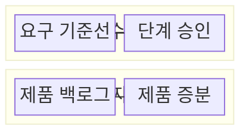
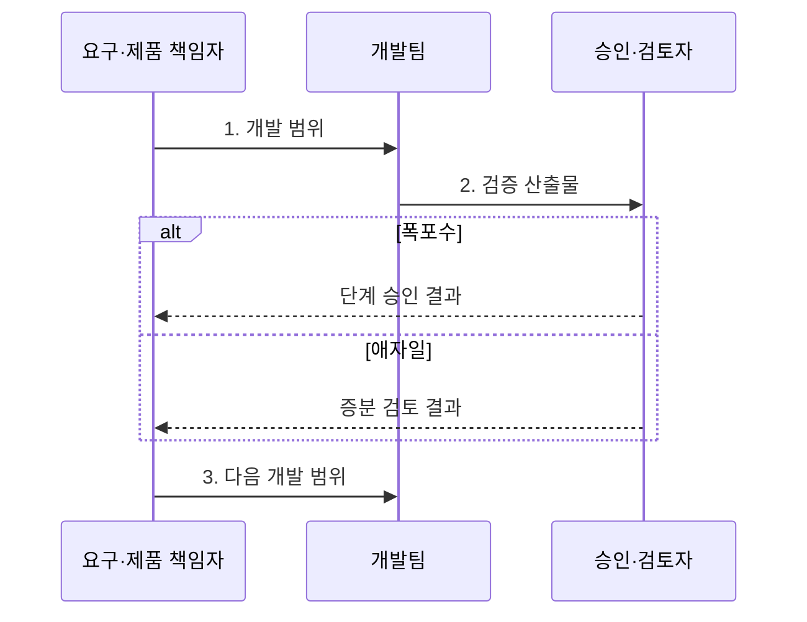

---
sidebar:
  order: 31
  label: "031. 폭포수 모델 vs 애자일 (Waterfall vs Agile)"
  badge:
    text: "미출제 · 30%"
    variant: note
title: "폭포수 모델 vs 애자일 (Waterfall vs Agile)"
date: "2026-08-02T12:00:00+09:00"
tags:
  - "notes-software"
weight: 31
extra:
  question_no: "031"
  source_status: "미출"
  source_history: ""
  priority: 30
  priority_note: "미출제, 개발 생명주기 비교 기초"
---

## Ⅰ. 개요

핵심 용어

- **폭포수 모델(Waterfall Model)**: 각 개발 단계의 산출물을 승인한 뒤 다음 단계로 이동하는 순차 개발 모델이다.
- **애자일(Agile)**: 짧은 반복마다 제품 증분을 검토하고 피드백을 다음 작업에 반영하는 개발 방식이다.
- **소프트웨어 개발 생명주기(Software Development Lifecycle, SDLC)**: 요구 분석부터 운영까지 개발 활동과 산출물의 흐름을 관리하는 체계다.

- 정의/개념: 단계 승인을 따르는 폭포수와 반복 증분을 따르는 두 **SDLC 모델**
- 배경/필요성: 요구 변동성·승인 증적 수준별 **개발 통제 방식 구분**

### 쉽게 이해하기 (학습용)

- 단계별 승인과 잦은 방향 조정 중 맞는 방식을 선택한다.

## Ⅱ. 특징

핵심 용어

- **단계 승인**: 한 단계의 산출물과 기준 충족을 확인한 뒤 다음 단계 진입을 허용하는 통제다.
- **증분 피드백**: 짧은 반복에서 만든 결과를 검토해 다음 개발 범위와 우선순위에 반영하는 방식이다.

- **단계 승인 중심**으로 폭포수의 범위·증적 통제
- **증분 피드백 중심**으로 애자일의 변경 조기 반영

### 쉽게 이해하기 (학습용)

- 폭포수는 단계 문에서, 애자일은 짧은 주기에서 오류를 찾는다.

## Ⅲ. 구조 및 구성요소

핵심 용어

- **요구 기준선(Requirements Baseline)**: 승인된 요구사항의 범위와 변경 통제를 위한 기준이다.
- **제품 백로그(Product Backlog)**: 제품에 필요한 요구와 작업을 가치와 위험에 따라 정렬한 단일 목록이다.
- **제품 증분(Product Increment)**: 반복마다 통합해 이해관계자가 검토할 수 있는 결과다.

| 구성요소 | 책임 |
|:---|:---|
| 요구 기준선 | 폭포수의 **범위·산출물 기준** 확정 |
| 단계 승인 | **다음 단계 진입** 통제 |
| 제품 백로그 | 애자일 **요구·작업 우선순위** 관리 |
| 제품 증분 | 반복별 **통합·검토 결과** 제공 |

### 쉽게 이해하기 (학습용)

- 폭포수는 기준선과 승인문, 애자일은 작업 목록과 증분을 쓴다.

## Ⅳ. 흐름도

핵심 용어

- **제품 책임자(Product Owner)**: 제품 가치와 위험을 기준으로 백로그 순서와 반복 범위를 결정하는 책임자다.
- **검증 산출물**: 개발 결과가 요구와 품질 기준을 충족했는지 승인·검토자에게 제시하는 결과물이다.

**동작 원리**

1. **개발 범위**: 폭포수는 요구 기준선, 애자일은 백로그 항목으로 범위 설정
2. **검증 산출물**: 폭포수는 단계 결과, 애자일은 제품 증분 제출
3. **다음 개발 범위**: 승인 결과나 증분 피드백으로 다음 단계·반복 결정

### 쉽게 이해하기 (학습용)

- 폭포수는 문을 지나고 애자일은 결과를 본 뒤 순서를 바꾼다.

## Ⅴ. 종류 및 비교

핵심 용어

- **승인 증적**: 요구·산출물·검증 결과가 정해진 승인 절차를 통과했음을 보이는 기록이다.
- **반복(Iteration)**: 짧은 기간에 요구 선택·구현·검토를 끝내고 피드백을 다음 주기에 반영하는 개발 주기다.

| 개발 모델 | 폭포수 | 애자일 |
|:---|:---|:---|
| 적용 기준 | 안정된 요구와 **승인 증적**이 중요 | 잦은 변경과 **고객 피드백**이 중요 |
| 핵심 특징 | **초기 계획·단계별 승인** | **반복 계획·증분 피드백** |
| 한계 | 늦은 **오류 발견·재작업 확대** | **범위 변동·장기 예측성** 저하 |

> 요약: 폭포수는 승인, 애자일은 반복 검토로 변경 통제

### 쉽게 이해하기 (학습용)

- 요구가 안정되면 승인, 변화가 잦으면 반복 피드백을 쓴다.

## Ⅵ. 실무 고려사항 및 대책

핵심 용어

- **완료 정의(Definition of Done)**: 제품 증분이 구현·시험·문서·보안의 품질 조건을 모두 충족했는지 판단하는 공통 기준이다.
- **리드타임(Lead Time)**: 요구 제기부터 사용 가능한 결과를 제공하기까지 걸린 시간이다.
- **시제품(Prototype)**: 핵심 기능·화면·흐름을 이른 시점에 검토하기 위한 시험용 구현물이다.

| 문제 | 대책 | 효과 |
|:---|:---|:---|
| 조직 관행만으로 모델을 정해 **업무 특성 불일치** | **요구 안정성·승인 주기·피드백 비용** 평가 | 근거에 맞는 **개발 모델 선택** |
| 폭포수의 시험·사용자 검토가 후반에 **집중** | **초기 시제품·단계별 자동 시험** 적용 | 늦은 **결함 발견·재작업** 감소 |
| 애자일을 문서·통제 부재로 오해해 **품질 기준 누락** | **완료 정의**에 시험·추적성·보안·문서 포함 | 반복별 **품질·승인 조건** 유지 |
| 잦은 변경으로 제품 목표와 **장기 예측성 상실** | **제품 목표·백로그 변경 기준·리드타임** 관리 | 가치 중심의 **범위 변동** 통제 |

### 쉽게 이해하기 (학습용)

- 단계형은 검문소를 앞당겨 시제품을 확인하고, 반복형은 매 주기의 완료표에 시험·문서 조건을 함께 붙인다.

## Ⅶ. 결론

핵심 용어

- **요구 안정성**: 개발 기간 동안 요구 범위와 우선순위가 바뀌지 않는 정도다.
- **고객 피드백**: 실제 제품 증분을 본 고객이 다음 개발 방향과 우선순위에 제공하는 의견이다.

- 요구·승인이 안정되면 **폭포수**, 변경·고객 피드백이 잦으면 **애자일** 선택

### 쉽게 이해하기 (학습용)

- 요구 변화와 승인 방식에 맞는 개발 흐름을 선택한다
