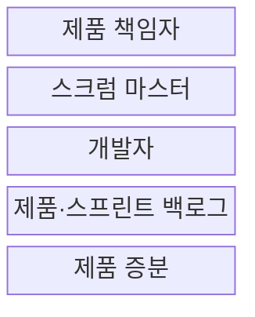
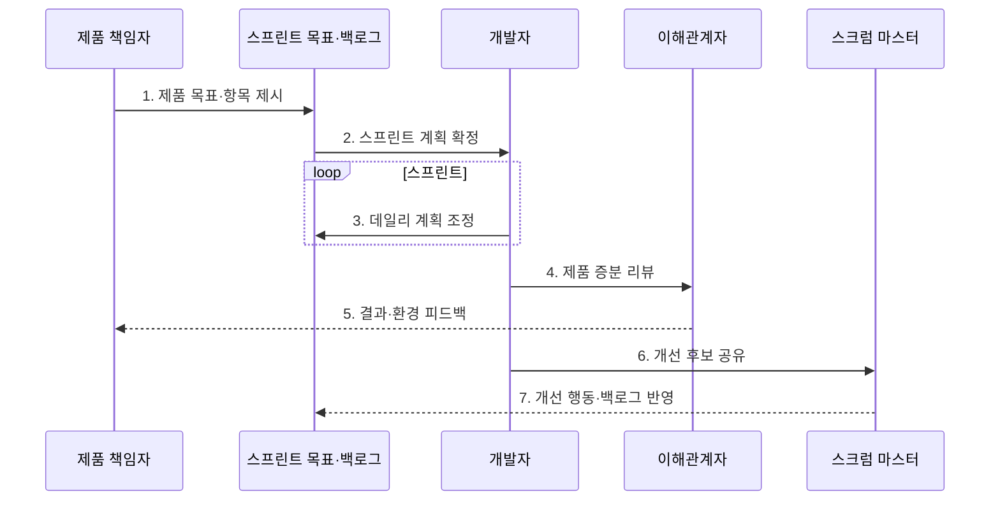

---
sidebar:
  order: 32
  label: "032. 애자일 스크럼 (Agile Scrum)"
  badge:
    text: "기출 · 50%"
    variant: note
title: "애자일 스크럼 (Agile Scrum)"
date: "2026-07-27T23:59:59+09:00"
tags:
  - "notes-software"
weight: 32
extra:
  question_no: "032"
  source_status: "기출"
  source_history: "134회"
  priority: 50
  priority_note: "134회 기출, 책무·이벤트·산출물 구조"
---

## 미리 알고가기

- **스크럼(Scrum)**: 짧은 스프린트마다 사용 가능한 제품 증분을 만들어 복잡한 문제에 대응하는 경량 프레임워크
- **경험주의(Empiricism)**: 실제 결과를 투명하게 공개하고 점검한 뒤 다음 행동에 적응하는 접근
- **스크럼 팀(Scrum Team)**: 제품 책임자·스크럼 마스터·개발자의 세 책무로 구성된 자율관리 팀
- **제품 백로그(Product Backlog)**: 제품 개선에 필요한 작업의 단일 목록
- **스프린트 백로그(Sprint Backlog)**: 스프린트 목표와 선택한 작업, 제품 증분을 전달할 계획을 담는 목록
- **제품 증분(Increment)**: 완료의 정의를 충족한 사용 가능한 결과
- **완료의 정의(Definition of Done)**: 제품 증분의 품질 기준
- **린 사고(Lean Thinking)**: 고객 가치가 아닌 낭비를 줄이고 흐름을 개선하는 사고방식으로서 스크럼의 경험주의와 함께 효과적인 증분 전달을 뒷받침함
- **교차기능·자율관리(Cross-functional·Self-managing)**: 교차기능은 증분 완성에 필요한 기술을 팀 안에 갖추는 성질이고 자율관리는 누가 무엇을 어떻게 할지 팀이 결정하는 방식
- **제품·스프린트 목표(Product·Sprint Goal)**: 제품 목표는 장기 방향이고 스프린트 목표는 한 스프린트의 단일 목적이며 백로그 선택과 결과 점검 기준을 제공함
- **스프린트 계획·데일리 스크럼(Sprint Planning·Daily Scrum)**: 계획은 목표·작업·수행 방식을 정하고 데일리 스크럼은 개발자가 목표 진척과 다음 하루 계획을 조정하는 이벤트
- **스프린트 리뷰·회고(Sprint Review·Retrospective)**: 리뷰는 이해관계자와 제품 결과·환경·다음 작업을 검토하고 회고는 팀의 품질과 효과성을 높일 개선을 계획하는 이벤트
- **장애물(Impediment)**: 팀의 목표 달성이나 작업 흐름을 막는 문제로서 스크럼 마스터가 제거를 지원함
- **이해관계자(Stakeholder)**: 제품에 영향을 주거나 영향을 받으며 스프린트 리뷰에서 결과와 환경 변화에 피드백을 제공하는 사람이나 조직
- **전자상거래·플랫폼 팀(E-commerce·Platform Team)**: 전자상거래 팀은 리뷰 의견으로 제품 백로그를 재정렬하고 플랫폼 팀은 회고 개선을 다음 스프린트에 실행하는 적용 조직
- **전통 프로젝트(Traditional Project)**: 장기 요구 기준선과 단계별 산출물 승인을 중심으로 진행해 스크럼의 반복 증분 방식과 비교되는 관리 방식
- **기술 부채(Technical Debt)**: 빠른 구현을 위해 미룬 설계·시험·품질 작업이 이후 변경 비용으로 누적된 상태
- **품질 게이트(Quality Gate)**: 시험·보안·코드 품질 기준을 충족해야 제품 증분 통합을 허용하는 통제

## Ⅰ. 개요

- 정의/개념: 경험주의로 **스프린트 증분을 만드는 틀**
- 배경/필요성: **요구 변화·늦은 피드백**에 반복 대응

### 쉽게 이해하기 (학습용)

- 짧게 만들고 실제 결과를 보며 다음 방향을 조정하는 틀이다.

## Ⅱ. 특징

- **투명성·점검·적응**으로 실제 결과 기반 계획 조정
- **고정 길이 스프린트**마다 사용 가능한 제품 증분 생성
- **교차기능·자율관리 팀**이 제품 목표 달성 책임 공유

### 쉽게 이해하기 (학습용)

- 짧은 주기 안에서 결과와 일하는 방식을 함께 점검한다.

## Ⅲ. 구조 및 구성요소

| 구성요소 | 책임 |
|:---|:---|
| 제품 책임자 | 제품 가치·제품 백로그 관리 |
| 스크럼 마스터 | 스크럼 정착·팀 효과성 향상 지원 |
| 개발자 | 스프린트 계획·제품 증분 완성 |
| 제품·스프린트 백로그 | 장기 작업과 반복 계획 관리 |
| 제품 증분 | 완료의 정의를 충족한 결과 제공 |

### 쉽게 이해하기 (학습용)

- 방향 책임자, 진행 지원자, 개발자, 작업 목록, 결과물로 구성된다.

## Ⅳ. 흐름도

**동작 원리**

- **1. 제품 목표·항목 제시**: 우선순위 작업 공개
- **2. 스프린트 계획 확정**: 목표·선택 항목·수행법 결정
- **3. 데일리 계획 조정**: 목표 진척과 다음 하루 점검
- **4. 제품 증분 리뷰**: 완료 기준 충족 결과 검토
- **5. 결과·환경 피드백**: 사용자·시장 변화 수집
- **6. 개선 후보 공유**: 품질·팀 효과성 문제 도출
- **7. 개선 행동·백로그 반영**: 다음 반복 계획 조정

### 쉽게 이해하기 (학습용)

- 목표를 세워 결과를 만들고 제품과 일하는 방식을 고쳐 간다.

## Ⅴ. 종류 및 비교

| 개발 관리 방식 | 애자일 스크럼 | 전통 프로젝트 |
|:---|:---|:---|
| 적용 기준 | 변화·**제품 피드백 중심** | 요구 안정·**승인 통제 중심** |
| 핵심 특징 | 스프린트·**제품 증분** | 장기 기준선·**단계별 산출물** |
| 한계 | 목표 변경·**행사 형식화** | 늦은 피드백·**재작업** |

> 요약: 스크럼은 짧은 증분, 전통 방식은 단계 기준선으로 통제

### 쉽게 이해하기 (학습용)

- 스크럼은 짧은 목표와 실제 결과로 다음 순서를 조정한다.

## Ⅵ. 실무 고려사항 및 대책

| 고려사항 | 대책 | 효과 |
|:---|:---|:---|
| 제품 책임자의 우선순위 결정 권한 분산 | 단일 제품 책임자·제품 목표·백로그 결정 규칙 명시 | 상충 지시·우선순위 혼선 방지 |
| 스프린트 중 잦은 범위 변경으로 목표 상실 | 스프린트 목표 보호·목표를 해치면 제품 책임자와 범위 재협의 | 예측 가능한 증분 완성 |
| 약한 완료의 정의로 미완료 시험·기술 부채 누적 | 자동 시험·보안·문서·통합 품질 게이트를 완료 정의에 포함 | 실제 사용 가능한 증분 확보 |
| 스크럼 이벤트가 보고 회의로 형식화 | 목표 진척·검토 결정·회고 행동과 책임자를 기록 | 점검·적응의 실행력 확보 |

### 적용 사례

- 전자상거래 팀은 스프린트 리뷰에서 사용자 반응과 시장 변화를 확인해 제품 백로그의 다음 작업 순서를 바꾼다.

### 쉽게 이해하기 (학습용)

- 쇼핑몰 팀은 실제 결과의 의견으로 다음 작업 순서를 바꾼다.

## Ⅶ. 결론

- **목표·완료 정의**를 보고 다음 백로그를 조정한다.

### 쉽게 이해하기 (학습용)

- 회의 수보다 목표 달성, 쓸 수 있는 결과, 개선 실행을 본다.
