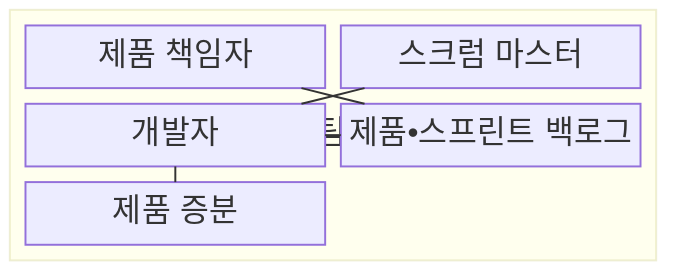
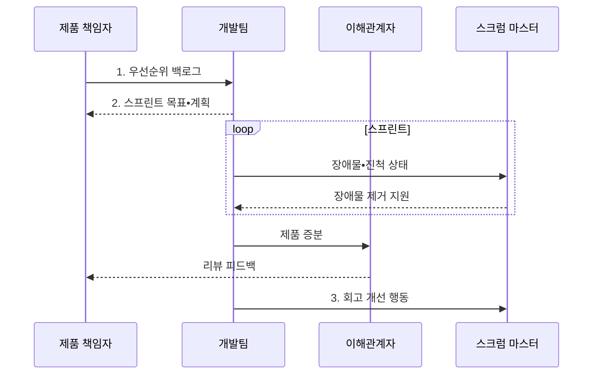

---
sidebar:
  order: 32
  label: "032. 애자일 스크럼 (Agile Scrum)"
  badge:
    text: "기출 • 50%"
    variant: note
title: "애자일 스크럼 (Agile Scrum)"
date: "2026-08-04T17:09:00+09:00"
tags:
  - "notes-software"
weight: 32
extra:
  question_no: "032"
  source_status: "기출"
  source_history: "134회"
  priority: 50
  priority_note: "134회 기출, 책무•이벤트•산출물 구조"
---

## Ⅰ. 개요

핵심 용어

- **스크럼(Scrum)**: 짧은 스프린트마다 사용 가능한 제품 증분을 만들어 복잡한 문제에 대응하는 경량 프레임워크다.
- **경험주의(Empiricism)**: 실제 결과를 투명하게 공개하고 점검한 뒤 다음 행동에 적응하는 접근이다.
- **제품 증분(Increment)**: 완료의 정의를 충족해 사용할 수 있는 제품 결과다.

- 정의/개념: 투명성•점검•적응으로 스프린트마다 **제품 증분** 을 만드는 경량 프레임워크
- 배경/필요성: 장기 계획은 잦은 요구 변화와 늦은 검증으로 **재작업 증가**

#### 한줄 요약

- 짧게 만들고 실제 결과를 보며 다음 방향을 조정하는 틀이다.

## Ⅱ. 특징

핵심 용어

- **투명성(Transparency)**: 실제 작업 상태를 이해관계자에게 공개하는 원칙이다.
- **점검(Inspection)**: 제품과 진행 결과를 주기적으로 살피는 원칙이다.
- **적응(Adaptation)**: 점검 결과에 따라 계획과 행동을 바꾸는 원칙이다.
- **스프린트(Sprint)**: 고정된 짧은 기간에 목표와 사용 가능한 제품 증분을 완성하는 반복 주기다.
- **교차기능(Cross-functional)**: 팀이 제품 완성에 필요한 기술을 함께 갖춘 성질이다.
- **자율관리(Self-managing)**: 팀이 작업 담당과 방법을 스스로 정하는 성질이다.

- **투명성•점검•적응** 으로 실제 결과 기반 계획 조정
- **고정 길이 스프린트**마다 사용 가능한 제품 증분 생성
- **교차기능•자율관리 팀** 이 제품 목표 달성 책임 공유

#### 한줄 요약

- 짧은 주기 안에서 결과와 일하는 방식을 함께 점검한다.

## Ⅲ. 구조 및 구성요소

핵심 용어

- **제품 책임자(Product Owner)**: 제품 가치와 제품 백로그의 우선순위를 책임지는 역할이다.
- **스크럼 마스터(Scrum Master)**: 스크럼 정착과 팀 효과성 향상, 장애물 제거를 지원하는 역할이다.
- **제품 백로그(Product Backlog)**: 제품에 필요한 작업을 우선순위로 관리하는 목록이다.
- **스프린트 백로그(Sprint Backlog)**: 현재 스프린트의 목표와 실행 계획을 관리하는 목록이다.
- **완료의 정의(Definition of Done)**: 제품 증분이 충족해야 하는 공통 품질 기준이다.

| 구성요소 | 책임 |
|:---|:---|
| 제품 책임자 | 제품 가치와 **제품 백로그** 관리 |
| 스크럼 마스터 | 스크럼 정착과 **팀 효과성** 향상 지원 |
| 개발자 | **스프린트 계획•제품 증분** 완성 |
| 제품•스프린트 백로그 | 장기 작업과 **반복 계획** 관리 |
| 제품 증분 | **완료의 정의** 를 충족한 결과 제공 |

#### 한줄 요약

- 방향 책임자, 진행 지원자, 개발자, 작업 목록, 결과물로 구성된다.

## Ⅳ. 흐름도

핵심 용어

- **스프린트 목표(Sprint Goal)**: 한 스프린트에서 달성할 단일 목적이자 작업 조정 기준이다.
- **스프린트 리뷰(Sprint Review)**: 이해관계자와 제품 결과•환경 변화•다음 작업을 검토하는 이벤트다.
- **스프린트 회고(Sprint Retrospective)**: 팀의 품질과 효과성을 높일 개선 행동을 정하는 이벤트다.

**동작 원리**

1. **우선순위 백로그**: 제품 목표에 맞춘 가치•위험 순서 제공
2. **스프린트 목표•계획**: 선택 항목과 증분 전달 방법 확정
3. **회고 개선 행동**: 팀의 품질•효과성 개선을 다음 스프린트에 적용

#### 한줄 요약

- 목표를 세워 결과를 만들고 제품과 일하는 방식을 고쳐 간다.

## Ⅴ. 종류 및 비교

핵심 용어

- **전통 프로젝트(Traditional Project)**: 장기 요구 기준선과 단계별 산출물 승인을 중심으로 진행하는 관리 방식이다.
- **제품 피드백**: 실제 제품 증분의 사용성과 가치를 검토해 백로그 순서에 반영하는 의견이다.

| 개발 관리 방식 | 애자일 스크럼 | 전통 프로젝트 |
|:---|:---|:---|
| 적용 기준 | 변화•**제품 피드백 중심** | 요구 안정•**승인 통제 중심** |
| 핵심 특징 | 스프린트•**제품 증분** | 장기 기준선•**단계별 산출물** |
| 한계 | 목표 변경•**행사 형식화** | 늦은 피드백•**재작업** |

> 요약: 스크럼은 짧은 증분, 전통 방식은 단계 기준선으로 통제

#### 한줄 요약

- 스크럼은 짧은 목표와 실제 결과로 다음 순서를 조정한다.

## Ⅵ. 실무 고려사항 및 대책

핵심 용어

- **기술 부채(Technical Debt)**: 미룬 설계•시험•품질 작업이 이후 변경 비용으로 누적된 상태다.
- **품질 게이트(Quality Gate)**: 시험•보안•코드 품질 기준을 충족해야 제품 증분 통합을 허용하는 통제다.
- **장애물(Impediment)**: 스크럼 팀의 목표 달성이나 작업 흐름을 막는 문제다.
- **백로그 결정 규칙**: 제품 가치•위험•목표를 기준으로 제품 책임자가 항목의 순서를 확정하는 규칙이다.
- **범위 재협의(Scope Renegotiation)**: 스프린트 목표를 유지하면서 제품 책임자와 개발자가 선택 작업의 양•내용을 다시 조정하는 활동이다.
- **리뷰 결정(Review Decision)**: 제품과 백로그 변경을 확정한 결과다.
- **회고 행동(Retrospective Action)**: 팀 개선 과제와 책임자를 확정한 결과다.

| 문제 | 대책 | 효과 |
|:---|:---|:---|
| 제품 책임자의 우선순위 권한 분산으로 **상충 지시** 발생 | 단일 제품 책임자와 **백로그 결정 규칙** 명시 | 제품 목표별 **우선순위 일관성** 유지 |
| 스프린트 중 잦은 범위 변경으로 **목표 상실** | **스프린트 목표 보호•범위 재협의** | 스프린트의 **증분 범위** 유지 |
| 약한 완료의 정의로 시험 누락•**기술 부채** 누적 | 자동 시험•보안•문서•**품질 게이트** 포함 | 실제 사용 가능한 **제품 증분** 확보 |
| 스크럼 이벤트가 보고 회의로 **형식화** | **검토 결정•회고 행동•책임자** 기록 | 점검 결과의 **적응 행동** 실행 |

#### 한줄 요약

- 완성품 검사표가 비어 있으면 다음 주문을 받지 않고, 리뷰 의견과 회고 행동은 다음 작업 목록의 순서에 붙인다.

## Ⅶ. 결론

핵심 용어

- **백로그 재정렬**: 제품 가치•위험•피드백에 맞춰 다음 작업의 우선순위를 다시 정하는 활동이다.
- **기술 부채 해소**: 완료 기준에 못 미친 설계•시험•품질 작업을 우선 수행해 변경 비용을 줄이는 활동이다.

- 스프린트 목표와 **완료의 정의** 를 충족하면 백로그 재정렬, 미달하면 **기술 부채** 우선 해소

#### 한줄 요약

- 완성품이 목표와 품질 검사표를 통과하면 다음 주문 순서를 바꾸고, 통과하지 못하면 밀린 품질 작업부터 끝낸다.
