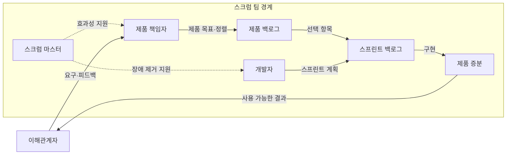
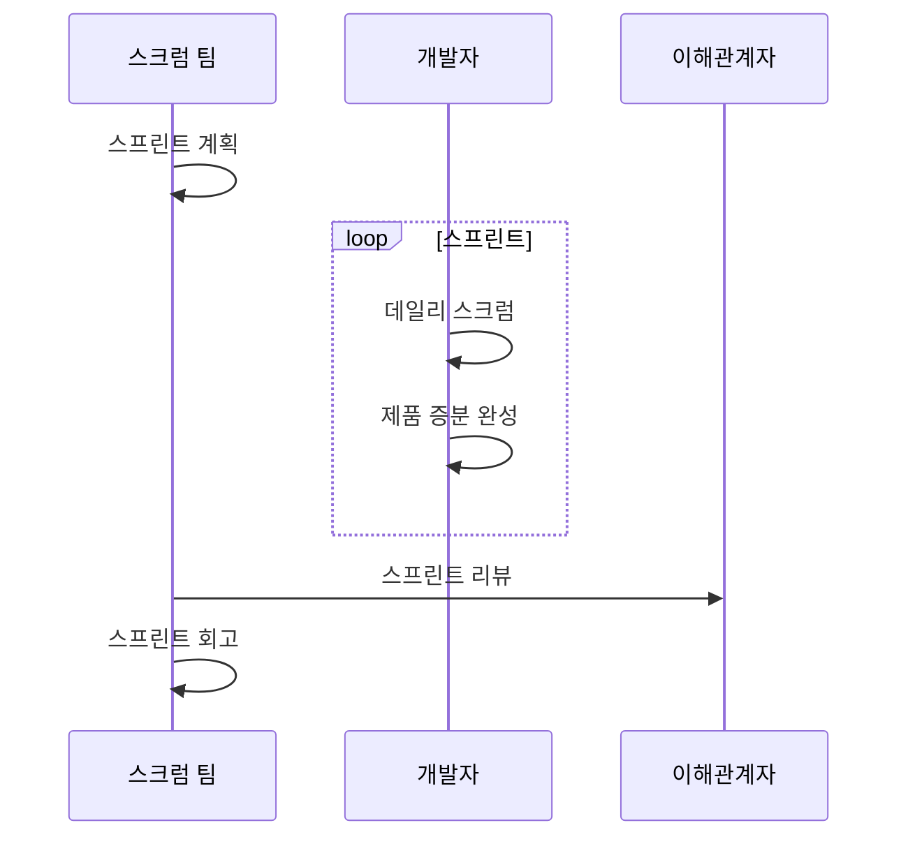

---
sidebar:
  order: 32
  label: "032. 애자일 스크럼 (Agile Scrum)"
  badge:
    text: "기출 · 50%"
    variant: note
title: "애자일 스크럼 (Agile Scrum)"
date: "2026-07-27T23:59:59+09:00"
tags:
  - "notes-software"
weight: 32
extra:
  question_no: "032"
  source_status: "기출"
  source_history: "134회"
  priority: 50
  priority_note: "134회 기출, 책무·이벤트·산출물 구조"
---

## 미리 알고가기

- **스크럼(Scrum)**: 짧은 스프린트마다 사용 가능한 제품 증분을 만들어 복잡한 문제에 대응하는 경량 프레임워크
- **경험주의(Empiricism)**: 실제 결과를 투명하게 공개하고 점검한 뒤 다음 행동에 적응하는 접근
- **스크럼 팀(Scrum Team)**: 제품 책임자·스크럼 마스터·개발자의 세 책무로 구성된 자율관리 팀
- **제품 백로그(Product Backlog)**: 제품 개선에 필요한 작업의 단일 목록
- **스프린트 백로그(Sprint Backlog)**: 스프린트 목표와 선택한 작업, 제품 증분을 전달할 계획을 담는 목록
- **제품 증분(Increment)**: 완료의 정의를 충족한 사용 가능한 결과
- **완료의 정의(Definition of Done)**: 제품 증분의 품질 기준
- **린 사고(Lean Thinking)**: 고객 가치가 아닌 낭비를 줄이고 흐름을 개선하는 사고방식으로서 스크럼의 경험주의와 함께 효과적인 증분 전달을 뒷받침함
- **교차기능·자율관리(Cross-functional·Self-managing)**: 교차기능은 증분 완성에 필요한 기술을 팀 안에 갖추는 성질이고 자율관리는 누가 무엇을 어떻게 할지 팀이 결정하는 방식
- **제품·스프린트 목표(Product·Sprint Goal)**: 제품 목표는 장기 방향이고 스프린트 목표는 한 스프린트의 단일 목적이며 백로그 선택과 결과 점검 기준을 제공함
- **스프린트 계획·데일리 스크럼(Sprint Planning·Daily Scrum)**: 계획은 목표·작업·수행 방식을 정하고 데일리 스크럼은 개발자가 목표 진척과 다음 하루 계획을 조정하는 이벤트
- **스프린트 리뷰·회고(Sprint Review·Retrospective)**: 리뷰는 이해관계자와 제품 결과·환경·다음 작업을 검토하고 회고는 팀의 품질과 효과성을 높일 개선을 계획하는 이벤트
- **장애물(Impediment)**: 팀의 목표 달성이나 작업 흐름을 막는 문제로서 스크럼 마스터가 제거를 지원함
- **이해관계자(Stakeholder)**: 제품에 영향을 주거나 영향을 받으며 스프린트 리뷰에서 결과와 환경 변화에 피드백을 제공하는 사람이나 조직
- **전자상거래·플랫폼 팀(E-commerce·Platform Team)**: 전자상거래 팀은 리뷰 의견으로 제품 백로그를 재정렬하고 플랫폼 팀은 회고 개선을 다음 스프린트에 실행하는 적용 조직
- **전통 프로젝트(Traditional Project)**: 장기 요구 기준선과 단계별 산출물 승인을 중심으로 진행해 스크럼의 반복 증분 방식과 비교되는 관리 방식

## Ⅰ. 개요

- 정의/개념: 경험주의 기반의 **짧은 스프린트로 가치 증분**을 만드는 틀
- 기존 한계: 장기 계획은 **복잡한 요구 변화·늦은 피드백** 대응에 한계

### 쉽게 이해하기 (학습용)

- 짧게 만들고 실제 결과를 보며 다음 방향을 조정하는 틀이다

## Ⅱ. 특징

- **투명성·점검·적응**으로 실제 결과 기반 계획 조정
- **고정 길이 스프린트**마다 사용 가능한 제품 증분 생성
- **교차기능·자율관리 팀**이 제품 목표 달성 책임 공유

### 쉽게 이해하기 (학습용)

- 짧은 주기 안에서 결과와 일하는 방식을 함께 점검한다

## Ⅲ. 아키텍처 및 구성요소

| 설계 요소 | 설명 |
|:---|:---|
| 제품 책임자 | 제품 가치 극대화와 제품 백로그 관리 책임 |
| 스크럼 마스터 | 스크럼 정착과 스크럼 팀 효과성 향상 책임 |
| 개발자 | 스프린트 계획과 사용 가능한 제품 증분 책임 |
| 제품 백로그 | 제품 목표를 향한 작업의 정렬된 단일 목록 |
| 스프린트 백로그 | 목표·선택 항목·제품 증분 전달 계획 |
| 제품 증분 | 완료의 정의를 충족한 사용 가능한 결과 |

> 요약: 세 책무가 백로그를 사용해 완료된 제품 증분을 전달

### 쉽게 이해하기 (학습용)

- 세 담당자가 할 일 목록을 실제로 쓸 수 있는 결과로 바꾼다

## Ⅳ. 원리 및 절차 흐름도

| 절차 | 설명 |
|:---|:---|
| 스프린트 계획 | 스크럼 팀이 목표·선택 항목·수행 계획 결정 |
| 데일리 스크럼 | 개발자가 목표 진척을 점검하고 계획 조정 |
| 제품 증분 완성 | 완료의 정의를 충족한 사용 가능한 결과 통합 |
| 스프린트 리뷰 | 이해관계자와 결과·환경·다음 작업 검토 |
| 스프린트 회고 | 품질과 효과성을 높일 개선 방법 계획 |

> 요약: 제품 결과와 작업 방식을 점검해 다음 스프린트에 적응

### 쉽게 이해하기 (학습용)

- 목표를 세워 결과를 만들고 제품과 일하는 방식을 고쳐 간다

## Ⅴ. 종류 및 비교

| 개발 관리 방식 | 애자일 스크럼 | 전통 프로젝트 |
|:---|:---|:---|
| 적용 기준 | 변화·**제품 피드백 중심** | 요구 안정·**승인 통제 중심** |
| 핵심 특징 | 스프린트·**제품 증분** | 장기 기준선·**단계별 산출물** |
| 한계 | 목표 변경·**행사 형식화** | 늦은 피드백·**재작업** |

> 요약: 스크럼은 짧은 증분, 전통 방식은 단계 기준선으로 통제

### 쉽게 이해하기 (학습용)

- 스크럼은 짧은 목표와 실제 결과로 다음 순서를 조정한다

## Ⅵ. 실무 사례

1. 전자상거래 팀은 **리뷰 의견으로 백로그** 재정렬

### 쉽게 이해하기 (학습용)

- 쇼핑몰 팀은 실제 결과의 의견으로 다음 작업 순서를 바꾼다.

## Ⅶ. 결론

- 짧은 주기로 고객가치를 검증하기 위해 **제품 목표·스프린트 목표·완료의 정의**를 검토하고, 리뷰와 회고 결과로 백로그와 개발 방식을 지속 조정한다

### 쉽게 이해하기 (학습용)

- 회의 수보다 목표 달성, 쓸 수 있는 결과, 개선 실행을 본다
