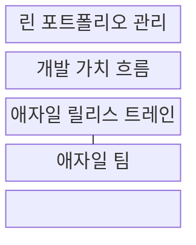
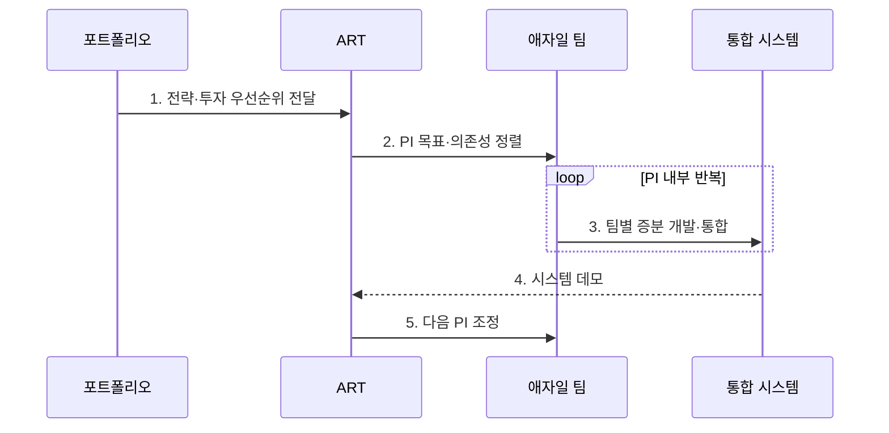

---
sidebar:
  order: 33
  label: "033. SAFe 대규모 애자일 프레임워크 (Scaled Agile Framework)"
  badge:
    text: "기출 · 70%"
    variant: note
title: "SAFe 대규모 애자일 프레임워크 (Scaled Agile Framework)"
date: "2026-08-02T12:00:00+09:00"
tags:
  - "notes-software"
weight: 33
extra:
  question_no: "033"
  source_status: "기출"
  source_history: "122회, 134회, 137회"
  priority: 70
  priority_note: "122·134·137회 반복, 규모 확장 애자일 핵심"
---

## Ⅰ. 개요

핵심 용어

- **확장형 애자일 프레임워크(Scaled Agile Framework, SAFe)**: 린·애자일 원칙을 가치 흐름과 전사 조직으로 확장한 프레임워크다.
- **린·애자일(Lean·Agile)**: 가치 흐름의 낭비를 줄이고 짧은 증분 피드백으로 변화에 적응하는 원칙이다.

- 정의/개념: 린·애자일을 전사 가치 흐름에 확장한 **애자일 프레임워크**
- 배경/필요성: 독립 팀 계획만으로는 다수 팀의 **의존성·통합 일정 조정이 어려움**

### 쉽게 이해하기 (학습용)

- 여러 팀의 목표와 의존성, 투자 방향을 같은 주기로 맞춘다.

## Ⅱ. 특징

핵심 용어

- **애자일 릴리스 트레인(Agile Release Train, ART)**: 여러 팀을 공통 임무와 개발 주기로 묶은 장기 조직이다.
- **계획 주기(Planning Interval, PI)**: ART가 공통 목표를 수행하는 시간 단위다.
- **가치 흐름(Value Stream)**: 아이디어와 투자를 고객 가치로 전환하는 개발 활동의 흐름이다.

- **ART·PI 공통 주기**로 다수 팀 목표·의존성 정렬
- **가치 흐름**으로 전략·투자·제품 실행 연결
- **포트폴리오·프로그램 조정 계층**으로 대규모 실행 통제

### 쉽게 이해하기 (학습용)

- 여러 팀을 맞출 수 있지만 조정 단계가 과하면 결정이 느려진다.

## Ⅲ. 구조 및 구성요소

핵심 용어

- **린 포트폴리오 관리(Lean Portfolio Management, LPM)**: 기업 전략과 투자를 개발 가치 흐름에 연결하는 관리 방식이다.
- **개발 가치 흐름(Development Value Stream, DVS)**: 아이디어를 고객 가치로 전환하는 개발 활동의 흐름이다.
- **애자일 팀**: 반복마다 제품 증분을 개발하고 검증하는 실행 조직이다.

| 구성요소 | 책임 |
|:---|:---|
| 린 포트폴리오 관리 | **전략·투자 우선순위** 관리 |
| 개발 가치 흐름 | 아이디어를 **고객 가치**로 전환 |
| 애자일 릴리스 트레인 | 여러 팀의 **목표·의존성** 정렬 |
| 애자일 팀 | 반복별 **증분 개발·검증** |

### 쉽게 이해하기 (학습용)

- 투자 방향, 가치 흐름, 공동 열차, 실행 팀으로 구성된다.

## Ⅳ. 흐름도

핵심 용어

- **PI 계획(PI Planning)**: 참여 팀이 계획 주기의 목표·용량·의존성을 함께 정렬하는 활동이다.
- **시스템 데모(System Demo)**: 여러 팀이 통합한 결과를 하나의 시스템 수준에서 검토하는 이벤트다.
- **용량·의존성(Capacity·Dependency)**: 수행 가능한 작업량과 다른 팀 결과가 선행조건이 되는 관계다.

**동작 원리**

- **1. 전략·투자 우선순위 전달**: 가치 흐름 목표 결정
- **2. PI 목표·의존성 정렬**: 용량·위험·책임자 합의
- **3. 팀별 증분 개발·통합**: 반복 결과를 공동 시스템에 반영
- **4. 시스템 데모**: 여러 팀의 통합 결과 검토
- **5. 다음 PI 조정**: 가치·위험 피드백을 다음 계획에 반영

### 쉽게 이해하기 (학습용)

- 공동 계획으로 일한 뒤 통합 결과를 보고 다음 주기를 조정한다.

## Ⅴ. 종류 및 비교

핵심 용어

- **스크럼(Scrum)**: 단일 팀이 스프린트마다 사용 가능한 제품 증분을 만들고 검토하는 프레임워크다.
- **조정 계층**: 여러 팀의 목표·일정·의존성을 맞추기 위해 추가되는 포트폴리오·프로그램 관리 층이다.

| 애자일 적용 규모 | SAFe | 단일 팀 스크럼 |
|:---|:---|:---|
| 적용 기준 | 공동 가치 흐름·**팀 간 의존성 큼** | 독립 제품·**팀 내부 조정** |
| 핵심 특징 | 가치 흐름·**ART·PI 정렬** | 제품·단일 팀·**스프린트** |
| 한계 | 조정 계층·**의사결정 지연** | 팀 간 의존성 **누락** |

> 요약: SAFe는 가치 흐름과 다수 팀, 스크럼은 단일 팀 정렬

### 쉽게 이해하기 (학습용)

- 여러 팀이 함께 만들면 SAFe의 공동 조정 단위를 검토한다.

## Ⅵ. 실무 고려사항 및 대책

핵심 용어

- **흐름 지표(Flow Metric)**: 대기·처리 시간, 진행 중 작업 수, 완료율로 가치 전달 흐름을 측정하는 지표다.
- **작업 진행 한도(Work-in-progress Limit)**: 동시에 진행하는 작업 수를 제한해 대기와 미완료 누적을 줄이는 기준이다.
- **가드레일(Guardrail)**: 팀의 자율 결정 범위와 넘지 말아야 할 비용·위험 기준이다.

| 문제 | 대책 | 효과 |
|:---|:---|:---|
| 조직 규모만 보고 **SAFe** 역할·이벤트 일괄 도입 | 실제 **가치 흐름·팀 의존성** 우선 지도화 | 불필요한 **조정 계층** 방지 |
| **PI 계획**이 근거 없는 장기 약속으로 변질 | 과거 **용량·의존성**과 변경 기준 명시 | 실행 가능한 **공동 계획** 수립 |
| 팀별 완료량과 달리 통합 가치 전달 지연 | **시스템 데모·흐름 지표**와 진행 한도 적용 | **지역 최적화** 방지 |
| 포트폴리오 통제로 팀 결정까지 중앙화 | **투자·위험 가드레일** 내 실행 자율성 보장 | **전략 정렬·현장 속도** 균형 |

### 쉽게 이해하기 (학습용)

- 차량 팀들은 같은 PI에서 부품과 소프트웨어 일정을 맞춘다.

## Ⅶ. 결론

핵심 용어

- **팀 의존성**: 한 팀의 산출물이나 일정이 다른 팀 작업의 시작·완료를 제약하는 관계다.
- **ART·PI 적용**: 다수 팀의 목표와 의존성을 공통 조직·주기로 정렬하는 결정이다.

- **가치 흐름·팀 의존성**이 크면 ART와 PI를 적용

### 쉽게 이해하기 (학습용)

- 팀 수보다 함께 맞춰야 할 가치 흐름과 의존성을 먼저 확인한다.
