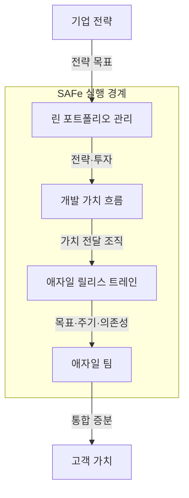
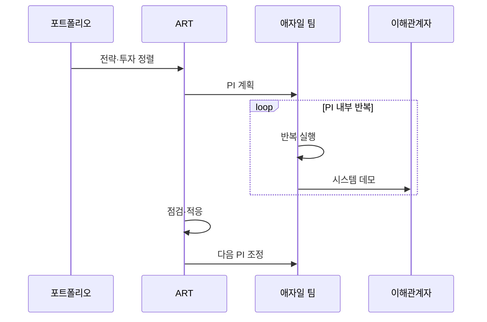

---
sidebar:
  order: 33
  label: "033. SAFe 대규모 애자일 프레임워크 (Scaled Agile Framework)"
  badge:
    text: "기출 · 70%"
    variant: note
title: "SAFe 대규모 애자일 프레임워크 (Scaled Agile Framework)"
date: "2026-07-27T23:59:59+09:00"
tags:
  - "notes-software"
weight: 33
extra:
  question_no: "033"
  source_status: "기출"
  source_history: "122회, 134회, 137회"
  priority: 70
  priority_note: "122·134·137회 반복, 규모 확장 애자일 핵심"
---

## 미리 알고가기

- **확장형 애자일 프레임워크(Scaled Agile Framework, SAFe)**: ‘세이프’로 읽고 Scaled Agile Framework를 공식 대소문자로 줄인 표기이며 린·애자일을 가치 흐름과 전사로 확장
- **린 포트폴리오 관리(Lean Portfolio Management, LPM)**: ‘엘피엠’으로 읽고 영문 머리글자를 딴 표기이며 기업 전략과 투자를 가치 흐름에 연결
- **개발 가치 흐름(Development Value Stream, DVS)**: ‘디브이에스’로 읽고 영문 머리글자를 딴 표기이며 아이디어를 고객 가치로 바꾸는 개발 활동의 흐름
- **애자일 릴리스 트레인(Agile Release Train, ART)**: ‘에이알티’로 읽고 영문 머리글자를 딴 표기이며 여러 팀을 공통 임무·주기로 묶은 장기 조직
- **계획 주기(Planning Interval, PI)**: ‘피아이’로 읽고 Planning Interval의 머리글자를 딴 표기이며 ART가 공통 목표를 수행하는 시간 상자
- **PI 계획(PI Planning)**: ‘피아이 플래닝’으로 읽고 계획 주기의 약어 PI에 Planning을 붙인 표기이며 참여 팀이 목표·용량·의존성을 정렬
- **시스템 데모(System Demo)**: 여러 팀의 통합 결과를 함께 검토하는 이벤트
- **린·애자일(Lean·Agile)**: 린은 가치 흐름의 낭비와 지연을 줄이고 애자일은 짧은 증분 피드백으로 변화에 적응하며 SAFe가 두 원칙을 여러 팀에 확장함
- **시간 상자(Timebox)**: 시작·종료 시각을 고정한 기간으로서 PI와 팀 반복의 계획·검토 리듬을 맞춤
- **용량·의존성(Capacity·Dependency)**: 용량은 주기 안에 수행 가능한 작업량이고 의존성은 한 팀의 결과가 다른 팀 작업의 선행조건이 되는 관계
- **점검·적응(Inspect and Adapt)**: PI 결과와 문제 원인을 검토하고 개선안을 다음 계획에 반영하는 SAFe 이벤트
- **에픽(Epic)**: 여러 팀·주기에 걸친 큰 사업 또는 기술 과제로서 린 포트폴리오가 가치 흐름별 투자와 진행을 조정함
- **스크럼(Scrum)**: 단일 팀이 스프린트마다 사용 가능한 제품 증분을 만들고 검토하는 경량 애자일 프레임워크

## Ⅰ. 개요

- 정의/개념: 다수 애자일 팀을 **가치 흐름·전략·공통 주기**에 정렬하는 프레임워크
- 기존 한계: 독립 팀 최적화는 **팀 간 의존성·통합 일정·투자 정렬**에 한계

### 쉽게 이해하기 (학습용)

- 여러 팀의 목표와 의존성, 투자 방향을 같은 주기로 맞춘다.

## Ⅱ. 특징

- **ART·PI 공통 주기**로 다수 팀 목표·의존성 정렬
- **가치 흐름**으로 전략·투자·제품 실행 연결
- **포트폴리오·프로그램 조정 계층**으로 대규모 실행 통제

### 쉽게 이해하기 (학습용)

- 여러 팀을 맞출 수 있지만 조정 단계가 과하면 결정이 느려진다.

## Ⅲ. 아키텍처 및 구성요소

| 설계 요소 | 설명 |
|:---|:---|
| 린 포트폴리오 관리 | 전략·투자와 가치 흐름 자금 지원 연결 |
| 개발 가치 흐름 | 아이디어부터 고객 가치까지 활동 조직화 |
| 애자일 릴리스 트레인 | 여러 팀의 장기 협업·통합 전달 조직 |
| 애자일 팀 | 반복마다 작동 증분을 개발·검증 |

> 요약: 포트폴리오 전략을 가치 흐름·ART·팀 실행에 연결

### 쉽게 이해하기 (학습용)

- 투자 방향이 가치 흐름과 릴리스 트레인을 거쳐 팀 목표로 이어진다.

## Ⅳ. 원리 및 절차 흐름도

| 절차 | 설명 |
|:---|:---|
| 전략·투자 정렬 | 가치 흐름 목표와 투자 우선순위 연결 |
| PI 계획 | ART 목표·용량·의존성·위험 공동 정렬 |
| 반복 실행 | 팀별 반복에서 기능 개발·통합 |
| 시스템 데모 | 여러 팀의 통합 결과를 함께 검토 |
| 점검·적응 | 결과·피드백으로 문제와 개선안 도출 |
| 다음 PI 조정 | 개선안과 미완료 작업을 다음 계획에 반영 |

> 요약: 전략을 PI 목표로 실행하고 통합 결과로 다음 주기 조정

### 쉽게 이해하기 (학습용)

- 공동 계획으로 일한 뒤 통합 결과를 보고 다음 주기를 조정한다.

## Ⅴ. 종류 및 비교

| 애자일 적용 규모 | SAFe | 단일 팀 스크럼 |
|:---|:---|:---|
| 적용 기준 | 공동 가치 흐름·**팀 간 의존성 큼** | 독립 제품·**팀 내부 조정** |
| 핵심 특징 | 가치 흐름·**ART·PI 정렬** | 제품·단일 팀·**스프린트** |
| 한계 | 조정 계층·**의사결정 지연** | 팀 간 의존성 **누락** |

> 요약: SAFe는 가치 흐름과 다수 팀, 스크럼은 단일 팀 정렬

### 쉽게 이해하기 (학습용)

- 여러 팀이 함께 만들면 SAFe의 공동 조정 단위를 검토한다.

## Ⅵ. 실무 사례

1. 차량 플랫폼은 **ART**로 HW·SW 의존성 정렬

### 쉽게 이해하기 (학습용)

- 차량 팀들은 같은 PI에서 부품과 소프트웨어 일정을 맞춘다.

## Ⅶ. 결론

- 다수 팀의 가치 전달과 의존성을 정렬하기 위해 **공동 가치 흐름·팀 간 결합도·계획 주기**를 검토하고, 통합 조정 필요성이 큰 조직에 ART와 PI를 적용한다

### 쉽게 이해하기 (학습용)

- 팀 수보다 함께 맞춰야 할 가치 흐름과 의존성을 먼저 확인한다.
