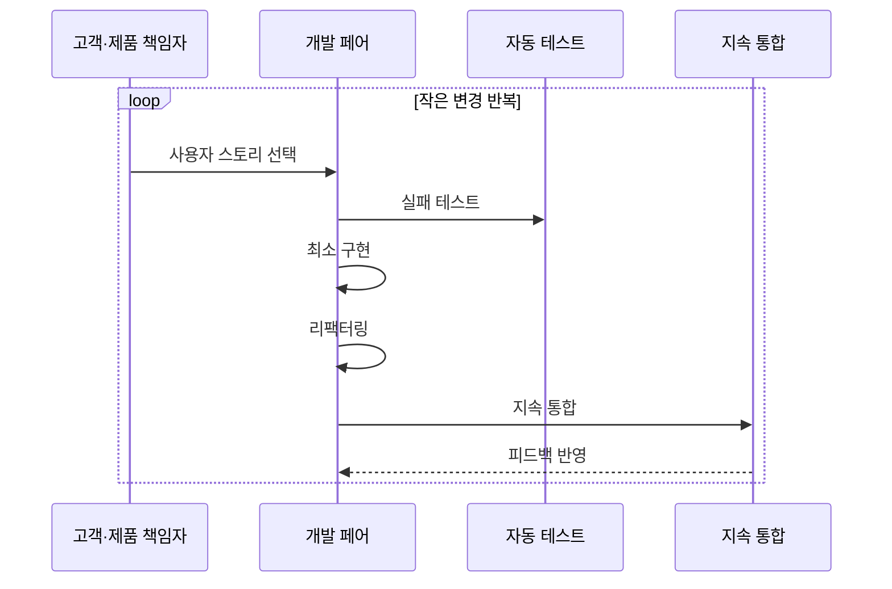

---
sidebar:
  order: 34
  label: "034. XP — 페어 프로그래밍·TDD (Extreme Programming)"
  badge:
    text: "기출 · 50%"
    variant: note
title: "XP — 페어 프로그래밍·TDD (Extreme Programming)"
date: "2026-07-25T00:35:00+09:00"
tags:
  - "notes-software"
weight: 34
extra:
  question_no: "034"
  source_status: "기출"
  source_history: "129회"
  priority: 50
  priority_note: "129회 기출, XP 실천법·피드백 주기"
---

## 미리 알고가기

- **익스트림 프로그래밍(Extreme Programming, XP)**: ‘엑스피’로 읽고 Extreme Programming의 머리글자를 딴 표기이며 짧은 반복과 기술 실천으로 피드백을 강화
- **사용자 스토리(User Story)**: 사용자 관점의 작은 가치 단위 요구사항
- **페어 프로그래밍(Pair Programming)**: 두 개발자가 한 작업을 함께 구현·검토하는 실천
- **드라이버(Driver)**: 코드와 테스트를 직접 작성하는 페어 역할
- **내비게이터(Navigator)**: 설계·결함·다음 단계를 검토하는 페어 역할
- **테스트 주도 개발(Test-Driven Development, TDD)**: ‘티디디’로 읽고 Test-Driven Development의 머리글자를 딴 표기이며 실패 테스트·구현·리팩터링을 반복
- **리팩터링(Refactoring)**: 외부 동작을 유지하며 내부 구조를 개선하는 활동
- **지속 통합(Continuous Integration, CI)**: ‘시아이’로 읽고 Continuous Integration의 머리글자를 딴 표기이며 작은 변경을 자주 합쳐 자동 빌드·테스트로 회귀를 검증
- **회귀 결함(Regression Defect)**: 새 변경으로 이전에 정상 동작하던 기능이 다시 실패하는 결함으로서 자동 테스트와 지속 통합이 조기에 탐지함
- **단순 설계·공동 소유(Simple Design·Collective Ownership)**: 단순 설계는 현재 요구를 만족하는 최소 구조를 유지하고 공동 소유는 모든 개발자가 코드 전반을 수정할 책임을 공유함
- **결합도(Coupling)**: 한 코드 요소의 변경이 다른 요소에 미치는 의존 정도로서 리팩터링이 불필요한 결합을 줄임
- **메인라인(Mainline)**: 팀의 변경을 지속적으로 합치는 기준 코드 흐름으로서 자동 회귀 검증의 대상
- **특성 테스트(Characterization Test)**: 문서가 부족한 레거시 코드의 현재 동작을 먼저 고정해 리팩터링 중 의도하지 않은 변경을 탐지하는 테스트
- **레거시 코드(Legacy Code)**: 오래 운영되어 변경 위험이 크거나 자동 테스트가 부족해 특성 테스트와 점진 리팩터링이 필요한 기존 코드

## Ⅰ. 개요

- **정의/개념**: 짧은 반복과 기술 실천으로 피드백을 강화
- **배경/필요성**: 큰 변경은 회귀 추적을 늦춰 소단위 검증 필요

### 쉽게 이해하기 (학습용)

- 작은 요구를 둘이 구현하고 테스트·통합 결과를 바로 받아 다음 변경에 반영한다

## Ⅱ. 특징

- 고객·개발·테스트 피드백을 작은 변경 안에 결합한다.
- 단순 설계·공동 소유로 변경 비용과 지식 편중 완화한다.

### 쉽게 이해하기 (학습용)

- 작게 정하고 둘이 만들며 테스트와 통합을 반복해야 빠른 피드백이 이어진다

## Ⅲ. 아키텍처 및 구성요소

| 설계 요소 | 설명 |
|:---|:---|
| 페어 프로그래밍 | 드라이버·내비게이터가 구현·검토 역할 교대 |
| 테스트 주도 개발 | 실패·통과·리팩터링 주기로 동작 명세 구체화 |
| 리팩터링 | 테스트를 안전망으로 중복 제거·결합도 감소 |
| 지속 통합 | 작은 변경을 메인라인에 합쳐 자동 회귀 검증 |

> 요약: 페어 검토와 TDD·리팩터링·통합을 변경마다 반복

### 쉽게 이해하기 (학습용)

- 둘이 동작을 정하고 최소 코드로 통과시킨 뒤 구조를 다듬어 자주 합친다

## Ⅳ. 원리 및 절차 흐름도

| 절차 | 설명 |
|:---|:---|
| 사용자 스토리 선택 | 고객 가치·우선순위로 작은 개발 범위 결정 |
| 실패 테스트 | 요구 동작을 테스트로 쓰고 실패 확인 |
| 최소 구현 | 테스트를 통과할 만큼의 코드만 작성 |
| 리팩터링 | 테스트 통과 상태에서 코드 구조 개선 |
| 지속 통합 | 작은 변경을 메인라인에 합쳐 자동 검증 |
| 피드백 반영 | 테스트·통합 결과를 다음 반복에 반영 |

> 요약: 스토리마다 실패·통과·개선·통합 피드백을 반복

### 쉽게 이해하기 (학습용)

- 실패 기준을 먼저 만든 뒤 필요한 만큼 구현하고 안전하게 정리해 바로 합친다

## Ⅴ. 종류 및 비교

| 판단 기준 | XP | 단계 중심 방식 |
|:---|:---|:---|
| 핵심 특징 | 작은 스토리·TDD·지속 통합 | 단계 산출물·독립 검증 |
| 적용 기준 | 변경 빈번·자동화·긴밀한 협업 | 요구 안정·단계 승인 중요 |
| 주요 위험 | 실천 규율 붕괴·협업 비용 | 늦은 통합·피드백 지연 |

> 요약: XP는 작은 변경의 즉시 피드백, 단계 방식은 승인 중심

### 쉽게 이해하기 (학습용)

- XP는 작은 변경마다 검증하고 단계 방식은 정해진 관문을 지난다.

## Ⅵ. 실무 사례

1. 결제 규칙 개발은 페어·TDD로 변경과 검토를 함께 수행
2. 레거시 개선은 특성 테스트·리팩터링·CI로 점진 변경

### 쉽게 이해하기 (학습용)

- 결제 팀은 작성과 검토를 함께 하고 테스트로 이전 동작을 지킨다.
- 레거시 팀은 현재 동작을 테스트로 고정한 뒤 코드를 조금씩 정리한다

## Ⅶ. 결론

- 변화 빈도·자동화·협업 여건으로 XP 적용 방식 선택

### 쉽게 이해하기 (학습용)

- XP는 속도 자체보다 작은 변경을 안전하게 반복하는 팀 규율에 가깝다
