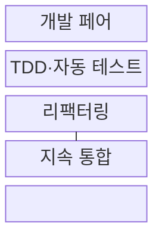
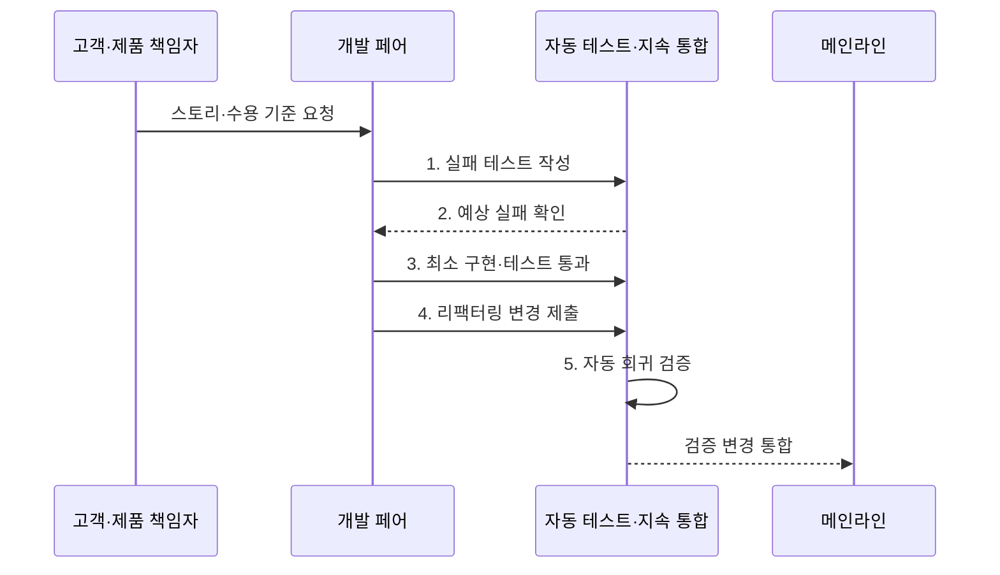

---
sidebar:
  order: 34
  label: "034. XP: 페어 프로그래밍·TDD (Extreme Programming)"
  badge:
    text: "기출 · 50%"
    variant: note
title: "XP: 페어 프로그래밍·TDD (Extreme Programming)"
date: "2026-08-02T12:00:00+09:00"
tags:
  - "notes-software"
weight: 34
extra:
  question_no: "034"
  source_status: "기출"
  source_history: "129회"
  priority: 50
  priority_note: "129회 기출, XP 실천법·피드백 주기"
---

## Ⅰ. 개요

핵심 용어

- **익스트림 프로그래밍(Extreme Programming, XP)**: 짧은 반복과 공학적 실천으로 고객 피드백을 빠르게 반영하는 애자일 방법론이다.
- **회귀 결함(Regression Defect)**: 새 변경으로 이전에 정상 동작하던 기능이 다시 실패하는 결함이다.

- 정의/개념: 짧은 반복과 공학 실천을 결합한 **애자일 개발 방법론**
- 배경/필요성: 큰 변경과 늦은 통합으로 **회귀 결함·재작업** 증가

#### 한줄 요약

- 작은 요구를 둘이 구현하고 테스트·통합 결과를 바로 받아 다음 변경에 반영한다.

## Ⅱ. 특징

핵심 용어

- **사용자 스토리(User Story)**: 사용자 관점에서 표현한 작은 가치 단위 요구사항이다.
- **테스트 주도 개발(Test-Driven Development, TDD)**: 실패 테스트 작성·최소 구현·리팩터링을 반복하는 개발 방식이다.
- **지속 통합(Continuous Integration, CI)**: 작은 변경을 자주 합치고 자동 빌드·시험으로 회귀 오류를 검증하는 방식이다.
- **공동 소유(Collective Ownership)**: 모든 개발자가 코드 전반을 수정하고 품질을 지킬 책임을 공유하는 원칙이다.
- **페어 프로그래밍(Pair Programming)**: 두 개발자가 작성자와 검토자 역할을 교대하며 한 작업을 함께 구현하는 실천이다.

- **작은 스토리·짧은 릴리스** 로 고객 피드백 조기 반영
- **TDD·지속 통합** 으로 변경 직후 회귀 결함 검출
- **페어 프로그래밍·공동 소유** 로 코드 지식 분산

#### 한줄 요약

- 작게 정하고 둘이 만들며 테스트와 통합을 반복해야 빠른 피드백이 이어진다.

## Ⅲ. 구조 및 구성요소

핵심 용어

- **페어 프로그래밍(Pair Programming)**: 두 개발자가 한 작업을 함께 구현하고 검토하는 실천이다.
- **드라이버·내비게이터(Driver·Navigator)**: 코드 작성과 설계·결함 검토를 맡아 교대하는 페어 역할이다.
- **리팩터링(Refactoring)**: 외부 동작을 유지하면서 내부 코드 구조를 개선하는 활동이다.

| 구성요소 | 책임 |
|:---|:---|
| 개발 페어 | **드라이버·내비게이터** 역할 교대 |
| TDD·자동 테스트 | **실패·통과 주기** 로 동작 명세 검증 |
| 리팩터링 | **외부 동작** 을 유지하며 구조 개선 |
| 지속 통합 | 작은 변경의 **회귀 검증·통합** |

#### 한줄 요약

- 두 개발자, 시험 기준, 구조 정리, 자동 통합으로 구성된다.

## Ⅳ. 흐름도

핵심 용어

- **수용 기준(Acceptance Criteria)**: 사용자 스토리가 충족됐는지 판정하는 검증 조건이다.
- **메인라인(Mainline)**: 팀의 검증된 변경을 지속적으로 합치는 기준 코드 흐름이다.
- **자동 회귀 검증**: 새 변경이 기존 동작을 깨뜨리지 않았는지 자동 시험으로 확인하는 활동이다.

**동작 원리**

- **1. 실패 테스트 작성**: 요구 동작을 시험으로 표현
- **2. 예상 실패 확인**: 의도한 이유의 실패 검증
- **3. 최소 구현·테스트 통과**: 필요한 코드만 작성
- **4. 리팩터링 변경 제출**: 동작 유지 상태로 구조 개선
- **5. 자동 회귀 검증**: 메인라인 통합 전 기존 동작 확인

#### 한줄 요약

- 실패 기준을 먼저 만든 뒤 필요한 만큼 구현하고 안전하게 정리해 바로 합친다.

## Ⅴ. 종류 및 비교

핵심 용어

- **단계 중심 방식**: 요구·설계·구현·시험 산출물을 단계별 승인으로 통제하는 개발 방식이다.
- **실천 규율**: TDD·페어·지속 통합을 짧은 주기로 일관되게 수행하는 팀 규칙이다.

| 개발 방법 | XP | 단계 중심 방식 |
|:---|:---|:---|
| 적용 기준 | 변경 빈번·**자동화·긴밀한 협업** | 요구 안정·**단계 승인 중요** |
| 핵심 특징 | 작은 스토리·**TDD·지속 통합** | 단계 산출물·**독립 검증** |
| 한계 | 실천 규율 붕괴·**협업 비용** | 늦은 통합·**피드백 지연** |

> 요약: XP는 작은 변경의 즉시 피드백, 단계 방식은 승인 중심

#### 한줄 요약

- XP는 작은 변경마다 검증하고 단계 방식은 정해진 관문을 지난다.

## Ⅵ. 실무 고려사항 및 대책

핵심 용어

- **테스트 피라미드(Test Pyramid)**: 빠른 단위 시험을 많이 두고 느린 통합·전체 시험은 필요한 만큼 두는 구성 원칙이다.
- **불안정 테스트(Flaky Test)**: 코드가 같아도 환경·순서·시간에 따라 성공과 실패가 달라지는 시험이다.
- **레거시 코드(Legacy Code)**: 오래 운영되어 변경 위험이 크거나 자동 시험이 부족한 기존 코드다.
- **특성 테스트(Characterization Test)**: 레거시 코드의 현재 동작을 먼저 고정해 리팩터링 중 의도하지 않은 변화를 찾는 시험이다.
- **외부 동작 테스트(Behavioral Test)**: 내부 구현 방식보다 입력에 대한 관찰 가능한 결과와 계약을 검증하는 시험이다.
- **필수 검증 분리**: 빠르고 안정적인 시험은 통합의 필수 조건으로 두고 느리거나 불안정한 시험은 별도 경로에서 진단하는 운영 방식이다.

| 문제 | 대책 | 효과 |
|:---|:---|:---|
| 구현 세부와 결합된 테스트로 수정량 증가 | **외부 동작 테스트·테스트 피라미드** 적용 | 리팩터링용 **안전망** 확보 |
| 페어 역할 고정과 연속 작업으로 피로 증가 | **드라이버·내비게이터** 교대와 개인 작업 구분 | **지식 공유·협업 지속성** 확보 |
| 느린 **불안정 테스트** 로 지속 통합 신뢰 하락 | 필수 검증 분리와 불안정 테스트 격리 | 짧고 신뢰할 **피드백** 확보 |
| 테스트 없는 **레거시 코드** 의 대규모 변경 | **특성 테스트** 후 작은 리팩터링 반복 | **회귀 위험** 제한 |

#### 한줄 요약

- 결제 팀은 작성과 검토를 함께 하고 테스트로 이전 동작을 지킨다.

## Ⅶ. 결론

핵심 용어

- **자동화 가능성**: 작은 변경을 시험·빌드·통합 과정에서 반복 검증할 수 있는 정도다.
- **단계 승인**: 정해진 산출물과 기준을 통과해야 다음 개발 단계로 이동하게 하는 통제다.

- 변경이 잦고 자동화 가능하면 **XP**, 단계 승인이 중요하면 **단계 방식** 적용

#### 한줄 요약

- XP는 속도 자체보다 작은 변경을 안전하게 반복하는 팀 규율에 가깝다.
