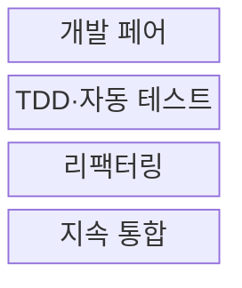
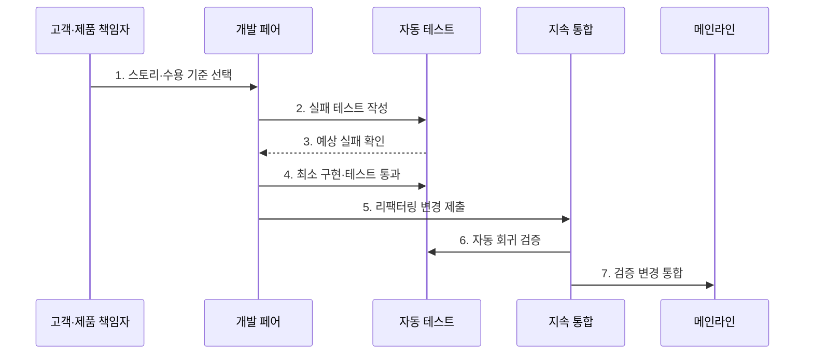

---
sidebar:
  order: 34
  label: "034. XP: 페어 프로그래밍·TDD (Extreme Programming)"
  badge:
    text: "기출 · 50%"
    variant: note
title: "XP: 페어 프로그래밍·TDD (Extreme Programming)"
date: "2026-07-27T23:59:59+09:00"
tags:
  - "notes-software"
weight: 34
extra:
  question_no: "034"
  source_status: "기출"
  source_history: "129회"
  priority: 50
  priority_note: "129회 기출, XP 실천법·피드백 주기"
---

## 미리 알고가기

- **익스트림 프로그래밍(Extreme Programming, XP)**: 짧은 반복과 공학적 실천으로 고객 피드백을 신속하게 반영하는 애자일 방법론
- **사용자 스토리(User Story)**: 사용자 관점의 작은 가치 단위 요구사항
- **페어 프로그래밍(Pair Programming)**: 두 개발자가 한 작업을 함께 구현·검토하는 실천
- **드라이버(Driver)**: 코드와 테스트를 직접 작성하는 페어 역할
- **내비게이터(Navigator)**: 설계·결함·다음 단계를 검토하는 페어 역할
- **테스트 주도 개발(Test-Driven Development, TDD)**: 실패 테스트 작성·구현·리팩터링을 반복하는 개발 방식
- **리팩터링(Refactoring)**: 외부 동작을 유지하며 내부 구조를 개선하는 활동
- **지속 통합(Continuous Integration, CI)**: 작은 변경을 자주 통합하고 자동 빌드·테스트로 회귀 오류를 검증하는 방식
- **회귀 결함(Regression Defect)**: 새 변경으로 이전에 정상 동작하던 기능이 다시 실패하는 결함으로서 자동 테스트와 지속 통합이 조기에 탐지한다.
- **단순 설계·공동 소유(Simple Design·Collective Ownership)**: 단순 설계는 현재 요구를 만족하는 최소 구조를 유지하고 공동 소유는 모든 개발자가 코드 전반을 수정할 책임을 공유한다.
- **결합도(Coupling)**: 한 코드 요소의 변경이 다른 요소에 미치는 의존 정도로서 리팩터링이 불필요한 결합을 줄이다.
- **메인라인(Mainline)**: 팀의 변경을 지속적으로 합치는 기준 코드 흐름으로서 자동 회귀 검증의 대상
- **특성 테스트(Characterization Test)**: 문서가 부족한 레거시 코드의 현재 동작을 먼저 고정해 리팩터링 중 의도하지 않은 변경을 탐지하는 테스트
- **레거시 코드(Legacy Code)**: 오래 운영되어 변경 위험이 크거나 자동 테스트가 부족해 특성 테스트와 점진 리팩터링이 필요한 기존 코드
- **불안정 테스트(Flaky Test)**: 코드가 바뀌지 않아도 실행 환경·순서·시간에 따라 성공과 실패가 달라지는 테스트
- **테스트 피라미드(Test Pyramid)**: 빠른 단위 테스트를 많이 두고 느린 통합·전체 시스템 테스트는 필요한 만큼 적게 두는 구성 원칙

## Ⅰ. 개요

- 정의/개념: 짧은 반복·실천으로 **피드백을 단축**
- 배경/필요성: 큰 변경·늦은 통합의 **회귀·변경 비용 축소**

### 쉽게 이해하기 (학습용)

- 작은 요구를 둘이 구현하고 테스트·통합 결과를 바로 받아 다음 변경에 반영한다.

## Ⅱ. 특징

- **작은 스토리·짧은 릴리스**로 고객 피드백 조기 반영
- **TDD·지속 통합**으로 변경 직후 회귀 결함 검출
- **페어 프로그래밍·공동 소유**로 코드 지식 분산

### 쉽게 이해하기 (학습용)

- 작게 정하고 둘이 만들며 테스트와 통합을 반복해야 빠른 피드백이 이어진다.

## Ⅲ. 구조 및 구성요소

| 구성요소 | 책임 |
|:---|:---|
| 개발 페어 | 드라이버·내비게이터 역할 교대 |
| TDD·자동 테스트 | 실패·통과 주기로 동작 명세 검증 |
| 리팩터링 | 외부 동작을 유지하며 구조 개선 |
| 지속 통합 | 작은 변경의 자동 회귀 검증·통합 |

### 쉽게 이해하기 (학습용)

- 두 개발자, 시험 기준, 구조 정리, 자동 통합으로 구성된다.

## Ⅳ. 흐름도

**동작 원리**

- **1. 스토리·수용 기준 선택**: 작은 가치 단위 확정
- **2. 실패 테스트 작성**: 요구 동작을 시험으로 표현
- **3. 예상 실패 확인**: 의도한 이유의 실패 검증
- **4. 최소 구현·테스트 통과**: 필요한 코드만 작성
- **5. 리팩터링 변경 제출**: 동작 유지 상태로 구조 개선
- **6. 자동 회귀 검증**: 전체 빌드·시험 수행
- **7. 검증 변경 통합**: 성공한 변경만 메인라인 반영

### 쉽게 이해하기 (학습용)

- 실패 기준을 먼저 만든 뒤 필요한 만큼 구현하고 안전하게 정리해 바로 합친다.

## Ⅴ. 종류 및 비교

| 개발 방법 | XP | 단계 중심 방식 |
|:---|:---|:---|
| 적용 기준 | 변경 빈번·**자동화·긴밀한 협업** | 요구 안정·**단계 승인 중요** |
| 핵심 특징 | 작은 스토리·**TDD·지속 통합** | 단계 산출물·**독립 검증** |
| 한계 | 실천 규율 붕괴·**협업 비용** | 늦은 통합·**피드백 지연** |

> 요약: XP는 작은 변경의 즉시 피드백, 단계 방식은 승인 중심

### 쉽게 이해하기 (학습용)

- XP는 작은 변경마다 검증하고 단계 방식은 정해진 관문을 지난다.

## Ⅵ. 실무 고려사항 및 대책

| 고려사항 | 대책 | 효과 |
|:---|:---|:---|
| 구현 세부에 결합된 테스트로 리팩터링마다 대량 수정 | 외부 동작 중심 테스트·테스트 피라미드 적용 | 구조 개선 가능한 안전망 |
| 페어 역할 고정·과도한 연속 작업으로 피로 증가 | 드라이버·내비게이터 교대·집중 구간과 개인 작업 구분 | 지식 공유·협업 지속성 확보 |
| 느리거나 불안정한 테스트로 지속 통합 신뢰 하락 | 빠른 필수 검증 분리·불안정 테스트 격리·원인 제거 | 짧고 신뢰할 수 있는 피드백 |
| 테스트 없는 레거시 코드에 큰 리팩터링 시도 | 특성 테스트로 현재 동작 고정 후 작은 구조 개선 반복 | 회귀 위험 제한 |

### 적용 사례

- 결제 팀은 페어 프로그래밍으로 규칙 변경을 함께 검토하고 TDD로 기존 결제 동작의 회귀를 차단

### 쉽게 이해하기 (학습용)

- 결제 팀은 작성과 검토를 함께 하고 테스트로 이전 동작을 지킨다.

## Ⅶ. 결론

- **변화 빈도·자동화 여건**을 보고 XP를 적용

### 쉽게 이해하기 (학습용)

- XP는 속도 자체보다 작은 변경을 안전하게 반복하는 팀 규율에 가깝다.
