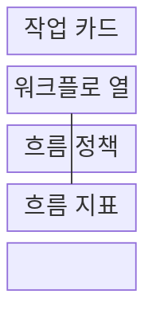
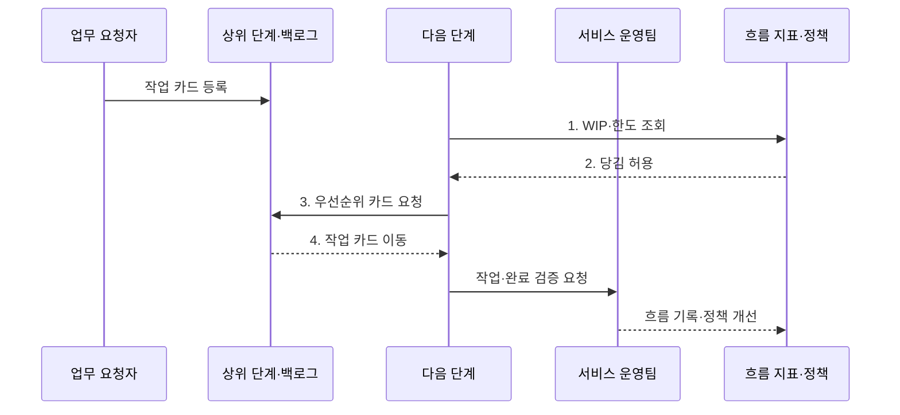

---
sidebar:
  order: 35
  label: "035. 칸반 (Kanban)"
  badge:
    text: "미출제 · 50%"
    variant: note
title: "칸반 (Kanban)"
date: "2026-08-02T12:00:00+09:00"
tags:
  - "notes-software"
weight: 35
extra:
  question_no: "035"
  source_status: "미출"
  source_history: ""
  priority: 50
  priority_note: "칸반은 흐름 제한·리드타임 개선 기법"
---

## Ⅰ. 개요

핵심 용어

- **칸반(Kanban)**: 작업 흐름을 시각화하고 진행 중 작업 한도와 당김으로 관리하는 방법이다.
- **진행 중 작업(Work in Progress, WIP)**: 착수했지만 아직 완료하지 않은 작업이다.
- **당김 시스템(Pull System)**: 다음 단계에 처리 여유가 생길 때만 새 작업을 가져오는 방식이다.

- 정의/개념: **흐름 시각화·WIP 한도·당김**으로 작업을 제어하는 방식
- 배경/필요성: 동시 작업의 과다 착수로 **대기·병목·납기 변동** 증가

#### 한줄 요약

- 다음 공정에 자리가 날 때만 새 일을 가져와 밀린 작업이 더 늘지 않게 한다.

## Ⅱ. 특징

핵심 용어

- **리틀의 법칙(Little's Law)**: 안정 상태에서 평균 진행 중 작업 수가 처리율과 평균 리드타임의 곱이라는 관계다.
- **연속 흐름**: 고정 반복 없이 실제 수요와 단계 수용량에 따라 작업을 계속 이동시키는 방식이다.
- **점진적 진화**: 기존 역할과 절차를 유지하며 흐름 데이터를 바탕으로 조금씩 개선하는 접근이다.

> 처리율을 하루 2건으로 고정한 파란 선은 WIP가 10건이면 평균 리드타임이 5일이 되는 리틀의 법칙 예시이며, 안정적인 유입·처리율을 가정한다.

- **완료 우선**으로 대기·병목 중심 개선
- **연속 흐름**으로 실제 서비스 수요 처리
- **점진적 진화**로 기존 역할·절차 개선

#### 한줄 요약

- 보드는 정체된 단계를 보여 주고 한도와 당김 규칙은 새 일의 과다 착수를 제한한다.

## Ⅲ. 구조 및 구성요소

핵심 용어

- **작업 카드(Work Item)**: 업무의 가치·우선순위·차단 상태와 현재 위치를 보드에 표현하는 단위다.
- **워크플로(Workflow)**: 요청부터 완료까지 작업이 거치는 단계의 흐름이다.
- **체류시간(Flow Time in State)**: 작업 카드가 한 워크플로 단계에 머문 시간이다.

| 구성요소 | 책임 |
|:---|:---|
| 작업 카드 | **가치·우선순위·차단 상태** 표현 |
| 워크플로 열 | 실제 **단계·현재 위치** 시각화 |
| 흐름 정책 | **WIP·당김·완료 규칙** 정의 |
| 흐름 지표 | **리드타임·처리량·체류시간** 측정 |

#### 한줄 요약

- 작업표, 진행 칸, 이동 규칙, 흐름 계기판으로 구성된다.

## Ⅳ. 흐름도

핵심 용어

- **진행 중 작업 한도(Work in Progress Limit, WIP Limit)**: 단계별로 동시에 처리할 수 있는 작업 수의 상한이다.
- **수용량**: 다음 단계가 새 작업을 받아 처리할 수 있는 남은 여유다.

**동작 원리**

- **1. WIP·한도 조회**: 다음 단계의 현재 수용량 확인
- **2. 당김 허용**: 한도 아래일 때 새 작업 승인
- **3. 우선순위 카드 요청**: 상위 목록에서 작업 선택
- **4. 작업 카드 이동**: 선택 작업을 다음 단계로 전달

#### 한줄 요약

- 다음 칸이 비어야 카드를 옮기고 오래 머문 칸의 한도와 규칙을 고친다.

## Ⅴ. 종류 및 비교

핵심 용어

- **시간 상자(Timebox)**: 시작과 종료 시간을 고정한 작업 기간이다.
- **스크럼(Scrum)**: 고정 길이 스프린트 목표와 제품 증분으로 작업을 관리하는 애자일 프레임워크다.
- **병목(Bottleneck)**: 처리 능력이 가장 낮아 전체 작업 흐름을 제한하는 단계다.

| 작업 흐름 운영 방식 | 칸반 | 스크럼 |
|:---|:---|:---|
| 적용 기준 | 불규칙 유입·**서비스 흐름** | 제품 증분·**시간 상자 목표** |
| 핵심 특징 | **WIP 제한·당김**·연속 흐름 | **스프린트·목표**·제품 증분 |
| 한계 | 우선순위 변동·**병목 고착** | 스프린트 과부하·**행사 형식화** |

> 요약: 칸반은 WIP·연속 흐름, 스크럼은 시간 상자 중심

#### 한줄 요약

- 칸반은 단계 수용량을, 스크럼은 정한 기간의 목표를 지킨다.

## Ⅵ. 실무 고려사항 및 대책

핵심 용어

- **사이클타임(Cycle Time)**: 작업 착수부터 완료까지 걸린 시간이다.
- **작업 노화(Work Item Aging)**: 완료되지 않은 작업이 접수·착수 후 경과한 시간이다.
- **서비스 수준 기대(Service Level Expectation, SLE)**: 특정 작업 유형이 정한 시간 안에 완료될 것으로 기대하는 확률 기반 목표다.
- **협업 집중(Swarming)**: 새 작업 착수보다 막히거나 오래된 작업의 완료에 여러 사람이 함께 집중하는 방식이다.

| 문제 | 대책 | 효과 |
|:---|:---|:---|
| 근거 없는 **WIP 한도** 고정으로 흐름 왜곡 | **처리량·사이클타임**을 보며 한도 실험 | 실제 수용량에 맞는 **한도** |
| 긴급 통로 남용으로 일반 작업 장기 대기 | 긴급 조건·동시 수·승인자 명시 | 일반 작업의 **우선순위 침해** 통제 |
| 차단·노화 카드에도 새 작업만 착수 | **작업 노화·SLE** 경고와 협업 집중 적용 | 오래된 작업의 **완료 촉진** |
| 단계별 생산성 개선으로 전체 시간 악화 | 요청부터 완료까지 **리드타임**으로 개선 | **부분 최적화** 방지 |

#### 한줄 요약

- 지원팀은 긴급 요청 통로를 제한해 일반 작업이 모두 밀리지 않게 한다.

## Ⅶ. 결론

핵심 용어

- **불규칙 유입**: 작업 요청의 도착 시점과 양이 일정하지 않은 업무 특성이다.
- **시간 상자 목표**: 고정된 기간 안에 달성할 제품 결과와 작업 범위를 정한 목표다.

- 유입이 불규칙하면 **칸반**, 시간 상자 목표가 중요하면 **스크럼** 선택

#### 한줄 요약

- 완료 건수만 늘리기보다 동시에 벌인 일과 오래 기다린 일을 줄여야 한다.
